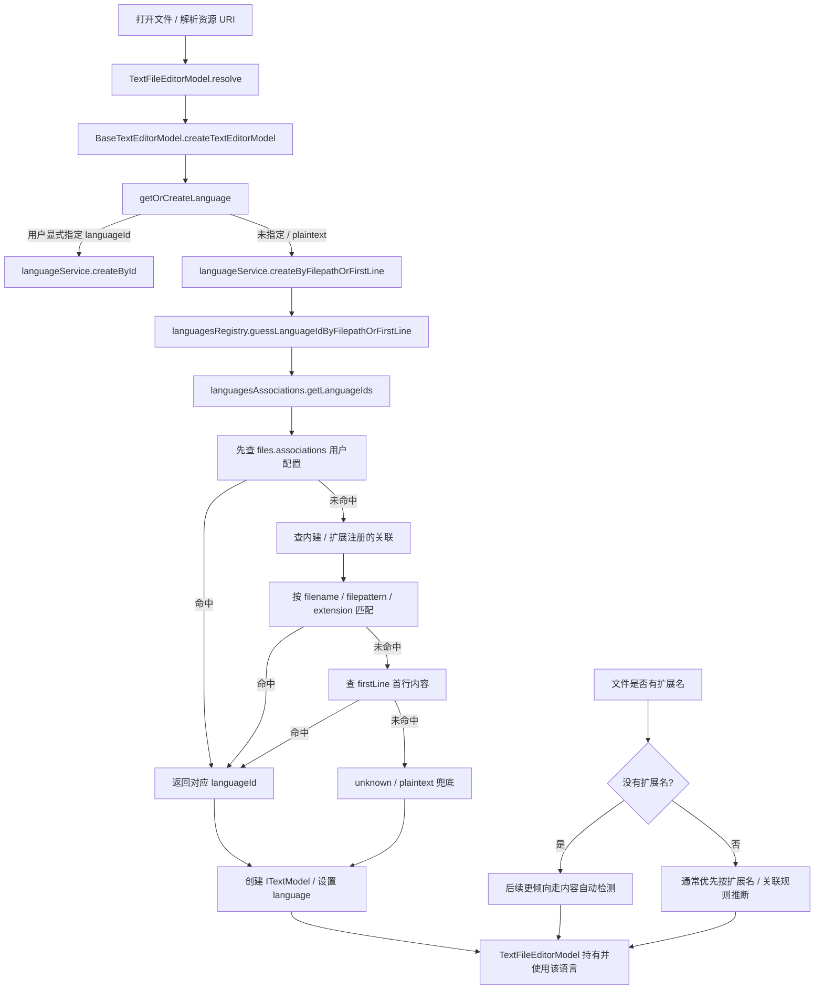
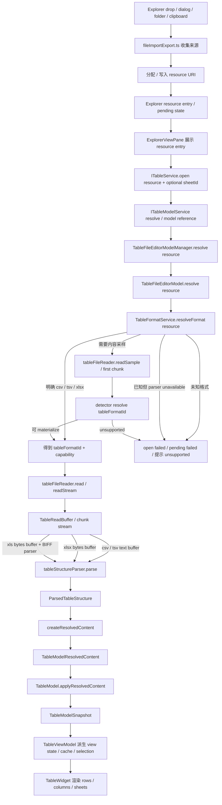
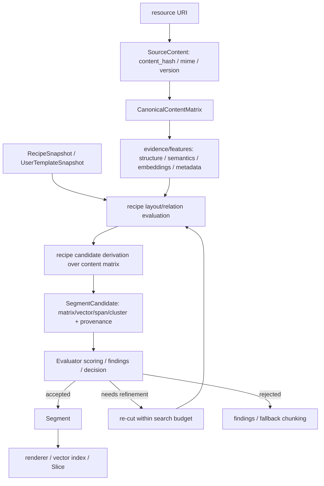

# Conductor URI 内容链路模块说明

这份说明记录上游 VS Code “文件 -> 文本模型/语言识别” 思路如何映射到
Conductor 的 URI-grounded content pipeline。表格链路是当前落地的一个
content view / renderer / projection，不是核心数据模型本身。

核心结论：

- 核心模型应从 Table-first 改成 Content-first、URI-grounded、recipe-driven
  segmentation、evaluator-gated retention。
- `URI` 是数据源身份和 provenance，不是内容本身；同一个 URI 的内容可能变化，
  因此需要用 `content_hash` / source version 区分具体内容版本。
- 主链路是 `URI -> fetch content -> canonical content matrix -> recipes 生成候选切分 -> evaluator 打分 -> accept / reject / re-cut -> Segment`。
- canonical content matrix 是广义内容矩阵：cell、block、span、record 都可以带
  content、position、structure、semantics、source selector、metadata、embedding
  或 feature。二维 table 只是其中一种投影。
- Recipe 切的是 content matrix，不是 table。它可以生成小矩阵、向量、span group、
  row group、column group、semantic cluster 等候选片段。
- Evaluation 对候选切分做可解释评分，例如完整性、语义一致性、信息密度、
  token budget、schema match、上下文依赖、冗余度和可回答性。
- 重新切分必须有 search budget，例如最多 N 个 recipe / N 轮 refinement；
  超出预算后 fallback 到默认 chunking，不能无边界循环。
- 持久化和下游输出保存的是 `Segment`：`segment_id`、`uri`、`content_hash`、
  `selectors`、`recipe_id`、`score`、`content_payload`、`metadata`。table、cards、
  JSON、markdown、vectors 都只是输出形式。
- 每个候选小矩阵或向量都必须保留 provenance：原始 URI、content hash、range /
  selector 和生成 recipe，否则评估、调试、引用和增量更新都会失真。
- 上游的 `languageId` 不直接复用；Conductor 需要自己的 `tableFormatId`。
- `tableFormatId` 只属于表格投影链路：它是 resource 进入 table reader / parser /
  `ITableModel` 前的稳定格式 ID，不应上升成全局 content identity。
- Files 目标链路整体遵循上游 editor open / resource model 架构；差异只在 source
  content 到 canonical representation / table projection 的 materialization 阶段。
- reader 和 parser 之间需要 table-owned read buffer/chunk stream：文本格式走 text buffer，workbook 格式走 byte buffer。
- URI-backed 表格模型身份对齐上游：先用 `resource URI`，多 sheet 时再加 `sheetId`。
- URI-backed 派生数据也按上游 resource-model 口径关联：Review、Slice、Plot 结果由各自 service/cache 按 `resource URI` 关联；多 sheet 表格只在 URI target 上增加 `sheetId` 子维度。公开 API 应使用 `resource` / `target` / model reference 命名；内部缓存可用 `ResourceMap` 或私有索引，但不能把索引名暴露成契约，也不写回 legacy Session/raw-table ledger。
- 历史兼容身份字段和预览投影字段不是目标模型契约；URI-backed 链路只暴露 resource、sheetId 和模型快照。
- parser 只产出物理表格结构和 diagnostics；`resource`、`format`、`defaultSheetId`、`sourceVersion` 由 tableFile resolve wrapper 写入 `TableModelResolvedContent`。目标 content pipeline 还需要在 source 层记录 `content_hash`，并让后续 Segment 使用它做版本身份。
- `TableFormatId` 表示“已知表格格式”，不等于“当前 runtime 一定能打开”；`canHandle/open` 必须继续检查 reader + parser capability。
- `.txt` 暂时不支持；后续需要单独设计 delimiter/header/fixed-width detector 和对应 parser。

阅读口径：除明确标为“迁移现状”或“迁移参考”的段落外，本文均按目标架构规划，不以当前旧实现倒推责任边界。文中的 `ITableModel`、`Review`、`Slice` 是表格投影和当前迁移实例；新增通用能力时应优先使用 content / matrix / segment 口径。

## 模块导航

这份文档按 owner / 链路模块阅读：

| 模块 | 主要内容 |
| --- | --- |
| [内容优先分层](#content-first) | Source、Canonical Content、Recipe、Evaluation、Persistence / Output 的目标责任边界。 |
| [总览与上游映射](#overview) | VS Code 文件/语言链路、Conductor 目标结构和目标文件拆分。 |
| [Files / Explorer 打开链路](#files-explorer) | source -> resource -> open/resolve/read/model 的主链路、Clipboard 边界、责任边界和审计点。 |
| [视图渲染层](#table-widget) | `TableWidget`、`TableViewModel` 和 `ITableModel` 的渲染边界。 |
| [Recipes / Content Features](#recipes-content-features) | Recipe、SegmentCandidate、Evaluator 与上游 language features 的对应关系。 |
| [Segment / Slice 输出链路](#slice) | accepted Segment、表格 `ReviewedTemplate` 和 URI-backed Slice 结果关联。 |
| [核心契约边界](#contracts) | `tableFormatId`、reader/stream、parser/resolved content、diagnostics、resource/sheet identity。 |
| [模型契约层](#table-model) | `services/table/common/model.ts` 的目标字段、snapshot 和兼容字段退场。 |
| [格式支持边界](#format-boundaries) | XLS/XLSX 能力边界和 `.txt` 后续支持前提。 |
| [迁移参考](#migration-reference) | 现有文件到目标 owner 的上游映射，以及概念对照表。 |

<a id="content-first"></a>

## 内容优先分层

目标架构按 source identity、content version、canonical representation、segmentation
和 output 分层。URI 只回答“从哪里来”和“如何追溯”，content hash 才回答“是哪一版内容”。

```txt
URI
  -> SourceContent(uri, content_hash, mime/type, updated_at, permissions, version)
  -> CanonicalContentMatrix(cells / blocks / spans / records + selectors + features)
  -> RecipeSnapshot / UserTemplateSnapshot
  -> SegmentCandidate(matrix slice / vector / span group / semantic cluster)
  -> Evaluator(score + findings + decision)
  -> Segment(accepted) or re-cut / fallback
  -> table / cards / JSON / markdown / vectors / Slice
```

| 层 | 职责 | 不拥有 |
| --- | --- | --- |
| Source | 基于 URI fetch content，记录 `uri`、`content_hash`、mime/type、mtime/etag、权限、版本和读取诊断。 | 业务切分、表格语义、review score。 |
| Canonical Content | 把 source content normalize 成统一 representation：二维矩阵、block matrix、section/tree + token spans、DOM-derived blocks 等。 | 下游 renderer 状态、recipe catalog、segment persistence。 |
| Recipe | 对 canonical content matrix 声明 selector / projection / chunking strategy，生成候选切分。 | 读取 URI、解析文件格式、决定是否保存结果。 |
| Evaluation | 对 `SegmentCandidate` 打分，做 hard gates、penalty、search budget 和 fallback 决策。 | 修改 source content、反写 canonical matrix、渲染 UI。 |
| Persistence / Output | 保存 accepted `Segment`，并按需要投影成 table、cards、JSON、markdown、vectors 或 Slice 输入。 | 重新解析原文件、隐藏 provenance、把输出形态变成核心模型。 |

Segment target 至少应保留：

```ts
interface Segment {
	readonly segmentId: string;
	readonly uri: URI;
	readonly contentHash: string;
	readonly selectors: readonly ContentSelector[];
	readonly recipeId: string;
	readonly score: SegmentScore;
	readonly contentPayload: CanonicalContentPayload;
	readonly metadata: SegmentMetadata;
}
```

所有 re-cut / refinement 都必须带预算，例如 `maxRecipes`、`maxRefinementRounds`、
`maxCandidates`、`maxElapsedMs`。预算耗尽后必须返回 best-effort accepted segments
或默认 chunking 结果，并在 findings 里说明 fallback 原因。

<a id="overview"></a>

## 总览与上游映射

### 同构链路

Conductor 的目标链路和 VS Code 文本模型链路同构：都是从 resource / URI 出发，
先进入 source/model lifecycle，再把已存在的模型交给 feature 层。差异是 Conductor
的核心模型不是 table，而是 URI 版本化后的 canonical content matrix。

```txt
VS Code:
  resource
    -> languageId
    -> text reader
    -> ITextModel
    -> language features

Conductor:
  URI
    -> source fetch + content_hash
    -> canonical content matrix
    -> content features / recipes
    -> Segment[]
    -> output renderers

Conductor table projection:
  URI
    -> tableFormatId
    -> table reader / parser
    -> table-shaped canonical matrix / ITableModel projection
    -> table renderer / table-specific review
```

差异在目标模型和格式语义：

```txt
.txt
  -> 能稳定读成 text
  -> 不能稳定推出 table structure

.csv / .tsv
  -> text + delimiter 语义
  -> 可以稳定解析成 table structure

.xlsx
  -> bytes + workbook XML 语义
  -> 可以稳定解析成 sheets / table structure

.xls
  -> bytes + OLE2/BIFF 语义
  -> 只有 BIFF/OLE parser 可用时才能解析；否则是 known-but-unsupported
```

如果去掉表格结构，CSV/TSV/TXT 都可以只是文本。目标 content pipeline 先关心
“这个 URI 当前版本的内容如何被规范化成 canonical content matrix”；表格只是其中一种
可渲染投影。对于 table projection，Files/Table 的目标不是普通文本模型，而是
`ITableModel`，因此 `tableFormatId` 不是普通扩展名白名单，它表示这个 resource
的已知表格格式语义；是否能进入 `ITableModel` materialization 链路，还要继续看
reader + parser capability。

### 上游参考



相关上游位置：

- `.../workbench/services/textfile/common/textFileEditorModel.ts`
  - `TextFileEditorModel.resolve` / `doCreateTextModel` 读取文件内容，并把资源交给基础文本模型创建。
  - `autoDetectLanguage` 在无扩展名、当前语言为空或 `plaintext` 时触发内容检测。
- `.../workbench/common/editor/textEditorModel.ts`
  - `BaseTextEditorModel.createTextEditorModel` 创建 `ITextModel`。
  - `getOrCreateLanguage` 根据显式语言、resource 和 firstLine 选择语言。
- `.../editor/common/services/languageService.ts`
  - `createByFilepathOrFirstLine` / `guessLanguageIdByFilepathOrFirstLine` 是语言推断的服务入口。
- `.../editor/common/services/languagesRegistry.ts`
  - 收集语言定义，把 extensions、filenames、filenamePatterns、firstLine 注册成 association。
  - `guessLanguageIdByFilepathOrFirstLine` 调用 association 层返回候选 `languageId`。
- `.../editor/common/services/languagesAssociations.ts`
  - 真正执行 resource / filename / extension / filepattern / firstLine 到 `languageId` 的匹配。
  - 匹配优先级是用户配置 > 内建/扩展注册 > firstLine > unknown。
- `.../editor/common/languages/modesRegistry.ts`
  - 注册基础语言和 `plaintext`，其中 `.txt` 默认关联到 `plaintext`。

### 目标结构

#### 职责一对一映射

| VS Code | 负责 | Conductor 对应 |
| --- | --- | --- |
| `modesRegistry.ts` | 注册已知语言 ID，例如 `plaintext`。 | 注册已知表格格式 ID，例如 `csv` / `tsv` / `xls` / `xlsx` / 未来 `txtDelimited`。 |
| `languagesRegistry.ts` | 收集语言定义，并注册扩展名、文件名、filepattern、firstLine 规则。 | table format registry：收集 `tableFormatId` 定义和默认匹配规则。 |
| `languagesAssociations.ts` | 按优先级匹配 resource -> `languageId`。 | table format associations：按资源、文件名、用户配置、内容探测匹配 resource -> `tableFormatId`。 |
| `languageService.ts` | 对外提供 `createByFilepathOrFirstLine` / `guessLanguageIdByFilepathOrFirstLine`。 | `TableFormatResolver` / `TableFormatService` 对外提供 `resolveFormat` / `canHandle`。 |
| `TextFileEditorModel` | 读取资源内容，消费 `languageId` 创建/更新文本模型。 | `TableFileEditorModel` 消费 `tableFormatId`，协调 reader 和 parser，创建/更新表格模型。 |
| text reader / encoding | 读取 resource，做编码解码，给 `ITextModel` 提供文本内容。 | table reader：读取 resource，按 `tableFormatId` 选择 text/bytes/stream 模式，产出 `TableReadBuffer`。 |
| text buffer / language feature | 文本 buffer 进入 `ITextModel` 后，`languageId` 分发 tokenization、补全、格式化、诊断等能力。 | `TableReadBuffer` 进入 parser；parser 再把 text/bytes chunks 解析成 table structure 和后续表格能力输入。 |

Parser 本质上也是 `tableFormatId` 驱动的 table capability，和 VS Code 里 `languageId` 驱动 tokenization / completion / diagnostics 是同一种分发模式。区别是 language feature 多数发生在 `ITextModel` 创建之后，而 table parser 参与 `ITableModel` 内容 materialization：没有 parser 产出的 rows / sheets，表格模型的核心内容就不存在。

#### 目标文件拆分

目标形态直接拆成 registry / associations / resolver。这样 `.txt`、用户配置、内容探测进入时只扩展对应 owner，不再重新搬边界。

```txt
services/table/common/tableFormatRegistry.ts
  定义可用 tableFormatId 和默认规则

services/table/common/tableFormatAssociations.ts
  按 filename / extension / pattern / detector 匹配

services/table/common/tableFormatService.ts
  对外提供 resolveFormat / canHandle

services/tableFile/common/tableFileEditorModel.ts
  消费 tableFormatId，协调 reader 和 parser

services/tableFile/common/tableFileReader.ts
  按 tableFormatId 选择读取入口，产出 TableReadBuffer

services/tableFile/common/encoding.ts
  负责 utf8/base64、bytes/text decode、mime 等低层读取细节

services/table/common/tableReadBuffer.ts
  定义 TableTextBuffer / TableByteBuffer / chunk stream，作为 parser 输入契约

services/table/common/tableStructureParser.ts
  在 parser capability 可用时，消费 TableReadBuffer，产出 ParsedTableStructure
```

格式语义更接近上游 `editor/common/services`，因此目标应放在 `services/table/common`。`services/tableFile/common` 只保留 URI-backed 文件生命周期、reader、encoding、watch/reload/save 等文件工作副本责任。

<a id="files-explorer"></a>

## Files / Explorer 打开链路

### 目标链路

这条链路整体按上游 editor open / resource model 架构走，可以认为主形状和上游一样：
外部输入先归一成 `resource URI`，再进入 editor/model resolver、file editor model、
reader、model、view model、widget。差异只在 materialization：上游把 reader 输出变成
text buffer / `ITextModel`；Conductor 需要先经过 table parser，把 reader 输出变成
`ParsedTableStructure`，再包装成 `TableModelResolvedContent` / `ITableModel`。

```txt
VS Code:
  external / explorer input
    -> resource URI
    -> editorService.openEditor
    -> TextResourceEditorInput / ITextModelService
    -> TextFileEditorModelManager
    -> TextFileEditorModel
    -> text reader / languageId
    -> ITextModel
    -> editor view model
    -> editor widget

Conductor:
  external / explorer input
    -> resource URI
    -> ITableService.open
    -> ITableModelService
    -> TableFileEditorModelManager
    -> TableFileEditorModel
    -> table reader / tableFormatId
    -> TableReadBuffer
    -> ParsedTableStructure
    -> ITableModel
    -> TableViewModel
    -> TableWidget
```



逐段映射：

| Conductor 目标段 | 上游对应 | 映射关系 |
| --- | --- | --- |
| `Explorer drop/dialog/folder/clipboard -> resource URI` | `ResourcesDropHandler`、`filesExplorer.paste`、`fileImportExport.ts`、`ExplorerView` 调 `editorService.openEditor({ resource })`。 | 上游也是先把外部输入、Explorer 选择、拖拽/粘贴归一成 `resource`；Conductor 多了 pending/resource entry 和 table support check。 |
| `Explorer resource entry -> ITableService.open({ resource, sheetId? })` | `ExplorerView` / file commands 调 `IEditorService.openEditor({ resource })`。 | 上游交给 editor service；Conductor 交给 table service，但核心输入仍是 `resource`。 |
| `ITableService.open -> ITableModelService resolve` | `TextResourceEditorInput.resolve -> ITextModelService.createModelReference(resource)`。 | 这里应有 table model resolver/reference 层，不能让 widget 或 service 直接 new/resolve file model。 |
| `ITableModelService -> TableFileEditorModelManager` | `TextModelResolverService -> textFileService.files.resolve(resource)`。 | resolver 负责 resource 到可引用模型；manager 负责按 resource 缓存/复用 file editor model。 |
| `TableFileEditorModel.resolve -> tableFileReader / encoding` | `TextFileEditorModel.resolveFromFile -> ITextFileService.readStream -> encoding`。 | 上游读成 text buffer；Conductor 读成 table-owned `TableReadBuffer`，按格式分成 text buffer/chunk stream 或 byte buffer/chunk stream。 |
| `TableReadBuffer -> tableStructureParser` | `createTextBufferFactoryFromStream -> ITextModel` 是上游文本模型 materialization 输入。 | Conductor 不把中间 buffer 升格为 `ITextModel`，而是作为 parser 输入继续 materialize table structure。 |
| `TableFormatService.resolveFormat` | `BaseTextEditorModel.getOrCreateLanguage -> languageService.createByFilepathOrFirstLine`。 | 上游解析 `languageId`；Conductor 解析 `tableFormatId`。明确扩展名可只看 resource，`.txt` 等模糊格式需要 sample/detector。 |
| `tableStructureParser -> ParsedTableStructure` | 无同名上游文件。 | 表格域新增：文本模型不需要结构化 rows/sheets，`ITableModel` 需要。 |
| `createResolvedContent -> TableModelResolvedContent -> TableModelSnapshot` | `TextFileEditorModel.resolveFromContent -> createTextEditorModel -> ITextModel`。 | 上游把 read result 包成 `ITextModel`；Conductor 把 parser result 包成 table model content。 |
| `TableViewModel -> TableWidget` | editor view model -> editor widget。 | 渲染层只消费模型/view model，不读文件、不解析格式。 |

Clipboard 入口保留为后续增强点。最佳方案是把 clipboard payload 先生成/注册成
file-like resource URI，然后完全按普通 table resource 打开。临时 import identity
只允许存在于 resource 创建前的 staging 期，不能流入 table model。

```txt
clipboard text / HTML / files
  -> source workflow
  -> temporary or persisted file-like resource URI
  -> ITableService.open({ resource })
  -> ITableModelService
  -> TableFileEditorModel
  -> TableFormatService
  -> reader
  -> parser
  -> ITableModel
```

| Clipboard 输入 | 未来处理方向 | 当前边界 |
| --- | --- | --- |
| clipboard files | 注册/分配 resource URI，按普通 table file open。 | 不在 clipboard 阶段解析业务语义。 |
| clipboard TSV/CSV text | 写入 file-like resource，resolver/detector 判断 `csv` / `tsv` / `txtDelimited`。 | detector/parser 未就绪前可保持 unsupported。 |
| Excel copied range | 优先读 clipboard HTML/TSV fallback，写入 file-like table resource。 | 不绕过 `TableFormatService` 和 `tableStructureParser`。 |
| free-form text | 写入 text resource 后交给未来 `.txt` delimiter/header/fixed-width detector。 | 当前仍是 unsupported source。 |

责任边界：

- `files.contribution.ts` 只注册 Files/Explorer view，不放导入业务逻辑。
- `fileActions.contribution.ts` 注册命令、动作、菜单和快捷键。
- `fileImportExport.ts` 负责文件传输、来源收集、pending 状态、resource 分配和打开工作流编排；它可以做 source -> resource 归一化，但不拥有 `tableFormatId` 解析。
- `services/table/common/resolverService.ts` 负责 resource -> table model reference 的 resolver 契约。
- `services/tableFile/common/tableFileEditorModelManager.ts` 负责按 resource 缓存/复用 URI-backed table file editor model。
- `services/table/common/tableFormat*.ts` 负责目标格式定义、关联规则、resolver 和 capability，并在 URI-backed resolve/open 链路中消费 `resource`。
- `services/tableFile/common/tableFileReader.ts` / `encoding.ts` 负责已知表格格式下的读取入口、stream/chunk 和编码/字节模式，并产出 `TableReadBuffer`。
- `services/table/common/tableReadBuffer.ts` 负责定义 parser 输入缓冲区契约；它不理解 CSV/TSV/XLSX 语义。
- `services/table/common/tableStructureParser.ts` 负责 CSV/TSV/XLSX，以及 parser capability 可用时 XLS 的物理表格结构解析；它消费 `TableReadBuffer`，只产出 `ParsedTableStructure`。
- `TableFileEditorModel` / `createResolvedContent` 把 parser result 包成 `TableModelResolvedContent`。
- `tableService` / `tableViewModel` 负责从 `TableModelSnapshot` 派生 view state、cache、selection 和 layout。
- `TableWidget` 负责渲染 `TableViewModel` 提供的 rows、columns、sheet、selection 和 layout 状态。
- `ExplorerViewPane` 负责展示 URI-backed resource entry，并把打开动作交给 `ITableService.open({ resource, sheetId? })`。
- legacy Session/raw-table pipeline 不属于目标 URI-backed file-to-table 主线。

当前实现后续需要按这条目标链路逐段审计。下面是潜在偏差点，不代表已经逐项确认：

| 审计点 | 目标判断 |
| --- | --- |
| drop / dialog / folder / clipboard source 是否都先归一成 file-like `resource URI`。 | source workflow 可以有 pending/staging，但进入 table open 前必须已经是 `resource`。 |
| source workflow 是否直接解析表格内容或构造 preview/model。 | 不应直接产出 table model、business semantics 或长期 preview contract；应交给 resolver/reader/parser/model。 |
| browser `File` / clipboard payload 是否存在绕过 resource URI 的直通 parser 路径。 | 需要先注册/落地成 resource，再走统一 open/resolve/read/model 链路。 |
| `ITableService.open` 到 file model 之间是否缺少 resolver/manager 层。 | 应通过 `ITableModelService` / model reference 和 `TableFileEditorModelManager`，对齐上游 model resolver。 |
| 历史兼容身份字段或预览投影字段是否进入 URI-backed model contract。 | 不进入目标契约；新契约以 `resource URI` 为身份，多 sheet 只增加 `sheetId` 子维度。 |
| parser result 是否和 `TableModelResolvedContent` 混在一起。 | parser 只产出 `ParsedTableStructure`；`resource`、`format`、`sourceVersion` 由 tableFile resolve wrapper 包装。 |

<a id="table-widget"></a>

## 视图渲染层

### 渲染链路

现在关注点已经进入 table widget 渲染层。更准确地说，上游是 editor widget
通过 `ITextModel` / editor view model 渲染文件内容；Conductor 对应的是
`TableWidget` 通过 `ITableModel` / `TableViewModel` 渲染表格内容。这里的“渲染”
不是绕过模型直接读取磁盘文件，而是消费已经 resolve 出来的模型状态。

```txt
VS Code:
  resource
    -> TextFileEditorModel / ITextModel
    -> editor view model
    -> editor widget render text content

Conductor:
  resource + optional sheetId
    -> TableFileEditorModel / ITableModel
    -> TableViewModel
    -> TableWidget render table content
```

实现边界也应对齐上游：editor widget 不直接读文件，而是消费 `ITextModel` 和 view model；
`TableWidget` 也不应该直接读 `File`、兼容身份字段或预览投影输入。它只消费
`TableViewModel` 从 `TableModelSnapshot` 派生出的 view state，负责渲染 rows、columns、
sheet 切换、selection、layout 和滚动窗口。

| 上游 | Conductor |
| --- | --- |
| editor widget 渲染 `ITextModel` 的文本内容。 | `TableWidget` 渲染 `ITableModel` / `TableViewModel` 的表格内容。 |
| editor widget 不直接解析磁盘文件。 | `TableWidget` 不直接解析 CSV/TSV/XLSX。 |
| 文件读取和模型更新由 `TextFileEditorModel` 负责。 | 文件读取和模型更新由 `TableFileEditorModel` 负责。 |

因此目标打开链路是：

```txt
ITableService.open({ resource, sheetId? })
  -> ITableModelService.resolve / model reference
  -> TableFileEditorModelManager.resolve(resource)
  -> TableFileEditorModel.resolve(resource)
  -> tableFileReader / tableStructureParser
  -> TableModelResolvedContent
  -> TableModel.applyResolvedContent
  -> TableViewModel
  -> TableWidget
```

<a id="recipes-content-features"></a>

## Recipes / Content Features

recipes 应映射到上游的 language features 层，而不是映射到 reader、parser、
table model 或 editor/widget render。上游 language features 的形状是：
`ITextModel` 已经存在，feature registry 根据 `languageId` / uri / selector
选择 provider，provider 消费 `ITextModel` 并返回 hover、completion、symbol、
code action 等派生结果。

```txt
VS Code:
  ITextModel
    -> language feature registry
    -> provider consumes model
    -> hover / completion / symbol / code action

Conductor:
  CanonicalContentMatrix(uri + content_hash)
    -> RecipeSnapshot / UserTemplateSnapshot
    -> SegmentCandidate[]
    -> Evaluator
    -> Segment[]
    -> renderer / vector index / Slice
```

因此 Recipe 不是 reader/parser/model 的一部分，也不是执行器。Recipe 是
canonical content matrix 之后 content feature 的 passive catalog；真正消费内容矩阵、
解释 dataRange / blockPartition / physicalLayout / logicalRelation、产出候选切分的是 segmentation / evaluation owner。
中间候选叫 `SegmentCandidate`，不叫 Template，也不应假设是 table slice。
只有 evaluator 通过后才产出 accepted `Segment`。在当前表格分析迁移里，
`Review` / `ReviewedTemplate` 只是 `SegmentCandidate -> accepted segment`
之后的一种表格执行适配。

目标链路：

```txt
SourceContent(uri, content_hash)
  -> CanonicalContentMatrix
  -> RecipeSnapshot / UserTemplateSnapshot
  -> SegmentCandidate(matrix/vector/span/cluster + provenance)
  -> Evaluator(score + findings + decision)
  -> accepted Segment
  -> output renderer / vector index / Slice
```

### SegmentCandidate

`SegmentCandidate` 是 evaluator 前的候选切分值。它的职责是记录某个 Recipe
或 UserTemplate 套到当前 canonical content matrix 后得到的临时 segment 解释和
trace；它不是最终 Segment，也不是独立 service/model。

```txt
CanonicalContentMatrix
  - cells / blocks / spans / records
  - positions / ranges / selectors
  - structure / semantic features
  - metadata / embeddings / feature vectors
  - source provenance

RecipeSnapshot / UserTemplateSnapshot
  -> dataRange / blockPartition / physicalLayout / logicalRelation over content matrix
  -> SegmentCandidate(content interpretation + trace)
  -> scoring / findings / decision
  -> accepted Segment
```

`SegmentCandidate` 可以包含 selector trace、projection trace、candidate payload、
content hash、source version、matrix fingerprint、candidate confidence hint 和
diagnostics。它不应包含最终 `accepted` / `rejected` / `fallback` 状态，不应包含
renderer-specific output payload，也不应作为长期公开 API 暴露给 Explorer 或 UI。



硬边界：

| 边界 | 目标判断 |
| --- | --- |
| Recipe 不读文件、不解析 CSV/TSV/XLSX。 | 文件读取和物理解析仍属于 Source / reader / parser。 |
| Recipe 不把 table rows 当核心输入。 | dataRange / blockPartition / physicalLayout / logicalRelation 应作用在 canonical content matrix；二维 rows 只是 table matrix 的一种形态。 |
| Recipe 不决定 `tableFormatId`。 | format 仍由 `TableFormatService` / detector 负责，且只服务 table projection。 |
| Recipe 不修改 source content 或 canonical matrix。 | evidence/features 是从 canonical content 派生的输入，不反写核心内容。 |
| candidate builder 只产出 `SegmentCandidate`。 | `SegmentCandidate` 仍是临时切分解释和 trace，不是最终 Segment；evaluator 通过后才生成 accepted `Segment`。 |
| candidate building 不属于 `TableWidget` 渲染核心。 | 可按 content hash / matrix fingerprint / 用户动作 / 后台任务执行；candidate 不长期缓存。 |
| re-cut 必须受 search budget 限制。 | 超出预算后 fallback 到默认 chunking，并保留 finding。 |
| accepted Segment 必须保留 provenance。 | 至少包含 URI、content hash、selectors/ranges、recipe id、score 和 metadata。 |

### 表格迁移适配：Review

下面的 `Review` 是表格投影上的 evaluator 适配，不是通用 content pipeline
的核心抽象。通用层应使用 `SegmentCandidate`、`Segment`、`content_hash` 和
selector provenance；只有当候选切分需要进入现有表格分析执行链路时，才把 accepted
segment 适配成 `ReviewedTemplate`。

这里的 Review 是 URI-backed content feature 链路上的候选评估，
不是代码审查，也不是当前 legacy raw-table review。`Review`
必须按目标架构设计，不能按当前 legacy raw-table / session 身份
链路倒推。目标 `Review` 评估的是某个 `resource URI + content_hash/sourceVersion`
上的 content evidence，当前表格分析只是把 table projection 候选适配到 Slice：

```txt
URI + content_hash/sourceVersion
  -> canonical content evidence
  -> ReviewEvidence(sourceMetadata + projection evidence)
  -> SegmentCandidate / ReviewCandidate(layout/relation trace + interpretation)
  -> evaluator
  -> ReviewResult / accepted Segment

Current table adapter:
  TableModelSnapshot(modelVersion, sourceVersion)
    -> ReviewEvidence.tableProjection (optional table projection)
    -> table-shaped ReviewCandidate
    -> ReviewedTemplate
    -> Slice
```

`Review` 的输入和输出按目标口径看：

| 项 | 目标 owner | 说明 |
| --- | --- | --- |
| review association | `resource URI` + `contentHash/sourceVersion` + optional selector / `sheetId` sub-target | 对齐上游 resource model；不使用公开 synthetic key；`sheetId` 只是当前表格投影的子目标。 |
| review context | `ReviewContext` | 包含 `resource`、可选 sub-target、model/source version、evidence fingerprint 和 canonical content evidence；不读文件、不访问 browser `File`。 |
| review candidates | `ReviewCandidate[]` / `SegmentCandidate[]` | candidate builder 已经按 Recipe dataRange / blockPartition / physicalLayout / logicalRelation 产出临时候选；当前表格 adapter 的 candidate 内含 table-shaped interpretation 和 trace。 |
| review output | `reviewResult` | ranking、置信度、问题列表、decision 和 ready 分支的 `ReviewedTemplate`；不修改 `TableModel`。 |

`Review` 可以参考 Recipe 的 metadata / expectation 来评分，但不能变成第二个
candidate builder。它不在 scoring 阶段重新解释 Recipe authoring schema，不重新产出
最终 `Template`，只评估 candidate builder 已经产出的 `ReviewCandidate` 是否能被
`ReviewContext.evidence` 支撑。

`Review` 的置信度必须是可解释评分，不是一个黑盒数字。目标算法分四步：

```txt
1. hard gates
   parser fatal / stale model version / missing required candidate slot / invalid range
   -> invalid 或 confidence cap

2. factor scores
   selectorScore
   projectionScore
   semanticScore
   dataQualityScore
   parseHealthScore
   freshnessScore

3. penalties / caps
   ambiguityPenalty
   conflictPenalty
   diagnosticPenalty
   lowCoverageCap

4. decision
   ready / needsAdjustment / invalid
```

建议的首版可解释评分：

```txt
base =
  0.25 * selectorScore +
  0.25 * projectionScore +
  0.20 * semanticScore +
  0.15 * dataQualityScore +
  0.10 * parseHealthScore +
  0.05 * freshnessScore

confidence = clamp(base - ambiguityPenalty - conflictPenalty - diagnosticPenalty, 0, 1)
```

hard gates 和 cap 比权重更重要：

| 条件 | 结果 |
| --- | --- |
| `ReviewCandidate` 的 modelVersion / evidenceFingerprint 已过期。 | `invalid`，confidence = 0。 |
| parser 有 fatal diagnostic，或 `ReviewContext.evidence` 不存在。 | `invalid`，confidence = 0。 |
| required projection slot 缺失。 | `needsAdjustment`，confidence cap 0.49。 |
| range 越界、空 range、sheet 不匹配。 | `invalid` 或 confidence cap 0.39。 |
| required role/unit/type 不匹配。 | `needsAdjustment`，confidence cap 0.69。 |
| 多个候选分数接近，top1 - top2 小于阈值。 | 增加 ambiguityPenalty，并限制自动 ready。 |
| 用户手动确认。 | 可以进入 ready，但保留原始 system confidence 和 user override。 |

factor score 的来源：

| score | 来源 | 说明 |
| --- | --- | --- |
| `selectorScore` | `ReviewCandidate.selectorTrace` | selector 是否命中 required predicates，captures 是否完整；不是重新 evaluate selector。 |
| `projectionScore` | `ReviewCandidate.projectionTrace` / table interpretation | 候选的 axis/series/range、参数映射是否完整且合法；还不是最终 Template。 |
| `semanticScore` | `ReviewContext.evidence`；当前表格 adapter 读取 `tableProjection.semanticCandidates` / columnProfiles / units | 列角色、单位、类型、单调性等是否支持 candidate。 |
| `dataQualityScore` | `ReviewContext.evidence`；当前表格 adapter 读取 `tableProjection.structure` / measurement blocks | 行数、列数、空值比例、numeric coverage、block 稳定性。 |
| `parseHealthScore` | `TableModelResolvedContent.diagnostics` 的投影 | 解析健康程度；只作为扣分项，不替代 parser diagnostics。 |
| `freshnessScore` | `modelVersion` / `sourceVersion` / `evidenceFingerprint` | 确认 candidate 对应当前模型快照。 |

decision threshold 也要固定，避免 UI/服务各自解释：

| decision | 条件 |
| --- | --- |
| `ready` | confidence >= 0.85，且无 blocking finding，且候选差距足够。 |
| `needsAdjustment` | 0.50 <= confidence < 0.85，或有可修复 finding。 |
| `invalid` | confidence < 0.50，或 hard gate 失败。 |

`ReviewResult` 至少应保留分项得分和 findings，方便 UI 解释为什么不是 ready：

```ts
interface ReviewResult {
	readonly resource: URI;
	readonly sheetId?: TableSheetId;
	readonly modelVersion: number;
	readonly sourceVersion: number;
	readonly evidenceFingerprint: string;
	readonly candidateReviews: readonly ReviewCandidateAssessment[];
	readonly decision: ReviewDecision;
	readonly reviewedTemplate?: ReviewedTemplate;
}

interface ReviewCandidateAssessment {
	readonly candidateId: string;
	readonly confidence: number;
	readonly factors: ReviewFactors;
	readonly findings: readonly ReviewFinding[];
	readonly status: 'ready' | 'needsAdjustment' | 'invalid';
}
```

高置信度结果也要按上游 resource model 的方式保存和关联：URI 是身份锚点，
不是信息容器。`Review` ready 后产生的 `ReviewedTemplate`、confidence、
factors、findings、decision 应由 review service / cache 持有，并以
`resource URI` 关联到当前表格；多 sheet 表格通过 URI target 上的 `sheetId`
子维度区分。

| 信息 | owner | identity / invalidation | 说明 |
| --- | --- | --- | --- |
| latest review association | `IReviewService` / review cache | `resource URI` + optional `sheetId` target | UI、Explorer decoration、Slice 入口按 URI 查最新有效 review。 |
| review validity | `ReviewResult` | `modelVersion`、`sourceVersion`、`evidenceFingerprint`、recipe/user-template fingerprint、review policy version | 任一输入变化即 stale，不能继续当 ready。 |
| reviewed template | `ReviewResult.reviewedTemplate` | 跟随 review result | 只有 `ready` 才有；Slice 只消费这里的 reviewed/manual template。 |
| model core content | `TableModelSnapshot` | `resource URI` + optional `sheetId` target | 不保存 review decision，不反写 recipe 高置信度语义。 |

这和上游 markers / decorations / language feature result 的关系类似：它们都以
`ITextModel.uri` 为锚点关联到模型，但不是 URI 字符串本身的一部分，也不是文本模型
的文件内容。Conductor 这里也一样：`ReviewResult` 是 URI-backed content feature
结果，订阅和查询应走 review service，例如 `getLatestReview(resource, sheetId?)`
和 `onDidChangeReview` 这一类接口。

Explorer decoration 也必须走这条新架构链路。Explorer decoration 不是独立的语义评估器，
也不从 `Template` 本身倒推结论；它只是 `ReviewResult` 的 Explorer presentation：

术语按上游拆开：

| 术语 | 用法 |
| --- | --- |
| decoration | 上游 API / owner / 文件名用语。对应 `IDecorationsProvider`、`IDecorationData`、`explorerDecorationsProvider.ts` 和 `explorer.decorations.*` 设置。 |
| badge | decoration 的一个视觉部件或用户设置用语。上游有 `explorer.decorations.badges`；在数据上通常对应 `IDecorationData.letter` / 图标这类 badge payload。 |
| color / tooltip | decoration 的其他 presentation 部件。对应 `IDecorationData.color`、`IDecorationData.tooltip`。 |

因此目标文件、provider、owner 都命名为 Explorer decoration；只有描述具体 UI
视觉部件时才说 badge。不要新增 `*BadgeProjection`、`BadgeService` 或以 badge
命名的 owner 文件。旧 `ExplorerBadgeState` UI 字段已经退场，
但目标语义要收敛到 Explorer decoration。

```txt
IReviewService.getLatestReviewSummary({ resource, sheetId })
  -> ReviewSummary
  -> ExplorerDecorationsProvider.provideDecorations(resource)
  -> IDecorationsService cache / onDidChangeDecorations
  -> ResourceLabels reads IDecoration by Explorer decoration resource
  -> ExplorerViewPane reads IDecorationData for badge text
  -> ExplorerViewer decorationsByFileKey

IReviewService.getLatestReviewSummary({ resource, sheetId })
  -> ReviewSummary
  -> ExplorerViewPane reviewSummariesByFileKey
  -> ExplorerViewer review hover content
```

Explorer decoration 的输入是 review service 暴露的 `ReviewSummary`，
不是完整 `ReviewResult` internals，也不是 `ReviewedTemplate` 本身。
`ReviewSummary` 是 review-owned 公开摘要，用来稳定表达 Explorer、Slice 入口、
状态栏等消费者都能理解的 review 结果摘要。这里不用 `status` 命名，因为它不只是
pending/ready/stale 这类生命周期状态，还包含 selected candidate 的 confidence、
semantic label、message 和 signatures；也不用 `projection` 命名，因为它不是
Explorer presentation 层，而是 review 服务对外暴露的稳定 read model：

| 字段 | 来源 | 说明 |
| --- | --- | --- |
| `resource` / `sheetId?` | review association | 被评估的 URI content association；`sheetId` 只是当前表格投影的子目标。 |
| `state` | `ReviewResult.decision` + lifecycle | `pending`、`stale`、`ready`、`needsAdjustment`、`invalid` 这类状态。 |
| `confidence` | selected `ReviewCandidateAssessment.confidence` | 用于展示 confirmed/tentative；不由 Explorer 重新计算。 |
| `reviewedSemanticLabel` | selected candidate / `ReviewedTemplate` metadata | Explorer decoration 显示的业务标签来源，例如 transfer/output/cv。 |
| `message` / `findingCodes` | `ReviewFinding[]` summary | tooltip 或问题说明；不暴露完整 scoring internals。 |
| `reviewSignature` | `ReviewResult` signature | 证明 decoration 对应哪一次 review。 |
| `templateFingerprint` | `ReviewedTemplate.templateFingerprint` | 只有 ready 或 user-action 状态才有；供 Slice 入口和 stale 判断使用。 |

其中 `ReviewedTemplate` 仍是 Slice 的可执行输入；Explorer decoration 只拿
`ReviewSummary.reviewedSemanticLabel`、`confidence`、`state`、
`message` 等 presentation 所需字段。也就是说，“是否能显示 ready decoration、
置信度是多少、是否需要用户处理、旧结果是否 stale”必须由 review summary 决定。
Explorer 只能把这些状态映射成 `IDecorationData` 的 badge/letter、tooltip、
color 和 presentation signature；
不能重新 evaluate Recipe authoring schema，不能重新解释 Template，也不能读取 table rows
来补做语义判断。
Explorer rich hover 也只能读同一个 `ReviewSummary`；`ResourceLabels`
只负责上游式的短 decoration color / tooltip / strikethrough，review 结果浮层
属于 `ExplorerViewer` 的 hover presentation，不走 `ExplorerFileEntry` 旧字段或 DOM
`auto*` dataset。

Session `rawTableId`、slice run view input 等仍属于 legacy raw-table 执行兼容层。
Session raw-table review bridge 已经退场，不能作为 URI-backed `Review` / Explorer decoration 的目标 owner，
也不能继续为新架构扩字段、扩分支或扩业务判断。旧 raw-table status bridge 已退场；新路径必须以
`resource URI` + optional `sheetId` target 查询 `IReviewService`；
旧 Explorer semantic badge 兼容层已经退场，不保留长期双路径。

Explorer decoration 相关文件目标落点：

| 文件 | 职责 | 不拥有 |
| --- | --- | --- |
| `services/review/common/reviewModel.ts` | 定义 `ReviewResult`、`ReviewDecision`、confidence、findings、`ReviewedTemplate`，以及 `ReviewSummary` 这类 review-owned 公开摘要。 | Explorer decoration UI 类型、颜色、文案、tree presentation signature。 |
| `services/review/common/reviewEvidence.ts` | 定义 URI/content 进入 Review 的 evidence shape；当前表格派生字段收在可选 `tableProjection`，只是 content 的一种投影来源。 | Recipe DSL、review result/policy、Explorer decoration presentation。 |
| `services/review/common/review.ts` | 暴露 `getLatestReview(resource, sheetId?)` 给 review/Slice 级消费者，暴露 `getLatestReviewSummary(resource, sheetId?)` 给 Explorer decoration 这类摘要消费者，并提供 `onDidChangeReview`。 | decoration 映射、Explorer entry mutation、legacy raw-table fallback。 |
| `services/review/browser/reviewService.ts` | 维护 URI-backed review cache、invalidation、后台 review 生命周期。 | DOM/UI decoration、Explorer tree state、retired Session raw-table review records。 |
| `services/decorations/common/decorations.ts` / `browser/decorationsService.ts` | 对齐上游 decorations service。注册 `IDecorationsProvider`，缓存 provider 输出，合并 `onDidChangeDecorations`，并按 URI 提供 `IDecoration` / `IDecorationData`。 | Explorer 业务映射、review summary 查询、DOM badge 渲染。 |
| `workbench/browser/labels.ts` | 对齐上游 ResourceLabels。`setResource(..., { fileDecorations })` 按 resource 向 `IDecorationsService` 读取 label color、tooltip、strikethrough，并响应 `onDidChangeDecorations`。 | review 查询、Explorer entry 查询、badge 文案映射。 |
| `contrib/files/browser/views/explorerDecorationsProvider.ts` | 对齐上游 Explorer decoration provider。`provideDecorations(resource)` 按 resource 读取 Explorer entry 和 `IReviewService.getLatestReviewSummary(...)`，返回 `IDecorationData`，并把 review / pane input change 转成受影响 decoration resource。 | review 计算、candidate building、scoring、Template materialization、读取 table rows、直接刷新 Explorer view。 |
| `contrib/files/browser/views/explorerDecorations.ts` | 可选 helper；只有 decoration 规则变多或多个 Files browser surface 复用时再拆。负责把 Explorer entry + `ReviewSummary` 映射成 `IDecorationData`。 | review cache、review validity、legacy raw-table fallback。 |
| `contrib/files/common/explorerModel.ts` | 保留 Explorer entry/tree/presentation 类型；不再承载 semantic badge 状态字段。 | review cache、review validity、retired raw-table review 兼容逻辑。 |
| `contrib/files/browser/explorerViewlet.ts` | 注册 `ExplorerDecorationsProvider` 到 `IDecorationsService`，向 Explorer viewer 传递 decoration resource、badge text 用 `IDecorationData`，以及 hover 用 `ReviewSummary`。 | review 计算、candidate building、scoring、直接调用 provider、读取 retired Session review。 |

不要把 Explorer decoration 映射放到 `services/review/**`。Review service
输出的是领域事实；Explorer decoration 是 Files/Explorer 的 presentation。也不要把它放到
`services/slice/**`，Slice 只消费 `ReviewedTemplate` 和 review signature，不决定 decoration。

首版不引入独立 `ReviewModel`。`ReviewResult` 本身是结果数据，
`IReviewService` 负责 cache、stale、订阅和查询。只有当 review 后续出现
pending/running/manual-edit/undo/partial-result 等复杂生命周期时，再考虑把
`ReviewModel` 作为 service 内部 per-resource state 引入。

`Review` findings 和 parser diagnostics 也要分开：

| 类型 | 来源 | 语义 |
| --- | --- | --- |
| parser diagnostics | `tableStructureParser` / `TableModelResolvedContent.diagnostics` | 文件是否能被健康读成表格。 |
| review findings | `services/review/**` | 某个 `ReviewCandidate` 套在这个表格上是否可靠。 |

文件落点也要分清楚。Recipe 本身只是 catalog / physical-layout / logical-relation 定义；
把 Recipe 应用到表格模型、产出 `ReviewCandidate` 的行为属于 review candidate building。
最终 `Template` 只在 `Review` 通过后生成，作为 `ReviewedTemplate` 进入 Slice。

| 目标层 | 上游对应 | 目标 owner / 文件 | 职责 | 不拥有 |
| --- | --- | --- | --- | --- |
| Recipe catalog | 无同名上游文件；机制上类似 language feature provider 的静态来源。 | `services/recipe/common/recipe.ts`、`recipeSchema.ts`、`recipeSelector.ts`、`recipeProjection.ts`、`recipeCodec.ts` | 定义 passive `Recipe`、dataRange / blockPartition / physicalLayout / logicalRelation authoring schema、校验、diagnostics、fingerprint。 | 不读取 table，不执行 Recipe，不产出 Template。 |
| Built-in recipe bundle | 无同名上游文件；更接近内置 provider/extension contribution 的数据来源。 | `resources/recipes/v1/**/*.json`、`resources/recipes/v1/index.json`、`scripts/buildRecipeBundle.mjs`、`services/recipe/common/builtinRecipes.generated.ts` | 手写 JSON recipe 和生成内置 bundle。 | 不放运行时 table/materialization 逻辑。 |
| Recipe service | `editor/common/services/languageFeatures.ts`、`editor/common/services/languageFeaturesService.ts`。 | `services/recipe/browser/recipeService.ts` | 发布 `RecipeSnapshot`、catalog fingerprint、diagnostics、`onDidChangeRecipes`。 | 不 evaluate tables，不构造 ReviewCandidate，不写 Session。 |
| Review types / context | `editor/common/model.ts`、`editor/common/model/textModel.ts` 作为 language feature 的输入模型。 | `services/review/common/reviewModel.ts`；URI/content evidence 放 `services/review/common/reviewEvidence.ts`。 | 定义 `ReviewContext`、`ReviewCandidate`、`ReviewResult`、`ReviewedTemplate`、findings/factors/decision 等纯类型；表格派生字段只放在可选 `ReviewEvidence.tableProjection`。 | 不放 service implementation，不放 legacy raw-table record。 |
| Review service contract | 上游类似 marker / language feature service 以 URI 关联结果。 | `services/review/common/review.ts`。 | 定义 `IReviewService`、`getLatestReviewSummary({ resource, sheetId })`、`onDidChangeReview` 等契约。 | 不放 browser cache 实现，不写 Session。 |
| Review service implementation | 上游类似 browser/workbench service implementation。 | `services/review/browser/reviewService.ts`。 | 按 `resource URI` + optional `sheetId` target cache `ReviewResult`，处理 stale、订阅、后台 review；首版内部私有函数完成 selector matching、candidate building、scoring。内部可用 `ResourceMap` 或私有索引，但 API 名称保持 resource/target 口径。 | 不读取原始文件，不拥有 TableModel 内容，不把 candidate 作为独立 service/model。 |
| Explorer decorations service/provider | 上游 `decorationsService.ts`、`IDecorationsService`、`IDecorationsProvider`、`explorerDecorationsProvider.ts`。 | `services/decorations/**` + `contrib/files/browser/views/explorerDecorationsProvider.ts`，必要时配套同目录 `explorerDecorations.ts`。 | service 负责 provider 注册、缓存和 change event；Explorer provider 从 `IReviewService.getLatestReviewSummary(...)` 的 `ReviewSummary` 提供 `IDecorationData`、tooltip、color 和 presentation signature。 | 不读取 Session raw-table review，不 evaluate Recipe/Template，不恢复 raw-table status bridge。 |
| Optional Review helpers | 后续按复杂度从 service 内部拆出。 | 可选：`services/review/common/reviewSelector.ts`、`reviewCandidate.ts`、`reviewScoring.ts`。 | 当 selector / candidate / scoring 逻辑变胖时再拆纯 helper。 | 首版不强制拆，不使用 `engine` 命名。 |
| Slice consumer | 无上游对应；Conductor 表格分析域新增。 | `services/slice/**` | 执行 reviewed/manual Template snapshot。 | 不读取 Recipe，不推断 table semantics。 |

<a id="slice"></a>

## Segment / Slice 输出链路

通用目标上，Slice 不是核心切分模型，而是 accepted `Segment` 的一种输出/执行消费方。
它不消费 Recipe、不消费未评估的 `SegmentCandidate`，也不重新判断内容语义。
在当前表格分析迁移里，Slice 只接收已经通过 `Review` 的
`ReviewedTemplate`，或者用户手动确认的等价 template snapshot。

```txt
Segment pipeline:
  Segment(uri, content_hash, selectors, score)
    -> renderer / vector index / JSON / markdown / cards

Table analysis adapter:
  IReviewService.reviewUri({ resource, sheetId, contentHash? })
    -> decision.ready.reviewedTemplate
    -> ISliceService.submitUri(SliceUriRequest[])
    -> SliceService retains state/result for the URI target + content version
    -> IPlotService reads Slice URI results by URI target and derives calculated/display data for Chart
```

Slice 的身份仍然沿用 URI-backed 链路，但需要把 content version 纳入失效判断：

```txt
resource URI + content_hash/sourceVersion + optional sheetId + reviewSignature/templateFingerprint
```

其中 `resource URI` 指向被切片的表格，多 sheet 时 `sheetId` 只是 URI target
的表格子维度；`reviewSignature` /
`templateFingerprint` 用来证明 Slice 使用的是哪一次 review 后的模板。`content_hash`
或 source version 用来证明同一 URI 下使用的是哪一版内容。文件内容、
table model、review result 任一变化，都应让旧 slice 结果失效或需要重新生成。URI-backed
slice 结果是 Slice service 的派生状态，不写入 legacy Session/raw-table ledger。

| 阶段 | 输入 | 输出 | 不拥有 |
| --- | --- | --- | --- |
| Segment output | `Segment` 的 `uri`、`content_hash`、selectors、score、payload。 | table/cards/JSON/markdown/vectors 等输出。 | source fetch、recipe search、重新评分。 |
| Slice request | `resource`、`contentHash/sourceVersion`、`sheetId?`、`ReviewedTemplate`、review signature、source/model version。 | 一个可执行的 URI slice job。 | Recipe catalog、selector matching、review scoring。 |
| Slice execution | `ReviewedTemplate` 定义的 ranges / axes / series / params。 | `SliceUriResult`。 | 修改 `TableModel`、修改 `ReviewResult`、写 Session。 |
| Slice association | `resource URI` + content version + optional `sheetId` target + `reviewSignature/templateFingerprint`。 | 可查询的 slice 状态和结果；公开 API 用 resource/target 命名，内部索引不外露。 | legacy raw-table identity、公开 synthetic key。 |

目标文件落点：

| 目标文件 | 职责 |
| --- | --- |
| `services/slice/common/slice.ts` | 定义 `ISliceService`、legacy request、URI-backed target/request/result、slice signature 等纯类型。目标 API 应像上游 `createModelReference(resource)` 一样接收 `resource` / `target`，例如 submit target request、query latest result/state、订阅 target changes；不要暴露 keyed map 字段。 |
| `services/slice/browser/sliceService.ts` | 按 `resource URI` + optional `sheetId` target 关联 URI slice 结果，处理执行、cache、stale、event；内部可用 `ResourceMap` 或私有索引；legacy raw-table 结果仍走 Session commit。 |
| `services/plot/browser/plotService.ts` | 从 Slice service 读取按 URI target 关联的 slice 结果，派生 chart 所需 calculated/display data。 |

这也对齐上游 resource-model 模式：Slice 结果是挂在 URI-backed content version /
review 后面的 feature result，不是 URI 自身的一部分，也不是
`TableModelSnapshot` 核心内容。通用输出仍以 accepted `Segment` 为边界；
Slice 只是表格分析域的执行型输出。

迁移参考：当前 table projection 类型收敛在
`services/table/common/tableProjection.ts`。按本文目标架构，它们对应的是
URI-backed `ITableModel` 之后的 `ReviewContext.evidence` / content feature owner，不是 Recipe owner。
首版可以先把这些字段作为 `ReviewContext` 的 evidence snapshot，不必单独服务化；
只有 recipe、review 之外的多个 feature 都要复用同一套 evidence 生成逻辑时，再拆到
`services/table/common/tableEvidence.ts` 这一类文件。有缓存、调度、版本失效需求时，
再考虑 `services/table/browser/tableEvidenceService.ts`。

不应落点：

| 不应放入 | 原因 |
| --- | --- |
| `contrib/files/**` | Files/Explorer 只负责 source/resource/open，不拥有 table semantic feature。 |
| `services/tableFile/**` | tableFile 只负责 URI-backed 文件工作副本、读取、reload/save，不拥有 Recipe、ReviewCandidate 或 Review。 |
| `services/table/common/tableStructureParser.ts` | parser 只产出物理结构，不做 semantic candidates / recipe matching。 |
| `services/recipe/**` | Recipe 只保存 passive catalog，不 evaluate table。 |
| `TableWidget` / `tableViewModel` | 渲染和 view state 不执行 Recipe，也不构造 ReviewCandidate。 |

对应上游看：

| VS Code language features | Conductor recipes/template |
| --- | --- |
| `languageFeatureRegistry` 保存 provider。 | `IRecipeService` 保存 passive recipe catalog。 |
| provider selector 判断是否适用于 `ITextModel`。 | review candidate builder 内部按 Recipe authoring fields 判断是否适用于 `ReviewContext.evidence`。 |
| provider 被调用后返回 hover/completion/code action。 | review candidate builder 返回临时 `ReviewCandidate`。 |
| editor/widget 只消费最终 view/model 状态。 | `TableWidget` 不执行 recipes；`Review` 产出 `ReviewedTemplate` 后由 Slice 消费。 |

命名上可以借上游的层次，但不要为了像上游而强行同名。目标规则是：

| 当前/目标名 | 是否保留 | 理由 |
| --- | --- | --- |
| `recipeSchema.ts` | 保留。 | Recipe authoring schema：dataRange、blockPartition、physicalLayout、logicalRelation、domain、roles。 |
| `recipeSelector.ts` | 保留为兼容导出。 | 只暴露 role/domain vocabulary；实际匹配行为属于 Review。 |
| `recipeProjection.ts` | 保留为兼容导出。 | 只暴露 range/layout/relation vocabulary；不做 Template materialization。 |
| `recipeCodec.ts` | 保留。 | 负责 JSON normalization、validation、fingerprint；不是上游 feature registry。 |
| `recipeService.ts` | 保留。 | 类似 `languageFeaturesService.ts` 的服务入口，但语义是 catalog snapshot，不是 provider 执行器。 |
| `builtinRecipes.generated.ts` | 保留。 | generated built-in catalog，类似内置 provider 数据来源，但没有上游同名文件。 |
| `recipeSelectorEvaluator.ts` | 不建议保留在 `services/template/common` 作为目标名。 | 它会暗示中间阶段属于 template owner；目标上应作为 `reviewService` 内部逻辑，后续需要时再拆成 `reviewSelector.ts`。 |
| `review.ts` / `reviewService.ts` | 使用现有 common/browser 双层。 | `common` 放 `IReviewService` 契约，`browser` 放按 `resource URI` + optional `sheetId` target 的 summary 查询、stale、event 和后台 review 实现。 |
| `reviewModel.ts` | 建议只放纯类型。 | 定义 `ReviewContext`、`ReviewCandidate`、`ReviewResult`、`ReviewedTemplate`、findings/factors/decision；URI/content evidence 放 `reviewEvidence.ts`；不要混入 service implementation 或 legacy raw-table record。 |
| `reviewSelector.ts` / `reviewCandidate.ts` / `reviewScoring.ts` | 首版不建议强制拆。 | 当 `browser/reviewService.ts` 内部 selector matching、candidate building、scoring 逻辑明显变胖时，再拆成纯 helper；不要使用 `engine` 命名。 |
| `recipeTemplateMaterializer.ts` | 不建议作为目标名。 | 容易误导成中间阶段已经产出 Template；目标语义应改成 `ReviewCandidate`。 |
| `recipeRegistry.ts` / `recipeCatalog.ts` | 仅在拆 catalog 时引入。 | 如果 `recipe.ts` 变胖，可以拆出 registry/catalog；优先 `recipeCatalog.ts` 表达 passive catalog，只有存在 runtime provider register/unregister 时才叫 registry。 |
| `recipeFeatureRegistry.ts` | 不建议。 | 容易误导成 VS Code `LanguageFeatureRegistry` 一样的 runtime provider registry；当前 Recipe 是 passive JSON catalog。 |
| `templateFeatureRegistry.ts` | 不建议。 | Template 是 materialization target，不是 feature provider registry。 |

执行时机也应参考上游 language features：hover、completion、code action 通常按需或后台触发，
不会阻塞 `ITextModel` 创建和 editor 基础渲染。Review candidate building / Review 也不应进入
`open -> render` 同步主路径；表格应该先打开和渲染，再基于模型版本、
structure fingerprint、用户动作或后台任务执行。

<a id="contracts"></a>

## 核心契约边界

### `tableFormatId` 解析

目标架构里，`tableFormatId` 的 owner 是 `services/table/common`，不是
`services/tableFile/common`。它对齐上游 language registry / associations / service 的拆分：

```txt
services/table/common/tableFormatRegistry.ts
  -> 注册已知 TableFormatId，例如 csv / tsv / xls / xlsx / 未来 txtDelimited

services/table/common/tableFormatAssociations.ts
  -> 按 resource、filename、extension、用户配置、content detector 匹配 tableFormatId

services/table/common/tableFormatService.ts
  -> 对外提供 resolveFormat / canHandle，并返回 capability 信息
```

目标 `TableFormatId` 可以先覆盖已知格式，但它只是 registry ID：

```ts
type TableFormatId = "csv" | "tsv" | "xls" | "xlsx" | "txtDelimited" | "txtFixedWidth";
```

其中 `.txt` 相关 ID 只是未来占位；在 detector/parser 落地前仍然是 unsupported source。`xls` 也是同样的分层问题：可以是已知格式 ID，但没有 BIFF/OLE parser 时不能进入普通 URI-backed table open。

| 格式 ID | registry 是否可注册 | associations 是否可命中 | `canHandle/open` 语义 |
| --- | --- | --- | --- |
| `csv` | 可以 | `.csv` 命中 | reader + parser 可用时支持打开。 |
| `tsv` | 可以 | `.tsv` 命中 | reader + parser 可用时支持打开。 |
| `xlsx` | 可以 | `.xlsx` 命中 | workbook XML parser 可用时支持打开。 |
| `xls` | 可以 | `.xls` 命中 | 只有 BIFF/OLE parser 可用时支持打开；否则 known-but-unsupported。 |
| `txtDelimited` | 可以作为未来占位 | detector 未落地前不命中 | unsupported。 |
| `txtFixedWidth` | 可以作为未来占位 | detector 未落地前不命中 | unsupported。 |

resolver 的目标链路是：

```txt
resource / filename / user table association / content detector
  -> tableFormatId
  -> reader + parser
  -> table structure
```

`.csv` / `.tsv` / `.xlsx` 这类扩展名明确的格式，通常不需要读首行才能确定 `tableFormatId`。`.txt` 缺少稳定表格语义，所以需要内容采样，但只读首行也不够可靠。目标上应读取首块内容，用首行加后续若干行一起判断 delimiter、固定宽度、空行比例和列数稳定性。

| 阶段 | 可以看什么 | 可以产出什么 | 不能产出什么 |
| --- | --- | --- | --- |
| resolver / detector | resource、文件名、扩展名、用户配置、首行/首块内容。 | 明确的 `tableFormatId`，例如 `txtDelimited` / `txtFixedWidth`，或 unsupported。 | 完整 rows、sheet、业务字段含义。 |
| parser | reader 产出的 `TableReadBuffer`，以及已经 resolved 的 `tableFormatId`。 | rows、rowCount、columnCount、sheets、物理解析健康信息。 | 偷偷改写 `tableFormatId`，或决定业务语义。 |

`.txt` detector 的输出不应该是完整表结构，而应该是格式判断结果和解析 hint：

```ts
interface TableFormatDetectionResult {
	readonly tableFormatId: 'txtDelimited' | 'txtFixedWidth' | null;
	readonly confidence: number;
	readonly hints?: {
		readonly delimiter?: string;
		readonly hasHeader?: boolean;
		readonly fixedWidths?: readonly number[];
	};
}
```

首行和 sample lines 的职责不同：

| 输入 | 作用 |
| --- | --- |
| first line | delimiter、header、fixed-width 的 strong hint。 |
| sample lines | 验证列数稳定性、数据类型分布、空行/注释比例、固定宽度边界。 |

header 判断也要单独看。首行很可能是 header，但这不是 `tableFormatId` 本身。如果后续需要 `hasHeader` / `headerRowIndex`，应先进入 table model 或 diagnostics/metadata 契约，再由 parser 明确产出，不能把它混在格式 resolve 的返回值里。

### Reader / Stream

上游 text reader 的目标不是理解文件语义，而是把 resource 稳定变成文本模型可消费的 buffer。`languageId` 负责后续语言能力分发，reader 只负责读取、解码、二进制拒绝和基础文件元数据。

上游链路：

```txt
TextFileEditorModel.resolveFromFile
  -> ITextFileService.readStream
  -> AbstractTextFileService.doRead
  -> IFileService.readFileStream
  -> doGetDecodedStream / encoding.toDecodeStream
  -> createTextBufferFactoryFromStream
  -> resolveFromContent
  -> ITextModel
```

Conductor 的 reader 也应保留同样的能力，但 buffer 只属于读取到解析之间这一层：

```txt
读取缓冲:
  resource -> bytes stream/chunks -> TableReadBuffer

解析流式:
  TableReadBuffer -> parser -> ParsedTableStructure

模型内容:
  ParsedTableStructure -> TableModelResolvedContent -> TableModelSnapshot
```

目标读取链路：

```txt
TableFileEditorModel.resolve
  -> tableFileReader.read / readStream
  -> encoding decode / byte stream
  -> TableReadBuffer
  -> tableStructureParser
  -> TableModelResolvedContent
```

buffer 层的上游映射：

| 上游文件 | 作用 | Conductor 对应 |
| --- | --- | --- |
| `workbench/services/textfile/common/textFileEditorModel.ts` | `resolveFromFile` 调 `ITextFileService.readStream`，再 `resolveFromContent`。 | `TableFileEditorModel.resolve` 编排 reader/parser/model。 |
| `workbench/services/textfile/common/textfiles.ts` | 定义 `ITextFileStreamContent`、`ITextFileService.readStream` 等 read contract。 | `TableFileReadResult` / `TableReadBuffer` contract。 |
| `workbench/services/textfile/common/encoding.ts` | encoding / decode 相关 helper。 | `services/tableFile/common/encoding.ts`。 |
| `editor/common/model/textModel.ts` | `createTextBufferFactoryFromStream`，把 stream 构造成 text buffer factory。 | `TableTextBuffer` / `TableTextChunkStream`。 |
| `editor/common/model.ts` | `ITextBufferFactory`、`ITextBuffer`、`ITextModel` 等模型内容契约。 | `TableReadBuffer` 是进入 parser 前的输入契约；`TableModel` 内部内容结构后续由 `model.ts` 目标契约单独设计。 |

上游与目标的对应关系：

```txt
VS Code:
  ITextFileService.readStream
    -> ITextFileStreamContent
    -> createTextBufferFactoryFromStream
    -> ITextBufferFactory
    -> ITextBuffer
    -> ITextModel

Conductor:
  tableFileReader.readStream
    -> TableFileReadResult
    -> TableReadBuffer
       - TableTextBuffer / TableTextChunk
       - TableByteBuffer / byte chunks
    -> tableStructureParser
    -> ParsedTableStructure
    -> ITableModel
```

问题和改进方案：

| 问题 | 改进方案 |
| --- | --- |
| 当前实现容易把 read result 简化成一次性 `text` / `bytes`。 | 引入 table-owned `TableReadBuffer`，文本和二进制都走 buffer/chunk stream。 |
| CSV/TSV parser 如果依赖完整字符串，大文件会被迫一次性聚合。 | `TableTextBuffer` 提供 chunks / line access，让 parser 可以按文本块消费。 |
| XLSX/XLS 如果和文本共用 text buffer，会混淆格式责任。 | workbook 格式走 `TableByteBuffer` / byte chunks，由 workbook parser 消费。 |
| reader 和 parser 边界不清时，reader 容易提前理解 delimiter、sheet、row。 | reader 只产出 buffer；parser 才理解 table format。 |
| 只做 reader stream 但 model 仍保存完整 rows，仍然不能支撑大文件。 | 在 model 层另行设计窗口化读取或分块快照契约；这里不提前命名具体接口。 |

`TableReadBuffer` 对应上游 text buffer 思路，但它是 table-owned parser input，
不是 `ITextModel`。所有格式都应先进入 read buffer / chunk stream 层；区别是文本格式
走 `TableTextBuffer`，workbook 格式走 `TableByteBuffer`。
本节只定义 reader/parser 之间的 buffer，并且只分这两种。上游 `TextModel`
内部确实还有 `ITextBuffer` 作为模型内容存储；Conductor 如果需要类似的
`TableModel` 内部内容结构，应放到 `services/table/common/model.ts`
目标契约里单独设计，不在 reader 章节提前定义。

```ts
type TableReadBuffer =
	| TableTextBuffer
	| TableByteBuffer;

interface TableTextBuffer {
	readonly kind: 'text';
	readonly encoding: string;
	readonly chunks?: AsyncIterable<TableTextChunk>;
	getLine?(lineNumber: number): string | undefined;
	readLines?(start: number, end: number): readonly string[];
}

interface TableTextChunk {
	readonly text: string;
	readonly lineStart: number;
}

interface TableByteBuffer {
	readonly kind: 'bytes';
	readonly chunks?: AsyncIterable<Uint8Array>;
	readonly bytes?: Uint8Array;
}

interface TableFileReadResult {
	readonly resource: URI;
	readonly format: TableFormatId;
	readonly buffer: TableReadBuffer;
	readonly mime?: string;
	readonly stat?: TableFileStat;
}
```

按格式看：

| 格式 | reader buffer | parser 输入 |
| --- | --- | --- |
| `csv` / `tsv` | `TableTextBuffer` / `TableTextChunk`。 | 按行和 delimiter 解析。 |
| 未来 `txtDelimited` / `txtFixedWidth` | `TableTextBuffer` / sample chunks。 | detector hints + 文本行解析。 |
| `xlsx` | `TableByteBuffer` / byte chunks。 | zip/XML workbook parser。 |
| `xls` | `TableByteBuffer` / byte chunks。 | 只有 BIFF/OLE parser 可用时消费。 |

这里的 `resource` / `format` 是 reader 的上下文和回传，不代表 reader 拥有模型身份或格式归档。`sourceVersion` 应由 tableFile resolve wrapper 从 `stat` / mtime / etag 派生，再写入 `TableModelResolvedContent`。parser 只消费 `TableFileReadResult.buffer` 和已经 resolved 的 `tableFormatId`。

硬边界：

- `TableReadBuffer` 不理解 CSV/TSV/XLSX 语义，只负责提供已解码文本 chunks 或 bytes chunks。
- `tableStructureParser` 才理解 delimiter、workbook、sheet、row、column 等表格结构。
- 文本格式不应强制聚合成完整大字符串；二进制格式也不应强制一次性持有完整 `Uint8Array`。
- 真正的大文件路径还需要 parser 和 model 共同设计内容窗口或分块快照契约，不能只停留在 reader stream，也不应在 reader 层提前定义模型侧数据结构。

只做读取流式还不够。如果 `TableModelContentSnapshot` 仍然保存完整 `rows`，reader 就算是 stream，最终也会聚合成完整快照。真正的大文件路径需要模型契约支持内容窗口、分块快照或等价机制；具体 owner、接口名和缓存策略应放到 `model.ts` 目标契约里单独设计，不在 reader 章节提前写死。

### Parser / Resolved Content

Parser 的责任是把 reader 产出的 `TableReadBuffer` 变成 `ITableModel` 能消费的物理表格结构。它不负责判断业务语义，也不负责模板、绘图、切片或测量角色推断。

目标主入口是：

```txt
TableFileEditorModel.resolve
  -> tableFileReader.read / readStream
  -> TableReadBuffer
  -> tableStructureParser.parse
  -> createResolvedContent
  -> TableModel.resolve / applyResolvedContent
```

这条链路需要分成两层 owner：

| 层 | owner | 输入 | 输出 | 不拥有 |
| --- | --- | --- | --- | --- |
| parser result | `services/table/common/tableStructureParser.ts` | reader 产出的 `TableReadBuffer`，以及 resolved `tableFormatId`。 | `ParsedTableStructure`：物理 rows、sheet、列数、解析健康信息、格式物理 metadata。 | `resource`、`format` 的最终归档、`defaultSheetId`、`sourceVersion`、UI 预览投影、兼容身份字段。 |
| tableFile resolve wrapper | `TableFileEditorModel` / `createResolvedContent` | `resource`、stat/version、resolved `tableFormatId`、parser result。 | `TableModelResolvedContent`：模型可持有的 resolved 内容和文件元数据。 | 具体 CSV/XLSX 行解析、业务字段语义、UI preview。 |

硬规则：parser 只产出 `sheets` / `content` / `diagnostics` / 物理 metadata；`resource`、`format`、`defaultSheetId`、`sourceVersion` 由 tableFile resolve wrapper 包装进 `TableModelResolvedContent`。

`tableStructureParser` 属于 parser result 层，它能给后续模型包装层的数据是：

| 字段 | 来源 | 用途 |
| --- | --- | --- |
| `content.rows` | CSV/TSV 文本解析，或 XLSX sheet XML 解析。 | `ITableModel.getRows` / `getCellValue` / `getValueInRange` 的基础数据。 |
| `content.rowCount` | `rows.length`。 | 表格范围、滚动、预览统计。 |
| `content.columnCount` | 所有行的最大列数。 | 表格范围、列渲染、空单元格补齐边界。 |
| `content.maxCellLengths` | 每列最大字符串长度。 | 预览/表格显示宽度的基础 hint。 |
| `sheets[].content` | 每个物理 sheet 的 `TableModelContentSnapshot`。 | 多 sheet 资源切换和预览。 |
| `sheets[].sheetId` | XLSX workbook sheet id；CSV/TSV 可为 `null` 或默认 sheet。 | 给 resolve wrapper 选择默认 sheet，并区分同一个 resource 下的不同 sheet。 |
| `sheets[].sheetName` | XLSX workbook sheet name。 | 展示 sheet 名称。 |

目标上 `TableModelResolvedContent` 是 tableFile resolve wrapper 的输出，只承载模型核心内容和文件元数据，不承载 preview：

```ts
interface TableModelResolvedContent {
	readonly resource: URI;
	readonly format: TableFormatId | null;
	readonly defaultSheetId: TableSheetId | null;
	readonly sheets: readonly TableModelResolvedSheet[];
	readonly diagnostics?: readonly TableParseDiagnostic[];
	readonly sourceVersion: number;
}

interface TableModelResolvedSheet {
	readonly sheetId: TableSheetId | null;
	readonly sheetName: string | null;
	readonly content: TableModelContentSnapshot | null;
	readonly diagnostics?: readonly TableParseDiagnostic[];
}
```

目标上，UI preview/view input 应由 `tableService` / `tableViewModel` 从
`TableModelResolvedContent` 或 `TableModelSnapshot` 派生，不能成为 parser -> model
的核心契约。

### Diagnostics

这里的 diagnostics 不是分析置信度，也不是 review/template/plot 的业务判断。它只描述“这个资源作为表格被读取和解析时是否健康”。

| 类型 | 示例 | 是否阻止打开 |
| --- | --- | --- |
| fatal | `decodeFailed`、`parserUnavailable`、`empty`、`malformedWorkbook`、`noReadableSheet`。 | 是，无法产出有效 `TableModelResolvedContent`。 |
| recoverable | `ambiguousDelimiter`、`inconsistentColumnCount`、`badRow`、部分 cell decode 失败、sheet 名称缺失。 | 否，可以打开，但应把诊断附到模型。 |
| informational | 推断 delimiter、可能存在 header、固定宽度 span。 | 否，只是给 UI 或后续 parser/model 行为提供提示。 |

```ts
interface TableParseDiagnostic {
	readonly code: 'decodeFailed'
		| 'parserUnavailable'
		| 'empty'
		| 'ambiguousDelimiter'
		| 'inconsistentColumnCount'
		| 'badRow'
		| 'missingSheetXml'
		| 'malformedWorkbook'
		| 'noReadableSheet';
	readonly severity: 'fatal' | 'error' | 'warning' | 'info';
	readonly message: string;
	readonly rowIndex?: number;
	readonly columnIndex?: number;
	readonly sheetId?: string;
}
```

owner 直接定在模型 resolved contract 上：

| 位置 | 负责什么 |
| --- | --- |
| `TableModelResolvedContent.diagnostics` | 文件级解析健康信息，例如 decode failed、parser unavailable、workbook malformed、没有可读 sheet。 |
| `TableModelResolvedSheet.diagnostics` | sheet/行/列级解析健康信息，例如 bad row、列数不稳定、sheet 名称缺失、局部 cell decode 失败。 |
| `TableModelSnapshot.diagnostics` | 从模型状态复制出来给 view 使用，不重新拥有 diagnostics。 |
| `TableModelContentSnapshot` | 只保存 rows、rowCount、columnCount、maxCellLengths 等物理内容快照，不拥有 diagnostics。 |
| legacy preview health summary | 只能是 `TableParseDiagnostic[]` 的 UI summary，不能成为 diagnostics owner。 |

落地前必须先把 diagnostics 加进目标契约。parser 不应该假装已经能把 bad rows、header、range、confidence 稳定交给 `TableModel`。其中 bad rows 属于 diagnostics；header/range/confidence 需要先定义明确的 model metadata 或 diagnostics 契约。

### Resource / SheetId / Legacy Key

上游 `ITextModel` 的核心身份是 `resource URI`。Conductor 也应该沿用这个主轴：URI-backed 表格文件的身份先是 `resource`，只有遇到多 sheet 文件时才增加 `sheetId` 这个表格域子维度。

```txt
VS Code:
  resource URI -> ITextModel

Conductor:
  resource URI + optional sheetId -> ITableModel sheet
```

命名也应跟上游一样区分公开 API 和内部索引。上游公开入口使用
`createModelReference(resource)`、`getModel(resource)`、
`changeOne(owner, resource, markers)` 这类 `resource` 参数；内部缓存才使用
`ResourceMap`、`mapResourceToModel`、`mapResourceToPendingModelResolvers`
或局部 `modelId`。Conductor 的 URI-backed API 也应保持这个口径：

| 位置 | 推荐命名 | 避免命名 |
| --- | --- | --- |
| public target / request | `resource`、`target`、`sheetId`、`createModelReference(resource)` 风格 | `resourceKey`、`SliceUriResourceKey` |
| service query | `getUriResult(target)`、`getUriState(target)`、`getLatestReviewSummary({ resource, sheetId })` | `getByResourceKey(...)`、暴露 keyed map |
| private resource cache | `resultsByResource`、`statesByResource`、`mapResourceToSliceResults` | public `uriResultsByResourceKey` |
| private sheet bucket | `resultsBySheetId`、`statesBySheetId` | 把 sheet key 存进 model contract |
| unavoidable string index | private `modelId` / `cacheKey` scoped to one implementation | exported `create...ResourceKey(...)` |

需要 map、cache、列宽存储或 view lookup 时，可以从 `resource URI + sheetId` 派生内部 `TableSheetKey`：

```ts
type TableSheetId = string;
type TableSheetKey = string;

function toTableSheetKey(resource: URI, sheetId: TableSheetId | null): TableSheetKey;
```

旧的兼容 key 不是目标身份。只有还没有分配 `resource` 的 import staging，以及非 URI-backed 的 legacy Session/raw-table pipeline，才需要继续保留自己的临时/raw key。

退场结论：URI-backed tableFile/table model 目标契约不暴露兼容 key。后续新接口不得新增兼容 key 作为身份字段；如确实需要字符串 key，只能从 `resource URI + sheetId` 派生 `TableSheetKey`，并限制在 cache/storage/view adapter 内部。

| 场景 | 目标 identity | 是否需要兼容 key |
| --- | --- | --- |
| Explorer 已落盘/已分配 resource 的文件 | `resource URI` | 不需要 |
| Explorer 选中 XLSX 某个 sheet | `resource URI` target + `sheetId` | 不需要 |
| table view row cache | derived `TableSheetKey(resource, sheetId)` | 不需要作为契约字段 |
| 列宽存储 | derived `TableSheetKey(resource, sheetId)` | 不需要作为契约字段 |
| `ITableService.open` | `{ resource, sheetId? }` | 不需要 |
| TableModel identity | `resource`，内部 active/default `sheetId` | 不需要 |
| pending import 尚未分配 resource 前 | 临时 import identity | 可以临时需要，但不应流入 model |
| legacy Session/raw-table | raw/session identity | 需要保留 |

预览投影输入在 parser -> `TableModelResolvedContent` -> `TableModelSnapshot` 的核心链路中退场。后续新接口不得把 UI 预览投影作为 model resolve 字段或 snapshot 核心字段；如果 UI 需要 preview/view input，只能由 `tableService` / `tableViewModel` 从 `TableModelSnapshot` 派生。

<a id="table-model"></a>

## 模型契约层

### `model.ts` 目标契约

`services/table/common/model.ts` 对应上游 `ITextModel` 这一层，是 URI-backed table 内容、版本、sheet、diagnostics 和 decoration 的核心 owner。后续改代码时要先把这里的身份和 resolved content 契约摆正，再让 tableFile、tableService、tableViewModel 适配它。

先把 current / target 分清楚：

| 字段 | 当前定位 | 目标定位 |
| --- | --- | --- |
| 兼容 key | 历史上被 Explorer、view cache、列宽、legacy/raw pipeline 复用。 | URI-backed model 核心契约退场；只允许 legacy/raw 或 adapter 内部用 derived `TableSheetKey`。 |
| 预览投影输入 | 曾混在 resolved content / snapshot 里的 view 投影。 | 从 `TableModelSnapshot` 派生的 UI input，不进入 model resolve contract。 |
| 多 sheet 预览投影索引 | 曾用兼容 key 做多 sheet/view input 索引。 | 由 `sheets` 加 derived `TableSheetKey(resource, sheetId)` 派生，留在 tableService/tableViewModel。 |

| 当前字段 / API | 当前问题 | 目标契约 | 迁移动作 |
| --- | --- | --- | --- |
| `TableModel(resource, legacyKey)` | 把兼容 key 放进模型身份。 | `TableModel(resource)`，sheet 由 `defaultSheetId` / active sheet 表达。 | URI-backed 模型身份回到上游式 `resource URI`。 |
| `TableModelSheetSnapshot.legacyKey` | 把 `resource URI + sheetId` 派生 key 存成 sheet 核心字段。 | `sheetId` / `sheetName` / `content` / `diagnostics`。 | 需要 key 时由 `toTableSheetKey(resource, sheetId)` 派生。 |
| `TableModelResolvedContent.previewProjection` | view 投影进入 model resolve contract。 | `resource` / `format` / `defaultSheetId` / `sheets` / `diagnostics` / `sourceVersion`。 | preview 从 `TableModelSnapshot` 派生，不作为 parser -> model 输入。 |
| 多 sheet preview projection map | 以兼容 key 建 view 输入索引。 | `sheets` + derived `TableSheetKey`。 | tableService/tableViewModel 自己建 view/cache map。 |
| `TableModelSnapshot.previewProjection` | snapshot 混入 UI 输入。 | snapshot 保存模型状态，view input 是 adapter 输出。 | 兼容期投影也要标记为投影，不新增 owner。 |
| model preview accessor | model 对 view adapter 暴露过多。 | `getSnapshot()` / sheet accessors。 | 目标迁到 tableService/tableViewModel 派生。 |
| `rawTableHealth` | 单个 UI health 字段承载 diagnostics。 | `TableParseDiagnostic[]`。 | `rawTableHealth` 只做 diagnostics 的 UI summary。 |

目标类型可以先按这个形状记录：

```ts
interface TableModelSnapshot {
	readonly resource: URI;
	readonly format: TableFormatId | null;
	readonly defaultSheetId: TableSheetId | null;
	readonly sheets: readonly TableModelSheetSnapshot[];
	readonly diagnostics?: readonly TableParseDiagnostic[];
	readonly sourceVersion: number;
	readonly version: number;
}
```

代码现实状态：URI-backed tableFile/table model 生产路径不应再暴露或依赖历史兼容 key 或预览投影输入。兼容期投影只能留在 adapter/legacy 边界；URI-backed tableFile/table model 的目标契约不依赖它们。

<a id="format-boundaries"></a>

## 格式支持边界

### XLS / XLSX 边界

`.xlsx` 和 `.xls` 不能按同一个 parser 处理。`.xlsx` 是 zip + XML workbook，目标 parser 可以从 workbook、rels、sharedStrings、worksheet XML 里恢复 sheets 和 rows。`.xls` 是旧的 OLE2/BIFF 二进制格式，不是 zip/XML；如果没有专门 parser，读取 bytes 也不能直接得到表格结构。

| 格式 | reader | parser | 目标策略 |
| --- | --- | --- | --- |
| `xlsx` | bytes/base64 或 bytes stream。 | workbook XML parser。 | 支持 URI-backed table open。 |
| `xls` | bytes/base64 或 bytes stream。 | 需要专门 BIFF/OLE parser。 | 在 parser 落地前，应被识别为 known-but-unsupported，或返回明确 fatal diagnostic。 |

服务语义按阶段拆开：

| 阶段 | `xls` 语义 |
| --- | --- |
| registry | 可以注册 `xls`，因为它是已知 table format id。 |
| associations / resolver | 可以把 `.xls` resource resolve 成 `tableFormatId = 'xls'`，但要保留 capability 信息。 |
| `canHandle` | 只有当前 runtime 有可用 BIFF/OLE parser 时才返回可普通打开；没有 parser 时返回 unsupported/known-but-unavailable。 |
| open | 不应让 `.xls` 进入普通 URI-backed table open 后再在 parser 内部硬炸；应在 open 前返回明确 unsupported，或产出 fatal diagnostic。 |
| parser | 只有 parser capability 存在时才消费 `xls`；否则不应该被调用。 |

也就是说，`registry.has('xls')` 不等于 `canHandle(xls) === true`。前者说明格式已知，后者说明当前链路具备 reader + parser + model materialization 能力。

### `.txt` 待定

`.txt` 在上游 VS Code 是 `plaintext` 语言关联，但这不等于 Conductor 的表格格式。它可以进入未来的 `tableFormatId` 映射设计，但暂时不应加入 `TABLE_IMPORT_FILE_EXTENSIONS`。

原因：

- `.txt` 没有稳定的表格结构语义，可能是空格分隔、固定宽度、自由文本或混合内容。
- 不能只按扩展名决定 delimiter、header、坏行诊断和预览结构。
- 如果后续支持 `.txt`，需要先定义更细的 `tableFormatId`，例如 `txtDelimited`、`txtFixedWidth` 或用户指定的格式策略。
- `.txt` resolver 必须能产出明确 `tableFormatId` 或 unsupported，不能只返回 `plaintext`。

未来占位，当前不实现：

| 占位 | owner | 当前状态 |
| --- | --- | --- |
| `.txt` delimiter detector | `services/table/common/tableFormatAssociations.ts` / `tableFormatService.ts` | 未实现；未来基于首块 sample lines 判断 delimiter、列数稳定性和 confidence，产出 `txtDelimited` 或 unsupported。 |
| `.txt` header detector | `services/table/common/tableFormatAssociations.ts` / `tableFormatService.ts` | 未实现；未来只能产出 `hasHeader` / `headerRowIndex` hint，不能把 header 当成 `tableFormatId`。 |
| `.txt` fixed-width detector | `services/table/common/tableFormatAssociations.ts` / `tableFormatService.ts` | 未实现；未来基于多行边界和宽度稳定性产出 `txtFixedWidth` 或 unsupported。 |
| `txtDelimited` parser | `services/table/common/tableStructureParser.ts` | 未实现；未来消费 resolved `tableFormatId` 和 delimiter/header hints，产出 rows/sheets/diagnostics。 |
| `txtFixedWidth` parser | `services/table/common/tableStructureParser.ts` | 未实现；未来消费 resolved `tableFormatId` 和 fixed-width hints，产出 rows/sheets/diagnostics。 |

这些占位只记录 owner 和边界，不代表现在创建文件或把 `.txt` 加入支持列表。在 detector 和 parser 都没有落地前，`.txt` 仍然是 unsupported source，不能通过 `languageId`、编码类型、URI scheme 或文本 `files.associations` 绕进表格导入链路。

<a id="migration-reference"></a>

## 迁移参考

### 现有文件的上游映射

本节只描述当前文件如何迁移到目标 owner，不作为目标主线的设计依据。按现有文件看，`services/table` 和 `services/tableFile` 不应该混成一个 owner。`services/table` 更接近上游 editor model / resolver / view 层；`services/tableFile` 才对应上游 workbench textfile 文件工作副本链路。

`services/table`：

| Conductor 文件 | 上游对应 | 映射说明 | 目标注意 |
| --- | --- | --- | --- |
| `services/table/common/model.ts` | `editor/common/model.ts`、`editor/common/model/textModel.ts`、`workbench/common/editor/textEditorModel.ts` | `ITableModel` / `TableModel` 对应 `ITextModel` / `TextModel` 这一层，保存内容、版本、range、selection、decorations。 | 核心身份走 `resource URI`，sheet 作为 `sheetId` 子维度；兼容 key 和预览投影输入退场。 |
| `services/table/common/resolverService.ts` | `editor/common/services/resolverService.ts` | `ITableModelService` 对应 `ITextModelService`：resource -> model reference，并支持 provider。 | 只做 resource -> model reference 边界；不拥有 parser、preview 或文件编码。 |
| `services/table/common/tableModelResolverService.ts` | `workbench/services/textmodelResolver/common/textModelResolverService.ts` | 当前 `ITableModelService` 的实现落点，对应上游 text model resolver implementation。 | 已收敛在 `services/table/common` 这一 owner；对外契约仍由 `services/table/common/resolverService.ts` 暴露，内部以 `resource` 为 key。 |
| `services/table/common/table.ts` | `editor/common/services/resolverService.ts`、`editor/common/core/position.ts`、`editor/common/core/range.ts`、`editor/common/core/selection.ts` | 表格服务契约、selection/reveal/copy 类型，相当于文本 editor 的公共 service/core 类型集合。 | `TableSource` 目标只保留 `resource URI` 和 optional `sheetId` target；legacy/adapter 兼容身份不进入公开契约。 |
| `services/table/browser/tableService.ts` | `workbench/services/editor/common/editorService.ts`、`workbench/services/editor/browser/codeEditorService.ts` | 当前表格 UI/service 编排层：open、selection、copy、column width、view input。上游没有表格同名文件，只能映射到 editor service/view service 层。 | 不读文件、不解析格式；从 `ITableModelService` 拿模型，并从 snapshot 派生 view input。 |
| `services/table/browser/tableViewModel.ts` | `editor/common/viewModel.ts`、`editor/common/viewModel/viewModelImpl.ts` | 表格 view model：source 切换、row cache、selection/highlight/reveal、display profile。 | 属于 view adapter；可以拥有 cache 和 derived `TableSheetKey`，不能把预览投影推回 model 契约。 |
| `services/table/common/parsers.ts` | 无同名上游文件；最接近 `languageId` 驱动的 tokenization/language feature 层。 | 表格域新增 parser：把 text/bytes 变成 rows/sheets。上游文本 reader 产出 text buffer 即可，表格必须多一步结构化。 | 目标拆为 `tableStructureParser.ts`；消费 `TableReadBuffer` 和 `tableFormatId`，产出物理结构和 diagnostics，不产出 preview 或兼容 identity。 |
| `services/table/common/numericFormat.ts` | 无直接上游对应。 | 表格显示域新增：数值识别、缩放和格式化。 | 属于 view/display profile，不属于 parser/model core。 |
| `services/table/common/tableDisplayProfile.ts` | 无直接上游对应。 | 表格列显示 profile 类型。 | view 状态；不进入 tableFile/parser。 |
| `services/table/common/tableColumnLayout.ts` | 无直接上游对应；接近 editor view state/layout 存储。 | 表格列宽 storage 转换。 | storage key 应由 `TableSheetKey(resource, sheetId)` 派生，不使用兼容 key 作为契约字段。 |

收敛结论：table model resolver 不应该作为新的责任大类扩张；当前实现已经回到 `services/table/common/tableModelResolverService.ts`。后续新增或迁移 table model resolver 能力时，owner 仍应保持在 `services/table/common`，这样才和上游 `editor/common/services/resolverService.ts` / `workbench/services/textmodelResolver` 的分层对应。

`services/tableFile`：

| Conductor 文件 | 上游对应 | 映射说明 | 目标注意 |
| --- | --- | --- | --- |
| `services/tableFile/common/tablefiles.ts` | `workbench/services/textfile/common/textfiles.ts` | `ITableFileService` 契约对应 `ITextFileService` / textfile model manager contracts。 | 只负责 URI-backed 文件工作副本、读写、reload、manager；不拥有 table format registry。 |
| `services/tableFile/browser/tableFileService.ts` | `workbench/services/textfile/browser/textFileService.ts` | browser 侧 table file service 实现，对应 text file service 的 browser 实现。 | 委托 manager，选择 read encoding；格式 resolver 目标迁到 `services/table/common`。 |
| `services/tableFile/browser/browserTableFileService.ts` | `workbench/services/textfile/browser/browserTextFileService.ts` | 平台/browser 注册层，对应上游 browser textfile service 注册。 | 只做 DI/平台 wiring。 |
| `services/tableFile/common/tableFileEditorModel.ts` | `workbench/services/textfile/common/textFileEditorModel.ts` | 文件工作副本 model：watch、resolve、save/revert、conflict/orphan state，并协调 reader/parser 更新 `TableModel`。 | 对齐上游 `TextFileEditorModel`；核心身份用 `resource`，不要继续传兼容 key 给 `TableModel`。 |
| `services/tableFile/common/tableFileEditorModelManager.ts` | `workbench/services/textfile/common/textFileEditorModelManager.ts` | 按 resource 缓存/resolve/reload file editor model，处理 file events。 | 应继续以 `resource URI` 为 map key；sheet 不创建新的 file editor model。 |
| `services/tableFile/common/encoding.ts` | `workbench/services/textfile/common/encoding.ts`、`ITextFileService.readStream/getDecodedStream` | 读取编码和 bytes/text decode helper。当前用 utf8/base64；上游文本是 stream decode。 | 目标配合 `tableFileReader.ts` 做 stream/chunk decode；不解析表格结构。 |
| `services/tableFile/common/tableFileFormat.ts` | `editor/common/languages/modesRegistry.ts`、`editor/common/services/languagesRegistry.ts`、`languagesAssociations.ts`、`languageService.ts` | 早期把格式 ID、扩展名关联、resolver 压在一个临时文件里。 | 目标已迁到 `services/table/common/tableFormatRegistry.ts`、`tableFormatAssociations.ts`、`tableFormatService.ts`；`tableFile` 只消费 resolved `tableFormatId`。 |

按产物看，当前落点和目标文件应该这样分：

| 产物 | 上游对应 | 当前落点 | 目标落点 | 说明 |
| --- | --- | --- | --- | --- |
| 已知 `tableFormatId` 定义 | `editor/common/languages/modesRegistry.ts` 注册已知 `languageId`。 | `services/tableFile/common/tableFileFormat.ts` | `services/table/common/tableFormatRegistry.ts` | 注册 `csv` / `tsv` / `xls` / `xlsx` / 未来 `txtDelimited` 等格式 ID 和默认格式元数据。 |
| resource -> `tableFormatId` 匹配结果 | `editor/common/services/languagesAssociations.ts` 做 resource -> `languageId` 匹配；`languagesRegistry.ts` 收集规则。 | `services/tableFile/common/tableFileFormat.ts` | `services/table/common/tableFormatAssociations.ts` + `tableFormatService.ts` | filename / extension / pattern / detector / 用户配置最终解析成一个明确格式，或 unsupported。 |
| reader 输出 `TableReadBuffer` | `TextFileEditorModel.resolveFromFile` + `ITextFileService.readStream` + encoding helper + `createTextBufferFactoryFromStream`。 | `services/tableFile/common/tableFileEditorModel.ts` 的 `readResourceAsBrowserFile` + `services/tableFile/common/encoding.ts` | `TableFileEditorModel` 编排 resolve，`services/tableFile/common/tableFileReader.ts` 负责 read/readStream 入口，`services/tableFile/common/encoding.ts` 负责 decode/mime，`services/table/common/tableReadBuffer.ts` 定义 parser 输入。 | Reader 阶段按上游责任拆开，只产出 table-owned buffer/chunk stream，不产出表格结构。 |
| parser 输出 `ParsedTableStructure` | 上游没有同名文件；最接近的是 `languageId` 驱动 tokenization / language features 的能力分发层。 | `services/table/common/parsers.ts` 的 `parseTableStructure` | `services/table/common/tableStructureParser.ts` | 产出 `content` 和 `sheets`；这是进入 `ITableModel` 前的物理表格结构，在 Conductor 中是 model materialization 的必需能力。 |
| resolved format 进入模型 | `BaseTextEditorModel.getOrCreateLanguage` / `TextFileEditorModel` 把 resolved language selection 交给 `ITextModel`。 | 当前 `TableModel` 从 resource extension 推断，`createResolvedContent` 尚未显式传 `format`。 | tableFile resolve 层把 resolved `tableFormatId` 写入 `TableModelResolvedContent.format`。 | 对 `.csv/.tsv/.xlsx` 扩展名格式尚可工作；未来 `.txt -> txtDelimited` 必须显式传递，否则模型不知道真实格式。 |
| `TableModelResolvedContent` | `TextFileEditorModel.resolveFromContent` 把 read result 包成模型内容和工作副本 metadata。 | `services/tableFile/common/tableFileEditorModel.ts` 的 `createResolvedContent`，早期还混有 view projection。 | 仍由 `TableFileEditorModel` 或 tableFile resolve helper 拥有。 | 把 parser 结果补上 `resource`、`format`、`defaultSheetId`、`sourceVersion`、diagnostics；不把 preview 作为核心契约。 |
| view input / preview 投影 | 上游 editor/view 从 `ITextModel` 派生 UI 状态。 | 早期预览投影由 tableFile resolve 创建并进入 model。 | `tableService` / `tableViewModel` 从 `TableModelSnapshot` 派生。 | `rawTableHealth`、row/column count 展示、sheet label、cache input 等是 UI 投影，不是 parser owner。 |
| `TableModel` 内部状态 | `ITextModel` 保存 text buffer、language、version 等模型状态。 | `services/table/common/model.ts` 的 `TableModel.applyResolvedContent`。 | `services/table/common/model.ts` | 保存 `resource`、`format`、`defaultSheetId`、`sheets`、`diagnostics`、`sourceVersion`、`loadState`，并通知 view model。 |

### 概念映射

| 上游概念 | Conductor 对应 | 说明 |
| --- | --- | --- |
| 文件路径 / resource | `FileSource` / `URI` | 由 Explorer drop/dialog/folder/clipboard 工作流收集。 |
| `ITextModel.uri` | `resource URI` + optional `sheetId` | 上游一个 resource 对应一个文本模型；Conductor 只额外增加 sheet 子维度。 |
| `languageId` | `tableFormatId` | 文本语言 ID 的思想映射到表格格式 ID；不要复用 VS Code 的 `languageId`。 |
| `files.associations` | 未来可能的 table association | 如果需要用户配置，应配置表格格式/解析策略，而不是文本语言模式。 |
| 语言注册里的扩展名关联 | `TableFormatService` | 目标在 `services/table/common`，负责 table format registry / associations / resolver。 |
| `firstLine` 语言检测 | 未来的首行/首块 table detector | 可用于 `.txt` 这类模糊来源，但必须产出明确 tableFormatId 或 unsupported。 |
| `TextFileEditorModel` | `TableFileEditorModel` / `ITableModel` | Conductor 的 URI-backed 表格预览生命周期由 tableFile/table model 负责。 |
| `unknown` / `plaintext` 兜底 | unsupported source | 不支持的文件不进入普通表格导入链路。 |
| 无直接上游对应 | temporary import key / legacy raw identity | 只保留在 pre-resource import staging 或 Session/raw-table；URI-backed 目标模型不以它为身份。 |
