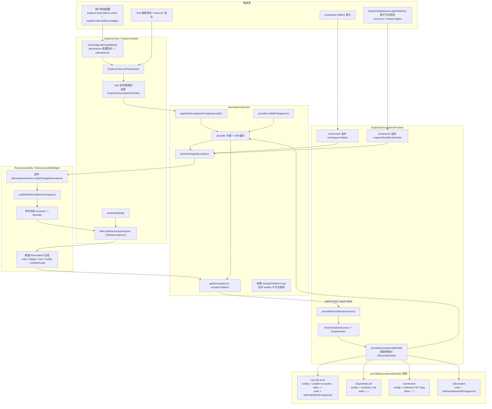

- 文件级调用图，每个节点标注了调用文件名



```mermaid
flowchart TB
  subgraph A["视图装配"]
    A1["explorerViewlet.ts<br/>注册 ExplorerViewlet / ViewContainer"]
    A2["explorerView.ts<br/>创建 ExplorerView"]
    A3["explorerViewer.ts<br/>渲染 tree 节点"]
  end

  subgraph B["装饰提供层"]
    B1["explorerDecorationsProvider.ts<br/>ExplorerDecorationsProvider"]
    B2["explorerDecorationsProvider.ts<br/>provideDecorations(fileStat)"]
    B3["explorerViewer.ts<br/>explorerRootErrorEmitter"]
  end

  subgraph C["装饰服务层"]
    C1["decorations.ts<br/>IDecorationsService / IDecorationsProvider"]
    C2["decorationsService.ts<br/>DecorationsService.registerDecorationsProvider()"]
    C3["decorationsService.ts<br/>DecorationsService.getDecoration()"]
    C4["decorationsService.ts<br/>onDidChangeDecorations"]
  end

  subgraph D["标签渲染层"]
    D1["labels.ts<br/>ResourceLabels"]
    D2["labels.ts<br/>ResourceLabelWidget"]
    D3["labels.ts<br/>notifyFileDecorationsChanges()"]
  end

  subgraph E["Explorer 数据层"]
    E1["explorerService.ts<br/>ExplorerService"]
    E2["explorerModel.ts<br/>ExplorerModel / ExplorerItem"]
    E3["explorerViewer.ts<br/>ExplorerDataSource.getChildren()"]
  end

  subgraph F["配置层"]
    F1["files.contribution.ts<br/>explorer.decorations.colors"]
    F2["files.contribution.ts<br/>explorer.decorations.badges"]
    F3["explorerView.ts<br/>onConfigurationUpdated()"]
  end

  A1 --> A2 --> A3
  A3 -->|setTreeInput 完成后注册| B1
  B1 --> B2
  B2 --> E1
  E1 --> E2
  E3 -->|root resolve 失败| B3
  B3 --> B1

  B1 -->|注册 provider| C2
  C2 --> C3
  C2 --> C4
  C4 --> D1

  A3 -->|renderStat()| D2
  D2 -->|setResource(resource, options)| C3
  C3 -->|返回 IDecoration| D2
  C4 --> D3 --> D2

  F1 --> F3
  F2 --> F3
  F3 -->|refresh(true)| A2
  ```