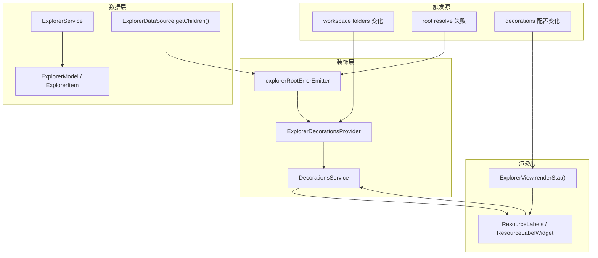
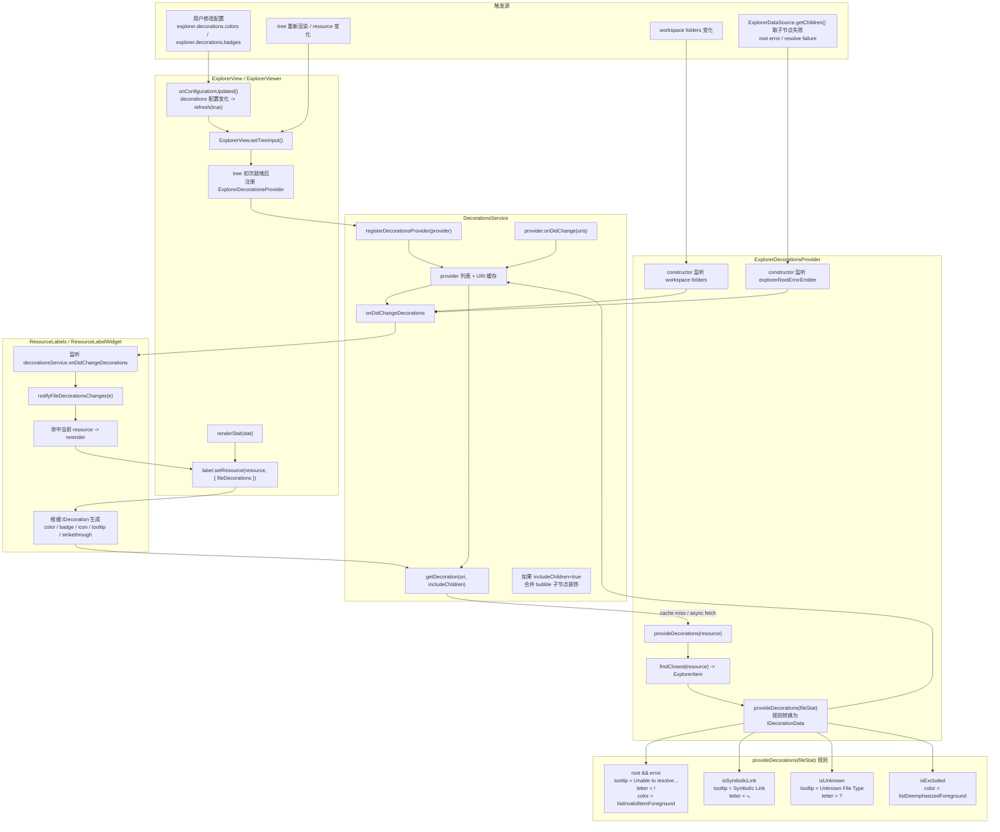
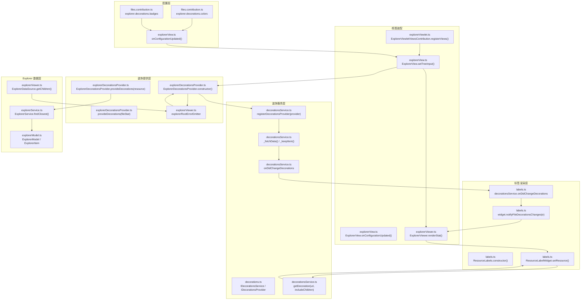

# decorations的主调用流程图（上游的逻辑）

- 文件级调用图，每个节点标注了调用文件名

```mermaid
flowchart TB
  subgraph A["数据层"]
    A1["ExplorerModel / ExplorerItem"]
    A2["ExplorerService"]
    A3["ExplorerDataSource.getChildren()"]
  end

  subgraph B["装饰层"]
    B1["ExplorerDecorationsProvider"]
    B2["DecorationsService"]
    B3["explorerRootErrorEmitter"]
  end

  subgraph C["渲染层"]
    C1["ExplorerView.renderStat()"]
    C2["ResourceLabels / ResourceLabelWidget"]
  end

  subgraph D["触发源"]
    D1["workspace folders 变化"]
    D2["root resolve 失败"]
    D3["decorations 配置变化"]
  end

  D1 --> B1
  D2 --> B3
  D3 --> C1

  A3 --> B3
  B3 --> B1
  A2 --> A1
  B1 --> B2
  C1 --> C2
  C2 --> B2
  B2 --> C2
```

```mermaid
flowchart TB
  %% ============ 触发源 ============
  subgraph SRC["触发源"]
    U["用户修改配置<br/>explorer.decorations.colors / explorer.decorations.badges"]
    W["workspace folders 变化"]
    F["ExplorerDataSource.getChildren() 取子节点失败<br/>root error / resolve failure"]
    R["tree 重新渲染 / resource 变化"]
  end

  %% ============ Explorer View ============
  subgraph VIEW["ExplorerView / ExplorerViewer"]
    EV1["ExplorerView.setTreeInput()"]
    EV2["tree 初次就绪后<br/>注册 ExplorerDecorationsProvider"]
    EV3["onConfigurationUpdated()<br/>decorations 配置变化 -> refresh(true)"]
    EV4["renderStat(stat)"]
    EV5["label.setResource(resource, { fileDecorations })"]
  end

  %% ============ Provider ============
  subgraph PROVIDER["ExplorerDecorationsProvider"]
    P1["constructor 监听 workspace folders"]
    P2["constructor 监听 explorerRootErrorEmitter"]
    P3["provideDecorations(resource)"]
    P4["findClosest(resource) -> ExplorerItem"]
    P5["provideDecorations(fileStat)<br/>规则转换为 IDecorationData"]
  end

  subgraph RULES["provideDecorations(fileStat) 规则"]
    PR1["root && error<br/>tooltip = Unable to resolve...<br/>letter = !<br/>color = listInvalidItemForeground"]
    PR2["isSymbolicLink<br/>tooltip = Symbolic Link<br/>letter = ⤷"]
    PR3["isUnknown<br/>tooltip = Unknown File Type<br/>letter = ?"]
    PR4["isExcluded<br/>color = listDeemphasizedForeground"]
  end

  %% ============ Decorations Service ============
  subgraph SERVICE["DecorationsService"]
    S1["registerDecorationsProvider(provider)"]
    S2["provider 列表 + URI 缓存"]
    S3["provider.onDidChange(uris)"]
    S4["getDecoration(uri, includeChildren)"]
    S5["如果 includeChildren=true<br/>合并 bubble 子节点装饰"]
    S6["onDidChangeDecorations"]
  end

  %% ============ Labels / Rendering ============
  subgraph LABEL["ResourceLabels / ResourceLabelWidget"]
    L1["监听 decorationsService.onDidChangeDecorations"]
    L2["notifyFileDecorationsChanges(e)"]
    L3["命中当前 resource -> rerender"]
    L4["根据 IDecoration 生成<br/>color / badge / icon / tooltip / strikethrough"]
  end

  %% ============ 连接 ============
  U --> EV3
  EV3 --> EV1
  EV1 --> EV2
  EV2 --> S1

  W --> P1
  F --> P2
  R --> EV1

  P1 --> S6
  P2 --> S6

  EV4 --> EV5 --> L4
  L4 --> S4

  S1 --> S2
  S3 --> S2
  S2 --> S4
  S4 -->|cache miss / async fetch| P3
  P3 --> P4 --> P5
  P5 --> PR1
  P5 --> PR2
  P5 --> PR3
  P5 --> PR4
  P5 --> S2
  S2 --> S6

  S6 --> L1 --> L2 --> L3 --> EV5
```

```mermaid
flowchart TB
  subgraph V["视图装配"]
    V1["explorerViewlet.ts<br/>ExplorerViewletViewsContribution.registerViews()"]
    V2["explorerView.ts<br/>ExplorerView.setTreeInput()"]
    V3["explorerView.ts<br/>ExplorerView.onConfigurationUpdated()"]
    V4["explorerViewer.ts<br/>ExplorerViewer.renderStat()"]
  end

  subgraph D["装饰提供层"]
    D1["explorerDecorationsProvider.ts<br/>ExplorerDecorationsProvider.constructor()"]
    D2["explorerDecorationsProvider.ts<br/>ExplorerDecorationsProvider.provideDecorations(resource)"]
    D3["explorerDecorationsProvider.ts<br/>provideDecorations(fileStat)"]
    D4["explorerViewer.ts<br/>explorerRootErrorEmitter"]
  end

  subgraph S["装饰服务层"]
    S1["decorations.ts<br/>IDecorationsService / IDecorationsProvider"]
    S2["decorationsService.ts<br/>registerDecorationsProvider(provider)"]
    S3["decorationsService.ts<br/>getDecoration(uri, includeChildren)"]
    S4["decorationsService.ts<br/>_fetchData() / _keepItem()"]
    S5["decorationsService.ts<br/>onDidChangeDecorations"]
  end

  subgraph L["标签渲染层"]
    L1["labels.ts<br/>ResourceLabels.constructor()"]
    L2["labels.ts<br/>decorationsService.onDidChangeDecorations"]
    L3["labels.ts<br/>widget.notifyFileDecorationsChanges(e)"]
    L4["labels.ts<br/>ResourceLabelWidget.setResource()"]
  end

  subgraph E["Explorer 数据层"]
    E1["explorerViewer.ts<br/>ExplorerDataSource.getChildren()"]
    E2["explorerService.ts<br/>ExplorerService.findClosest()"]
    E3["explorerModel.ts<br/>ExplorerModel / ExplorerItem"]
  end

  subgraph C["配置层"]
    C1["files.contribution.ts<br/>explorer.decorations.colors"]
    C2["files.contribution.ts<br/>explorer.decorations.badges"]
    C3["explorerView.ts<br/>onConfigurationUpdated()"]
  end

  V1 --> V2
  V2 --> D1
  V2 --> V4

  D1 --> D4
  D1 --> S2
  D2 --> E2
  E2 --> E3

  E1 --> D4
  D4 --> D1

  S2 --> S4
  S4 --> S5
  S5 --> L2

  V4 --> L4
  L4 --> S3
  S3 --> L4

  L2 --> L3
  L3 --> V4

  C1 --> C3
  C2 --> C3
  C3 --> V2
```

```mermaid
flowchart TB
  subgraph V["视图装配"]
    V1["explorerViewlet.ts<br/>ExplorerViewletViewsContribution.registerViews()"]
    V2["explorerView.ts<br/>ExplorerView.setTreeInput()"]
    V3["explorerView.ts<br/>ExplorerView.onConfigurationUpdated()"]
    V4["explorerViewer.ts<br/>ExplorerViewer.renderStat()"]
  end

  subgraph D["装饰提供层"]
    D1["explorerDecorationsProvider.ts<br/>ExplorerDecorationsProvider.constructor()"]
    D2["explorerDecorationsProvider.ts<br/>ExplorerDecorationsProvider.provideDecorations(resource)"]
    D3["explorerDecorationsProvider.ts<br/>provideDecorations(fileStat)"]
    D4["explorerViewer.ts<br/>explorerRootErrorEmitter"]
  end

  subgraph S["装饰服务层"]
    S1["decorations.ts<br/>IDecorationsService / IDecorationsProvider"]
    S2["decorationsService.ts<br/>registerDecorationsProvider(provider)"]
    S3["decorationsService.ts<br/>getDecoration(uri, includeChildren)"]
    S4["decorationsService.ts<br/>_fetchData() / _keepItem()"]
    S5["decorationsService.ts<br/>onDidChangeDecorations"]
  end

  subgraph L["标签渲染层"]
    L1["labels.ts<br/>ResourceLabels.constructor()"]
    L2["labels.ts<br/>decorationsService.onDidChangeDecorations"]
    L3["labels.ts<br/>widget.notifyFileDecorationsChanges(e)"]
    L4["labels.ts<br/>ResourceLabelWidget.setResource()"]
  end

  subgraph E["Explorer 数据层"]
    E1["explorerViewer.ts<br/>ExplorerDataSource.getChildren()"]
    E2["explorerService.ts<br/>ExplorerService.findClosest()"]
    E3["explorerModel.ts<br/>ExplorerModel / ExplorerItem"]
  end

  subgraph C["配置层"]
    C1["files.contribution.ts<br/>explorer.decorations.colors"]
    C2["files.contribution.ts<br/>explorer.decorations.badges"]
    C3["explorerView.ts<br/>onConfigurationUpdated()"]
  end

  V1 --> V2
  V2 --> D1
  V2 --> V4

  D1 --> D4
  D1 --> S2
  D2 --> E2
  E2 --> E3

  E1 --> D4
  D4 --> D1

  S2 --> S4
  S4 --> S5
  S5 --> L2

  V4 --> L4
  L4 --> S3
  S3 --> L4

  L2 --> L3
  L3 --> V4

  C1 --> C3
  C2 --> C3
  C3 --> V2
```