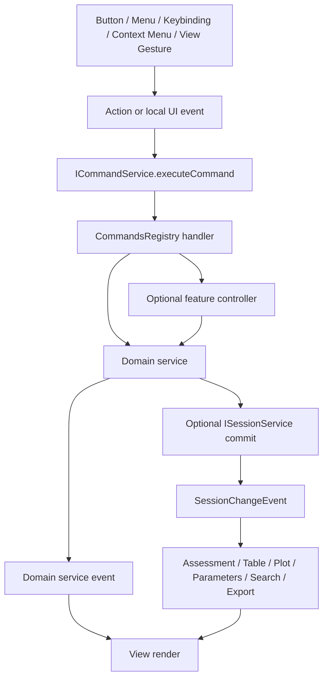
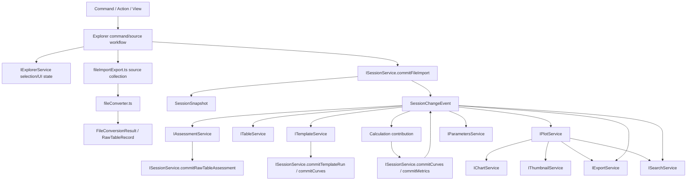
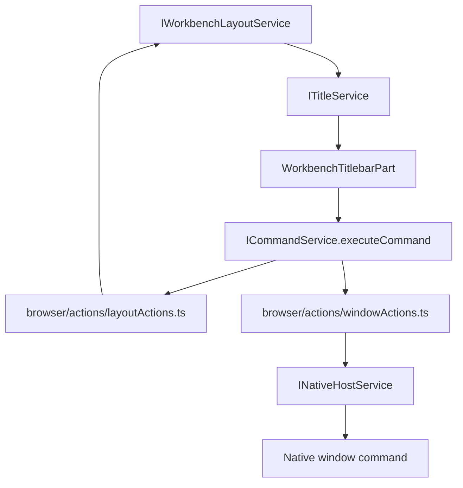
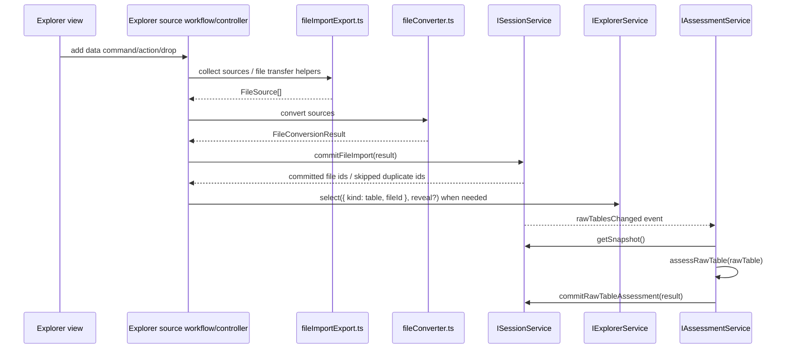
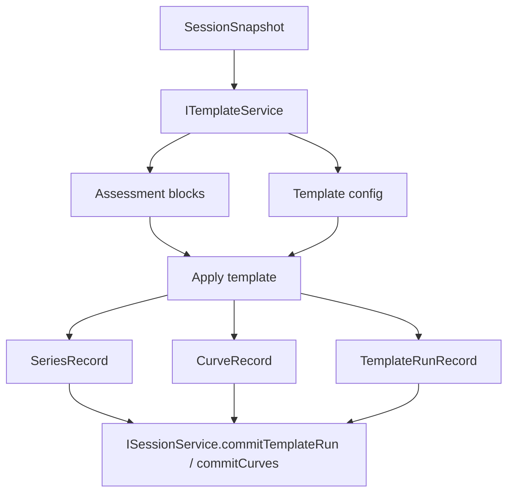
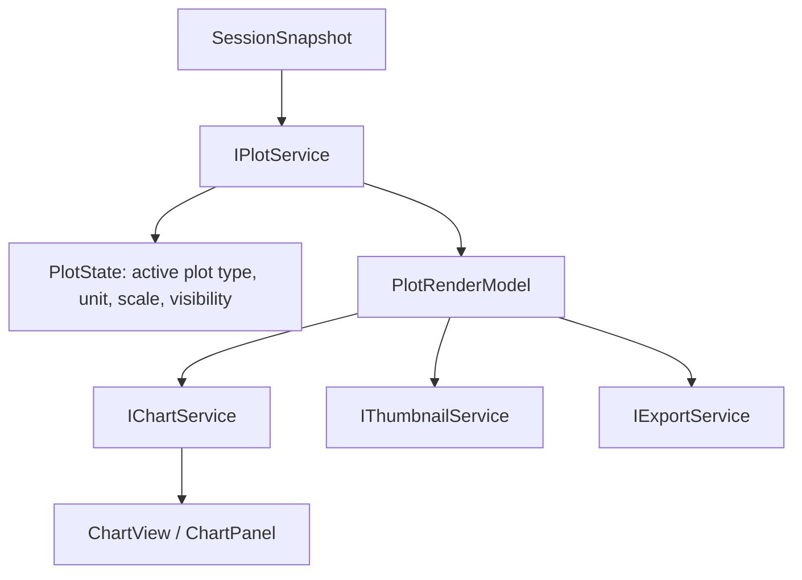
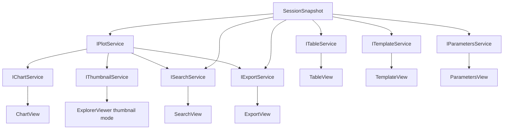

# Conductor Architecture

Canonical reference for Conductor Studio architecture and ownership boundaries.

Use this file before adding a new service, moving a record, wiring a feature
through `workbench.ts`, or deciding which component owns state. Domain-specific
details live in the matching `*.instructions.md` file.

Read this document in this order:

1. Start with the core interaction model and owner rules.
2. Check the layer and service map for the correct destination.
3. Use the flow diagrams to preserve existing responsibility boundaries.
4. Use the file layout and migration sections when moving code.

## Core interaction model

Conductor follows the VS Code module relationship:

```txt
contribution / registry / DI
  -> register service / command / action / view / provider
  -> user triggers command / action
  -> command handler gets service
  -> service method is called
  -> service updates owned state
  -> service fires onDidChangeXxx
  -> listeners receive event
  -> listeners read current service / model / view state
  -> listeners update themselves
```

These three mechanisms are separate:

| Mechanism | Purpose | Rule |
| --- | --- | --- |
| Registration | Connect a capability to the system. | Register services, commands, actions, views, providers, serializers, context keys, and contributions. Do not execute business logic or refresh UI from registration code. |
| Invocation | Execute a capability after a user or caller entry point fires. | Commands/actions/controllers normalize input, get services, call public service APIs, and return results. They do not own long-lived state or mutate DOM/model internals. |
| Subscription | Notify interested consumers after state changes. | Owners fire `onDidChangeXxx` events. Consumers subscribe, reread the public service/model/view state they need, and update themselves. |

Compressed rule:

```txt
register
  -> command/action invoked
  -> service method called
  -> owned state changed
  -> event fired
  -> listener notified
  -> listener reads current state
  -> listener updates itself
```

Registration files are access points, not business controllers. A
`.contribution.ts` file may register commands, actions, menus, keybindings,
views, workbench contributions, services, and small glue code. Complex logic
belongs in the concrete owner: service, model, controller, provider, or view
model.

Command and action code is an entry layer, not a state owner. It may perform
light argument validation, resolve a service, call a service API, and return the
result. It must not hold long-lived state, directly mutate internal models,
operate concrete DOM, or carry complex domain workflows.

## State owner rule

The owner of state is the only component that mutates that state.

Upstream rule: who owns the state updates the state. A consumer does not take
over mutation because it observed a change, rendered the state, or needs the
derived result. It calls the owner's public API, then subscribes to the owner's
`onDidChangeXxx` event and rereads the current owner state or model.

Use this flow:

```txt
consumer intent
  -> ownerService.update/select/set/run(...)
  -> owner mutates owned state
  -> owner fires onDidChangeXxx
  -> subscribers reread owner public state/model
  -> subscribers update their own UI or local view state
```

Do not invert the flow by passing owner behavior, owner data builders, or
mutation callbacks through view input/context records so another component can
update the owner indirectly.

External modules interact through public APIs:

```ts
service.update(...);
service.reset(...);
service.refresh(...);
service.getState();
service.getViewState();
```

Do not mutate another owner's internals:

```ts
service._model.value = ...;
service._items.clear();
service._state.visible = false;
```

Naming of public methods is domain-specific. Do not force a generic abstraction
only to make method names uniform.

Service interfaces should expose methods and events, not mutable internal
structure:

```ts
export interface IFeatureService {
  readonly onDidChangeFeature: Event<FeatureChangeEvent>;

  getState(): FeatureState;
  run(input: FeatureInput): Promise<void>;
  update(update: FeatureUpdate): void;
}
```

Do not expose private owner state as API:

```ts
export interface IFeatureService {
  _model: FeatureModel;
  _state: FeatureState;
  _items: Map<string, Item>;
}
```

## Owner-driven target API rule

For every `workbench/contrib` and `workbench/services` boundary, behavior lives
on the owner service, model, controller, or primitive. Targets are pure
reference/value objects.

Use this shape when an operation acts on a domain target:

```ts
ownerService.select(target, reveal?);
ownerService.reveal(target, options?);
ownerService.open(target, options?);
ownerService.update(target, update);
ownerModel.setSelection(selection);
```

Do not turn target records into behavior objects:

```ts
target.select();
cell.reveal();
row.open();
curve.toggle();
```

The owner validates and normalizes the target, mutates only its owned state,
fires the matching `onDidChangeXxx` event, and lets subscribers reread public
state. Commands, actions, views, and gestures may construct targets and invoke
owner APIs, but they must not own the mutation or smuggle callbacks through
pane input to make another component perform it.

This applies across domains:

```txt
Explorer resource selection -> IExplorerService
Table cell/range selection  -> ITableService
Plot type/series visibility -> IPlotService
Chart pane/legend state     -> IChartService
Search query/result state   -> ISearchService
Export option/curve state   -> IExportService
Parameter row/input state   -> IParametersService
```

Use the domain's existing public method names when they already exist. Add a
new method only when the owner boundary is clear, the target type is part of the
owner's contract, and the API is explicitly Conductor-specific when no upstream
counterpart exists.

## Event rule

Events are facts, not commands.

Good event names describe what changed:

```ts
onDidChangeConfiguration
onDidChangeContext
onDidChangeModel
onDidChangeSelection
onDidChangeVisibility
onDidChangeViewState
```

Bad event names describe what a consumer should do:

```ts
onShouldRefreshView
onNeedRenderPanel
onForceUpdateUI
```

If an event name contains `should`, `need`, or `force`, the owner is probably
crossing the boundary and controlling consumers. The owner should fire a state
change event; subscribers decide how to respond.

A subscriber may bridge domains only by reading the source owner's public
state and calling the target owner's public API. Do not use an event as a
hidden command bus where one service fires `onDidSubmitXxx` only so another
service mutates its own state. If a workflow has produced canonical data, call
`ISessionService` directly; the resulting `SessionChangeEvent` is what
downstream consumers subscribe to.

When an owner stores a service-local view input or pane input snapshot, the
change event is only the fact that the owner snapshot changed. Consumers must
subscribe to the specific `onDidChange*Input` event and then reread
`getViewInput()` / `getPaneInput()` from the owner. Do not send the full input
snapshot through the event payload and do not consume event payloads as the data
path.

Subscriptions must be disposed:

```ts
this._register(service.onDidChangeSomething(() => {
  this.update();
}));
```

Do not subscribe without owning the listener lifetime:

```ts
service.onDidChangeSomething(() => {
  this.update();
});
```

## View rule

Views are usually state readers and event subscribers.

Views may register with the view registry, get services, subscribe to service /
model / context / configuration events, update DOM from current state, and
translate user interaction into commands or service calls.

Views must not directly mutate service internals, control other views, own the
only source of business truth, or bypass command/service boundaries for domain
actions.

Preferred flow:

```txt
user interaction
  -> command / service API
  -> service updates state
  -> service fires event
  -> view receives event
  -> view reads current state
  -> view updates DOM
```

Avoid:

```txt
user interaction
  -> view directly mutates service._model
  -> view manually calls otherView.refresh()
```

## Selection rule

Selection belongs to a concrete owner. It is not global by default.

Typical owners:

```txt
editor owns editor selection
tree owns tree selection
list owns list selection
quick pick owns quick pick selection
specific view owns its own local selection
```

The selection owner exposes the matching API or event:

```ts
readonly onDidChangeSelection: Event<SelectionChangeEvent>;

getSelection(): Selection;
setSelection(selection: Selection): void;
```

Consumers that care about selection changes subscribe to the owning component's
`onDidChangeSelection` event. Do not collapse local selection into a global
center such as `GlobalSelectionService`, `ActiveTargetService`, or
`UniversalSelectionState` unless it is truly a workbench-wide platform
capability with a clear owner, lifecycle, and consumer boundary.

## Model and view state rule

Model state represents business or structural facts. View state represents a
view's own presentation and interaction state, such as visibility, focus,
selection, expanded/collapsed nodes, scroll position, layout state, filter text,
and sort state.

Do not mix model state and view state. Usually:

```txt
service / model owner maintains core state
view / widget maintains local view state
external consumers read necessary state through public APIs
changes are announced through onDidChangeXxx
```

Before promoting state into a global service, answer:

```txt
Who produces this state?
Who mutates it?
Who owns its lifecycle?
Is it truly shared across modules?
Does the external caller need the state itself, or only a behavior API?
```

## Architecture checklist

Use these checks when judging whether code follows the Conductor / VS Code
style:

```txt
1. Is the capability registered through contribution / registry / DI?
2. Does the user entry dispatch through command / action / service API?
3. Is state mutated only by an explicit owner?
4. Are changes announced through onDidChangeXxx instead of owner-controlled consumers?
```

Common bad smells:

```txt
view directly mutates service._model
service directly calls view.render()
command handler contains complex business logic
contribution file becomes the business orchestrator
event name expresses a UI instruction instead of a state change
external module holds a mutable reference to owner internals
local selection is prematurely promoted to global selection
event subscription is not disposed
```

## Record and component documentation rule

Record and state field definitions are centralized in
`records.instructions.md`. Module instruction files should not repeat full
field tables unless the type is module-private and not yet ready for the shared
catalog. Instead, module files should identify which records/state they own and
link to the shared field catalog.

When adding or materially changing a shared record/state/model entry in
`records.instructions.md`, include the applicable metadata before the field
table:

```txt
Type name
  Owner
  Producer
  Consumers
  Canonical or service-local
  Invalidation rule
  Field table
```

When a module file needs a local `Field catalog` section, keep it to a short
pointer to the record/state names in `records.instructions.md` plus any
module-specific owner or invalidation rule that is not already captured there.

A file responsibility table must not stop at `FooManager`. It must say whether the file is a service, controller, store, model, provider, adapter, planner, reader, registry, or cache.

## Layers

Conductor follows the same ordered-layer idea as VS Code:

1. **`base`** - utilities and UI primitives. No workbench service dependency.
2. **`platform`** - process/platform services such as files, dialogs, commands, context keys, storage, instantiation.
3. **`workbench/services`** - cross-feature domain services and canonical service APIs.
4. **`workbench/contrib`** - feature contributions, views, commands, actions, and UI composition.
5. **entry points** - files that import/register contributions and services.

Entry-point imports are loading and registration statements. Group them by the
owner of the implementation being registered:

```txt
workbench services        -> workbench/services/** service implementations
workbench service contributions -> workbench/services/**/*.contribution.ts
workbench contrib services -> contrib-owned DI services such as IExplorerService
workbench browser contributions -> workbench/browser action/contribution registration
workbench contributions   -> feature contribution/action/command registration
```

Do not move a service into `workbench/services` only because an entry point
imports it for DI registration. `IExplorerService` is a service, but its owner
is the Files Explorer UI under `workbench/contrib/files`.

Layer rule:

```txt
contrib -> workbench/services -> platform -> base
```

A lower layer must not import a higher layer. `platform/files/IFileService` must not know Explorer, Session, Plot, or Assessment. `services/session` must not import contrib views. Views consume services; they do not own canonical records.

## Runtime folders

Use runtime folders consistently.

| Folder | Meaning |
| --- | --- |
| `common` | Types, interfaces, records, pure functions. No DOM, no Worker, no Electron. |
| `browser` | DOM, browser workers, browser implementations. |
| `electron-browser` | Renderer-side desktop bridge and Electron IPC integration. |
| `node` | Node-only helpers. |
| `electron-main` | Main process implementation. |

`common` files define the contract. Runtime folders implement the contract.

## Service map

| Service | Canonical owner | Primary input | Primary output | Must not do |
| --- | --- | --- | --- | --- |
| `ICommandService` | `src/cs/platform/commands` | command id + args | command dispatch, command events | domain state, UI rendering, session records |
| `IFileService` | `src/cs/platform/files` | URI / filesystem provider | file bytes, stat, watch events | Explorer UI state, import semantics, raw tables |
| `IQuickInputService` | `src/cs/platform/quickinput` | quick pick items, placeholder, labels | generic quick input / quick pick UI, filtering, keyboard navigation, selected item result | command collection, feature-specific quick access providers, workbench domain state |
| `IWorkbenchLayoutService` | `src/cs/workbench/services/layout` | workbench layout commands, part visibility updates, navigation requests | active workbench view, active table/chart mode, navigation history, part visibility events | Explorer selection, table/chart data state, titlebar rendering |
| `ITitleService` | `src/cs/workbench/services/title` | layout/window chrome state and optional titlebar view-state overrides | titlebar render state, titlebar part attachment, titlebar change events | own table/chart mode, own file selection, register layout/window commands |
| `IExplorerService` | `src/cs/workbench/contrib/files` | Explorer view/model events, command context, session/file facts | Explorer model/state, context, select/reveal, edit/copy state, refresh | filesystem primitives, table parsing, assessment, canonical session ownership |
| `fileConverter.ts` / files source workflow | `src/cs/workbench/services/files` | CSV/Excel/Clipboard source | `FileConversionResult`, `RawTableRecord` | Explorer UI state, IV/CV judgement, block detection, session mutation |
| `IAssessmentService` | `src/cs/workbench/services/assessment` | `RawTableRecord` | groups, blocks, column roles, diagnostics | template execution, plotting, UI state |
| `ISessionService` | `src/cs/workbench/services/session` | commit requests | canonical records, snapshot, change events | view state, worker refs, request cache, rendering |
| `ITableService` | `src/cs/workbench/services/table` | session snapshot, raw table refs | table model, row preview, selection snapshot/highlight state | block detection, template execution |
| `ITemplateService` | `src/cs/workbench/services/template` | assessment blocks, template config | template records, template run, curves/series commit request | assessment, plotting, table selection ownership |
| calculation contribution/helpers | `src/cs/workbench/services/calculation` | session base curves, metric inputs | derived calculation results, `CurveRecord` and `MetricRecord` commit payloads | plot/chart UI state, parameter UI state, session internals |
| `IPlotService` | `src/cs/workbench/services/plot` | session curves/metrics, plot settings | `PlotRenderModel`, plot domains, display series | DOM rendering, chart panel shell |
| `IChartService` | `src/cs/workbench/services/chart` | plot model and chart UI actions | chart shell state, pane layout, render input | raw session interpretation, plot calculation |
| `IThumbnailService` | `src/cs/workbench/services/thumbnail` | plot render model | thumbnail cache/render result | session mutation, independent curve derivation |
| `ISearchService` | `src/cs/workbench/services/search` | session snapshot, optional plot index | search results with source refs | canonical mutation, duplicate assessment |
| `IExportService` | `src/cs/workbench/services/export` | session records, plot models, export options | export plan/payload | chart rendering, assessment, session ownership |
| `IParametersService` | `src/cs/workbench/services/parameters` | metrics, curves, manual inputs | parameter display model, metric input commits | plot rendering, raw parsing |


## Command entry and dispatch

All user-visible operations enter through commands/actions/controllers before reaching services.



Command files are entry points, not state owners. A command handler validates arguments, resolves a service through `ServicesAccessor`, and delegates. It must not mutate the DOM or `SessionModel` directly.

```txt
<feature>Actions.ts
  UI affordance: menu, toolbar, keybinding, context menu.

<feature>Commands.ts
  command id + argument validation + service dispatch.

<feature>Controller.ts
  optional multi-step workflow: dialog, progress, notification, batching.

services/<domain>/browser/<domain>Service.ts
  long-lived state and domain implementation.
```

Use `CommandTarget` as an explicit command argument. Do not reintroduce a global `activeTarget` in session as the universal dispatch target.

Read `commands.instructions.md` before adding command IDs or handlers.

## Data flow at a glance



Key rule: **Plot is the drawing domain consumer. Chart is a host for plot rendering.**

## Workbench chrome flow



`IWorkbenchLayoutService` owns active view, table/chart mode, navigation
history, and part visibility. `ITitleService` consumes that public state and
publishes titlebar render state. `WorkbenchTitlebarPart` renders chrome and
invokes command ids; it does not register commands or own mode/file state.

## Canonical session state

`SessionModel` is the in-memory ledger for the current analysis session.

It stores canonical records only:

```ts
export type SessionModel = {
  readonly schemaVersion: 1;
  readonly sessionVersion: number;
  readonly filesById: Record<FileId, FileRecord>;
  readonly fileOrder: readonly FileId[];
};
```

A `FileRecord` owns the lifecycle records for one imported workbook/file:

```ts
export type FileRecord = {
  readonly id: FileId;
  readonly name: string;
  readonly kind: FileKind;

  readonly raw: RawRecord;
  readonly assessmentsByRawTableId: Record<RawTableId, RawTableAssessmentRecord>;

  readonly measurementBlocksById: Record<MeasurementBlockId, MeasurementBlockRecord>;
  readonly measurementBlockOrder: readonly MeasurementBlockId[];

  readonly templateRunsById?: Record<TemplateRunId, TemplateRunRecord>;
  readonly latestTemplateRunId?: TemplateRunId | null;

  readonly seriesById: Record<SeriesId, SeriesRecord>;
  readonly seriesOrder: readonly SeriesId[];

  readonly curvesByKey: Record<CurveKey, CurveRecord>;
  readonly metricsByKey: Record<MetricKey, MetricRecord>;
  readonly metricInputsByKey?: Record<MetricKey, MetricInputRecord>;

  readonly calculationCache?: CalculationCacheRecord;
};
```

Do not put these in `SessionModel`:

- table selection, focused row, scroll offset;
- chart zoom, legend popover, pane visibility;
- template form draft state;
- search query or selected search result;
- export dialog options;
- thumbnail render cache;
- worker refs, request id refs, row caches;
- service lifecycle state.

Use service-specific state for those.

## Domain active and selection owners

This section applies the earlier selection rule to Conductor domains. Do not
create a global `activeTarget` as the owner of every active object.

Use this mapping:

```txt
The service that owns the interaction owns the active/focus/selection state.
```

Examples:

| State | Owner |
| --- | --- |
| selected resource in Explorer | `IExplorerService` |
| active table cell/range | active `TableWidget`, mirrored to `ITableService` as a command/copy snapshot |
| active table zoom / column widths | active `TableWidget` |
| active plot type / visible plotted series | `IPlotService` |
| chart detail pane / legend popover | `IChartService` |
| selected parameter row | `IParametersService` |
| search query / selected result | `ISearchService` |
| export selected curves/options | `IExportService` |

Use `CommandTarget` as a command argument, not as global session state.

## Cross-service selection mirroring

When one service needs to reflect another service's active item, keep ownership
with the original service and mirror through an explicit bridge. Do not move the
state into a shared object, do not name the receiving service input after the
source service's state, and do not make the source service call the receiving
service's private lifecycle methods.

Upstream Explorer/Editor pattern:

```txt
EditorService owns activeEditor.
ExplorerView listens to EditorService.onDidActiveEditorChange.
ExplorerView derives the active editor resource.
ExplorerView calls ExplorerService.select(resource, reveal).
ExplorerService owns Explorer selection/reveal and calls ExplorerView.selectResource(...).
```

Important consequences:

- Editor does not own Explorer tree selection.
- Explorer does not store editor active state as its canonical state.
- Explorer service does not subscribe to editor and mutate unrelated domains.
- The bridge translates between domain terms: editor resource -> explorer resource.
- Commands may bridge domains, but the target service still owns its state.

Use the same rule for Conductor domains:

```txt
Explorer owns selected Explorer resource.
TableService owns current TableSource and preview lifecycle; the active TableWidget owns table selection interaction, zoom, and column layout, and mirrors only the command/copy selection snapshot to TableService.
WorkbenchDomainBridge or a feature view may translate selected Explorer resource -> TableSource.
TableService.open(...) receives source: TableSource | null, not selectedFileId.
TableService subscribes to Session and rereads session snapshots for raw table metadata and rows.
Files/Explorer must not call Table preview invalidation or row-cache methods.
```

## Import flow



`IExplorerService` is the Explorer UI-state service under
`workbench/contrib/files`, following the upstream Files feature shape. The
source workflow or controller coordinates user intent, source collection,
conversion, session commit, and any optional Explorer selection follow-up.
`fileImportExport.ts` collects sources or handles file transfer.
`fileConverter.ts` converts external data sources into raw table facts. It
does not decide whether the data is IV/CV/CF/PV/IT.

## Assessment flow

```mermaid
flowchart TD
    RawTable[RawTableRecord] --> Assessment[IAssessmentService.assessRawTable]
    Assessment --> Groups[MeasurementGroupRecord]
    Assessment --> Blocks[MeasurementBlockRecord]
    Assessment --> Columns[ColumnRoleMap]
    Assessment --> Diagnostics[AssessmentDiagnostic]
    Groups --> Result[RawTableAssessmentRecord]
    Blocks --> Result
    Columns --> Result
    Diagnostics --> Result
    Result --> Session[ISessionService.commitRawTableAssessment]
```



Assessment is the only owner of block/group/column role/sweep mode detection.

## Template flow



Template consumes assessment. It does not re-detect table structure.

## Plot and chart flow



Plot builds the render model. Chart hosts UI and renders it.

## Downstream consumption flow



## Session change events

Use specific events. Do not use `Event<void>` for broad invalidation once the new architecture is in place.

```ts
export type SessionChangeEvent =
  | {
      readonly reason: 'rawTablesChanged';
      readonly sessionVersion: number;
      readonly fileIds: readonly FileId[];
      readonly rawTableRefs: readonly RawTableRef[];
    }
  | {
      readonly reason: 'assessmentChanged';
      readonly sessionVersion: number;
      readonly fileIds: readonly FileId[];
      readonly rawTableRefs: readonly RawTableRef[];
      readonly measurementBlockIds: readonly MeasurementBlockId[];
    }
  | {
      readonly reason: 'templateRunChanged';
      readonly sessionVersion: number;
      readonly fileIds: readonly FileId[];
    }
  | {
      readonly reason: 'curvesChanged';
      readonly sessionVersion: number;
      readonly fileIds: readonly FileId[];
      readonly curveKeys: readonly CurveKey[];
    }
  | {
      readonly reason: 'metricsChanged';
      readonly sessionVersion: number;
      readonly fileIds: readonly FileId[];
      readonly metricKeys: readonly MetricKey[];
    };
```

## Recommended file layout

```txt
src/cs/platform/files/
  common/files.ts
  common/fileService.ts
  common/io.ts
  browser/webFileSystemAccess.ts
  browser/htmlFileSystemProvider.ts
  electron-main/*

src/cs/platform/quickinput/
  common/quickInput.ts
  browser/quickInputService.ts
  browser/media/quickInput.css

src/cs/workbench/services/files/
  common/files.ts
  common/fileConverterBackend.ts
  common/rawTable.ts
  browser/fileConverter.ts
  browser/fileConverterBackendService.ts
  browser/fileConverter.worker.ts
  browser/rawTableRowsReader.ts
  electron-browser/fileConversionService.ts

src/cs/workbench/services/assessment/
  common/assessment.ts
  common/measurement.ts
  common/diagnostics.ts
  browser/assessmentService.ts
  browser/fileAssessment.ts
  browser/assessment.contribution.ts

src/cs/workbench/services/session/
  common/session.ts
  common/sessionModel.ts
  common/sessionReadModel.ts
  common/sessionEvents.ts
  browser/sessionService.ts

src/cs/workbench/services/layout/
  browser/layoutService.ts

src/cs/workbench/services/title/
  browser/titleService.ts

src/cs/workbench/services/table/
  common/table.ts
  browser/tableService.ts
  browser/tableModel.ts
  browser/tablePreviewWorker.ts
  browser/tableRowsReaderService.ts
  browser/table.contribution.ts

src/cs/workbench/services/template/
  common/template.ts
  common/templateRun.ts
  browser/templateService.ts
  browser/templateApplyService.ts
  browser/template.contribution.ts

src/cs/workbench/services/calculation/
  common/calculation.ts
  common/calculationTypes.ts
  common/calculationExecutor.ts
  common/calculationRecordBuilder.ts
  common/calculationCurveRecordBuilder.ts
  common/calculationReadModel.ts
  common/calculationMetricRecordBuilder.ts
  common/gm.ts
  common/ss.ts
  common/vth.ts
  common/sweepSegmentation.ts
  common/ionIoff.ts
  common/calculationCacheAccess.ts
  common/calculationCachePolicy.ts
  browser/calculation.contribution.ts

src/cs/workbench/services/plot/
  common/plot.ts
  common/plotModel.ts
  common/plotSettings.ts
  browser/plotService.ts
  browser/plotRenderModel.ts
  browser/plotViewModel.ts
  browser/plot.contribution.ts

src/cs/workbench/services/chart/
  common/chart.ts
  browser/chartService.ts
  browser/chart.contribution.ts

src/cs/workbench/services/thumbnail/
  common/thumbnail.ts
  browser/thumbnailService.ts
  browser/thumbnailBitmap.ts

src/cs/workbench/services/search/
  common/search.ts
  browser/searchService.ts
  browser/searchIndex.ts

src/cs/workbench/services/export/
  common/export.ts
  browser/exportService.ts
  browser/originExportService.ts

src/cs/workbench/services/parameters/
  common/parameters.ts
  browser/parametersService.ts

src/cs/workbench/contrib/files/
  browser/files.ts
  browser/explorerService.ts
  common/explorerModel.ts
  browser/fileCommands.ts
  browser/fileActions.ts
  browser/fileActions.contribution.ts
  browser/fileImportExport.ts
  electron-browser/fileCommands.ts
  electron-browser/fileActions.contribution.ts
  browser/views/explorerView.ts
  browser/views/explorerViewer.ts

src/cs/workbench/contrib/quickaccess/
  common/quickAccessCommands.ts
  browser/commandsQuickAccess.ts
  browser/quickAccess.contribution.ts

src/cs/workbench/contrib/table/
  browser/tableCommands.ts
  browser/table.contribution.ts

src/cs/workbench/contrib/template/
  browser/templateCommands.ts
  browser/templateActions.ts
  browser/template.contribution.ts
  browser/templateApplyController.ts

src/cs/workbench/contrib/plot/
  browser/plotCommands.ts
  browser/plotActions.ts
  browser/plot.contribution.ts

src/cs/workbench/contrib/chart/
  browser/chartCommands.ts
  browser/chartActions.ts
  browser/chart.contribution.ts

src/cs/workbench/contrib/search/
  browser/searchCommands.ts
  browser/searchActions.ts
  browser/search.contribution.ts

src/cs/workbench/contrib/export/
  browser/exportCommands.ts
  browser/exportActions.ts
  browser/export.contribution.ts

src/cs/workbench/contrib/parameters/
  browser/parametersCommands.ts
  browser/parametersActions.ts
  browser/parameters.contribution.ts

src/cs/workbench/browser/actions/
  layoutActions.ts
  windowActions.ts

src/cs/workbench/browser/parts/titlebar/
  titlebarPart.ts
```

Views stay in `contrib/*`. Services own state and domain models.

Quick Input / Quick Access boundary:

- `platform/quickinput` owns the generic quick input UI infrastructure:
  overlay, input, list rendering, filtering, keyboard navigation, focus, and
  returning a selected item.
- `workbench/contrib/quickaccess` is a workbench contribution built on that
  infrastructure. It may register quick access command IDs and providers such
  as command search, but it must call `IQuickInputService` for the picker UI.
- Do not create `workbench/services/quickaccess` for command quick access
  unless there is a proven shared workbench-domain state owner. Command quick
  access is an entry/provider, not a service.
- Do not rename `contrib/quickaccess` to `quickinput`; quickinput is the
  platform primitive, quickaccess is the workbench feature that uses it.

## Contribution and command ownership

- Each feature has one `.contribution.ts` entry point for registration.
- Contribution files register services, views, commands, actions, menus,
  keybindings, and workbench contributions. They do not become business
  orchestrators.
- Commands live in `contrib/<feature>/browser/*Commands.ts` because commands
  are workbench entry points.
- Actions live in `contrib/<feature>/browser/*Actions.ts` and invoke command
  IDs or small service APIs.
- Services expose methods that commands call. Services do not register UI
  commands.
- Commands/actions live beside the contribution that owns the UI entry.
- If a command needs dialog/progress/notification orchestration, create a
  controller beside the contribution.
- Command handlers pass explicit targets to services whenever possible. If no
  target is passed, ask the owning service for its own local active/selection
  state.
- Commands call services; commands do not mutate `SessionModel` directly.
- Views render service state; views do not own canonical records.
- Cross-feature dependencies go through `services/*/common/*.ts` interfaces or
  explicit common models.
- Do not import from another contribution's internal `browser/` files.
- Avoid handlers that call `IViewsService.getViewWithId(...)` to mutate a view.
  That is acceptable only as a temporary migration bridge.

## Migration order

1. Settle the files capability / Explorer UI boundary while keeping platform `IFileService` and files import conversion as separate lower-level responsibilities.
2. Move raw table records to `services/files/common/rawTable.ts`.
3. Move assessment records and service API to `services/assessment`.
4. Shrink `ISessionService` to snapshot/events/commit methods.
5. Move table/template/chart/parameters/search/export view state into their services.
6. Add `IPlotService` and route chart/thumbnail/export through plot render models.
7. Keep file conversion, assessment, preview, and template worker boundaries separated under their domain services.
8. Add command/action/controller files for each feature and route UI entries through service dispatch.
9. Reduce `Workbench` to layout/view hosting and contribution wiring.

## Learnings

- If a new field describes imported data or analysis output, it probably belongs in a canonical record.
- If a new field describes how a panel looks, it belongs in that panel's service or view.
- If a service needs row bytes, use raw table refs and row readers; do not re-import files.
- If Chart needs data, ask Plot; do not read session curves directly from Chart.
- If Explorer needs filesystem bytes, ask `IFileService`; if it needs source collection or file conversion, use `fileImportExport.ts` and `fileConverter.ts` through the Files workflow.
