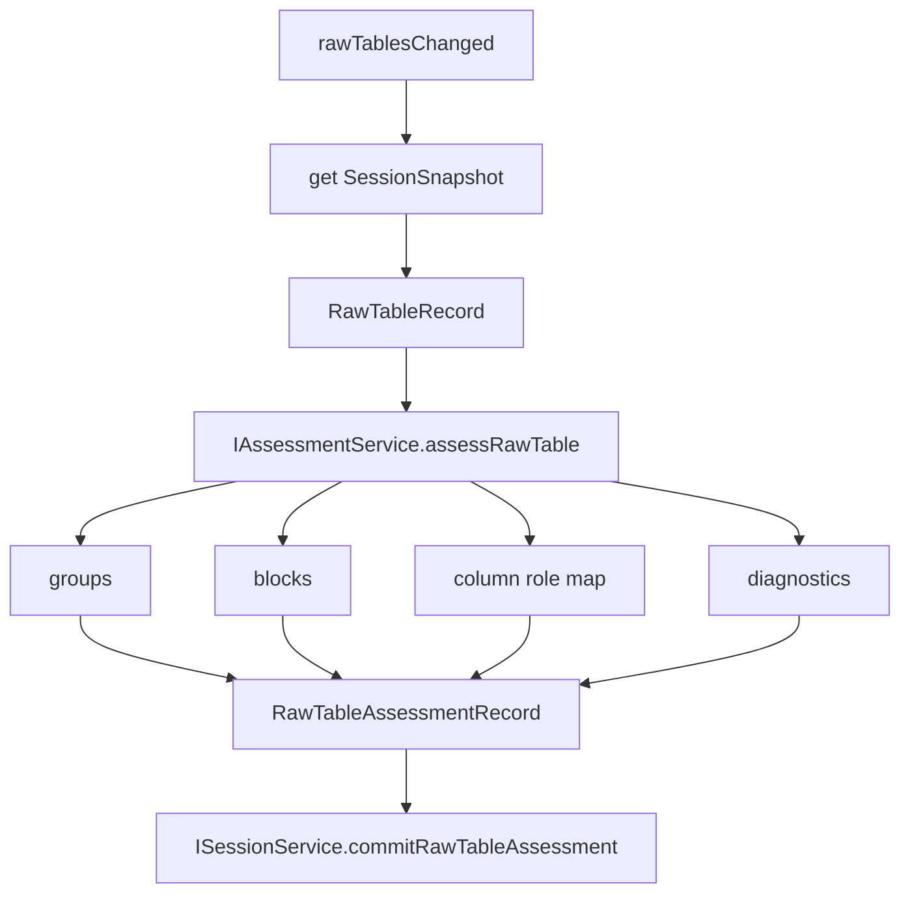

# Assessment

Assessment converts raw table facts into measurement structure.

It is the only owner of block/group/column role/sweep mode detection.

## Ownership

`IAssessmentService` owns:

- detecting measurement groups/device/sample labels;
- detecting measurement blocks within a raw table;
- identifying `headerRange`, `dataRange`, `titleRange`, and `fullRange`;
- detecting IV/CV/CF/PV/IT families;
- detecting IV transfer/output and IT modes;
- mapping raw columns to semantic roles;
- producing confidence and diagnostics;
- calling Rust/WASM assessment when available.

It does not own:

- file conversion;
- session storage;
- template execution;
- plot/chart rendering;
- table UI selection;
- search indexing beyond diagnostics metadata.

## Core files

| File | Responsibility |
| --- | --- |
| `src/cs/workbench/services/assessment/common/assessment.ts` | Defines `IAssessmentService`, `AssessRawTableInput`, `RawTableAssessmentRecord`, service result types. |
| `src/cs/workbench/services/assessment/common/measurement.ts` | Defines `MeasurementBlockRecord`, `MeasurementGroupRecord`, `MeasurementColumnMap`, `SweepMode`, `MeasurementFamily`, column refs. |
| `src/cs/workbench/services/assessment/common/diagnostics.ts` | Defines diagnostic severity, codes, messages, and source ranges. |
| `src/cs/workbench/services/assessment/browser/assessmentService.ts` | Browser implementation and orchestration. Chooses WASM or TypeScript fallback. |
| `src/cs/workbench/services/assessment/browser/fileAssessment.ts` | Browser adapter that parses import previews and calls the shared TypeScript assessment rules. |
| `src/cs/workbench/services/assessment/browser/assessmentRules.ts` | TypeScript fallback heuristics for headers, ranges, column roles, and sweep modes. |
| `src/cs/workbench/services/assessment/browser/assessment.contribution.ts` | Subscribes to session `rawTablesChanged` and commits assessment results. |

## Assessment result

```ts
export type RawTableAssessmentRecord = {
  readonly fileId: FileId;
  readonly rawTableId: RawTableId;
  readonly sourceRawTableVersion: number;
  readonly groups: readonly MeasurementGroupRecord[];
  readonly blocks: readonly MeasurementBlockRecord[];
  readonly diagnostics: readonly AssessmentDiagnostic[];
  readonly createdAt: number;
};
```

## Flow



## Rules

- `RawTableRecord` never owns blocks.
- A raw table can contain multiple measurement blocks.
- A block can point back to raw table cells using `RawTableRangeRef`.
- Diagnostics should be explicit when confidence is low.
- Assessment output must include `sourceRawTableVersion`; stale results must be ignored by Session.
- Assessment queue entries that are delayed by Explorer visible-range priority
  must capture the raw table source version when queued and drop the result if
  the version changes before rows are read or before assessment is committed.
- Keep curve family and curve mode separate. `iv`, `pv`, `cv`, `cf`, `it`,
  and `unknown` are measurement families. `transfer` and `output` are IV modes
  and must live in `ivMode`, not in `family`. `curveTypeLabel` / UI
  `curveType` strings are display projections only; owners must not parse them
  to recover canonical family or mode.
- TypeScript assessment rules are the semantic baseline. When changing
  `fileAssessment.ts`, `autoTemplatePlan*.ts`, or related confidence/role
  heuristics, update the Rust mirrors in `cli/src/assessment.rs` and
  `cli/src/detect.rs` in the same change when those paths implement the same
  rule.
- Mirrored TS/Rust assessment or auto-extraction rule changes must run
  `npm run verify:rust-auto-extraction` in addition to targeted unit tests.
  Add the new scenario to the compatibility fixtures when the rule changes
  classification, confidence, template need, axis role, or plan shape.

## Command entry and dispatch

Assessment is normally triggered by session events after raw tables change. A direct command is optional and should be used only for explicit re-assessment or developer tools.

Recommended files:

| File | Responsibility |
| --- | --- |
| `src/cs/workbench/contrib/assessment/browser/assessmentCommands.ts` | Optional command handlers such as reassess raw table/block. Normalizes a `rawTable` target. |
| `src/cs/workbench/services/assessment/browser/assessment.contribution.ts` | Subscribes to `rawTablesChanged` and schedules assessment. |
| `src/cs/workbench/services/assessment/browser/assessmentService.ts` | Performs assessment. No command registration. |

Command flow:

```txt
reassessRawTable command
  -> normalize RawTableRef
  -> IAssessmentService.assessRawTable(input)
  -> ISessionService.commitRawTableAssessment(result)
```

The command must not detect blocks itself.

## Do not

- Do not mutate raw table data.
- Do not apply templates.
- Do not build curves directly unless the result is explicitly an assessment candidate, not a final curve.
- Do not let Template/Table/Plot re-detect headers or sweep mode.


## Field catalog

Use `records.instructions.md` for assessment record field definitions:
`RawTableAssessmentRecord`, `MeasurementGroupRecord`,
`MeasurementBlockRecord`, `RawBlockSourceRef`, `MeasurementColumnRef`,
`MeasurementColumnMap`, and `AssessmentDiagnostic`.
