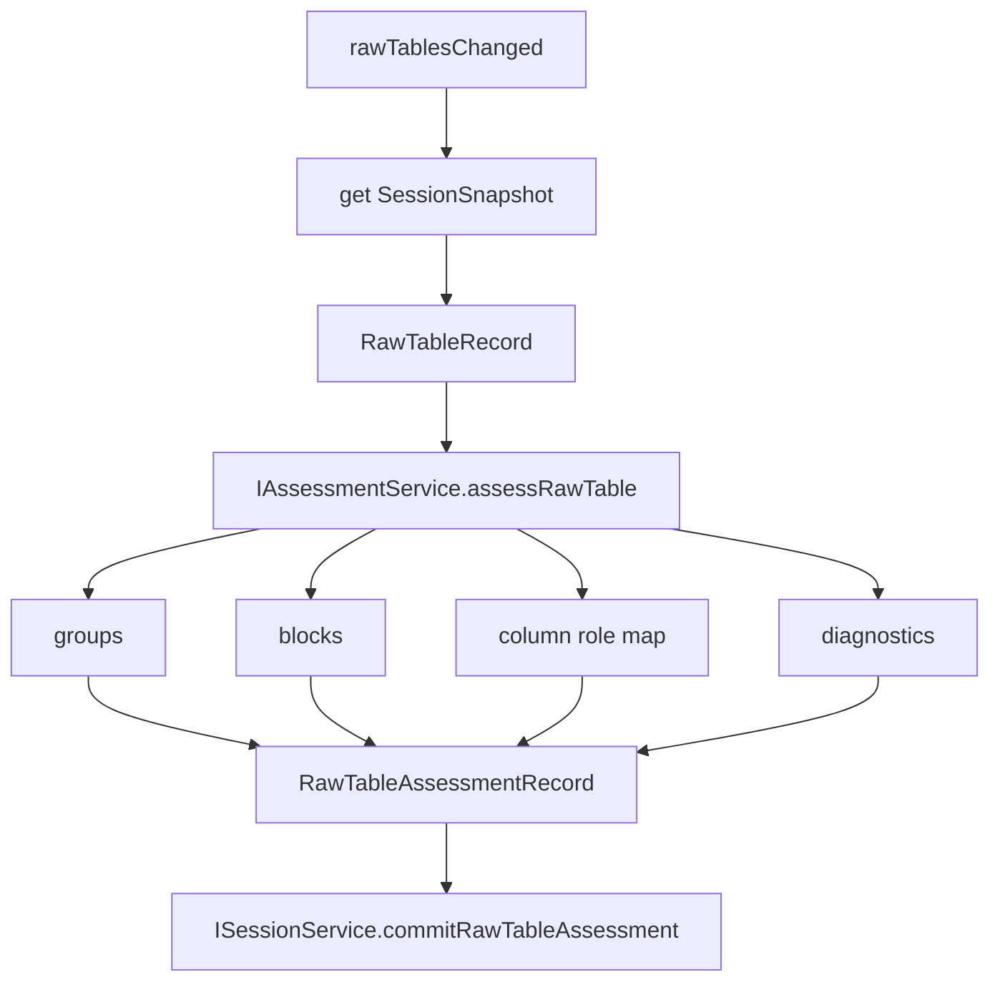

# Assessment

Assessment converts raw table facts into measurement structure.

It is the only owner of block/group/column role/sweep mode detection.

## Ownership

`IAssessmentService` owns:

- detecting measurement groups/device/sample labels;
- detecting measurement blocks within a raw table;
- identifying `headerRange`, `dataRange`, `titleRange`, and `fullRange`;
- detecting IV/CV/CF/PV/IT families;
- detecting IV transfer/output and IT modes;
- mapping raw columns to semantic roles;
- producing confidence and diagnostics;
- calling Rust/WASM assessment when available.

It does not own:

- file conversion;
- session storage;
- template execution;
- plot/chart rendering;
- table UI selection;
- search indexing beyond diagnostics metadata.

## Core files

| File | Responsibility |
| --- | --- |
| `src/cs/workbench/services/assessment/common/assessment.ts` | Defines `IAssessmentService`, `AssessRawTableInput`, `RawTableAssessmentRecord`, service result types. |
| `src/cs/workbench/services/assessment/common/measurement.ts` | Defines `MeasurementBlockRecord`, `MeasurementGroupRecord`, `MeasurementColumnMap`, `SweepMode`, `MeasurementFamily`, column refs. |
| `src/cs/workbench/services/assessment/common/diagnostics.ts` | Defines diagnostic severity, codes, messages, and source ranges. |
| `src/cs/workbench/services/assessment/browser/assessmentService.ts` | Browser implementation and orchestration. Chooses WASM or TypeScript fallback. |
| `src/cs/workbench/services/assessment/browser/assessmentWasm.ts` | Boundary to `conductor-rs/assessment`. Converts raw table rows to WASM input and normalizes output. |
| `src/cs/workbench/services/assessment/browser/assessmentRules.ts` | TypeScript fallback heuristics for headers, ranges, column roles, and sweep modes. |
| `src/cs/workbench/services/assessment/browser/assessment.contribution.ts` | Subscribes to session `rawTablesChanged` and commits assessment results. |

## Assessment result

```ts
export type RawTableAssessmentRecord = {
  readonly fileId: FileId;
  readonly rawTableId: RawTableId;
  readonly sourceRawTableVersion: number;
  readonly groups: readonly MeasurementGroupRecord[];
  readonly blocks: readonly MeasurementBlockRecord[];
  readonly diagnostics: readonly AssessmentDiagnostic[];
  readonly createdAt: number;
};
```

## Flow



## Rules

- `RawTableRecord` never owns blocks.
- A raw table can contain multiple measurement blocks.
- A block can point back to raw table cells using `RawTableRangeRef`.
- Diagnostics should be explicit when confidence is low.
- Assessment output must include `sourceRawTableVersion`; stale results must be ignored by Session.

## Command entry and dispatch

Assessment is normally triggered by session events after raw tables change. A direct command is optional and should be used only for explicit re-assessment or developer tools.

Recommended files:

| File | Responsibility |
| --- | --- |
| `src/cs/workbench/contrib/assessment/browser/assessmentCommands.ts` | Optional command handlers such as reassess raw table/block. Normalizes a `rawTable` target. |
| `src/cs/workbench/services/assessment/browser/assessment.contribution.ts` | Subscribes to `rawTablesChanged` and schedules assessment. |
| `src/cs/workbench/services/assessment/browser/assessmentService.ts` | Performs assessment. No command registration. |

Command flow:

```txt
reassessRawTable command
  -> normalize RawTableRef
  -> IAssessmentService.assessRawTable(input)
  -> ISessionService.commitRawTableAssessment(result)
```

The command must not detect blocks itself.

## Do not

- Do not mutate raw table data.
- Do not apply templates.
- Do not build curves directly unless the result is explicitly an assessment candidate, not a final curve.
- Do not let Template/Table/Plot re-detect headers or sweep mode.


## Record fields

### `RawTableAssessmentRecord`

| Field | Meaning |
| --- | --- |
| `fileId` | File containing the assessed table. |
| `rawTableId` | Assessed raw table. |
| `sourceRawTableVersion` | Raw table version used to produce this result; used to drop stale results. |
| `groups` | Device/sample groups detected from the table. |
| `blocks` | Measurement blocks detected from the table. |
| `diagnostics` | Warnings/errors/info from assessment. |
| `createdAt` | Assessment timestamp. |

### `MeasurementGroupRecord`

| Field | Meaning |
| --- | --- |
| `id` | Stable group id. |
| `fileId` | Parent file id. |
| `rawTableId` | Parent raw table id. |
| `label` | Device/sample label, for example `1-HS`. |
| `titleRange` | Optional raw range where the label came from. |
| `blockIds` | Blocks belonging to this group. |
| `confidence` | Optional group detection confidence. |

### `MeasurementBlockRecord`

| Field | Meaning |
| --- | --- |
| `id` | Stable measurement block id. |
| `fileId` | Parent file id. |
| `rawTableId` | Parent raw table id. |
| `groupId` | Optional device/sample group id. |
| `label` | Display label. |
| `family` | IV/CV/CF/PV/IT/unknown. |
| `ivMode` | Transfer/output for IV blocks only. |
| `itMode` | Stability/transient/retention/etc. for IT blocks only. |
| `source` | Full/header/data/title raw ranges. |
| `columns` | Semantic column role mapping. |
| `rowCount` | Data row count excluding header/title. |
| `columnCount` | Physical block column count. |
| `confidence` | Optional family/block confidence. |
| `diagnosticCodes` | Related diagnostic codes. |

### `MeasurementColumnRef`

| Field | Meaning |
| --- | --- |
| `rawCol` | Absolute column index in the raw table. |
| `headerText` | Original header text. |
| `role` | Semantic role such as `vd`, `vg`, `id`, `ig`, `capacitance`, `time`. |
| `unit` | Parsed unit. |
| `sourceRange` | Header cell/range provenance. |
| `confidence` | Optional column-role confidence. |

### `AssessmentDiagnostic`

| Field | Meaning |
| --- | --- |
| `severity` | `info`, `warning`, or `error`. |
| `code` | Stable machine-readable diagnostic code. |
| `message` | Human-readable message. |
| `sourceRange` | Optional raw table location. |
| `relatedBlockId` | Optional related block. |
| `relatedGroupId` | Optional related group. |

