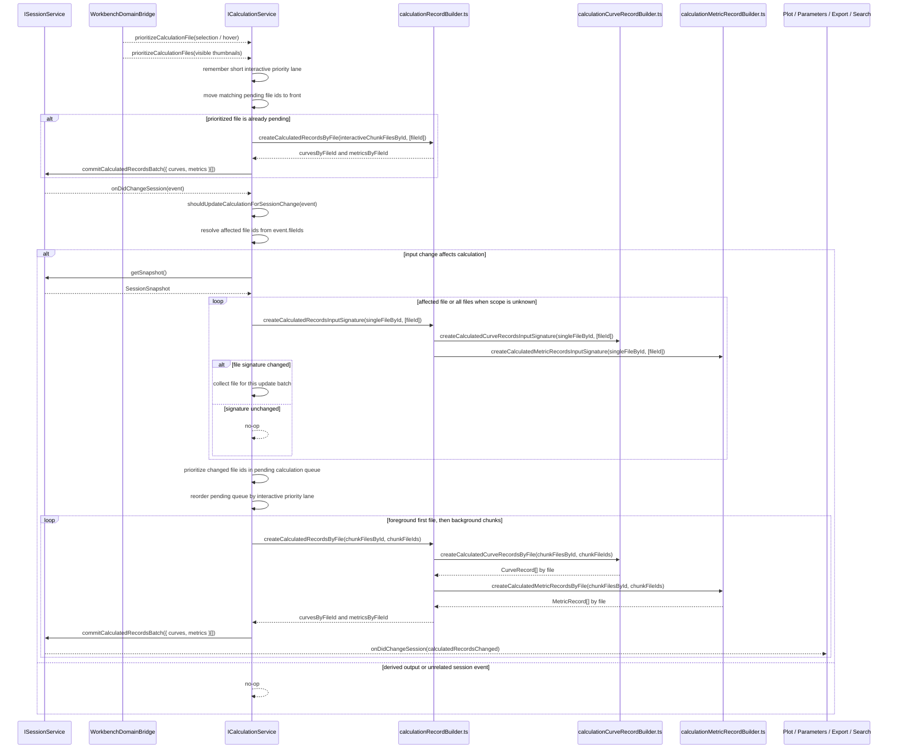

# Calculation

Calculation owns reusable analysis algorithms and the pure projection helpers
that run those algorithms over session facts.

It is a computation domain, not a plot, parameters, chart, or session UI owner.
File names under this module should describe calculation responsibility, not
the downstream consumer or the specific UI that reads the result.

## Ownership

Calculation owns:

- first-pass and second-pass numerical algorithms;
- reusable calculation result builders from `FileRecord` inputs;
- metric record builders from base curves and metric inputs;
- calculation input signatures and cache policy helpers;
- the injectable calculation service that reruns calculations when relevant
  session facts change, owns the pending calculation queue, accepts explicit
  file-priority hints, and commits calculated canonical records through
  `ISessionService`.

Calculation does not own:

- plot display state, plot units, y-scale, visibility, or render models;
- chart panes, legends, popovers, or DOM rendering;
- parameter panel selection, edit mode, or row focus;
- session mutation internals;
- assessment, template extraction, raw parsing, or table preview state.

## Core Files

| File | Responsibility |
| --- | --- |
| `common/calculation.ts` | Defines `ICalculationService`, the calculation contribution id, and compatibility re-exports for shared calculation types. |
| `common/calculationTypes.ts` | Shared pure calculation value types such as points, calculation kinds, calculated-data kinds, and algorithm option methods. |
| `common/calculationExecutor.ts` | Pure calculation dispatcher: resolves calculation descriptors and executes the selected algorithm. |
| `common/calculationRecordBuilder.ts` | Pure facade that builds calculation `CurveRecord` and `MetricRecord` commit payloads from session facts by delegating to focused record builders. |
| `common/calculationCurveRecordBuilder.ts` | Pure builder that creates canonical derived and second-derived `CurveRecord` commit payloads from session base curves in one in-memory calculation pass. |
| `common/calculationReadModel.ts` | Pure derived calculation read-model builders from session records or processed legacy inputs for compatibility/read projections. |
| `common/calculationMetricRecordBuilder.ts` | Pure builder that creates canonical `MetricRecord` commit payloads from session base curves and metric inputs. |
| `common/calculationCacheAccess.ts` | Compatibility reader for rebuildable canonical calculation cache records, with temporary legacy `analysisCache` fallback during migration. |
| `common/calculationCachePolicy.ts` | Cache invalidation and retention policy for calculation output. |
| `common/gm.ts` | gm/gds derivative calculation family, including central derivative and second-derivative helpers. |
| `common/ss.ts` | SS calculation family, including SS curve derivation and SS fit/classification exports. |
| `common/vth.ts` | Vth calculation family. |
| `common/sweepSegmentation.ts` | Bidirectional sweep segmentation helper shared by calculation algorithms. |
| `common/ionIoff.ts` | Ion/Ioff current-window calculation helpers, including automatic and manual target-window selection. |
| `browser/calculationService.ts` | Injectable owner of calculation signatures, the pending calculation queue, short interactive priority lane, foreground/background calculation chunks, file-priority hints, and calculated record commits through `ISessionService`. |
| `browser/calculation.contribution.ts` | Registers `ICalculationService` and starts calculation lifecycle wiring. No queue or algorithm ownership. |

## Flow

```mermaid
flowchart TD
    Session[SessionSnapshot / FileRecord] --> Calculation[Calculation helpers]
    Calculation --> CurveRecords[CurveRecord[]]
    Calculation --> MetricRecords[MetricRecord[]]
    CurveRecords --> SessionCommit[ISessionService.commitCalculatedRecordsBatch]
    MetricRecords --> SessionCommit
    ExplorerPriority[Explorer selection / hover / visible thumbnails] --> CalculationService[ICalculationService]
    CalculationService --> Queue[Pending calculation queue]
    Queue --> Calculation
```

`calculationService.ts` is lifecycle and queue glue. It may subscribe to
session events, prioritize already-pending calculation files, and call
calculation helpers, but complex algorithm or record-building logic belongs in
`common/*` helpers. `calculation.contribution.ts` remains registration-only
glue.

## Session Sequence

Calculation is a session subscriber and a session committer. It does not own
session state and must not mutate `SessionModel` internals.



Update triggers:

- `templateRunChanged`, `filesRemoved`, `sessionCleared`, and
  `metricInputsChanged` always rerun calculation.
- `curvesChanged` reruns calculation only when base curves changed. Derived and
  second-derived curve commits must not cause another calculation pass.
- `rawTablesChanged`, `assessmentChanged`, `calculatedRecordsChanged`, and
  `metricsChanged` do not rerun calculation. Metrics and calculated records are
  calculated output, not calculation input.
- When a session event includes `fileIds`, calculation recomputes only those
  files and tracks input signatures per file. Startup or events without an
  affected file scope may still perform a full pass. `filesRemoved` and
  `sessionCleared` prune per-file calculation signatures instead of forcing
  unrelated files to be recommitted.

Session boundary rules:

- Calculation reads session facts only through `ISessionService.getSnapshot()`.
- Calculation writes canonical results through `commitCalculatedRecordsBatch`
  after collecting curves and metrics for a calculation chunk. The first chunk
  may run in the foreground to make the newest/selected file drawable quickly;
  remaining files should run as background chunks so a large apply/import phase
  does not monopolize the renderer thread.
- `ICalculationService.prioritizeCalculationFile(s)` accepts interactive
  priority hints from workbench orchestration such as Explorer selection,
  hover thumbnails, and visible thumbnail ranges. It records a bounded
  latest-first interactive priority lane and reorders matching files that are
  already pending calculation. When a prioritized file is already pending, the
  service may synchronously process a tiny interactive chunk before returning so
  active chart and hover targets can become drawable without waiting for the
  next background timer. If a touched file enters pending calculation later,
  the queued work must also honor the remembered priority lane. The API must
  not enqueue unrelated extra calculation work for completed or unchanged
  files.
- `calculationRecordBuilder.ts` is the contribution-facing facade for
  calculated canonical record payloads. It delegates record-family details to
  focused builders and remains pure.
- `calculationCurveRecordBuilder.ts` and
  `calculationMetricRecordBuilder.ts` are pure builders; they receive records
  and return values for the contribution to commit.
- Second-derived curves are calculated from first-pass derived curves in memory
  during the same update pass; calculation must not commit a first-pass curve
  and then read it back from session only to calculate the second pass.
- Downstream services read the committed session records after Session fires
  change events. Calculation must not call Plot, Parameters, Export, Search, or
  Chart services directly.

## Rules

- Calculation helpers are pure: no DOM, no services, no command registration.
- Session mutation happens only through `ISessionService` commit APIs.
- Plot consumes calculated/session data through `IPlotService`; Calculation
  must not import plot rendering helpers or chart DOM code.
- Parameter UI consumes metric records through Parameters ownership;
  Calculation must not own parameter view state.
- Input signatures must include only facts that affect calculation output.
  Rebuildable calculated output must not invalidate itself.
- Keep algorithm files named for the calculation family, and keep
  contribution/lifecycle wiring in `browser/calculation.contribution.ts`.

## Field Catalog

Use `records.instructions.md` for canonical `CurveRecord`, `MetricRecord`, and
`CalculationCacheRecord` fields. `CalculatedData`, `CalculatedSeries`, and
`CalculatedPoint` are derived calculation result types, not canonical session
records.
