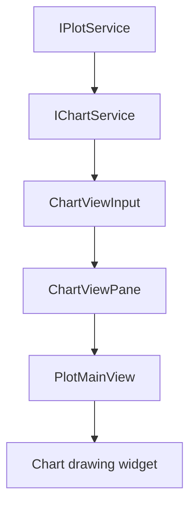
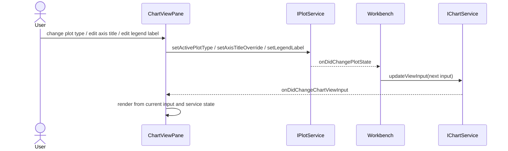

# Chart

Chart is the rendering host for Plot. It is not the drawing-domain owner.

If a change concerns series data, domains, units, y-scale, plot type, visibility, or render models, put it in Plot. If a change concerns chart pane shell, detail pane visibility, popovers, headers, and embedding the plot view, put it in Chart.

## Ownership

`IChartService` owns:

- chart shell state;
- chart detail pane visibility;
- legend/inspector popover UI state;
- chart header action state;
- embedding and updating `PlotMainView` / `ChartPanel`;
- commands that affect chart shell UI.

It consumes:

- `IPlotService` render models and plot state;
- `IWorkbenchLayoutService` / layout services as needed;
- context menu/action services for UI presentation.

It does not own:

- plot data extraction from session;
- domain/tick/downsampling logic;
- unit conversion logic;
- raw curves or metrics;
- thumbnail bitmap generation.

## Core files

| File | Responsibility |
| --- | --- |
| `src/cs/workbench/services/chart/common/chart.ts` | Defines `IChartService`, chart shell state, pane state, chart events, and chart commands. |
| `src/cs/workbench/services/chart/browser/chartService.ts` | Owns chart shell state and publishes chart view input supplied from Plot/Workbench projections. No raw session data extraction. |
| `src/cs/workbench/services/chart/browser/chart.contribution.ts` | Registers chart service and chart lifecycle contribution. |
| `src/cs/workbench/contrib/chart/browser/chartViewPane.ts` | View pane shell. Hosts header, actions, detail pane, and plot view. Delegates data to services. |
| `src/cs/workbench/contrib/chart/browser/chartPanel.ts` | Chart panel composition. Receives plot/chart props. No session reads. |
| `src/cs/workbench/contrib/chart/browser/chartActions.ts` | Chart shell actions: inspector, legend, pane toggles. Handlers call `IChartService` or `IPlotService`. |
| `src/cs/workbench/contrib/chart/browser/chartFileSelect.ts` | UI selector adapter. Target: ask Explorer/Plot services for options instead of reading session directly. |

## Flow



## Boundary examples

Belongs to Plot:

```txt
active plot type
x/y unit conversion
y-scale mode
series visibility
axis domains
legend labels derived from series
```

Belongs to Chart:

```txt
legend popover open/closed
inspector pane visible/hidden
header action visibility
chart pane layout
edit-title UI trigger
```

## Command entry and dispatch

Chart commands own chart chrome, not plot data.

Recommended files:

| File | Responsibility |
| --- | --- |
| `src/cs/workbench/contrib/chart/browser/chartCommands.ts` | Registers toggle legend, toggle inspector, focus chart, edit chart title commands. |
| `src/cs/workbench/contrib/chart/browser/chartActions.ts` | Header buttons/menu entries for chart commands. |
| `src/cs/workbench/services/chart/browser/chartService.ts` | Owns chart shell state and publishes chart view input. |

Boundary:

```txt
plot type / unit / scale / series visibility -> IPlotService
legend popover / inspector pane / chart focus -> IChartService
```

If a chart header button changes plot type, it should execute a plot command, not a chart command.

Chart view plot-control wiring:



Do not pass Plot-owned behavior through `ChartViewInput` callbacks when
`ChartViewPane` can call the `IPlotService` owner API directly.

## Do not

- Do not read `SessionSnapshot.curvesByKey` from ChartService.
- Do not compute plot domains in chart files.
- Do not let thumbnail import chart internals to draw mini-plots.
- Do not store chart shell UI state in Session.


## State fields

### `ChartState`

| Field | Meaning |
| --- | --- |
| `visibleDetailPanes` | Open panes such as inspector. |
| `legendPopoverOpen` | Whether legend popover is open. |
| `inspectorVisible` | Whether inspector pane is visible. |
| `headerVisible` | Whether chart header/actions are visible. |
| `lastRenderedPlotModelId` | Last plot render model shown by chart. |

### `ChartViewInput`

| Field | Meaning |
| --- | --- |
| `visiblePanes` | Chart-owned visible pane ids such as chart and inspector. |
| `activePlotType` | Plot type currently shown, from Plot state. |
| `activeFileId` | File selected for chart display. |
| `chartFileOptions` | File selector options projected for chart mode. |
| `createPlotDisplayModel` | Plot display-model request function backed by `IPlotService`. |
| `plotLegendModel` | Legend display model from `IPlotService`. |
| `processingStatus` | Template processing status shown by chart UI. |
| `plotAxisSettings` / `originOpenPlotOptions` | Workbench/core settings projected into chart controls. |
| `onActiveFileIdChange` / settings callbacks | Temporary Workbench/settings bridges. Do not add Plot-owned behavior callbacks when `ChartViewPane` can call `IPlotService` directly. |

Chart state is shell state. Plot data, units, scale, series visibility, domains, and labels belong to Plot.
