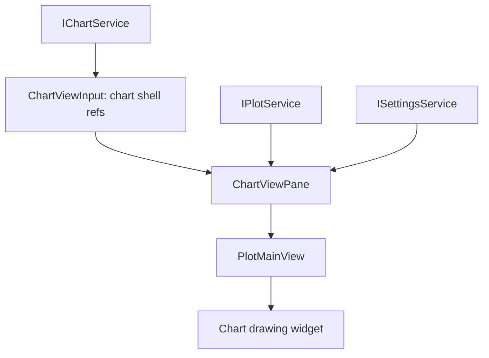
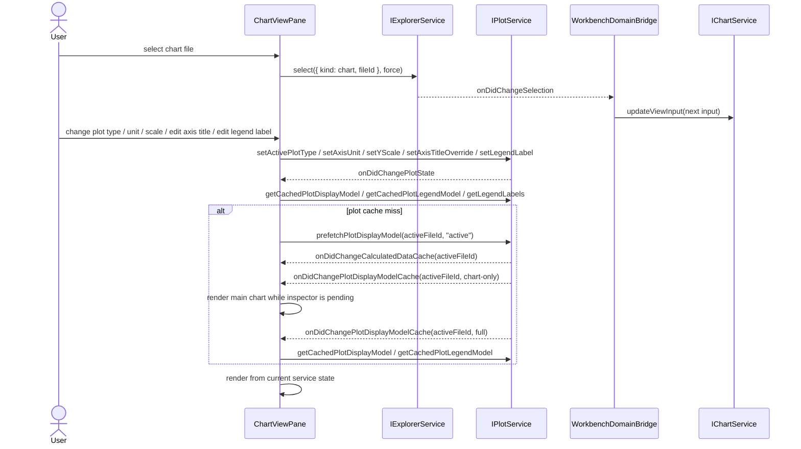
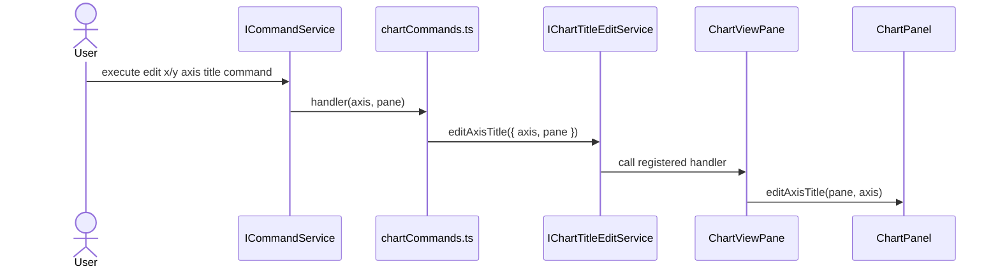

# Chart

Chart is the rendering host for Plot. It is not the drawing-domain owner.

If a change concerns series data, domains, units, y-scale, plot type, visibility, or render models, put it in Plot. If a change concerns chart pane shell, detail pane visibility, popovers, headers, and embedding the plot view, put it in Chart.

## Ownership

`IChartService` owns:

- chart shell state;
- chart detail pane visibility;
- legend/inspector popover UI state;
- chart header action state;
- embedding and updating `PlotMainView` / `ChartPanel`;
- commands that affect chart shell UI.

It consumes:

- `IPlotService` render models and plot state;
- `IWorkbenchLayoutService` / layout services as needed;
- context menu/action services for UI presentation.

It does not own:

- plot data extraction from session;
- domain/tick/downsampling logic;
- unit conversion logic;
- raw curves or metrics;
- thumbnail bitmap generation.

## Core files

| File | Responsibility |
| --- | --- |
| `src/cs/workbench/services/chart/common/chart.ts` | Defines `IChartService`, chart shell state, pane state, chart events, and chart commands. |
| `src/cs/workbench/services/chart/browser/chartService.ts` | Owns chart shell state and publishes chart shell input. No raw session data extraction, no Plot model creation, and no view-local request events. |
| `src/cs/workbench/contrib/chart/browser/chart.contribution.ts` | Registers chart commands and the chart view contribution. |
| `src/cs/workbench/contrib/chart/browser/chartViewPane.ts` | View pane shell. Hosts header, actions, detail pane, and plot view. Subscribes to owner services and rereads Chart/Plot/Settings state through public APIs. |
| `src/cs/workbench/contrib/chart/browser/chartPanel.ts` | Chart panel composition. Receives plot/chart props. No session reads. |
| `src/cs/workbench/contrib/chart/browser/chartActions.ts` | Chart shell actions: inspector, legend, pane toggles. Handlers call `IChartService` or `IPlotService`. |
| `src/cs/workbench/contrib/chart/browser/chartTitleEditService.ts` | Conductor-specific workflow bridge for command-dispatched axis-title edit focus. It calls the registered `ChartViewPane` handler and does not own chart state. |
| `src/cs/workbench/contrib/chart/browser/chartFileSelect.ts` | UI selector adapter. Target: ask Explorer/Plot services for options instead of reading session directly. |

## Flow



## Boundary examples

Belongs to Plot:

```txt
active plot type
x/y unit conversion
y-scale mode
series visibility
axis domains
legend labels derived from series
```

Belongs to Chart:

```txt
legend popover open/closed
inspector pane visible/hidden
header action visibility
chart pane layout
edit-title UI trigger
```

## Command entry and dispatch

Chart commands own chart chrome, not plot data.

Recommended files:

| File | Responsibility |
| --- | --- |
| `src/cs/workbench/contrib/chart/browser/chartCommands.ts` | Registers toggle legend, toggle inspector, focus chart, edit chart title commands. |
| `src/cs/workbench/contrib/chart/browser/chartActions.ts` | Header buttons/menu entries for chart commands. |
| `src/cs/workbench/contrib/chart/browser/chartTitleEditService.ts` | Explicit command-to-view workflow bridge for axis-title edit focus. |
| `src/cs/workbench/services/chart/browser/chartService.ts` | Owns chart shell state and publishes chart view input. |

Boundary:

```txt
plot type / unit / scale / series visibility -> IPlotService
legend popover / inspector pane / chart focus -> IChartService
axis-title edit focus command -> IChartTitleEditService -> ChartViewPane registered handler
```

If a chart header button changes plot type, it should execute a plot command, not a chart command.

Chart view plot-control wiring:



Axis-title edit focus command wiring:



Do not pass Plot-owned behavior through `ChartViewInput` callbacks when
`ChartViewPane` can call the `IPlotService` owner API directly.
Do not pass Plot display models or legend models through `ChartViewInput`;
`ChartViewPane` subscribes to `IPlotService` and rereads the current display
model, legend model, and legend labels from Plot.
`ChartViewPane` must use Plot's cached display/legend APIs during render and
request active display-model prefetch on cache miss; it must not synchronously
create calculated Plot data or Plot display models in the chart render path.
`ChartViewPane` must treat staged Plot display models as valid: if `chart` is
present and `inspector` is still `null`, render the main chart immediately and
show only the inspector pane as pending. It must rerender when Plot upgrades the
same cache entry to a full model.
Chart's active plot host may request eager first draw from `PlotMainView` so a
newly selected chart paints on the first connected, sized frame. Keep the
strategy explicit in Chart view composition; do not make Plot's reusable chart
widget eager by default.
Do not pass Explorer selection through `ChartViewInput` callbacks; chart file
selection is translated by `ChartViewPane` into `IExplorerService.select(...)`.
Do not pass settings mutations through `ChartViewInput`; settings panes write
through `ISettingsService` owner APIs and only consume projected settings data.
Do not pass plot rendering settings through Chart input when the chart view can
read them from `ISettingsService`.
`ChartViewInput.processingStatus` is only for the no-chart-data loading/empty
state. Once the active file has chart data, background template progress must
not remain in `ChartViewInput`, because changing progress counters would
recreate the chart panel and flicker the current canvas.
When the chart file selector is hidden, `ChartViewInput.chartFileOptions`
should not carry the whole background file list after the active chart has data.
Keep only the active file option needed by the current view so background file
completion does not change Chart input and recreate the chart panel.
`IChartService.onDidChangeChartViewInput` only tells the pane that the
Chart-owned input snapshot changed; `ChartViewPane` must reread
`IChartService.getViewInput()` instead of consuming input from the event.
Do not publish `onDidRequest*` events from `IChartService` for view-local focus
workflows. Use an explicit contrib/chart workflow service and handler
registration when a command needs the current chart view to focus or enter edit
mode.

## Do not

- Do not read `SessionSnapshot.curvesByKey` from ChartService.
- Do not compute plot domains in chart files.
- Do not let thumbnail import chart internals to draw mini-plots.
- Do not store chart shell UI state in Session.


## Field catalog

Use `records.instructions.md` for shared chart state fields such as
`ChartState`. `ChartViewInput` is a Chart-owned view input snapshot: it may
project Plot, Explorer, Settings, or processing facts for rendering, but it
must not become a callback bag or a data path for Plot models.

Chart state is shell state. Plot data, units, scale, series visibility,
domains, and labels belong to Plot.
