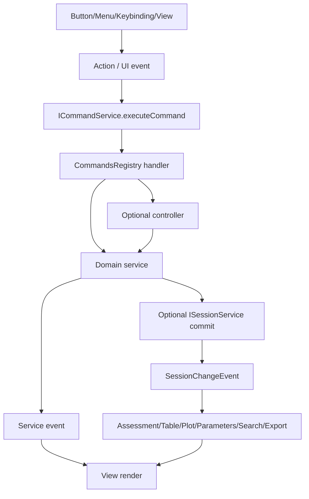

# Commands and Dispatch

Commands are the public entry points for user intent. Services own state and domain work. Views render state. Keep these roles separate.

Use this file when adding commands, menu items, toolbar buttons, context-menu entries, keyboard shortcuts, or controllers that coordinate services.


## Choosing Command, Action2, or runtime Action

Before adding an entry point, classify the user intent. Do not start by mechanically choosing `Action2` or `CommandsRegistry`.

| User need | Prefer | Rule |
| --- | --- | --- |
| A callable logical operation with no required UI placement | `CommandsRegistry.registerCommand(...)` | Command is the lowest executable entry point. |
| A command needs menu, toolbar, keybinding, Command Palette, `when`, category, or telemetry metadata | `registerAction2(...)` | `Action2` is a declarative command/menu/keybinding contribution. |
| A UI component needs a mutable action instance with changing `label`, `tooltip`, `enabled`, or `checked` | runtime `Action` / `IAction` | `Action` is a runtime object; `Action2` is not a live UI object. |
| A temporary local UI gesture with no reuse and no domain effect | local callback | Do not over-register commands. |

Remember:

```txt
Action  = a runtime action object
Action2 = a declarative command/menu/keybinding registration
Command = the executable entry point
```

`Action2` often registers a command, but it does not replace runtime `Action`. New command/menu/keybinding work should usually use `Action2`; UI component action objects should still use `Action` when they need mutable runtime state.

## Command layers

Use this ownership chain:

```txt
button / menu / keybinding / context menu
  -> action
  -> command id
  -> command handler
  -> optional controller
  -> service method
  -> session commit, service state update, or external side effect
  -> service event
  -> view render
```

Do not skip from a button directly into a view mutation when the action is a domain action. Small local DOM interactions may stay in the view; cross-view or reusable behavior must be a command or service method.

## File responsibilities

| File | Responsibility | Must not do |
| --- | --- | --- |
| `src/cs/platform/commands/common/commands.ts` | Defines `ICommandService`, `CommandsRegistry`, command metadata, command events. Platform-level only. | Import workbench services or contrib views. |
| `src/cs/workbench/contrib/<feature>/browser/<feature>Commands.ts` | Registers command IDs and command handlers for a feature. Validates args, resolves services through `ServicesAccessor`, delegates. | Own long-lived state, mutate DOM, mutate `SessionModel` directly. |
| `src/cs/workbench/contrib/<feature>/browser/<feature>Actions.ts` | Registers menu/action/keybinding/context-menu affordances for existing command IDs. | Reimplement command logic. |
| `src/cs/workbench/contrib/<feature>/browser/<feature>.contribution.ts` | Entry point that imports/registers commands/actions, wires lifecycle contributions, and registers views. | Become a domain service or a large controller. |
| `src/cs/workbench/contrib/<feature>/browser/<feature>Controller.ts` | Optional coordinator for multi-step workflows: dialogs, progress, notifications, batching, worker start/stop. | Store canonical records or become a substitute service. |
| `src/cs/workbench/services/<domain>/common/<domain>.ts` | Service interface, records, event types, command-facing target/input types if they are domain-level. | Register UI commands. |
| `src/cs/workbench/services/<domain>/browser/<domain>Service.ts` | State owner and domain implementation. | Depend on views or command files. |

## Command handler rules

A command handler should usually do only five things:

1. Normalize and validate arguments.
2. Resolve the service or optional controller through `ServicesAccessor`.
3. Resolve a `CommandTarget` if the command acts on a specific file/table/block/curve/metric.
4. Call a service method or controller method.
5. Return a value or `undefined`.

Pattern:

```ts
CommandsRegistry.registerCommand({
  id: ExplorerCommandId.ImportFolder,
  metadata: {
    description: localize('explorer.importFolder', 'Import Folder'),
  },
  handler: async (accessor, rawTarget?: unknown) => {
    const explorerService = accessor.get(IExplorerService);
    const target = normalizeExplorerCommandTarget(rawTarget);

    await explorerService.importFolder(target);
  },
});
```

## Dispatch targets

Use explicit command targets. Do not use a global session `activeTarget` as the universal dispatch input.

```ts
export type CommandTarget =
  | { readonly kind: 'explorerResource'; readonly resourceId: ExplorerResourceId }
  | { readonly kind: 'file'; readonly fileId: FileId }
  | { readonly kind: 'rawTable'; readonly fileId: FileId; readonly rawTableId: RawTableId }
  | { readonly kind: 'rawTableRange'; readonly fileId: FileId; readonly rawTableId: RawTableId; readonly range: RangeRef }
  | { readonly kind: 'measurementBlock'; readonly fileId: FileId; readonly blockId: MeasurementBlockId }
  | { readonly kind: 'series'; readonly fileId: FileId; readonly seriesId: SeriesId }
  | { readonly kind: 'curve'; readonly fileId: FileId; readonly curveKey: CurveKey }
  | { readonly kind: 'metric'; readonly fileId: FileId; readonly metricKey: MetricKey };
```

When a command is invoked from a view, the view should pass the precise target. When invoked from the command palette without a target, the handler may ask the owning service for its local active/focused/selected state.

Examples:

```ts
const target = normalizeCommandTarget(rawTarget)
  ?? explorerService.getSelectedResourceTarget();
```

```ts
const target = normalizeTableRangeTarget(rawTarget)
  ?? tableService.getActiveRangeTarget();
```

## Service dispatch table

| Command family | Command file | Target owner | Handler delegates to | Notes |
| --- | --- | --- | --- | --- |
| Explorer add-data/remove/select/toggle layout | `contrib/files/browser/fileCommands.ts` plus `fileActions.ts` / `fileActions.contribution.ts` | Explorer action/handler or `IExplorerService` for view/model behavior | Upstream-shaped `IExplorerService` methods, session/file services, or focused source/conversion helpers | Explorer commands should stop reaching into `FilesPaneHost` after migration. Do not invent placeholder Explorer service methods when the behavior belongs to an action/handler or another domain service. |
| File system read/write/watch | platform services, not workbench commands by default | `IFileService` | `IFileService` | Low-level filesystem capability; not Explorer state. |
| Raw import conversion | Explorer action/source workflow, not a user-facing command by default | `workbench/services/files` conversion contracts | `fileConverter.ts` through Explorer source workflow | No user-facing command should call conversion and session separately. Conversion returns `FileConversionResult`/`RawTableRecord`; Explorer workflow commits successful results. |
| Re-assess raw table | `assessmentCommands.ts` | `IAssessmentService` | `IAssessmentService.assessRawTable`, then `ISessionService.commitRawTableAssessment` | Optional developer/user command. Assessment remains the only block detector. |
| Table reveal/copy/select | `tableCommands.ts` | `ITableService` | `ITableService` | Commands may also use `IExplorerService` or `ISearchService` target refs. |
| Template save/delete/import/apply | `templateCommands.ts` | `ITemplateService` / `ITemplateApplyService` | Template service or controller | Apply is a multi-step workflow; controller is acceptable. |
| Plot type/unit/scale/visibility | `plotCommands.ts` | `IPlotService` | `IPlotService` | Chart should not own these commands unless they only affect chart chrome. |
| Chart legend/inspector/pane layout | `chartCommands.ts` | `IChartService` | `IChartService` | Chart shell commands do not rebuild plot data. |
| Thumbnail refresh/toggle presentation | `thumbnailCommands.ts` or Explorer command | `IThumbnailService` / `IExplorerService` | Thumbnail or Explorer service | Layout toggle belongs to Explorer; bitmap cache belongs to Thumbnail. |
| Search query/open result | `searchCommands.ts` | `ISearchService` | `ISearchService`; then target owner service for reveal | Search result navigation dispatches to Table/Explorer/Plot as needed. |
| Export Origin/CSV/ZIP | `exportCommands.ts` | `IExportService` | `IExportService` | Export service builds plans. Command handles UX entry and notifications. |
| Parameter metric input | `parametersCommands.ts` | `IParametersService` | `IParametersService`; may commit metric input to session | UI selection stays in Parameters; calculation input may be canonical. |

## Actions vs commands

Commands are callable operations. Actions are UI affordances that invoke commands.

Use actions for:

- toolbar buttons;
- menu entries;
- context-menu entries;
- keybinding registration;
- command-palette registration metadata;
- enablement/context-key wiring.

Do not put business logic in actions. If the same behavior can be triggered from a button, menu, and keybinding, all three should execute the same command ID.

## Controllers

A controller is allowed when a workflow is more than a single service call.

Good controller responsibilities:

- open a dialog;
- collect files or folders;
- show progress or notification;
- batch several service commits;
- start or stop a worker through a service boundary;
- translate UI errors into user-facing messages.

Bad controller responsibilities:

- owning canonical records;
- parsing raw tables;
- detecting IV/CV/block structure;
- storing chart/table/search state long term;
- replacing service APIs.

## Contribution entry points

Every feature should have a small contribution file.

```ts
export const ExplorerContributionId = 'workbench.contrib.explorer';

class ExplorerContribution extends Disposable implements IWorkbenchContribution {
  constructor(
    @IExplorerService explorerService: IExplorerService,
    @ICommandService commandService: ICommandService,
  ) {
    super();
    this._register(registerExplorerCommands());
    this._register(registerExplorerActions());
    this._register(explorerService.onDidChangeExplorer(() => {
      // update context keys or derived view state only
    }));
  }
}
```

Contribution files wire registration and lifecycle. They should not become large render loops.

## Event flow after a command



## Do not

- Do not let command handlers edit DOM directly.
- Do not let actions duplicate command logic.
- Do not let views mutate `SessionModel` directly.
- Do not register broad command handlers inside `workbench.ts` unless the command is truly global workbench behavior.
- Do not make `SessionService` dispatch user workflows; it should commit canonical state and emit events.
- Do not make `ChartService` own plot commands. Plot commands belong to `IPlotService`.
- Do not make Explorer commands call `IFileService` and `ISessionService` directly for full import; use `IExplorerService` or an import controller.
- Do not make Explorer commands call `fileConverter.ts` directly; Explorer import workflow owns source collection, conversion, diagnostics, and session commit ordering.


## Command target fields

### `CommandTarget`

| Field | Meaning |
| --- | --- |
| `kind` | Target kind: file/rawTable/block/series/curve/metric/tableRange/etc. |
| `fileId` | File target. |
| `rawTableId` | Raw table target. |
| `measurementBlockId` | Block target. |
| `seriesId` | Series target. |
| `curveKey` | Curve target. |
| `metricKey` | Metric target. |
| `range` | Raw table range target. |

Command handlers normalize unknown args into explicit command targets before calling services. Do not pass raw DOM nodes, view instances, or partial ad-hoc objects through command APIs.

## Controller fields

A controller should expose workflow inputs instead of owning records.

| Input | Meaning |
| --- | --- |
| `target` | Normalized command target. |
| `source` | Dialog/drop/context source metadata. |
| `options` | Workflow options such as replace/append/stopOnError. |
| `onProgress` | Optional progress callback. |

Long-lived canonical fields belong to services/session, not controllers.
