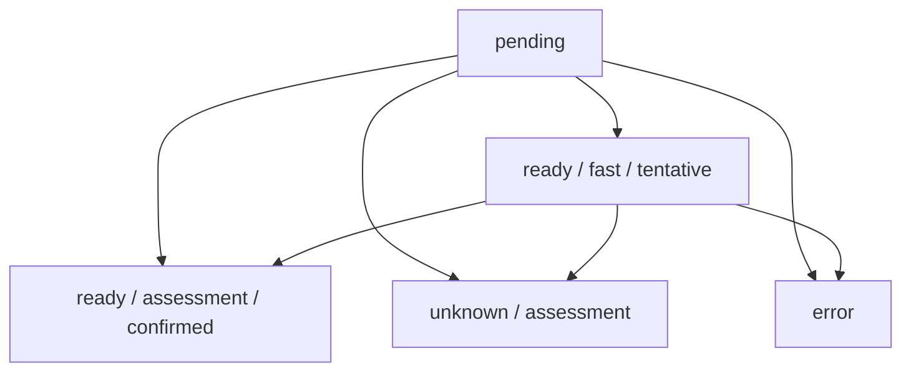

# Explorer Badge Projection

Explorer badges are UI decorations owned by the Files Explorer projection.
They are not canonical session records and must not become converter,
template, chart, table, or assessment decision inputs.

## Ownership

Fast badge:

- belongs only to Explorer projection;
- serves first-frame display and stable badge slot layout;
- may use only cheap signals: file name, relative path, extension, sheet name,
  and already-available header/sample rows;
- must not read files, write Session, alter converter output, select templates,
  or drive table/chart decisions;
- is represented as `ExplorerBadgeState` with
  `kind: "ready"`, `source: "fast"`, and `confidence: "tentative"`.

Full badge:

- comes from formal assessment results committed through Session;
- is the final fact for Explorer badge display;
- may override or clear any fast badge;
- is represented as `source: "assessment"` with either confirmed `ready` or
  final `unknown`.

## State Flow



Full assessment always wins. If assessment returns unknown, Explorer must not
continue displaying a fast badge as if it were confirmed.

## Scheduling

Explorer reports the actual rendered range from the ObjectTree/List layer.
Do not calculate "first page" counts from density or row height. Treat the
initial viewport as the first visible range.

```txt
visible rows   -> assessment priority visible
overscan rows  -> assessment priority nearby
remaining rows -> assessment priority background
```

Assessment queue entries must dedupe by raw table identity and source version.
If a raw table version changes before or during row loading, the stale queued
result must be dropped.

## Rendering

Every file row renders a stable badge slot in the first frame. The slot may
show pending, tentative fast, confirmed assessment, unknown, source status, or
nothing, but the row layout must not wait for full assessment.

Virtualized rows are reusable DOM. Badge DOM updates must bind to the current
row key before writing text, state, title, or classes. Repeated renders with the
same badge key should not rewrite the DOM.
