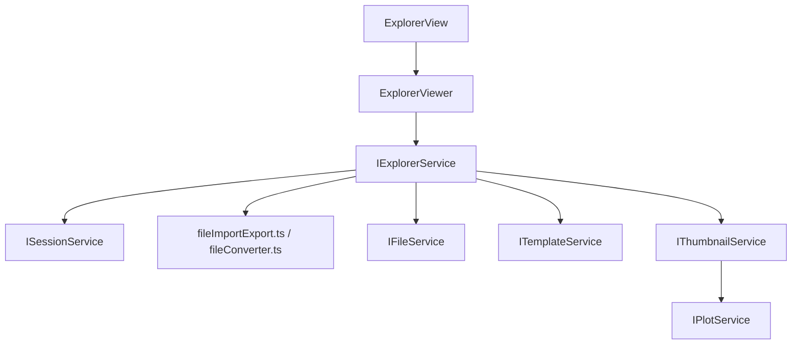

# Explorer

The left-side resource panel is **Explorer**, not FileView.

Use `ExplorerView`, `ExplorerViewer`, `ExplorerModel`, and `IExplorerService` naming for this area. `files` may remain as an existing contribution folder name, but the architecture concept is Explorer.

## Ownership

`IExplorerService` owns:

- Explorer resource tree state;
- selected Explorer resource;
- expanded/collapsed folder keys;
- tree vs thumbnail layout mode;
- drag/drop import orchestration;
- folder add/remove actions;
- per-resource UI selection state needed by the Explorer;
- coordinates files import/export workflows and calls `ISessionService.commitFileImport` after conversion.

It consumes:

- `IFileService` for filesystem reads/dialog-backed resources;
- `fileConverter.ts` / files import-export workflow for CSV/Excel/Clipboard conversion;
- `ISessionService` snapshot/events for file records;
- `ITemplateService` for template labels/selections shown in Explorer;
- `IPlotService` / `IThumbnailService` for thumbnail mode.

It does not own:

- filesystem provider implementation;
- raw table parsing;
- assessment;
- plot calculation;
- chart rendering;
- canonical session records.

## Core files

| File | Responsibility |
| --- | --- |
| `src/cs/workbench/services/explorer/common/explorer.ts` | Defines `IExplorerService`, `ExplorerState`, `ExplorerResource`, `ExplorerSelection`, layout mode, service events, and command-facing methods. |
| `src/cs/workbench/services/explorer/common/explorerModel.ts` | Pure functions for building Explorer tree/thumbnail models from session records and folders. No DOM. |
| `src/cs/workbench/services/explorer/browser/explorerService.ts` | Owns Explorer state, subscribes to session/template/plot changes, emits Explorer events, orchestrates imports. No DOM rendering. |
| `src/cs/workbench/services/explorer/browser/explorer.contribution.ts` | Registers `IExplorerService` and Explorer lifecycle contribution. |
| `src/cs/workbench/contrib/files/browser/views/explorerView.ts` | DOM root for Explorer panel. Handles drag/drop surface and delegates rendering to `ExplorerViewer`. Does not parse files or mutate session. |
| `src/cs/workbench/contrib/files/browser/views/explorerViewer.ts` | Tree/list/thumbnail renderer, context menus, row templates, hover content. Consumes `ExplorerViewModel`. Does not call assessment/session directly. |
| `src/cs/workbench/contrib/files/common/explorerInput.ts` | Compatibility adapter while migrating old files pane props to Explorer model. Remove once service wiring is complete. |
| `src/cs/workbench/contrib/files/common/explorerModel.ts` | Current tree-builder location. Target owner is `services/explorer/common/explorerModel.ts`. |
| `src/cs/workbench/contrib/files/browser/fileCommands.ts` | Registers Explorer commands such as remove, rename, set template, slice with template. Handlers call services. |
| `src/cs/workbench/contrib/files/browser/fileActions.ts` | Menu/action/keybinding registration for Explorer commands. No business logic. |
| `src/cs/workbench/contrib/files/browser/filesPaneHost.ts` | Transitional host that mounts `ExplorerView`. Target role: thin view container only. |

## Architecture at a glance



## Import orchestration

```ts
class ExplorerService implements IExplorerService {
  async importResources(resources: readonly ExplorerImportSource[]): Promise<void> {
    this.setImportState({ kind: 'loading' });

    const result = await this.fileImportService.importSources(resources);
    this.sessionService.commitFileImport(result);

    this.setSelection(resolveFirstImportedResource(result));
    this.setImportState({ kind: 'idle' });
  }
}
```

The Explorer service orchestrates the user action. The file import service performs conversion. Session stores the result.

## View rules

`ExplorerView` should:

- own DOM container and drag/drop handlers;
- forward user intent to `IExplorerService` or commands;
- receive an Explorer model as props;
- not parse files;
- not call `IAssessmentService`;
- not mutate session records.

`ExplorerViewer` should:

- render object tree rows and thumbnails;
- manage row templates and context menu presentation;
- call commands or service methods for user actions;
- not read raw table rows directly;
- not build plot models directly.

## Naming rules

Use:

```txt
ExplorerView
ExplorerViewer
ExplorerModel
ExplorerResource
IExplorerService
```

Avoid new names like:

```txt
FileView
FileViewer
IFileViewService
FilePanelService
```

`files` may appear in existing folder paths for compatibility, but new architecture language should say Explorer.

## Command entry and dispatch

Explorer commands are user-facing entry points for the left resource tree.

Recommended files:

| File | Responsibility |
| --- | --- |
| `src/cs/workbench/contrib/files/browser/explorerCommands.ts` | Target file name for Explorer command handlers. During migration, current `fileCommands.ts` may hold these handlers. |
| `src/cs/workbench/contrib/files/browser/explorerActions.ts` | Toolbar, context menu, menu, and keybinding entries that execute Explorer commands. |
| `src/cs/workbench/contrib/files/browser/explorer.contribution.ts` | Imports/registers Explorer commands/actions and view contribution. |
| `src/cs/workbench/contrib/files/browser/explorerImportController.ts` | Optional controller for dialog/drop import workflows, progress, notification, and batching. |

Command handlers should delegate to `IExplorerService`:

```ts
handler: async (accessor, rawSource) => {
  const explorer = accessor.get(IExplorerService);
  await explorer.importResources(normalizeExplorerImportSource(rawSource));
}
```

Explorer commands should not call `FilesPaneHost` methods after migration. If a command currently reaches a view through `IViewsService.getViewWithId(...)`, treat it as a temporary compatibility bridge and move the behavior into `IExplorerService`.

Typical command ownership:

| Command | Owner | Service call |
| --- | --- | --- |
| import folder/files/drop | Explorer | `IExplorerService.importResources(...)`, internally using file import/export + fileConverter |
| remove imported file/resource | Explorer | `IExplorerService.removeResources(...)` |
| select resource | Explorer | `IExplorerService.setSelection(...)` |
| toggle tree/thumbnail layout | Explorer | `IExplorerService.setLayout(...)` |
| set file template selection | Explorer + Template | `IExplorerService.setResourceTemplateSelection(...)` or `ITemplateService.setSelectionForFile(...)` |

## Do not

- Do not confuse `IExplorerService` with platform `IFileService` or files import/export conversion code.
- Do not put Excel/CSV parsing in Explorer.
- Do not put assessment labels into raw import records; Explorer displays assessment produced by `IAssessmentService`.
- Do not make Explorer call Plot internals; ask `IThumbnailService` or `IPlotService` for display models.


## State and model fields

### `ExplorerState`

| Field | Meaning |
| --- | --- |
| `layout` | `tree` or `thumbnail` display mode. |
| `selectedFileId` | Currently selected file in the Explorer. |
| `expandedFolderKeys` | Expanded tree folders. |
| `folderOrder` | Optional user/imported folder ordering. |
| `importState` | Current import workflow state. |
| `error` | User-visible Explorer/import error. |
| `dragging` | Whether files are being dragged over the Explorer. |

### `ExplorerImportState`

| Variant | Meaning |
| --- | --- |
| `idle` | No active import. |
| `picking` | Open dialog is active. |
| `collecting` | Folder/drop sources are being collected. |
| `importing` | Files are being converted to raw tables. |
| `committing` | Import result is being committed to session. |
| `failed` | Workflow failed with message/diagnostics. |

### `ExplorerResource`

| Field | Meaning |
| --- | --- |
| `kind` | `folder`, `file`, `rawTable`, or `measurementBlock`. |
| `key` | Stable tree key. |
| `fileId` | File id for file/table/block resources. |
| `rawTableId` | Raw table id for table/block resources. |
| `measurementBlockId` | Measurement block id for block resources. |
| `name` | Display name. |
| `parentKey` | Parent tree key. |
| `children` | Child resources. |
| `diagnosticBadge` | Optional import/assessment badge. |
| `thumbnailModelId` | Optional thumbnail reference. |

## Component split

Use these components instead of nested managers:

| Component | Responsibility |
| --- | --- |
| `ExplorerService` | Owns `ExplorerState`, exposes selection/layout/import state events. |
| `ExplorerImportController` | Coordinates dialogs/drop/folder import, calls files import/export helpers + `fileConverter.ts`, then commits through `ISessionService`. |
| `ExplorerTreeModel` | Builds `ExplorerResource[]` from session snapshot and explorer state. |
| `ExplorerSelectionStore` | Optional local selection/focus state helper. |
| `ExplorerView` | DOM shell for drag/drop and view hosting. |
| `ExplorerViewer` | Tree/thumbnail renderer. |

Do not create `ExplorerManager` that owns `ImportManager`, `SelectionManager`, and `ThumbnailManager`. Those are separate responsibilities with different lifetimes.

