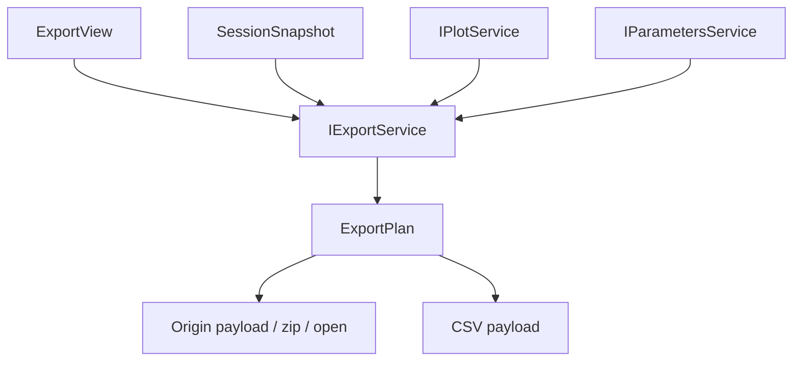

# Origin Export

Origin Export builds export plans and payloads. It is not Chart and not Plot.

## Ownership

`IExportService` owns:

- export option state;
- selected export scope;
- selected curves/content keys;
- Origin/CSV payload planning;
- mapping plot/session records into export payloads;
- export validation and user-facing errors.

It consumes:

- `SessionSnapshot` for canonical records;
- `IPlotService` for display-consistent plot models;
- `IParametersService` for parameter table output if exporting parameters;
- platform file/dialog services for save/open actions when needed.

It does not own:

- chart rendering;
- plot domain calculation;
- assessment;
- template execution;
- session canonical mutation.

## Core files

| File | Responsibility |
| --- | --- |
| `src/cs/workbench/services/export/common/export.ts` | Defines `IExportService`, export scope/options, export plan, payload types. |
| `src/cs/workbench/services/export/common/originExport.ts` | Origin-specific payload types and content key definitions. |
| `src/cs/workbench/services/export/browser/exportService.ts` | Owns export option state, builds export plans, validates selection. |
| `src/cs/workbench/services/export/browser/originExportService.ts` | Origin bridge: open in Origin, zip fallback, Origin-specific side effects. |
| `src/cs/workbench/services/export/browser/csvExportService.ts` | CSV/export-file generation if needed. |
| `src/cs/workbench/contrib/export/browser/exportViewPane.ts` | Export UI shell. Renders service state and calls `IExportService`. |
| `src/cs/workbench/contrib/export/browser/exportController.ts` | Transitional command/controller. Target: delegate to `IExportService`. |

## Flow



## Rules

- Export should use Plot models when the exported result is display-oriented.
- Export should use Session records when the exported result is canonical data-oriented.
- Export options are service state, not session state, unless saved project settings are introduced.

## Command entry and dispatch

Export commands own user-triggered export actions. ExportService owns export planning and payload generation.

Recommended files:

| File | Responsibility |
| --- | --- |
| `src/cs/workbench/contrib/export/browser/exportCommands.ts` | Registers export zip/open in Origin/copy export payload commands. |
| `src/cs/workbench/contrib/export/browser/exportActions.ts` | Export view and menu actions. |
| `src/cs/workbench/contrib/export/browser/exportController.ts` | Optional controller for save dialogs, notifications, and progress. |
| `src/cs/workbench/services/export/browser/exportService.ts` | Builds export plans from session and plot models. |

Command flow:

```txt
export.originZip command
  -> ExportController
  -> IExportService.buildExportPlan(options)
  -> platform save/open side effect
  -> notification
```

The command/controller should not rebuild plot domains; ask `IPlotService` or `IExportService`.

## Do not

- Do not read ChartViewPane state to export data.
- Do not recompute plot domains independently from Plot.
- Do not mutate curves or metrics during export.
- Do not put export option state in Session.


## State and record fields

### `ExportState`

| Field | Meaning |
| --- | --- |
| `scope` | Current/all/selected/filtered. |
| `format` | Origin/CSV/image/etc. |
| `selectedCurveKeys` | Curves selected for export. |
| `selectedMetricKeys` | Metrics selected for export. |
| `contentKeys` | Content categories to include. |

### `ExportPlan`

| Field | Meaning |
| --- | --- |
| `id` | Plan id/signature. |
| `scope` | Export scope. |
| `format` | Export format. |
| `fileIds` | Files included. |
| `curveKeysByFileId` | Curves per file. |
| `metricKeysByFileId` | Metrics per file. |
| `plotModelIds` | Plot models used. |
| `payloads` | Concrete payloads to write/open. |
| `diagnostics` | Export warnings/errors. |

