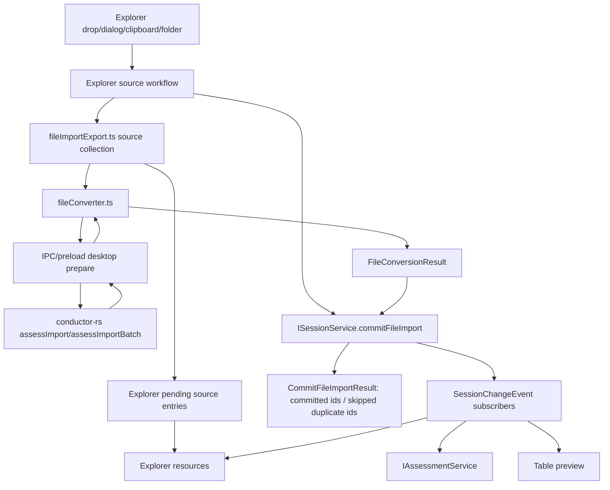

# Files Capability / Explorer UI

The `files` domain spans three layers that must stay separate during migration: `platform/files`, `workbench/services/files`, and `workbench/contrib/files`.

`Explorer` is the UI-state layer inside the files feature area. It is the primary view hosted by the Files container and owns resource-tree interaction state such as selection, expansion, focus/editing, and tree/thumbnail layout. Following upstream, its service contract and implementation belong under `workbench/contrib/files`, not `workbench/services/files`.

This follows the upstream VS Code shape: `platform/files` is the low-level filesystem capability; `workbench/services/files` is the workbench files service layer for filesystem bridges/helpers such as elevated/disk/watcher support; `workbench/contrib/files` is the Files feature contribution, Explorer service, and UI area. `ExplorerView`, `ExplorerViewer`, and `IExplorerService` are the UI/view-state vocabulary inside Files; `IFileService` remains the lower-layer filesystem capability.

## Target Shape

```txt
platform/files/IFileService
  low-level filesystem capability

workbench/services/files
  workbench files service layer: desktop/browser file-service bridges, source/conversion contracts, raw table row access, focused conversion helpers

workbench/services/files/fileConverter.ts
  Conductor import conversion: CSV/XLS/XLSX/clipboard -> FileConversionResult / RawTableRecord payloads

workbench/contrib/files/IExplorerService
  Explorer UI state inside the Files container: resource tree, selection, expansion, tree/thumbnail layout

workbench/contrib/files/IExplorerWorkflowService
  Conductor-specific command entry for view-local Explorer source/removal workflows

workbench/contrib/files/common/explorerModel.ts
  Explorer resource/item model and tree helpers shared by Explorer service and views

workbench/contrib/files
  Files container, Explorer service, Explorer model/view host, commands, actions, and UI workflow
```

Do not introduce `IFileViewService` or `IFilesExplorerService`. The view-state service is `IExplorerService`, and it belongs to `workbench/contrib/files` like upstream. Do not introduce `IFileImportService` by default; keep file conversion as focused files-domain modules under `workbench/services/files`.

The legacy `workbench/services/explorer/**` location has been retired. Explorer service code should use `workbench/contrib/files/**`; conversion/raw-table helpers should use `workbench/services/files/**`.

Entry-point registration should preserve this distinction. Import
`contrib/files/browser/explorerService` from a `workbench contrib services`
region when the browser workbench needs to run the Explorer DI registration.
Do not place that import under a `workbench services` region, and do not move
Explorer code into `workbench/services/files` just to make the entry-point
section look homogeneous.

## Layer Boundaries

Use these three locations for different responsibilities:

| Layer | Owns | May depend on | Must not own |
| --- | --- | --- | --- |
| `src/cs/platform/files` | URI-based filesystem providers, file stats, read/write/watch, provider registration, browser/desktop filesystem adapters. | `base`, platform IPC abstractions. | Explorer state, raw table records, file conversion, session commits, workbench views. |
| `src/cs/workbench/services/files` | Workbench files service helpers: desktop/browser file-service bridges, elevated/disk/watcher support, source/conversion contracts, `fileConverter.ts`, raw table records/readers. | `platform/files`, focused conversion helpers, type-only session contracts when needed for commit payload shape. | Explorer state, DOM rendering, command/menu registration, Files pane layout, platform provider implementation, assessment/template/plot semantics. |
| `src/cs/workbench/contrib/files` | Files feature contribution: Files container, `IExplorerService`, Explorer model/state, Explorer view host, views, commands, actions, context menus, drag/drop UI, source workflow controller. | `workbench/services/files`, `platform/files` through services/controllers, workbench UI services. | Canonical session records beyond invoking commits, CSV/XLS/XLSX parsing, raw table storage, low-level filesystem provider contracts. |

Migration rule: when upstream has code under `workbench/services/files`, map file-service bridges and reusable file capability helpers there. When upstream has code under `workbench/contrib/files`, map Explorer service, Explorer model, views, commands, actions, and contribution code there. When upstream has code under `platform/files`, keep it platform-only and do not let it learn Conductor source workflow or conversion semantics.

When Conductor has a file that does not exist upstream, choose the destination by responsibility, not by the closest-looking name:

| Put it under | If the file primarily... | Examples |
| --- | --- | --- |
| `workbench/contrib/files` | owns Explorer/UI state, commands, actions, view models, drag/drop UI, dialogs, progress, notifications, context menus, or source workflow orchestration. | Explorer source controller, Files pane host, resource tree model, command handlers, file transfer UI helpers. |
| `workbench/services/files` | provides reusable non-UI files-domain contracts or helpers: conversion contracts, raw table records/readers, normalized CSV references, file conversion workers, renderer-side file-service bridge helpers. | `fileConverter.ts`, `fileConverter.worker.ts`, `rawTable.ts`, raw row readers, source/conversion type contracts. |
| `platform/files` | implements generic URI filesystem capability with no workbench, Explorer, session, raw table, or Conductor data semantics. | provider contracts, provider registration, read/write/stat/watch dispatch, browser file handle provider, main-process disk provider server. |

Decision tests:

- If it imports DOM, view panes, menus, actions, notifications, progress UI, dialogs, or commands, it belongs in `contrib/files`.
- If it imports `IExplorerService`, `ExplorerItem`, `ExplorerResource`, or owns selection/layout/expanded state, it belongs in `contrib/files`.
- If it parses CSV/XLS/XLSX/clipboard/manual rows or produces `FileConversionResult`/`RawTableRecord`, it belongs in `services/files`.
- If it only defines types shared by conversion and session commit payloads, it belongs in `services/files/common`.
- If it can be reused by any workbench feature without knowing Explorer or raw tables, it may belong in `workbench/services/files`.
- If it needs to know `ISessionService`, keep that dependency in `contrib/files` orchestration where possible; conversion modules should return results, not commit.
- If it needs to know only URI/filesystem providers and byte/stat/watch operations, it belongs in `platform/files`.
- If it would make `platform/files` import anything from `workbench`, it is in the wrong layer.

## Import Terminology

Be careful with the word `import`. Upstream VS Code uses `fileImportExport.ts` for file transfer workflows in `contrib/files`: browser upload, external file drop/copy into the workspace, and download. In that upstream context, `ExternalFileImport.import(...)` means "copy dropped external resources into an Explorer target", not "parse file contents into domain records".

In Conductor, keep the user-facing word `Import` for commands and labels when the user is adding data files, but use more precise internal vocabulary:

| Term | Meaning | Preferred location |
| --- | --- | --- |
| file transfer / upload / download | Moving bytes between external files, browser handles, workspace resources, and local downloads. | `workbench/contrib/files/browser/fileImportExport.ts` or workbench helpers that call platform file APIs. |
| source collection | Turning drop/dialog/folder/clipboard/manual input into `FileSource[]`. | Explorer workflow or focused files helpers. |
| file conversion | Parsing CSV/XLS/XLSX/clipboard/manual sources into raw file/table records. | `workbench/services/files/browser/fileConverter.ts`. |
| conversion result | Converter output that can be committed to session. | `FileConversionResult`. |
| session commit | Storing converted raw files/tables in canonical session state. | `ISessionService.commitFileImport(...)` or its future renamed equivalent. |
| assessment | Interpreting raw tables into measurement blocks and semantic roles. | `IAssessmentService`. |

Do not use a generic `ImportService` or `IFileImportService` unless a stable boundary is intentionally introduced. Most code should say what it actually does: collect sources, convert files, commit converted files, upload files, download files, or copy external resources.

## Platform File System Boundary

`IFileService` is a platform service. It represents filesystem capability, not Explorer UI state and not the analysis import pipeline.

The Explorer UI and data-file source collection workflows may depend on `IFileService`, but platform filesystem capability stays separate from Explorer state and file conversion.

`IFileService` owns:

- provider registration by URI scheme;
- `exists`, `readDir`, `readFile`, `writeFile`, `realpath`, `stat`, `watch`;
- file change events from providers;
- filesystem abstractions that work across browser and desktop.

It does not own:

- Explorer tree state;
- selected file/resource;
- CSV/Excel parsing;
- raw table records;
- assessment;
- session commits.

Platform files dependency rules:

```txt
Allowed:
  platform/files -> base
  platform/files/electron-main -> platform ipc abstractions

Forbidden:
  platform/files -> workbench/services/session
  platform/files -> workbench/services/files
  platform/files -> workbench/contrib/*
```

`workbench/services/explorer` is retired. Do not introduce new dependencies on it; Explorer service code belongs under `workbench/contrib/files`.

`IFileService` returns filesystem facts. `IExplorerService` decides how those facts become Explorer resources. `fileConverter.ts` decides how collected data sources become raw table records.

## Ownership

Explorer UI owns:

- the Files container's Explorer view host;
- Explorer resource tree state;
- selected Explorer resource;
- expanded/collapsed folder keys;
- both Explorer presentation layouts: `tree` and `thumbnail`;
- tree vs thumbnail layout mode;
- the Explorer more actionbar placement for switching layouts;
- tree item hover triggers, hover timing, anchors, context-view containers, positioning, and dismissal;
- thumbnail file visibility/filtering before thumbnail UI is rendered;
- file/folder commands and context menu dispatch;
- drag/drop/dialog/clipboard source collection orchestration;
- coordinating source collection, file conversion, file transfer helpers, and committing successful conversion results through `ISessionService`.

Explorer consumes thumbnail UI for thumbnail layout cards and tree-layout hover previews. Thumbnail content is rendered by `src/cs/workbench/contrib/thumbnail`; Explorer owns the trigger, container, selection, file item actions, file visibility filtering, and lifecycle.

Files service conversion modules own:

- reading source metadata supplied by Explorer workflow code;
- byte-level text decode validation before CSV/table parsing;
- converting CSV, XLS, XLSX, clipboard, or manual inputs into raw table facts;
- generating one `RawTableRecord` per CSV table or Excel sheet;
- retaining decode/parse failure metadata as raw table health while keeping
  invalid row payloads out of normal table rows;
- accepting backend `sheets` metadata when a converter can emit multiple worksheet CSV payloads;
- writing or referencing normalized CSV artifacts;
- returning conversion diagnostics;
- producing `FileConversionResult` for `ISessionService.commitFileImport(...)`.

It does not own:

- platform filesystem providers;
- IV/CV/CF/PV/IT detection;
- measurement block detection;
- template application;
- plot/chart generation;
- session mutation from conversion modules;
- DOM rendering from service modules.

## Recommended Files

| File | Responsibility | Inputs | Outputs | Must not do |
| --- | --- | --- | --- | --- |
| `src/cs/workbench/contrib/files/browser/files.ts` | Defines `IExplorerService`, `IExplorerWorkflowService`, `IExplorerView`, command target helpers, Explorer selection/focus/workflow service contracts. | None or type-only service imports. | Explorer UI-state and workflow entry service contracts. | Define filesystem provider contracts or raw conversion records. |
| `src/cs/workbench/contrib/files/browser/explorerService.ts` | Owns Explorer UI state/model coordination, selection/reveal, edit/copy state, layout, expansion, and Explorer pane input publication. | Explorer resources, session/read-model projections supplied by composition code, commands, view events. | Explorer pane input, selection/layout/expansion/edit events, context and view registration. | Render DOM, parse CSV/XLS/XLSX, commit session, or own canonical session records. |
| `src/cs/workbench/contrib/files/browser/explorerWorkflowService.ts` | Conductor-specific command/workflow bridge for Explorer view-local add-folder and removal workflows. | File action commands and the current `ExplorerViewPane` workflow handler. | Explicit workflow method dispatch to the registered handler. | Own Explorer state, publish request events, parse files, commit session, or become a generic import service. |
| `src/cs/workbench/contrib/files/common/explorerModel.ts` | Defines Explorer resource/item model and tree model helpers. | File/session facts, Explorer configuration. | Explorer resources/items for the Files UI. | Parse data files, store raw table rows, or become a platform file stat model. |
| `src/cs/workbench/contrib/files/common/explorerFileNestingTrie.ts` | Implements upstream-shaped Explorer file nesting pattern matching. | Parent/child file nesting patterns and direct sibling file names. | Parent -> nested children filename map for Explorer display only. | Read session, parse files, mutate Explorer state, or decide import/conversion behavior. |
| `src/cs/workbench/contrib/files/browser/explorerViewlet.ts` | Upstream-aligned Files/Explorer viewlet entry for the Explorer pane and sidebar actions exposed through the view action surface consumed by `ViewPaneContainer`. | Explorer services and pane input read through `IExplorerService.getPaneInput()`. | Rendered Explorer pane and view-local sidebar actions. | Own canonical data, consume pane input event payloads as data, or bypass `IExplorerService` for state. |
| `src/cs/workbench/contrib/files/browser/explorerSessionImport.ts` | Explorer workflow helper that commits prepared conversion results through `ISessionService` and then asks `IExplorerService.select(...)` to own raw-file selection. | Prepared imports from `FileSourceWorkflow`, Explorer selection service, session commit service. | Session file import commit plus explicit Explorer selection result. | Become a generic import service, parse files, own canonical session records, or select by mutating pane input/callbacks. |
| `src/cs/workbench/contrib/files/browser/views/explorerViewer.ts` | Renders tree/list/thumbnail resources, context menus, row templates, Explorer-owned hover containers, and thumbnail UI content supplied by thumbnail contribution. | Explorer pane/view model, thumbnail UI factory/rendering surface props. | DOM presentation and user intents. | Parse files, mutate session directly, build canonical plot data, or own thumbnail bitmap/cache rendering. |
| `src/cs/platform/files/common/files.ts` | Defines `IFileService`, `IFileSystemProvider`, `FileType`, file stat/read/write/watch contracts, and the service decorator. | URI/provider inputs. | Filesystem facts and provider events. | Import workbench services, parse data files, or own Explorer/source workflow state. |
| `src/cs/platform/files/common/fileService.ts` | Implements the common `IFileService` provider registry and read/write/stat/watch dispatch. | Provider registrations and URI operations. | Filesystem facts and provider-backed file operations. | Depend on workbench services, Explorer state, or Conductor conversion/session semantics. |
| `src/cs/platform/files/common/io.ts` | Defines common read range and stream/range option types. | None; type-only. | Platform IO contracts. | Import DOM, Electron, or workbench modules. |
| `src/cs/platform/files/browser/webFileSystemAccess.ts` | Browser File System Access API adapter and browser file/folder handle capability detection. | Browser file handles/resources. | File/folder capability facts. | Know about session, Explorer model, source collection, or raw table records. |
| `src/cs/platform/files/browser/htmlFileSystemProvider.ts` | Browser-side provider implementation for web-accessible file handles. | Web file handles. | Provider contract implementation. | Own Explorer UI state or Conductor conversion semantics. |
| `src/cs/platform/files/electron-main/*` | Main-process provider/server implementation when desktop local filesystem access is required. | Native filesystem requests and IPC channels. | Provider responses. | Import workbench services or mutate session. |
| `src/cs/workbench/services/files/electron-browser/fileConversionService.ts` | Electron-browser implementation of the file conversion service contract; calls preload/IPC/Rust or reads normalized CSV artifacts. | File path metadata, Electron IPC/preload bridge, normalized CSV paths. | Prepared conversion descriptors and converted CSV reads for `fileConverter.ts`. | Register commands/actions, own Explorer state, commit session, or expose Rust-specific UI. |
| `src/cs/workbench/services/files/electron-browser/*` | Other workbench renderer-side desktop files service bridges such as disk provider clients/watchers. | IPC/filesystem service dependencies. | Registered workbench file providers and watcher clients. | Add Explorer state, command/menu registration, or UI workflow semantics. |
| `src/cs/workbench/services/files/common/rawTable.ts` | Defines raw table records: `RangeRef`, `RawTableRangeRef`, `RawTableRecord`, `RawTableRowsRecord`, `RawTableSourceRecord`. | None; type-only. | Shared raw table types. | Import browser APIs, parse files, or define assessment fields. |
| `src/cs/workbench/services/files/common/files.ts` | Defines source/conversion data contracts: `FileImportInput`, `FileConversionResult`, `FileImportDiagnostic`, source kinds. | None; type-only. | Source/conversion contracts. | Define `IFileImportService` unless a stable service boundary is intentionally added later. |
| `src/cs/workbench/services/files/browser/fileConverter.ts` | Converts CSV/XLS/XLSX/clipboard/manual sources into session-ready raw import facts. | `FileImportInput`, source bytes/path metadata, optional converter worker. | `FileConversionResult`, `ImportedFileRecord`, `RawTableRecord`, normalized CSV refs, diagnostics. | Call `IAssessmentService`, commit session, touch Explorer state, or render preview. |
| `src/cs/workbench/services/files/browser/fileConverter.worker.ts` | Optional worker for expensive workbook conversion. | Workbook bytes / file reference. | Per-sheet raw table payloads or normalized CSV artifact refs. | Own UI state or session state. |
| `src/cs/workbench/contrib/files/browser/fileImportExport.ts` | File transfer and source collection helpers: folder picker support, folder walking, `FileSource[]` collection, pending conversion queue, external upload/download scenario utilities. | `IFileService`, URI/file sources, folder resources, `fileConverter.ts` conversion output. | `FileSource[]`, prepared imported files, read/prepare failures, download/upload side effects. | Become a generic import service, parse CSV/XLS/XLSX directly, or parse assessment semantics. |

`FileSourceWorkflow` in `fileImportExport.ts` is an Explorer view-local helper,
not a service boundary. It may collect dropped/dialog/folder sources, watch an
imported folder for external changes, call file conversion prepare helpers, and
emit prepared imports back to `ExplorerViewPane`. It must not own canonical
session records, commit session directly, subscribe to session/table/template
state, or expose itself as an injectable service.

`common/explorerFileNestingTrie.ts` is an Explorer display-model helper for
file nesting patterns: it computes parent/child visual nesting inside a
directory, such as showing related generated files under one parent file.
`explorerModel.ts` may consume it when building tree nodes from direct sibling
files. It is not part of data import, source collection, conversion, session
commit, table preview, or template application.

Current implementation note: the session/import result path supports multiple
raw tables per imported workbook when `fileConverter.ts` receives sheet
metadata. The bundled Rust and WASM Excel converters currently export the first
worksheet only, so true multi-sheet import also requires extending those
converter backends to emit one sheet descriptor per worksheet.

Desktop import acceleration uses the Rust helper CLI route from
`rust.instructions.md`: Electron main resolves the bundled `conductor-rs`
binary and runs it in `--stdio-worker` mode. Files conversion code should depend
only on `IFileConverterBackendService` and IPC/preload domain methods; it must
not depend on a concrete executable name. Files code should treat
`conductor-rs` as the desktop helper binary only at the Electron main resolver
boundary.

Desktop folder prepare is optimized for assessment badge readiness, not maximum
single-command throughput. Electron main may batch CSV path entries into
`assessImportBatch`, cache successful descriptors by path/size/mtime, and
prewarm the Rust worker pool. It must still normalize and emit per-file
conversion results through the existing files service contract so Explorer can
materialize rows and project badges as files complete. Keep result chunks small;
do not trade first/all badge latency for oversized Rust responses.

Import and template-apply performance changes should be verified with
`test:template-apply-performance-trace`. Run at least 200 files for desktop and
browser, and include `--profile=mixed` when touching health/failure handling.
The reports under `.build/bench/template-apply-performance-trace/` are the
source of truth for first/half/all badge time, prepare completion, backend
invoke, Rust p50/p95, materialize, append, long task, RSS, JS heap, apply
processing, calculation, thumbnail hover, and file switch metrics.

## Data File Workflow



Explorer owns the user-facing add-data surface, but the source workflow is the
bridge that coordinates source collection, conversion, session commit, and
optional Explorer selection or mode follow-up. `IExplorerService` remains the
Explorer UI-state owner. `fileImportExport.ts` collects sources or handles file
transfer. `fileConverter.ts` converts data sources. Session commits canonical
records. Assessment interprets structure later.

The Explorer source workflow may publish view-local pending source entries
before conversion completes so large folder imports can render a stable file
tree immediately. These entries are `ExplorerFileEntry` projections only; they
must not be committed to Session or treated as converted files. When conversion
commits a real file with the same source identity, Explorer replaces the
pending entry with the committed entry.

Use `FileConversionResult` only for converter output. It is not the result of
the entire Explorer add-data workflow.

Workbench commands that need filesystem access should call a workbench service
or controller, and that service/controller may depend on `IFileService`.

## Explorer View Rules

Explorer view code should:

- own DOM container and drag/drop handlers;
- forward user intent to `IExplorerService` or commands;
- receive Explorer view input as props;
- not parse files;
- not call `IAssessmentService`;
- not mutate session records.

`ExplorerViewer` should:

- render object tree rows and thumbnails;
- manage row templates and context menu presentation;
- own tree/list hover trigger, hover timing, anchor, context-view container, positioning, and dismissal;
- call thumbnail UI factories for thumbnail card and hover-preview content;
- narrow thumbnail files from Explorer view-model inputs before rendering cards;
- clear only Explorer-owned thumbnail DOM/hover caches on prop changes;
- call commands or service methods for user actions;
- not read raw table rows directly;
- not build plot models directly.

Thumbnail mode is an Explorer layout mode, not a `FilterViewPane`. Filtering or narrowing thumbnail inputs is Explorer business logic unless a shared view-level filter widget is intentionally introduced.
Explorer view rerenders must not call `IThumbnailService.clear()` as a generic invalidation step. Thumbnail bitmap cache invalidation belongs to the thumbnail service cache key/signature logic or to an explicit thumbnail cache command.

Explorer badge projection rules live in `explorer-badge.instructions.md`.
Badges are Explorer decorations only: fast badges are tentative first-frame
projection, full assessment badges are confirmed display facts, and neither
belongs in converter output or Session as canonical state.

```mermaid
sequenceDiagram
    participant Bridge as WorkbenchDomainBridge
    participant Explorer as IExplorerService
    participant View as ExplorerView/ObjectTree
    participant Queue as IAssessmentQueueService
    participant Session as ISessionService

    Bridge->>Explorer: updatePaneInput(files with pending/fast badgeState)
    Explorer-->>View: onDidChangePaneInput; view rereads input
    View->>View: render row + stable badge slot
    View->>Explorer: setVisibleFileIds(visible, nearby)
    Explorer-->>Bridge: onDidChangeVisibleFileIds
    Bridge->>Queue: prioritizeRawTables(visible, nearby)
    Queue->>Session: commitRawTableAssessments(confirmed/unknown result)
    Session-->>Bridge: assessmentChanged
    Bridge->>Explorer: updatePaneInput(files with assessment badgeState)
```

## Explorer Tree/Thumbnail Wiring

Tree and thumbnail are two Explorer presentations over the same resource model. They must share Explorer selection, file item actions, and source workflow wiring.

Selection follows the cross-service mirroring rule from
`architecture.instructions.md`: Explorer owns Explorer selection. Other
domains may derive their own target inputs from it through the workbench
domain bridge or a view bridge, but Explorer must not call another domain's
private lifecycle methods such as table preview invalidation.

`WorkbenchDomainBridge` may project session/read-model facts into Explorer
view input by subscribing to source owner events and rereading source owner
public state. It must not smuggle add/remove/replace session callbacks through
`ExplorerPaneInput`, and it must not route canonical session mutations through
submit-style Explorer service events. The caller that owns the source workflow
result calls `ISessionService` directly for commit/remove operations, then lets
`SessionChangeEvent` subscribers consume the new snapshot. Optional UI
follow-up such as Explorer selection must call the target owner API
(`IExplorerService.select(...)`); optional mode handoff must call
`IWorkbenchLayoutService`. Workbench-domain projection code must stay in
`workbench/browser` when it needs session, template, plot, or table
composition. It must not accept `TableModel`, `TableSource`, or table preview
lifecycle callbacks. Table preview state is owned by `ITableService`.

Explorer-side wiring rules:

- Selection in tree and thumbnail layouts must call the same
  `IExplorerService.select(...)` path.
- Pending source entries are display-only rows. They may show pending/loading/
  failed source status, but they must not participate in Explorer selection,
  context-menu file actions, session commit, or duplicate detection.
- File item actions in both layouts must execute the same Files/Explorer
  action ids and command handlers.
- Table-drop and sidebar-drop import flows may reuse files source helpers, but
  the workflow caller commits through `ISessionService` and then asks
  `IExplorerService` or `IWorkbenchLayoutService` for optional UI follow-up.
- Explorer owns tree/list hover triggers, timing, anchor, positioning,
  context-view container, and dismissal. Thumbnail owns the preview content
  rendering inside that Explorer-owned container.
- Explorer may publish the currently hovered file id as Explorer UI state so
  `WorkbenchDomainBridge` can promote interactive cross-domain work such as
  template apply processing. Explorer still must not perform template, plot, or
  thumbnail cache work directly from hover handlers.
- Explorer owns the more actionbar placement and `IExplorerService.viewLayout`.
  The thumbnail contribution owns the thumbnail-specific toggle action/command
  and thumbnail UI/rendering content.

See `thumbnail.instructions.md` for the detailed thumbnail layout toggle,
selection, file action, render, and hover sequence diagrams.

## Explorer Command Entry and Dispatch

Explorer commands are user-facing entry points for the resource tree.

When a feature is invoked through the workbench command/action system, use the upstream registration split:

```txt
fileActions.contribution.ts
  registers CommandsRegistry / MenuRegistry / keybindings / registerAction2 entries
  -> fileActions.ts or fileCommands.ts
  -> IExplorerService for Explorer state, or IExplorerWorkflowService for view-local source/removal workflow
  -> workbench/services/files helpers when non-UI file work is needed
```

`files.contribution.ts` should remain the Files feature contribution entry for services, views, configuration, and workbench contributions. Do not use it as the growing command/menu registration bucket once `fileActions.contribution.ts` exists.

Recommended files:

| File | Responsibility |
| --- | --- |
| `src/cs/workbench/contrib/files/browser/fileCommands.ts` | Upstream-aligned target for Files/Explorer command handlers. Validates command args, resolves `IExplorerService` or `IExplorerWorkflowService` by owner, and delegates. |
| `src/cs/workbench/contrib/files/browser/fileActions.ts` | Upstream-aligned target for actions, command helpers, context-menu behavior, and small UI workflow helpers. |
| `src/cs/workbench/contrib/files/browser/fileActions.contribution.ts` | Upstream-aligned contribution entry that imports/registers file commands/actions. |
| `src/cs/workbench/contrib/files/browser/explorerWorkflowService.ts` | Conductor-specific bridge for command-dispatched Explorer workflows whose actual implementation is view-local, such as opening the folder picker or removing the selected imported folder. |
| `src/cs/workbench/contrib/files/electron-browser/fileCommands.ts` | Desktop-only Files command helpers such as reveal in OS. Follows upstream native split. |
| `src/cs/workbench/contrib/files/electron-browser/fileActions.contribution.ts` | Desktop-only command/menu/action registration for native Files actions. If `workbench.desktop.main.ts` imports this file, it must actually register the desktop command/action; do not leave only exported constants or detached handlers. Do not put Rust conversion branching here. |
| `src/cs/workbench/contrib/files/browser/fileImportExport.ts` | Upstream-aligned target for external file transfer plus Conductor source collection helpers. Use this for dialog/drop/folder source collection helpers instead of creating a generic import controller. |

Empty folders are Explorer presentation state only when backed by imported file
paths. Do not create placeholder session records for empty folders; if a folder
contains no supported raw table files, it should not appear as canonical session
data.

Do not split thin files out of `fileImportExport.ts` just to name internal
steps such as pending import queues, folder-import dialogs, or folder-import
types. Those are source workflow details owned by `contrib/files`. In
particular, do not reintroduce `pendingImportFiles.ts`,
`folderImportDialog.ts`, or `folderImport.ts` unless a new reusable boundary is
proven by non-Explorer callers.

Do not split thin files out of `fileConverter.ts` just to wrap raw import record
creation. Normalized CSV/worksheet payloads becoming `ImportedFileRecord` and
`RawTableRecord` is part of conversion output shaping. Keep the trivial
`FileImportResult` wrapper in `services/files/common/files.ts`; keep raw table
row reading in `rawTableRowsReader` because table/assessment consumers use that
boundary after session commit.

Do not reintroduce `filesPane.ts` or `filesPaneHost.ts` as separate thin
wrappers. Upstream's corresponding file is `explorerViewlet.ts`; keep the
Explorer `ViewPane` host and sidebar action wiring there while the workbench
continues to use the generic `ViewPaneContainer` for the Files container. The
actual Explorer rendering stays in `views/explorerView.ts` /
`views/explorerViewer.ts`. Do not add a separate `filesController.ts` migration
adapter for Explorer props, service subscriptions, or source workflow callbacks.
Those responsibilities belong to `ExplorerViewPane` and `ExplorerView`, matching
the upstream Explorer shape: the ViewPane listens to `IExplorerService`,
subscribes to Explorer/session-derived pane input changes, rereads
`IExplorerService.getPaneInput()`, and consumes that owner snapshot to update
the Explorer view. The generic `ViewPaneContainer` may consume `IView.getActions()`
from the active view for header action rendering; Workbench composition code
must not reach into `ExplorerViewPane` with `IViewsService.getViewWithId(...)`
only to collect sidebar actions. `ExplorerViewPane` may instantiate
`FileSourceWorkflow` as a private view helper, but that helper must remain
callback-based and view-local. Do not put cross-service
table/template/assessment lifecycle ownership in Explorer view code.

Do not reintroduce `explorerPaneInput.ts`, `explorerPaneViewInput.ts`, or
`explorerFileOptions.ts` under `contrib/files`. Explorer pane input is an
Explorer service payload type on `browser/files.ts`; Workbench-only projection
from session, template, plot, and processing state belongs in
`src/cs/workbench/browser/workbenchDomainBridge.ts` or an equivalent explicit
workbench-domain bridge, not in Explorer/files. Chart file options belong to
chart common code, not Explorer/files.

Command handlers should use the actual upstream-shaped `IExplorerService` surface when the behavior is Explorer view/model state:

```ts
handler: async (accessor, resource) => {
  const explorer = accessor.get(IExplorerService);
  await explorer.select(resource, 'force');
}
```

For Conductor-specific add-data workflows, define the command/action in `fileActions.ts` / `fileActions.contribution.ts`, then delegate to `IExplorerWorkflowService` when the actual workflow is view-local. The registered `ExplorerViewPane` handler may run `FileSourceWorkflow`, which collects sources, converts files, and commits prepared results through `ISessionService`. Do not document placeholder methods such as `importResources(...)` as if they were upstream Explorer APIs.

Explorer commands should not reach `ExplorerViewPane` through `IViewsService.getViewWithId(...)`. For Explorer state behavior, move the behavior into `IExplorerService`. For view-local source/removal workflow, use `IExplorerWorkflowService` and let `ExplorerViewPane` register the handler explicitly; do not publish `onDidRequest*` events from `IExplorerService`.

Upstream command shape:

- command/action/menu/keybinding registration lives in `fileActions.contribution.ts`;
- command handlers and action implementations live in `fileActions.ts` / `fileCommands.ts`;
- desktop-only native actions such as reveal-in-OS live in
  `contrib/files/electron-browser/fileActions.contribution.ts` and
  `contrib/files/electron-browser/fileCommands.ts`, matching upstream's native
  split;
- `IExplorerService` exposes Explorer context and view/model operations such as `getContext(...)`, `select(...)`, `setEditable(...)`, `setToCopy(...)`, `applyBulkEdit(...)`, `refresh(...)`, and `registerView(...)`;
- create/rename/delete/copy/paste style operations are actions/handlers that use Explorer context plus file/bulk-edit services, not `IExplorerService.removeResources(...)`;
- upload/download use `fileImportExport.ts` helpers such as `BrowserFileUpload` and `FileDownload`.

Conductor-specific commands should follow the upstream registration and handler shape without pretending that upstream has the same API:

- Add-data commands belong in `fileActions.ts` / `fileActions.contribution.ts`. They call `IExplorerWorkflowService.openFolderImport()` when the command starts the view-local folder picker/source workflow. The registered workflow handler may call source collection helpers in `fileImportExport.ts`, conversion in `fileConverter.ts`, and session commit APIs. Name any new helper after the concrete workflow, not after a generic import service.
- Resource removal commands should be action/handler code that derives Explorer context and calls the appropriate owner. Use `IExplorerWorkflowService.removeFile(...)` or `removeSelectedFolder()` for current view-local imported-source removal. Add an `IExplorerService` method only when the operation mutates Explorer view/model state rather than canonical session/file state.
- Resource rename commands should set Explorer editable state through
  `IExplorerService.setEditable(...)`. The Explorer view renders the inline
  editor, but committed display-name metadata belongs to `ISessionService`
  through `renameFile(...)`; do not mutate Explorer file props directly.
- Select/reveal behavior should use the upstream-shaped `IExplorerService.select(resource, reveal?)` and `IExplorerView.selectResource(...)` vocabulary.
- Explorer selection kind follows the workbench mode vocabulary: `table` and
  `chart`. The selected table-mode file may map to raw data and the selected
  chart-mode file may map to processed data, but command/action targets should
  not be named `analysis` or `titlebar` when the actual owner is Explorer/files
  or workbench mode switching.
- Tree/thumbnail layout is Conductor-specific view state. Keep it local to Explorer view/service state and do not document an upstream-style `setLayout(...)` method unless that method actually exists.
- The Explorer more actionbar may execute the thumbnail contribution's layout toggle command, but Explorer file item actions remain in the shared files action/command set for both tree and thumbnail layouts.
- File template selection belongs to Template canonical state. Explorer can host the action or expose local UI state, but should not own template selection semantics.

## Field catalog

Use `records.instructions.md` for shared files and Explorer field definitions:
`FileConversionResult`, `ImportedFileRecord`, `RawRecord`,
`RawTableRecord`, `RawTableSourceRecord`, `RawTableRowsRecord`,
`ExplorerState`, and `ExplorerResource`.

Use `ExplorerSourceState` as the target name when introducing or renaming the
Explorer source workflow state. Existing migration code may still call it
`ExplorerImportState`. The state should describe source collection/conversion
lifecycle only, for example idle, picking, collecting, converting, committing,
or failed.

## Component Split

Use these components instead of nested managers:

| Component | Responsibility |
| --- | --- |
| `ExplorerService` | Owns Explorer state, exposes selection/layout events and a pane input changed event plus `getPaneInput()`. |
| `ExplorerWorkflowService` | Dispatches command-initiated Explorer source/removal workflows to the current registered `ExplorerViewPane` handler. It is not a state owner and must not publish request events. |
| `fileActions.ts` / `fileImportExport.ts` workflow helpers | Coordinate dialogs/drop/folder source collection, file transfer/source helpers, `fileConverter.ts`, progress/notification, then return prepared imports or conversion results to the workflow caller. The caller commits through `ISessionService`; do not route commit through pane input callbacks or Explorer service submit events. |
| `common/explorerModel.ts` | Defines Explorer resource/item model and tree helpers. Do not create a separate `ExplorerTreeModel` class unless the upstream-style model file becomes too large. |
| `common/explorerFileNestingTrie.ts` | Owns Explorer file nesting pattern matching only. `explorerModel.ts` applies its output to tree nodes. |
| `ExplorerViewPane` | ViewPane host that listens to Explorer service events, rereads Explorer pane input from `IExplorerService.getPaneInput()`, exposes sidebar actions through `IView.getActions()`, and coordinates Explorer source workflow callbacks. |
| `ExplorerView` | DOM shell for drag/drop and view hosting. |
| `ExplorerViewer` | Tree/thumbnail renderer. |

Keep selection/focus state in `ExplorerService` until there is a concrete reason to extract it. Do not introduce `ExplorerSelectionStore` as a default layer.

Do not create `ExplorerManager` that owns `ImportManager`, `SelectionManager`, and `ThumbnailManager`. Those are separate responsibilities with different lifetimes.

## Naming Rules

Use `files` for capabilities and the feature/container area. Use `Explorer` for the UI layer, resource tree, view state, and user interaction. Use `fileConverter` for conversion-specific modules. Use `import` only for user-facing commands/labels or migration compatibility; internal code should prefer source collection, conversion, upload, download, copy, or commit vocabulary.

Good names:

```txt
explorerViewlet.ts
explorerWorkflowService.ts
ExplorerView
ExplorerViewer
fileActions.ts
fileImportExport.ts
fileConverter.ts
fileConverter.worker.ts
FileConversionResult
RawTableRecord
```

Avoid:

```txt
IFileImportService
IFileViewService
IFilesExplorerService
filesPane.ts
filesPaneHost.ts
filesController.ts
explorerPaneInput.ts
explorerPaneViewInput.ts
explorerFileOptions.ts
ExplorerImportController
ExplorerSourceController
ExplorerTreeModel
ExplorerSelectionStore
ImportManager
FileViewImport
```

## Do Not

- Do not put `curveType`, `xAxisRole`, `needsTemplate`, or assessment confidence in conversion result.
- Do not generate measurement blocks here.
- Do not create plot series here.
- Do not commit session from `fileConverter.ts`.
- Do not let Explorer view code parse XLS/XLSX.
- Do not let Session read files from disk.
- Do not put Explorer, source collection, conversion, or import semantics into `platform/files` command handlers.
- Do not expose Explorer UI state from `IFileService`.
- Do not create thumbnail-specific duplicates of Explorer file item actions or commands.
- Do not move tree item hover trigger, timing, anchors, context-view placement, or dismissal into thumbnail contribution code.
- Do not move thumbnail bitmap/cache rendering into Explorer/files code; Explorer provides containers and user-intent wiring, thumbnail renders thumbnail content.
- Do not put thumbnail file visibility/filter helpers under `workbench/services/thumbnail`; Explorer/files owns those view-model decisions.
- Do not clear `IThumbnailService` global bitmap cache from Explorer view prop-change handling.
