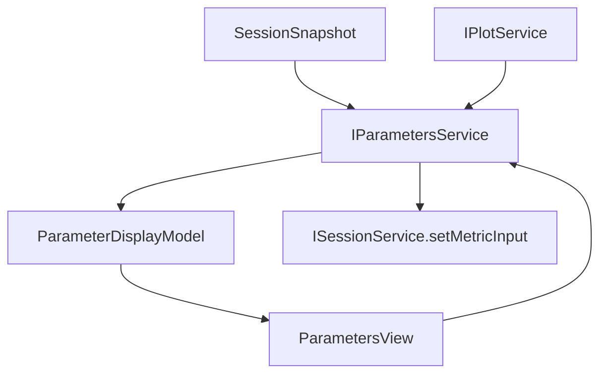

# Parameters

Parameters consumes metrics and curves and provides a parameter table/display model.

It may commit metric inputs that affect calculation, but pure view state stays in the Parameters service.

## Ownership

`IParametersService` owns:

- parameter view state;
- selected metric/parameter row;
- display rows grouped by file/series/metric;
- manual metric input draft state;
- commands that commit metric inputs to Session;
- parameter display filters and sorting.

It consumes:

- `SessionSnapshot.metricsByKey` and `metricInputsByKey`;
- `IPlotService` for plotted curve context when needed;
- `ISessionService` commit methods for real metric inputs.

It does not own:

- metric calculation algorithms unless explicitly split here later;
- raw table parsing;
- plot rendering;
- chart shell state;
- table selection.

## Core files

| File | Responsibility |
| --- | --- |
| `src/cs/workbench/services/parameters/common/parameters.ts` | Defines `IParametersService`, parameter rows, selection, filters, input commands. |
| `src/cs/workbench/services/parameters/common/parameterModel.ts` | Pure parameter display model types and builders. |
| `src/cs/workbench/services/parameters/browser/parametersService.ts` | Owns parameter view state, subscribes to session, builds display rows, commits metric inputs. |
| `src/cs/workbench/services/parameters/browser/parameters.contribution.ts` | Registers service and lifecycle contribution. |
| `src/cs/workbench/contrib/parameters/browser/parametersViewPane.ts` | View pane shell. Renders rows and forwards edits/selection. |
| `src/cs/workbench/contrib/parameters/browser/parametersModel.ts` | Current transitional model. Target owner is service common/browser model files. |

## Flow



## Rules

- Manual inputs that affect calculations are canonical and may be committed to Session.
- UI-only method choices, selected rows, filters, and panel state belong to Parameters service.
- Parameter rows should link back to source curves/metrics using ids, not copied data.

## Command entry and dispatch

Parameters commands own parameter panel operations and manual metric input workflows.

Recommended files:

| File | Responsibility |
| --- | --- |
| `src/cs/workbench/contrib/parameters/browser/parametersCommands.ts` | Registers reveal metric, set manual input, clear manual input, focus parameters commands. |
| `src/cs/workbench/contrib/parameters/browser/parametersActions.ts` | Parameter view/menu actions. |
| `src/cs/workbench/services/parameters/browser/parametersService.ts` | Owns parameter display state and delegates canonical metric input commits to session. |

Command flow:

```txt
parameters.setMetricInput command
  -> IParametersService.setMetricInput(input)
  -> ISessionService.setMetricInput(normalizedInput)
  -> metricsChanged or parameter state event
  -> ParametersView render
```

Only calculation-affecting manual inputs should become canonical session records. Panel selection stays in ParametersService.

## Do not

- Do not store selected parameter row in Session.
- Do not compute plot domains here.
- Do not use table raw rows directly unless a parameter algorithm explicitly requires it through a calculation service.


## Field catalog

Use `records.instructions.md` for parameter state and row model field
definitions: `ParametersState` and `ParameterRowModel`.
