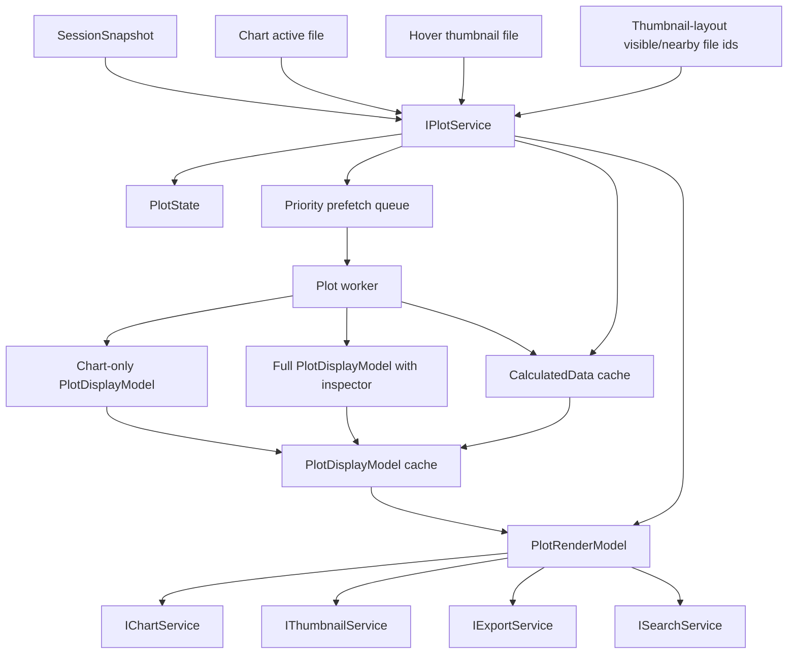

# Plot

Plot is the drawing core. Chart is only a host that renders plot output.

`IPlotService` subscribes to session and produces plot render models for Chart, Thumbnail, Search, and Export.

## Ownership

`IPlotService` owns:

- active plot type, such as IV/CV/CF/PV/IT/derived views;
- visible/hidden plotted series;
- axis unit conversion settings;
- y-scale mode for plotted data;
- plot domains and tick model;
- display downsampling;
- render model assembly from session curves/metrics;
- plot labels and legend labels that are display semantics.

It consumes:

- `SessionSnapshot` curves, metrics, series, file semantics;
- `IParametersService` or metric records when overlays depend on metrics;
- explicit user display settings.

It does not own:

- DOM rendering;
- chart panel layout;
- raw table parsing;
- assessment;
- template execution;
- thumbnail bitmap cache.

## Core files

| File | Responsibility |
| --- | --- |
| `src/cs/workbench/services/plot/common/plot.ts` | Defines `IPlotService`, `PlotType`, `PlotState`, `PlotRenderModel`, `PlotModelRef`, service events. `PlotType` is the plot-owned display alias for calculation kinds. |
| `src/cs/workbench/services/plot/common/plotModel.ts` | Shared model types: series, point, domain, axis labels, overlays. No DOM. |
| `src/cs/workbench/services/plot/common/plotSettings.ts` | Unit, scale, visibility, plot type settings. |
| `src/cs/workbench/services/plot/browser/plotService.ts` | Subscribes to session, maintains plot state, builds and caches plot render models. |
| `src/cs/workbench/services/plot/browser/plotCalculatedDataWorker.ts` | Browser worker entry that builds calculated plot data for queued prefetch work off the renderer UI thread. |
| `src/cs/workbench/services/plot/browser/plotCalculatedDataWorkerClient.ts` | Plot-owned worker adapter for async calculated-data and display-model prefetch requests, timeouts, and fallback. |
| `src/cs/workbench/services/plot/browser/plotDisplayModel.ts` | Pure display-model builder shared by PlotService and the Plot worker. No DOM. |
| `src/cs/workbench/services/plot/browser/plotRenderModel.ts` | Converts session curves/metrics to normalized render model. Target home for current `plotMainRenderModel`. |
| `src/cs/workbench/services/plot/browser/plotViewModel.ts` | Domains, ticks, point model, downsampling, signed-log helpers. Target home for current plot view-model math. |
| `src/cs/workbench/services/plot/browser/plot.contribution.ts` | Registers `IPlotService` and session subscription. |
| `src/cs/workbench/contrib/plot/browser/plotMainView.ts` | DOM adapter from `PlotRenderModel` to chart canvas/SVG component props. No session reads. |
| `src/cs/workbench/contrib/plot/browser/plotMainChart.ts` | Low-level chart drawing widget. Receives props only. |

## Flow



## Public interface shape

```ts
export interface IPlotService {
  readonly _serviceBrand: undefined;
  readonly onDidChangeCalculatedDataCache: Event<PlotCalculatedDataCacheChangeEvent>;
  readonly onDidChangePlotDisplayModelCache: Event<PlotDisplayModelCacheChangeEvent>;
  readonly onDidChangePlotState: Event<PlotState>;

  getState(): PlotState;
  getCachedCalculatedData(input: PlotCalculatedDataInput): CalculatedData | null;
  getCachedPlotDisplayModel(input: PlotDisplayModelInput): PlotDisplayModel | null;
  getCachedPlotLegendModel(input: PlotCalculatedDataInput): PlotLegendModel | null;
  getCalculatedData(input: PlotCalculatedDataInput): CalculatedData | null;
  getLegendLabels(fileId: FileId): Readonly<Record<SeriesId, string>>;
  getPlotDisplayModel(input: PlotDisplayModelInput): PlotDisplayModel | null;
  getPlotLegendModel(input: PlotCalculatedDataInput): PlotLegendModel | null;
  getPlotMainRenderModel(input: PlotMainRenderModelInput): PlotMainRenderModel | null;
  prefetchCalculatedData(fileIds: readonly FileId[], priority: PlotCalculatedDataPrefetchPriority, plotType?: PlotType): void;
  prefetchPlotDisplayModel(input: PlotDisplayModelInput, priority: PlotCalculatedDataPrefetchPriority): void;
  setActivePlotType(plotType: PlotType): void;
  setAxisTitleOverride(context: PlotAxisTitleContext, title: string, defaultTitle: string): void;
  setAxisUnit(fileId: FileId, axis: 'x' | 'y', unit: XUnit | YUnit): Promise<void>;
  setLegendLabel(fileId: FileId, seriesId: SeriesId, label: string | null): void;
  setYScale(fileId: FileId, scale: 'linear' | 'log'): Promise<void>;
}
```

`setAxisUnit` and `setYScale` are Plot owner APIs. Their persistent backing is
platform `IStorageService`, because per-file unit and scale choices are
remembered plot state, not user configuration. `PlotService` writes storage and
then fires `onDidChangePlotState`. Chart views must call Plot, not settings or
storage, for these controls.

## Rules

- Plot reads session curves; Chart does not.
- Plot owns data-to-display transformation.
- Plot calculated-data prefetch is a cache warmup queue only; it must not own
  Chart or Thumbnail rendering, and it must not publish a fake state change.
- Queued Plot calculated-data prefetch should run DOM-independent calculation
  through `plotCalculatedDataWorker` when Worker is available. `PlotService`
  remains the owner that accepts fresh results, writes the cache, ignores stale
  results, and falls back only when the worker path is unavailable or fails.
- Plot worker calculated-data requests should send only the file fields needed
  for plot calculation, such as base curves, series labels/order, and latest
  template axis metadata. Do not post full raw table row stores to the worker.
- `getCachedCalculatedData` is a non-creating read for consumers that must not
  run calculation work in their own frame budget.
- `getCachedPlotDisplayModel` and `getCachedPlotLegendModel` are non-creating
  reads for active chart rendering. Chart views should call them and request
  active prefetch on cache miss instead of synchronously creating calculated
  data during render.
- Plot publishes `onDidChangeCalculatedDataCache` when a calculated-data cache
  entry is created or invalidated for a specific file/plot pair, so consumers
  can refresh loading UI without polling or reacting to unrelated files.
- Plot calculated-data prefetch skips entries that are already cached for the
  same file id and plot type; it must not spend frame budget on warmed data.
- Plot calculated-data prefetch priority follows the user-facing surface:
  active chart file, hover thumbnail, visible thumbnails, nearby thumbnails, idle.
- Plot prefetch scheduling must reserve interactive capacity. Visible/nearby/idle
  background work must not occupy every worker slot; active chart and hover work
  must be able to start while background prefetch is still running.
- Queued calculated-data prefetch must be canceled when the active plot type
  changes. Plot-relevant session changes must invalidate only the affected
  file ids when the event provides them; unrelated file commits must not cancel
  the active chart or hover prefetch and must not publish a global
  `onDidChangePlotState`.
- Plot display-model prefetch is a separate cache warmup. `getCachedPlotDisplayModel`
  must not build display models synchronously when only calculated data is warm.
- Queued Plot display-model prefetch should run DOM-independent render-model,
  legend-filter, unit, and inspector derivative assembly through the Plot worker
  when Worker is available. `PlotService` accepts fresh results, writes the
  display-model cache, ignores stale results, and falls back only from the
  scheduled prefetch path.
- Plot display-model prefetch is staged: active chart work first publishes a
  chart-only `PlotDisplayModel` so Chart can paint the main canvas, then queues a
  full model that adds the inspector derivative. The cache may be upgraded from
  chart-only to full, but a full cache entry must not be replaced by chart-only
  data.
- Full display-model prefetch is cache completion work, not first-paint work.
  Once chart-only output is available, the queued full/inspector stage should
  run at background priority and must not occupy the reserved interactive
  capacity needed by active chart, file switch, or hover thumbnail requests.
- Active and hover display-model prefetch may synchronously cache the cheap
  chart-only display model when calculated data is already warm. This gives
  Chart and hover thumbnails a first drawable frame without waiting behind
  background worker display-model work; the full inspector model can still be
  queued afterward.
- Active and hover display-model prefetch may also synchronously warm the
  calculated-data cache for only the requested file when the session already has
  drawable canonical curves. Keep this interactive warm path file-scoped and do
  not apply it to visible/nearby/idle background prefetch.
- Plot display-model cache invalidation is file-scoped. When a session event
  affects only specific file ids, `PlotService` should publish targeted
  `onDidChangePlotDisplayModelCache` events for those file/plot pairs instead
  of waking every Chart/Thumbnail consumer through `onDidChangePlotState`.
- Plot render models are currently built from template/base curve records and
  Plot-owned settings. `calculatedRecordsChanged`, `metricsChanged`, and
  derived-only `curvesChanged` events must not invalidate active chart or hover
  thumbnail plot caches unless Plot starts consuming those canonical records as
  render inputs.
- Chart views should request `prefetchPlotDisplayModel(..., "active")` on a
  cached display-model miss. They should not call `getPlotDisplayModel` in the
  active render path.
- Domain bridges that know the active chart file should prefetch both
  calculated data and the default display model at `active` priority. Visible
  and nearby thumbnail backfill should be requested only while Explorer is in
  chart thumbnail layout; tree-layout hover previews use hover priority on
  demand.
- Plot render models must be stable and reusable by Chart/Thumbnail/Export.
- Chart canvas drawing should use a display downsample budget tied to the
  visible pixel width. Full point arrays remain in the render model for readout
  accuracy, but the first paint must not synchronously draw every point in a
  large series.
- `PlotMainChart` defaults to stable layout draw, but active Chart hosts may
  request an eager first draw once the chart is connected and sized. Keep this
  as an explicit host-provided strategy so reusable plot surfaces do not
  accidentally trade layout stability for speed.
- Plot state is display state; do not store it in Session unless it becomes saved project state later.

## Command entry and dispatch

Plot owns commands that change plotted data presentation.

Recommended files:

| File | Responsibility |
| --- | --- |
| `src/cs/workbench/contrib/plot/browser/plotCommands.ts` | Registers plot type, unit, scale, visibility, and active series commands. |
| `src/cs/workbench/contrib/plot/browser/plotActions.ts` | Toolbar/menu/keybinding entries for plot commands. |
| `src/cs/workbench/services/plot/browser/plotService.ts` | Owns plot state and render-model generation. No command registration. |

Command flow:

```txt
plot.setActivePlotType command
  -> IPlotService.setActivePlotType(type)
  -> IPlotService.onDidChangePlotState
  -> Chart/Thumbnail/Export/Search consumers update
```

Chart UI may expose buttons for these commands, but the target service remains `IPlotService`.

## Do not

- Do not put canvas/SVG DOM code in PlotService.
- Do not let Chart rebuild curve domains from raw session records.
- Do not duplicate downsampling logic in Thumbnail.
- Do not compute assessment or template outputs here.


## Field catalog

Use `records.instructions.md` for plot state and render-model field
definitions: `PlotState`, `PlotRenderModel`, `PlotSeriesModel`, and
`PlotAxisModel`.

Per-file unit and scale choices are written through Plot owner APIs and
persisted in platform storage. `PlotService` consumes storage, legacy Settings
values, and Session when building display models; callers do not pass axis
settings through Chart input or render-model requests.

## Component split

| Component | Responsibility |
| --- | --- |
| `PlotService` | Owns `PlotState`, subscribes to session, publishes render models. |
| `plotRenderModel.ts` | Pure render-model builders from session curves + plot state to `PlotRenderModel`. |
| `plotViewModel.ts` | Pure domain, tick, point-model, downsampling, and signed-log calculations. |

Do not make Chart own these fields. Chart consumes them.
