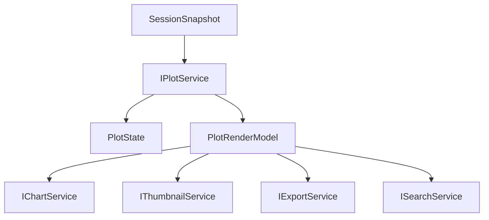

# Plot

Plot is the drawing core. Chart is only a host that renders plot output.

`IPlotService` subscribes to session and produces plot render models for Chart, Thumbnail, Search, and Export.

## Ownership

`IPlotService` owns:

- active plot type, such as IV/CV/CF/PV/IT/derived views;
- visible/hidden plotted series;
- axis unit conversion settings;
- y-scale mode for plotted data;
- plot domains and tick model;
- display downsampling;
- render model assembly from session curves/metrics;
- plot labels and legend labels that are display semantics.

It consumes:

- `SessionSnapshot` curves, metrics, series, file semantics;
- `IParametersService` or metric records when overlays depend on metrics;
- explicit user display settings.

It does not own:

- DOM rendering;
- chart panel layout;
- raw table parsing;
- assessment;
- template execution;
- thumbnail bitmap cache.

## Core files

| File | Responsibility |
| --- | --- |
| `src/cs/workbench/services/plot/common/plot.ts` | Defines `IPlotService`, `PlotType`, `PlotState`, `PlotRenderModel`, `PlotModelRef`, service events. |
| `src/cs/workbench/services/plot/common/plotModel.ts` | Shared model types: series, point, domain, axis labels, overlays. No DOM. |
| `src/cs/workbench/services/plot/common/plotSettings.ts` | Unit, scale, visibility, plot type settings. |
| `src/cs/workbench/services/plot/browser/plotService.ts` | Subscribes to session, maintains plot state, builds and caches plot render models. |
| `src/cs/workbench/services/plot/browser/plotRenderModel.ts` | Converts session curves/metrics to normalized render model. Target home for current `plotMainRenderModel`. |
| `src/cs/workbench/services/plot/browser/plotViewModel.ts` | Domains, ticks, point model, downsampling, signed-log helpers. Target home for current plot view-model math. |
| `src/cs/workbench/services/plot/browser/plot.contribution.ts` | Registers `IPlotService` and session subscription. |
| `src/cs/workbench/contrib/plot/browser/plotMainView.ts` | DOM adapter from `PlotRenderModel` to chart canvas/SVG component props. No session reads. |
| `src/cs/workbench/contrib/plot/browser/plotMainChart.ts` | Low-level chart drawing widget. Receives props only. |

## Flow



## Public interface shape

```ts
export interface IPlotService {
  readonly _serviceBrand: undefined;
  readonly onDidChangePlotState: Event<PlotState>;

  getState(): PlotState;
  getCalculatedData(input: PlotCalculatedDataInput): CalculatedData | null;
  getLegendLabels(fileId: FileId): Readonly<Record<SeriesId, string>>;
  getPlotDisplayModel(input: PlotDisplayModelInput): PlotDisplayModel | null;
  getPlotLegendModel(input: PlotCalculatedDataInput): PlotLegendModel | null;
  getPlotMainRenderModel(input: PlotMainRenderModelInput): PlotMainRenderModel | null;
  setActivePlotType(plotType: PlotType): void;
  setAxisTitleOverride(context: PlotAxisTitleContext, title: string, defaultTitle: string): void;
  setAxisUnit(fileId: FileId, axis: 'x' | 'y', unit: XUnit | YUnit): Promise<void>;
  setLegendLabel(fileId: FileId, seriesId: SeriesId, label: string | null): void;
  setYScale(fileId: FileId, scale: 'linear' | 'log'): Promise<void>;
}
```

`setAxisUnit` and `setYScale` are Plot owner APIs. Their current persistent
backing is conductor settings, so `PlotService` writes through
`ISettingsService` and then fires `onDidChangePlotState`. Chart views must call
Plot, not settings, for these controls.

## Rules

- Plot reads session curves; Chart does not.
- Plot owns data-to-display transformation.
- Plot render models must be stable and reusable by Chart/Thumbnail/Export.
- Plot state is display state; do not store it in Session unless it becomes saved project state later.

## Command entry and dispatch

Plot owns commands that change plotted data presentation.

Recommended files:

| File | Responsibility |
| --- | --- |
| `src/cs/workbench/contrib/plot/browser/plotCommands.ts` | Registers plot type, unit, scale, visibility, and active series commands. |
| `src/cs/workbench/contrib/plot/browser/plotActions.ts` | Toolbar/menu/keybinding entries for plot commands. |
| `src/cs/workbench/services/plot/browser/plotService.ts` | Owns plot state and render-model generation. No command registration. |

Command flow:

```txt
plot.setActivePlotType command
  -> IPlotService.setActivePlotType(type)
  -> IPlotService.onDidChangePlotState
  -> Chart/Thumbnail/Export/Search consumers update
```

Chart UI may expose buttons for these commands, but the target service remains `IPlotService`.

## Do not

- Do not put canvas/SVG DOM code in PlotService.
- Do not let Chart rebuild curve domains from raw session records.
- Do not duplicate downsampling logic in Thumbnail.
- Do not compute assessment or template outputs here.


## State and model fields

### `PlotState`

| Field | Meaning |
| --- | --- |
| `activePlotType` | Current plot family tab. |
| `axisTitleOverridesByKey` | User axis title overrides. |
| `legendLabelsByFileId` | User legend label overrides by file and series. |

Per-file unit and scale choices are written through Plot owner APIs and
currently persisted in conductor settings. `PlotService` consumes Settings and
Session directly when building display models; callers do not pass axis
settings through Chart input or render-model requests.

### `PlotRenderModel`

| Field | Meaning |
| --- | --- |
| `modelId` | Stable model/signature id. |
| `fileId` | Source file. |
| `plotType` | Rendered plot type. |
| `seriesList` | Display-ready plot series. |
| `axis` | Effective labels, units, domains, scale, ticks. |
| `pointsCount` | Total rendered point count. |
| `sourceCurveKeys` | Curves used to build this model. |
| `signature` | Invalidation signature. |
| `diagnostics` | Plot-specific warnings. |

### `PlotSeriesModel`

| Field | Meaning |
| --- | --- |
| `seriesId` | Source series id. |
| `curveKey` | Source curve key. |
| `label` | Display label. |
| `points` | Display points after unit conversion/filter/downsample. |
| `rawPointCount` | Point count before display processing. |
| `visible` | Effective visibility. |
| `focused` | Focus state. |
| `sourceRange` | Optional raw table provenance. |

### `PlotAxisModel`

| Field | Meaning |
| --- | --- |
| `xLabel` | Effective x label. |
| `yLabel` | Effective y label. |
| `xUnitLabel` | Effective x unit label. |
| `yUnitLabel` | Effective y unit label. |
| `xFactor` | X unit conversion factor. |
| `yFactor` | Y unit conversion factor. |
| `xDomain` | Display x domain. |
| `yDomain` | Display y domain. |
| `yScale` | Linear/log scale. |
| `xTicks` | Optional computed x ticks. |
| `yTicks` | Optional computed y ticks. |

## Component split

| Component | Responsibility |
| --- | --- |
| `PlotService` | Owns `PlotState`, subscribes to session, publishes render models. |
| `plotRenderModel.ts` | Pure render-model builders from session curves + plot state to `PlotRenderModel`. |
| `plotViewModel.ts` | Pure domain, tick, point-model, downsampling, and signed-log calculations. |

Do not make Chart own these fields. Chart consumes them.
