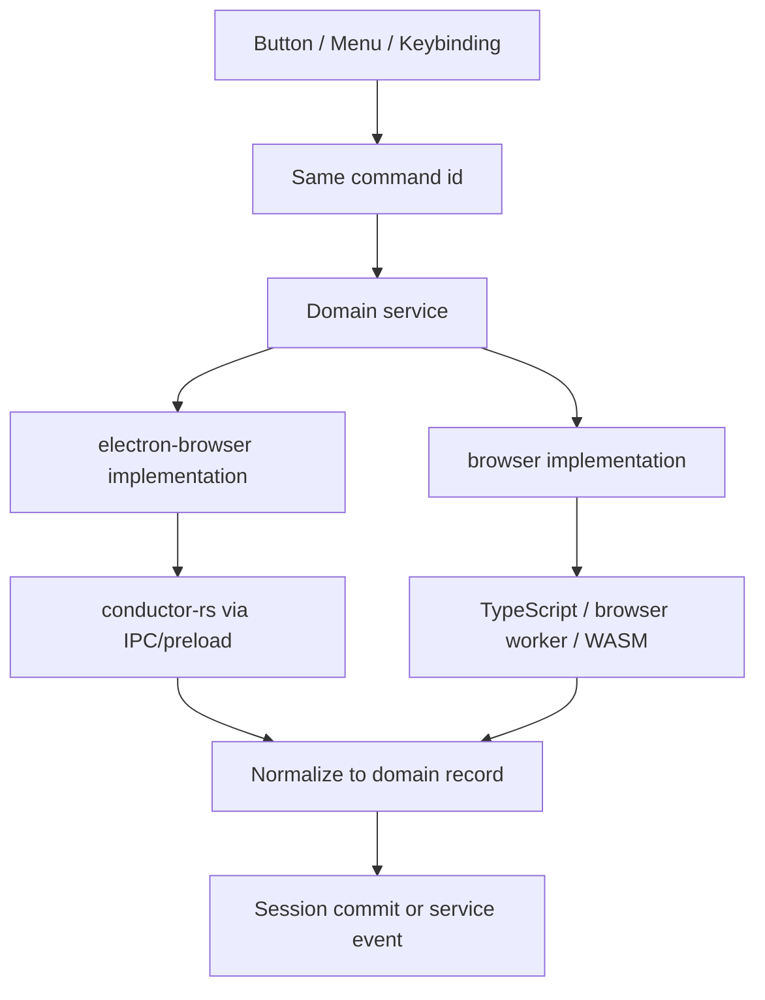

# Rust Execution Branch

Rust is an execution branch for desktop service implementations. It is not a separate workbench domain, not a replacement for commands, and not a second product session.

Use this document when moving expensive file/table/template/plot/export/metric work from TypeScript into `conductor-rs`.

## Core rule

Desktop code may bypass the TypeScript implementation of a heavy stage, but it must not bypass the TypeScript architecture.

```txt
Command / Action / View
  -> domain service contract in common
  -> browser implementation or electron-browser implementation
  -> electron-browser implementation calls Rust when running on desktop
  -> service normalizes and validates result
  -> SessionService commit or service event
  -> View render
```

Do not create a parallel Rust command layer, Rust view layer, or Rust session layer.

## Naming rule

Do not propagate legacy `analysisFile` names into new code. The old analysis-file surface is migration debt and must retreat behind domain services.

Do not add names like:

```txt
IRustService
RustBackend
FileConverterBackend
processWithRust
applyTemplateWithRust
analysisFileService
AnalysisFileBridge
```

Prefer domain names that match the browser implementation:

```txt
services/files/browser/fileConverter.ts
services/files/electron-browser/fileConverter.ts

services/table/browser/tableRowsReader.ts
services/table/electron-browser/tableRowsReader.ts

services/template/browser/templateApplyService.ts
services/template/electron-browser/templateApplyService.ts

services/plot/browser/plotService.ts
services/plot/electron-browser/plotService.ts

services/export/browser/exportService.ts
services/export/electron-browser/exportService.ts
```

A file in `electron-browser` is already the desktop branch. If clarity is needed, put this at the top of the file:

```ts
// Desktop implementation of the same domain service. Heavy data stages are executed by conductor-rs through Electron IPC/preload.
```

The word `bridge` is acceptable only at the Electron preload/main-process boundary, where it describes the technical IPC bridge. Do not leak `Bridge` names into workbench domain services.

## Command rule

Commands do not fork for Rust.

Do not add command ids such as:

```txt
explorer.importFolderWithRust
template.applyWithRust
plot.rebuildWithRust
export.originCsvWithRust
```

Use the same command id in browser and desktop:

```txt
explorer.importFolder
template.apply
plot.rebuild
export.originCsv
```

The command handler dispatches to the domain service. The domain service implementation decides which execution branch is active.



## Rust is data-plane, TypeScript is control-plane

Rust may own heavy execution and runtime caches. TypeScript owns product state and service orchestration.

Rust may do:

- file conversion;
- workbook sheet extraction;
- raw table scanning;
- assessment execution;
- table preview row/cell reads;
- template extraction;
- metric/Rc calculation;
- plot-frame construction and downsampling;
- export artifact generation.

TypeScript still owns:

- command/action registration;
- service contracts;
- controller workflow;
- session commits;
- version/signature validation;
- view state;
- DOM rendering;
- user-facing notifications;
- fallback policy.

Rust must never directly mutate `SessionModel`, table selection, chart state, Explorer state, or UI DOM.

## Stage ownership and return boundaries

Only return data at stable stage boundaries. Do not return intermediate arrays just because Rust has them.

| Stage | TS owner | Desktop Rust branch may do | Return to TS | Do not return by default |
| --- | --- | --- | --- | --- |
| File conversion | `files/electron-browser/fileConverter.ts` | CSV/XLS/XLSX parse, sheet split, normalized CSV artifact creation | `FileImportResult`-compatible descriptors, `RawTableRecord` metadata, `normalizedCsvPath`, manifest, diagnostics | full CSV text, full workbook data |
| Assessment | `assessment/electron-browser/assessmentService.ts` | block/group/header/data/column-role/sweep inference | `RawTableAssessmentRecord` | raw rows |
| Table preview | `table/electron-browser/tableRowsReader.ts` | row chunk reads, cell reads, raw table metadata reads | bounded rows chunk or selected cell values | whole table |
| Template apply | `template/electron-browser/templateApplyService.ts` | auto extraction, curve/series extraction, template process | `TemplateRunRecord`, `SeriesRecord` descriptors, curve descriptors/handles, diagnostics | full curve points unless small/fallback |
| Plot | `plot/electron-browser/plotService.ts` | domain calculation, unit scaling, log transform, downsampling, plot frame construction | `PlotRenderModel` / plot frame bounded by display needs | all original points |
| Parameters/metrics | `parameters/electron-browser/parametersService.ts` or metric calculator helper | gm, SS, Vth, Ion/Ioff, Rc, fit windows | `MetricRecord`, scalar values, bounded fit preview, diagnostics | full intermediate arrays |
| Export | `export/electron-browser/exportService.ts` | stream CSV/ZIP/artifact generation | `ExportArtifactRecord`: path, fileName, size, diagnostics | large CSV text |
| Search | future `search/electron-browser/searchService.ts` | indexed search over raw dataset/curves | result refs, snippets, counts, `RawTableRangeRef` | matched full rows or whole tables |

## Result normalization rule

Rust output is not a workbench record until a TypeScript service normalizes it.

```txt
Rust JSON result
  -> service-local validation
  -> domain record normalization
  -> stale-result check
  -> session commit or service event
```

Example:

```txt
Rust import result
  -> FileImportResult / RawTableRecord

Rust assessment result
  -> RawTableAssessmentRecord

Rust template result
  -> TemplateRunRecord / SeriesRecord / CurveRecord descriptor

Rust metric result
  -> MetricRecord

Rust export result
  -> ExportArtifactRecord
```

Do not let Rust payload types leak into Views. Views should consume the same domain models regardless of browser or desktop runtime.

## Boundary payload shape

Use a small envelope for cross-runtime responses. Keep errors typed and recoverable.

```ts
export type RustStageResult<T> =
  | {
      readonly ok: true;
      readonly value: T;
      readonly diagnostics?: readonly RustDiagnostic[];
      readonly timings?: RustTimings;
    }
  | {
      readonly ok: false;
      readonly code: RustErrorCode;
      readonly message?: string;
      readonly recoverable?: boolean;
    };
```

A domain service may hide this envelope from callers and expose only domain-specific success/failure types.

## Identity and stale-result checks

Every Rust request that can outlive the current UI turn must include enough identity to reject stale results.

```ts
export type RustRequestIdentity = {
  readonly requestId: string;
  readonly sessionVersion: number;
  readonly fileId: FileId;
  readonly rawTableId?: RawTableId;
  readonly rawTableVersion?: number;
  readonly assessmentVersion?: number;
  readonly templateRunId?: TemplateRunId;
  readonly configFingerprint?: string;
  readonly curveSignature?: string;
};
```

Before committing any Rust result, the service must check:

```txt
file still exists
rawTableVersion still matches
assessment/config signature still matches
requestId is still current for this service request
curve/metric signatures still match when applicable
```

If the result is stale, drop it silently unless a user-visible operation explicitly needs a cancellation message.

## Large-data rule

The main performance win is avoiding JS heap pressure and cross-boundary copies.

Return these freely:

- descriptors;
- ids and handles;
- versions/signatures;
- diagnostics;
- scalar metrics;
- bounded preview rows;
- bounded plot frames;
- export artifact paths.

Do not return these by default:

- full converted CSV text;
- full raw table rows;
- full curve point arrays;
- full intermediate metric arrays;
- full export text.

If a full payload must be returned for a small file or tests, mark it as a compatibility path and keep the large-file path artifact/handle-based.

## Handle and artifact records

When Rust keeps large data in process or writes a temp artifact, TypeScript should store a descriptor, not the payload.

```ts
export type EngineDatasetRef = {
  readonly kind: 'engineDataset';
  readonly fileId: FileId;
  readonly rawTableId: RawTableId;
  readonly rawTableVersion: number;
  readonly engineId: string;
  readonly normalizedCsvPath?: string;
  readonly signature: string;
};

export type EngineCurveRef = {
  readonly kind: 'engineCurve';
  readonly fileId: FileId;
  readonly curveKey: CurveKey;
  readonly pointCount: number;
  readonly domain: DomainRecord;
  readonly engineId: string;
  readonly signature: string;
};

export type ExportArtifactRecord = {
  readonly kind: 'csv' | 'zip' | 'directory';
  readonly path: string;
  readonly fileName: string;
  readonly sizeBytes?: number;
  readonly createdAt: number;
};
```

Names intentionally avoid `Rust*` in canonical records. A record should describe what the app has, not which runtime produced it.

## Runtime registration pattern

`common` defines the service contract. Runtime folders select implementation.

```txt
services/plot/common/plot.ts
  IPlotService, PlotRenderModel, PlotState

services/plot/browser/plotService.ts
  browser implementation using TS/WASM/browser worker

services/plot/electron-browser/plotService.ts
  desktop implementation using conductor-rs through Electron IPC/preload
```

Service consumers import only the common interface.

```ts
import { IPlotService } from 'src/cs/workbench/services/plot/common/plot';
```

They must not import the browser/electron-browser implementation directly.

## Fallback policy

Fallback is owned by the domain service, not by commands or views.

Recommended defaults:

| Stage | Desktop failure policy |
| --- | --- |
| File conversion | Fall back only when the browser converter can safely handle the file size/type; otherwise report conversion error. |
| Assessment | Fall back to WASM/TS only if schemas are compatible. |
| Table preview | Fall back to normalized CSV reader if available. |
| Template apply | Fall back to TS when Rust reports unsupported config. |
| Plot | Fall back to TS downsampling for small/inline curves. |
| Parameters/metrics | Fall back to TS calculation if signatures and algorithms are compatible. |
| Export | Fall back to TS export only when output size and plan are safe for JS memory. |

Do not write one global fallback rule.

## Lifecycle and disposal

Rust runtime state is cache-like and must be disposable/rebuildable.

Dispose or invalidate Rust-held data when:

- a file is removed;
- a raw table is replaced;
- a template is re-applied to the same block;
- curve descriptors are invalidated;
- metrics are invalidated;
- export artifacts expire;
- the session is cleared;
- the worker exits or crashes.

TypeScript session is the recovery source. If the Rust worker restarts, services should lazily reopen normalized CSV artifacts and recompute curve/metric handles from `FileRecord`, `RawTableRecord`, `RawTableAssessmentRecord`, and `TemplateRunRecord` descriptors.

## Migration from analysisFile

Legacy names may exist temporarily in compatibility files, but new architecture must not expand them.

Migration direction:

```txt
services/analysisFile/browser/fileConversion.ts
  -> services/files/browser/fileConverter.ts
  -> services/files/electron-browser/fileConverter.ts

services/analysisFile/browser/importPipeline.ts
  -> ExplorerImportController + fileImportExport.ts + fileConverter.ts

services/analysisFile/electron-browser/analysisFileService.ts
  -> domain-specific electron-browser implementations:
       files/fileConverter.ts
       table/tableRowsReader.ts
       template/templateApplyService.ts
       export/exportService.ts
       parameters/metric calculator helpers
```

Preload/main process bridge method names can remain as compatibility IPC surface until replaced. Workbench domain code should wrap them behind domain names.

## Acceptable file-level comment

If a new `electron-browser` file uses Rust heavily, use a short comment. Do not encode Rust into every class or method name.

```ts
// Desktop implementation of file conversion. Uses conductor-rs for workbook conversion and normalized CSV artifacts; returns FileImportResult-compatible descriptors.
```

## Do not

- Do not create `IRustService` as a general-purpose workbench service.
- Do not expose Rust calls to Views.
- Do not create Rust-specific command ids.
- Do not suffix domain methods with `WithRust`.
- Do not prefix new workbench records with `Rust` when the record is canonical.
- Do not let Rust commit session.
- Do not return large payloads when an artifact path, handle, descriptor, preview slice, or plot frame is enough.
- Do not keep `analysisFile` names in new service boundaries.
