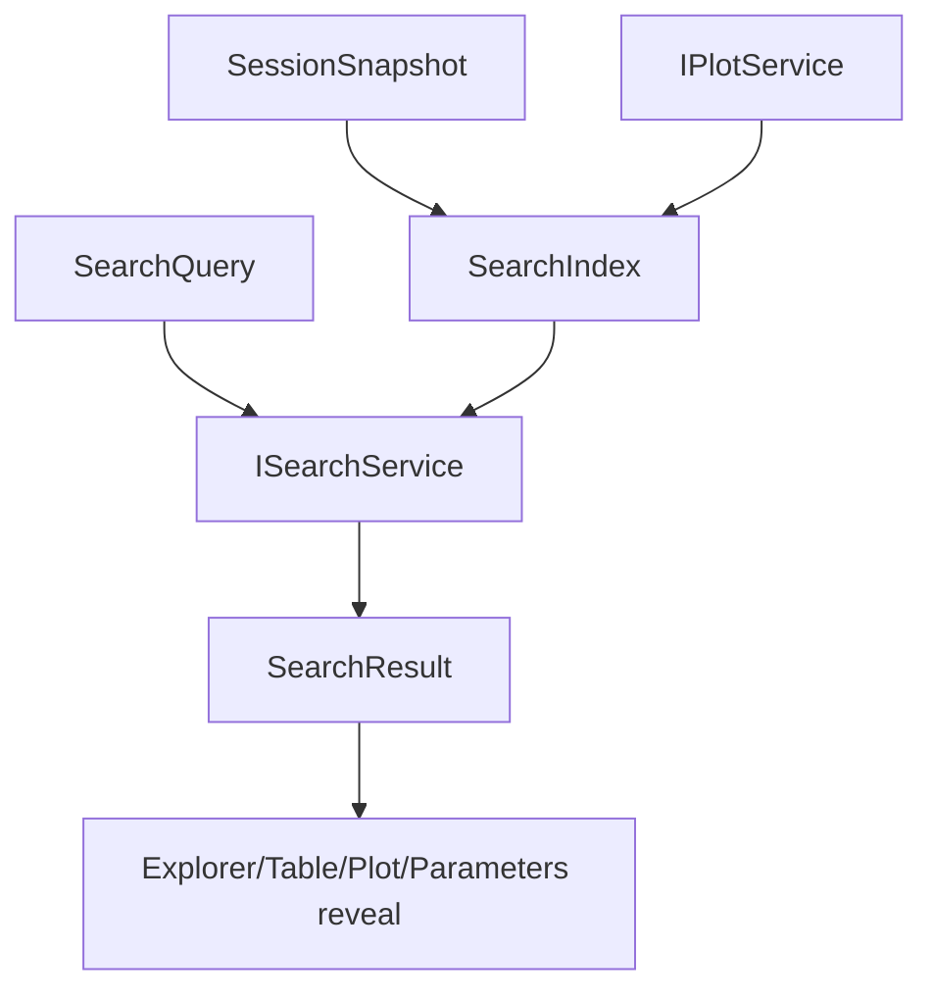

# Search

Search is a consumer and indexer. It does not produce canonical data.

## Ownership

`ISearchService` owns:

- search query state;
- selected search result;
- search indexes built from session snapshot;
- search results for raw cells, raw tables, groups, blocks, columns, curves, metrics, parameters;
- navigation target generation using `RawTableRangeRef`, block id, curve key, or metric key.

It consumes:

- `SessionSnapshot`;
- assessment results;
- optional `IPlotService` render models for currently plotted series labels;
- table service for reveal requests.

It does not own:

- raw table import;
- assessment;
- template execution;
- plot calculation;
- canonical session mutation.

## Core files

| File | Responsibility |
| --- | --- |
| `src/cs/workbench/services/search/common/search.ts` | Defines `ISearchService`, `SearchQuery`, `SearchResult`, result kinds, navigation targets. |
| `src/cs/workbench/services/search/browser/searchService.ts` | Owns query/selection state, subscribes to session/plot, returns results. |
| `src/cs/workbench/services/search/browser/searchIndex.ts` | Builds searchable index from files, raw tables, assessment blocks, curves, metrics. Pure enough to test. |
| `src/cs/workbench/services/search/browser/searchNavigation.ts` | Converts search result to Explorer/Table/Plot/Parameters reveal commands. |
| `src/cs/workbench/contrib/search/browser/searchViewPane.ts` | View pane shell. Renders search view and forwards query/selection changes. |
| `src/cs/workbench/contrib/search/browser/searchView.ts` | DOM/UI renderer for results. Does not read session directly. |

## Result shape

```ts
export type SearchResult = {
  readonly kind: SearchResultKind;
  readonly title: string;
  readonly preview?: string;
  readonly fileId?: FileId;
  readonly rawTableId?: RawTableId;
  readonly sourceRange?: RawTableRangeRef;
  readonly measurementBlockId?: MeasurementBlockId;
  readonly curveKey?: CurveKey;
  readonly metricKey?: MetricKey;
};
```

## Flow



## Command entry and dispatch

Search commands own query execution and result navigation.

Recommended files:

| File | Responsibility |
| --- | --- |
| `src/cs/workbench/contrib/search/browser/searchCommands.ts` | Registers focus search, run search, clear search, open result commands. |
| `src/cs/workbench/contrib/search/browser/searchActions.ts` | UI entries for search commands. |
| `src/cs/workbench/services/search/browser/searchService.ts` | Owns query state, selected result, and search index. |

Open-result dispatch:

```txt
search.openResult command
  -> ISearchService.resolveResultTarget(resultId)
  -> dispatch by target kind
     rawTableRange -> ITableService.revealRange
     curve -> IPlotService.revealCurve / set visibility
     metric -> IParametersService.revealMetric
     file/resource -> IExplorerService.revealResource
```

Search should navigate by explicit target refs, not by global session active state.

## Do not

- Do not re-detect block structure in search.
- Do not update canonical records from search results.
- Do not store query state in Session.
- Do not make SearchView read session directly.


## Field catalog

Use `records.instructions.md` for shared search result fields such as
`SearchResult`. Keep query state service-local to `ISearchService`; it is not
session canonical data.
