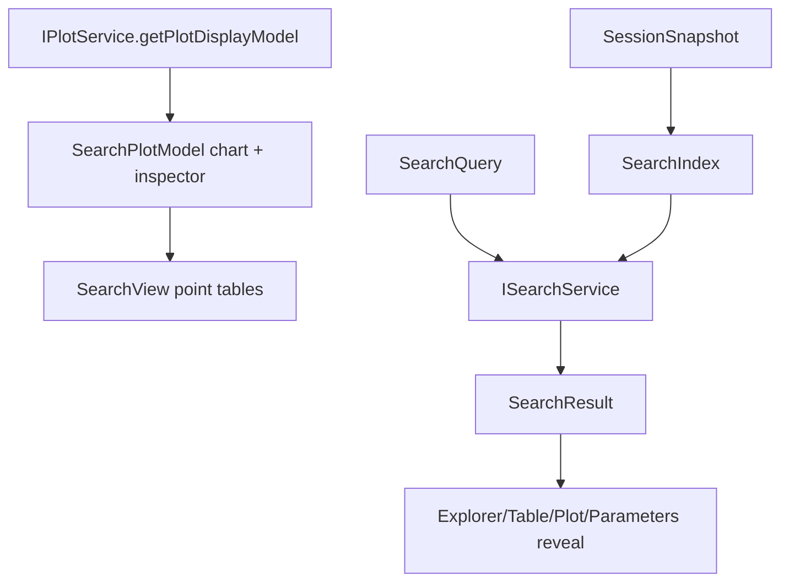

# Search

Search is a consumer and indexer. It does not produce canonical data.

## Ownership

`ISearchService` owns:

- search query state;
- selected search result;
- search indexes built from session snapshot;
- search results for raw cells, raw tables, groups, blocks, columns, curves, metrics, parameters;
- navigation target generation using `RawTableRangeRef`, block id, curve key, or metric key.

It consumes:

- `SessionSnapshot`;
- assessment results;
- optional `IPlotService` display models for currently plotted chart and inspector series labels;
- table service for reveal requests.

It does not own:

- raw table import;
- assessment;
- template execution;
- plot calculation;
- canonical session mutation.

## Core files

| File | Responsibility |
| --- | --- |
| `src/cs/workbench/services/search/common/search.ts` | Defines `ISearchService`, `SearchQuery`, `SearchResult`, result kinds, navigation targets. |
| `src/cs/workbench/services/search/browser/searchService.ts` | Owns query/selection state, subscribes to session/plot, returns results. |
| `src/cs/workbench/services/search/browser/searchIndex.ts` | Builds searchable index from files, raw tables, assessment blocks, curves, metrics. Pure enough to test. |
| `src/cs/workbench/services/search/browser/searchNavigation.ts` | Converts search result to Explorer/Table/Plot/Parameters reveal commands. |
| `src/cs/workbench/contrib/search/browser/searchViewPane.ts` | View pane shell. Renders search view and forwards query/selection changes. |
| `src/cs/workbench/contrib/search/browser/searchView.ts` | DOM/UI renderer for results. Does not read session directly. |

## Result shape

```ts
export type SearchResult = {
  readonly kind: SearchResultKind;
  readonly title: string;
  readonly preview?: string;
  readonly fileId?: FileId;
  readonly rawTableId?: RawTableId;
  readonly sourceRange?: RawTableRangeRef;
  readonly measurementBlockId?: MeasurementBlockId;
  readonly curveKey?: CurveKey;
  readonly metricKey?: MetricKey;
};
```

## Flow



## Command entry and dispatch

Search commands own query execution and result navigation.

Recommended files:

| File | Responsibility |
| --- | --- |
| `src/cs/workbench/contrib/search/browser/searchCommands.ts` | Registers focus search, run search, clear search, open result commands. |
| `src/cs/workbench/contrib/search/browser/searchActions.ts` | UI entries for search commands. |
| `src/cs/workbench/services/search/browser/searchService.ts` | Owns query state, selected result, and search index. |

Open-result dispatch:

```txt
search.openResult command
  -> ISearchService.resolveResultTarget(resultId)
  -> dispatch by target kind
     rawTableRange -> ITableService.revealRange
     curve -> IPlotService.revealCurve / set visibility
     metric -> IParametersService.revealMetric
     file/resource -> IExplorerService.revealResource
```

Search should navigate by explicit target refs, not by global session active state.

## Plot point search modes

Plot point search consumes a Search-owned projection of the current
`PlotDisplayModel`. Workbench bridges `IPlotService.getPlotDisplayModel(...)`
into `SearchPlotModel` with two panes:

| Pane | Source | UI behavior |
| --- | --- | --- |
| `chart` | `PlotDisplayModel.chart.model` | Main plot point table. |
| `inspector` | `PlotDisplayModel.inspector.model` | Second-order/inspector point table. |

The Search view owns one X input and one interpolation-mode select. It applies
the same X and mode to both panes and renders separate tables for the main chart
and second-order pane. These calculated point results are derived display data:
do not write them back to Session.

Search plot-point lookup currently supports one interpolation algorithm:
linear interpolation between adjacent finite points. The Search view may expose
this as a select box with two query modes:

| Mode | Behavior |
| --- | --- |
| `linear` | Use exact points when present, otherwise linearly interpolate between adjacent X points. |
| `none` | Require an exact X point; return a no-exact-match result when the X value is within the series domain but absent. |

Do not add an interpolation algorithm option unless the corresponding algorithm
exists in `searchModel.ts` and is covered by `searchModel.test.ts`.

## Search view layout

Search auxiliary-bar form rows should follow the same two-column control layout
used by neighboring chart auxiliary views:

```css
grid-template-columns: minmax(min(104px, 38%), 34%) minmax(0, 1fr);
column-gap: 12px;
```

The label column and control column resize with the auxiliary-bar width, while
the gap stays fixed. InputBox, select, dropdown, and similar controls in the
second column should keep `min-width: 0` and `width: 100%` so they shrink and
expand inside the available control column instead of overflowing or staying at
an intrinsic width.

The Search X input should use a text input with `inputMode = "decimal"` rather
than `type = "number"`. The view parses the text through SearchService when
searching, and text input preserves valid editing intermediates such as `1.`,
`.5`, and `-0.` while the user is still typing.

Do not rebuild the full Search view for every `SearchQuery` change. Text entry
and interpolation-mode changes should update `SearchService` query state and
refresh the current view's result table in place. Rebuilding the view should be
reserved for plot-model changes, otherwise the input DOM is replaced and focus
is lost after each keystroke.

## Do not

- Do not re-detect block structure in search.
- Do not update canonical records from search results.
- Do not store query state in Session.
- Do not make SearchView read session directly.


## Field catalog

Use `records.instructions.md` for shared search result fields such as
`SearchResult`. Keep query state service-local to `ISearchService`; it is not
session canonical data.
