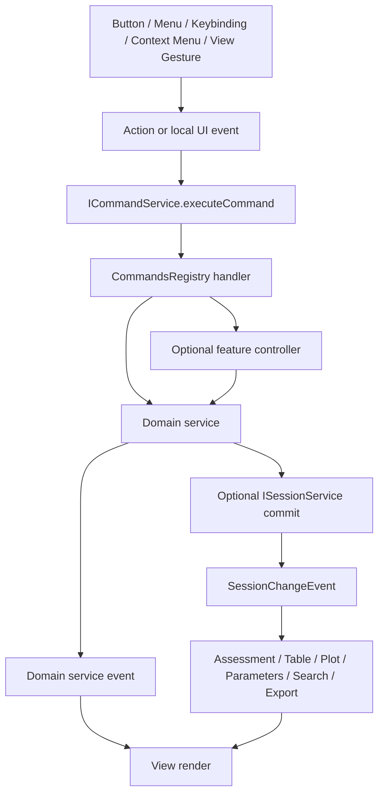
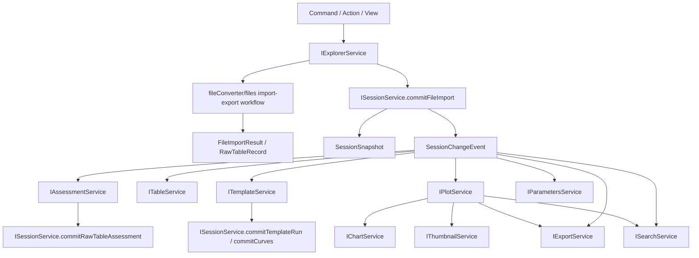
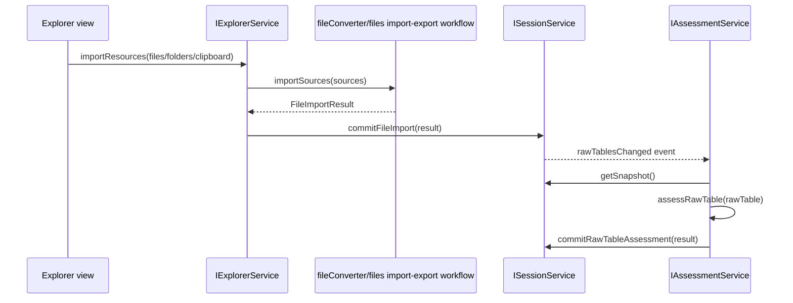
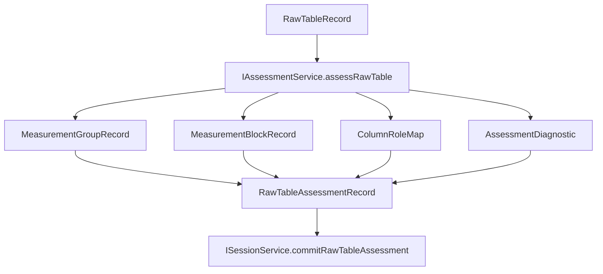
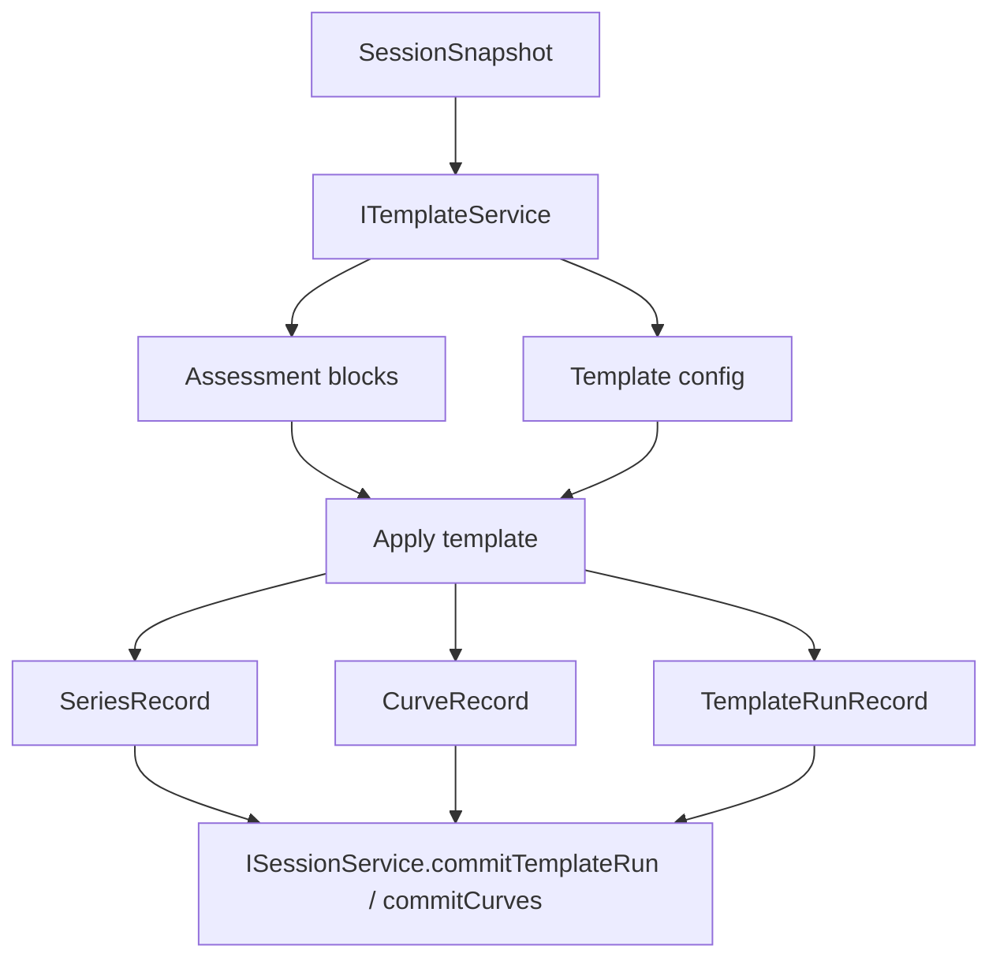
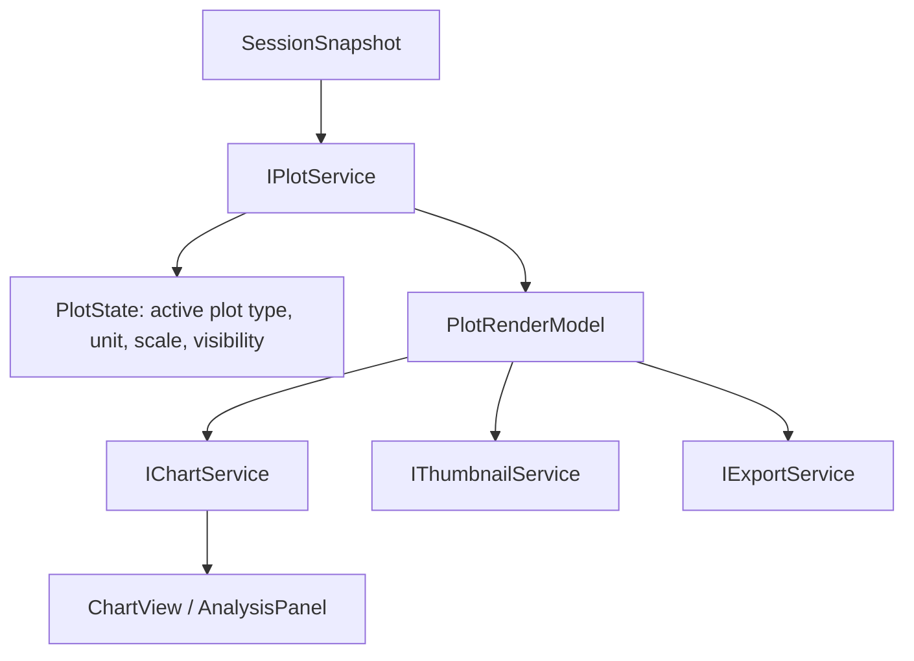
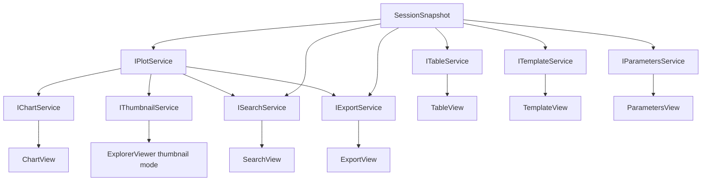

# Conductor Service Architecture

Canonical reference for Conductor Studio service boundaries.

Use this file before adding a new service, moving a record, or wiring a feature through `workbench.ts`. Domain-specific details live in the matching `*.instructions.md` file.


## Record and component documentation rule

Every service document must describe records and state by fields, not just by type names. Use `records.instructions.md` for canonical field definitions and `service-components.instructions.md` for helper naming rules.

Required format for every record/state/model section:

```txt
Type name
  Owner
  Producer
  Consumers
  Canonical or service-local
  Field table
  Invalidation rule
```

A file responsibility table must not stop at `FooManager`. It must say whether the file is a service, controller, store, model, provider, adapter, planner, reader, registry, or cache.

## Layers

Conductor follows the same ordered-layer idea as VS Code:

1. **`base`** — utilities and UI primitives. No workbench service dependency.
2. **`platform`** — process/platform services such as files, dialogs, commands, context keys, storage, instantiation.
3. **`workbench/services`** — cross-feature domain services and canonical service APIs.
4. **`workbench/contrib`** — feature contributions, views, commands, actions, and UI composition.
5. **entry points** — files that import/register contributions and services.

Layer rule:

```txt
contrib -> workbench/services -> platform -> base
```

A lower layer must not import a higher layer. `platform/files/IFileService` must not know Explorer, Session, Plot, or Assessment. `services/session` must not import contrib views. Views consume services; they do not own canonical records.

## Runtime folders

Use runtime folders consistently.

| Folder | Meaning |
| --- | --- |
| `common` | Types, interfaces, records, pure functions. No DOM, no Worker, no Electron. |
| `browser` | DOM, browser workers, browser implementations. |
| `electron-browser` | Renderer-side desktop bridge and Electron IPC integration. |
| `node` | Node-only helpers. |
| `electron-main` | Main process implementation. |

`common` files define the contract. Runtime folders implement the contract.

## Service map

| Service | Canonical owner | Primary input | Primary output | Must not do |
| --- | --- | --- | --- | --- |
| `ICommandService` | `src/cs/platform/commands` | command id + args | command dispatch, command events | domain state, UI rendering, session records |
| `IFileService` | `src/cs/platform/files` | URI / filesystem provider | file bytes, stat, watch events | Explorer UI state, import semantics, raw tables |
| `IExplorerService` | `src/cs/workbench/services/explorer` | user file/folder actions, session snapshot | Explorer model/state, selected resource, import orchestration | filesystem primitives, table parsing, assessment |
| `fileConverter.ts` / files import-export workflow | `src/cs/workbench/services/files` | CSV/Excel/Clipboard source | `FileImportResult`, `RawTableRecord` | Explorer UI state, IV/CV judgement, block detection, session mutation |
| `IAssessmentService` | `src/cs/workbench/services/assessment` | `RawTableRecord` | groups, blocks, column roles, diagnostics | template execution, plotting, UI state |
| `ISessionService` | `src/cs/workbench/services/session` | commit requests | canonical records, snapshot, change events | view state, worker refs, request cache, rendering |
| `ITableService` | `src/cs/workbench/services/table` | session snapshot, raw table refs | table model, row preview, selection/highlight state | block detection, template execution |
| `ITemplateService` | `src/cs/workbench/services/template` | assessment blocks, template config | template records, template run, curves/series commit request | assessment, plotting, table selection ownership |
| `IPlotService` | `src/cs/workbench/services/plot` | session curves/metrics, plot settings | `PlotRenderModel`, plot domains, display series | DOM rendering, chart panel shell |
| `IChartService` | `src/cs/workbench/services/chart` | plot model and chart UI actions | chart shell state, pane layout, render input | raw session interpretation, plot calculation |
| `IThumbnailService` | `src/cs/workbench/services/thumbnail` | plot render model | thumbnail cache/render result | session mutation, independent curve derivation |
| `ISearchService` | `src/cs/workbench/services/search` | session snapshot, optional plot index | search results with source refs | canonical mutation, duplicate assessment |
| `IExportService` | `src/cs/workbench/services/export` | session records, plot models, export options | export plan/payload | chart rendering, assessment, session ownership |
| `IParametersService` | `src/cs/workbench/services/parameters` | metrics, curves, manual inputs | parameter display model, metric input commits | plot rendering, raw parsing |


## Command entry and dispatch

All user-visible operations enter through commands/actions/controllers before reaching services.



Command files are entry points, not state owners. A command handler validates arguments, resolves a service through `ServicesAccessor`, and delegates. It must not mutate the DOM or `SessionModel` directly.

```txt
<feature>Actions.ts
  UI affordance: menu, toolbar, keybinding, context menu.

<feature>Commands.ts
  command id + argument validation + service dispatch.

<feature>Controller.ts
  optional multi-step workflow: dialog, progress, notification, batching.

services/<domain>/browser/<domain>Service.ts
  long-lived state and domain implementation.
```

Use `CommandTarget` as an explicit command argument. Do not reintroduce a global `activeTarget` in session as the universal dispatch target.

Read `commands.instructions.md` before adding command IDs or handlers.

## Data flow at a glance



Key rule: **Plot is the drawing domain consumer. Chart is a host for plot rendering.**

## Canonical session state

`SessionModel` is the in-memory ledger for the current analysis session.

It stores canonical records only:

```ts
export type SessionModel = {
  readonly schemaVersion: 1;
  readonly sessionVersion: number;
  readonly filesById: Record<FileId, FileRecord>;
  readonly fileOrder: readonly FileId[];
};
```

A `FileRecord` owns the lifecycle records for one imported workbook/file:

```ts
export type FileRecord = {
  readonly id: FileId;
  readonly name: string;
  readonly kind: FileKind;

  readonly raw: RawRecord;
  readonly assessmentsByRawTableId: Record<RawTableId, RawTableAssessmentRecord>;

  readonly measurementBlocksById: Record<MeasurementBlockId, MeasurementBlockRecord>;
  readonly measurementBlockOrder: readonly MeasurementBlockId[];

  readonly templateRunsById?: Record<TemplateRunId, TemplateRunRecord>;
  readonly latestTemplateRunId?: TemplateRunId | null;

  readonly seriesById: Record<SeriesId, SeriesRecord>;
  readonly seriesOrder: readonly SeriesId[];

  readonly curvesByKey: Record<CurveKey, CurveRecord>;
  readonly metricsByKey: Record<MetricKey, MetricRecord>;
  readonly metricInputsByKey?: Record<MetricKey, MetricInputRecord>;

  readonly calculationCache?: CalculationCacheRecord;
};
```

Do not put these in `SessionModel`:

- table selection, focused row, scroll offset;
- chart zoom, legend popover, pane visibility;
- template form draft state;
- search query or selected search result;
- export dialog options;
- thumbnail render cache;
- worker refs, request id refs, row caches;
- service lifecycle state.

Use service-specific state for those.

## Active, focus, and selection

Do not create a global `activeTarget` as the owner of every active object.

Use this rule:

```txt
The service that owns the interaction owns the active/focus/selection state.
```

Examples:

| State | Owner |
| --- | --- |
| selected resource in Explorer | `IExplorerService` |
| active table cell/range | `ITableService` |
| active plot type / visible plotted series | `IPlotService` |
| chart detail pane / legend popover | `IChartService` |
| selected parameter row | `IParametersService` |
| search query / selected result | `ISearchService` |
| export selected curves/options | `IExportService` |

Use `CommandTarget` as a command argument, not as global session state.

## Import flow



`IExplorerService` is the Explorer UI-state and import-orchestration service. `fileConverter.ts` / files import-export workflow converts external resources into raw table facts. It does not decide whether the data is IV/CV/CF/PV/IT.

## Assessment flow



Assessment is the only owner of block/group/column role/sweep mode detection.

## Template flow



Template consumes assessment. It does not re-detect table structure.

## Plot and chart flow



Plot builds the render model. Chart hosts UI and renders it.

## Downstream consumption flow



## Session change events

Use specific events. Do not use `Event<void>` for broad invalidation once the new architecture is in place.

```ts
export type SessionChangeEvent =
  | {
      readonly reason: 'rawTablesChanged';
      readonly sessionVersion: number;
      readonly fileIds: readonly FileId[];
      readonly rawTableRefs: readonly RawTableRef[];
    }
  | {
      readonly reason: 'assessmentChanged';
      readonly sessionVersion: number;
      readonly fileIds: readonly FileId[];
      readonly rawTableRefs: readonly RawTableRef[];
      readonly measurementBlockIds: readonly MeasurementBlockId[];
    }
  | {
      readonly reason: 'templateRunChanged';
      readonly sessionVersion: number;
      readonly fileIds: readonly FileId[];
    }
  | {
      readonly reason: 'curvesChanged';
      readonly sessionVersion: number;
      readonly fileIds: readonly FileId[];
      readonly curveKeys: readonly CurveKey[];
    }
  | {
      readonly reason: 'metricsChanged';
      readonly sessionVersion: number;
      readonly fileIds: readonly FileId[];
      readonly metricKeys: readonly MetricKey[];
    };
```

## Recommended file layout

```txt
src/cs/platform/files/
  common/files.ts
  common/io.ts
  browser/webFileSystemAccess.ts
  browser/htmlFileSystemProvider.ts
  electron-browser/fileService.ts

src/cs/workbench/services/explorer/
  common/explorer.ts
  common/explorerModel.ts
  browser/explorerService.ts
  browser/explorer.contribution.ts

src/cs/workbench/services/files/
  common/files.ts
  common/rawTable.ts
  browser/fileImportService.ts
  browser/fileConverter.ts
  browser/fileConverter.worker.ts
  # migration-only legacy: importPipeline.ts / fileConversion.ts / xlsxConversionWorker.ts
  browser/rawTableRowsReader.ts

src/cs/workbench/services/assessment/
  common/assessment.ts
  common/measurement.ts
  common/diagnostics.ts
  browser/assessmentService.ts
  browser/assessmentWasm.ts
  browser/assessment.contribution.ts

src/cs/workbench/services/session/
  common/session.ts
  common/sessionModel.ts
  common/sessionReadModel.ts
  common/sessionEvents.ts
  browser/sessionService.ts

src/cs/workbench/services/table/
  common/table.ts
  browser/tableService.ts
  browser/tableRowsModel.ts
  browser/table.contribution.ts

src/cs/workbench/services/template/
  common/template.ts
  common/templateRun.ts
  browser/templateService.ts
  browser/templateApplyService.ts
  browser/template.contribution.ts

src/cs/workbench/services/plot/
  common/plot.ts
  common/plotModel.ts
  common/plotSettings.ts
  browser/plotService.ts
  browser/plotRenderModel.ts
  browser/plotViewModel.ts
  browser/plot.contribution.ts

src/cs/workbench/services/chart/
  common/chart.ts
  browser/chartService.ts
  browser/chart.contribution.ts

src/cs/workbench/services/thumbnail/
  common/thumbnail.ts
  browser/thumbnailService.ts
  browser/thumbnailBitmap.ts

src/cs/workbench/services/search/
  common/search.ts
  browser/searchService.ts
  browser/searchIndex.ts

src/cs/workbench/services/export/
  common/export.ts
  browser/exportService.ts
  browser/originExportService.ts

src/cs/workbench/services/parameters/
  common/parameters.ts
  browser/parametersService.ts
```


src/cs/workbench/contrib/files/
  browser/explorerCommands.ts        # target name; current migration file may be fileCommands.ts
  browser/explorerActions.ts
  browser/explorer.contribution.ts
  browser/views/explorerView.ts
  browser/views/explorerViewer.ts

src/cs/workbench/contrib/table/
  browser/tableCommands.ts
  browser/tableActions.ts
  browser/table.contribution.ts

src/cs/workbench/contrib/template/
  browser/templateCommands.ts
  browser/templateActions.ts
  browser/template.contribution.ts
  browser/templateApplyController.ts

src/cs/workbench/contrib/plot/
  browser/plotCommands.ts
  browser/plotActions.ts
  browser/plot.contribution.ts

src/cs/workbench/contrib/chart/
  browser/chartCommands.ts
  browser/chartActions.ts
  browser/chart.contribution.ts

src/cs/workbench/contrib/search/
  browser/searchCommands.ts
  browser/searchActions.ts
  browser/search.contribution.ts

src/cs/workbench/contrib/export/
  browser/exportCommands.ts
  browser/exportActions.ts
  browser/export.contribution.ts

src/cs/workbench/contrib/parameters/
  browser/parametersCommands.ts
  browser/parametersActions.ts
  browser/parameters.contribution.ts

Views stay in `contrib/*`. Services own state and domain models.

## Contribution rules

- Each contribution has one `.contribution.ts` entry point.
- Commands/actions live beside the contribution that owns the UI entry.
- Commands call services; commands do not mutate `SessionModel` directly.
- Views render service state; views do not own canonical records.
- Cross-feature dependencies go through `services/*/common/*.ts` interfaces or explicit common models.
- Do not import from another contribution's internal `browser/` files.


## Command ownership rules

- Commands live in `contrib/<feature>/browser/*Commands.ts` because commands are workbench entry points.
- Services expose methods that commands call; services do not register UI commands.
- Actions live in `contrib/<feature>/browser/*Actions.ts` and only invoke command IDs.
- If a command needs dialog/progress/notification orchestration, create a controller beside the contribution.
- The handler must pass explicit targets to services whenever possible.
- If no target is passed, ask the owning service for its own local active/selection state.
- Avoid handlers that call `IViewsService.getViewWithId(...)` to mutate a view. That is acceptable only as a temporary migration bridge.

## Migration order

1. Settle the files capability / Explorer UI boundary while keeping platform `IFileService` and files import conversion as separate lower-level responsibilities.
2. Move raw table records to `services/files/common/rawTable.ts`.
3. Move assessment records and service API to `services/assessment`.
4. Shrink `ISessionService` to snapshot/events/commit methods.
5. Move table/template/chart/parameters/search/export view state into their services.
6. Add `IPlotService` and route chart/thumbnail/export through plot render models.
7. Remove `IAnalysisFileService` after file import, assessment, preview, and template worker boundaries are separated.
8. Add command/action/controller files for each feature and route UI entries through service dispatch.
9. Reduce `Workbench` to layout/view hosting and contribution wiring.

## Learnings

- If a new field describes imported data or analysis output, it probably belongs in a canonical record.
- If a new field describes how a panel looks, it belongs in that panel's service or view.
- If a service needs row bytes, use raw table refs and row readers; do not re-import files.
- If Chart needs data, ask Plot; do not read session curves directly from Chart.
- If Explorer needs filesystem bytes, ask `IFileService`; if it needs import conversion, ask `fileConverter.ts` / files import-export workflow.
