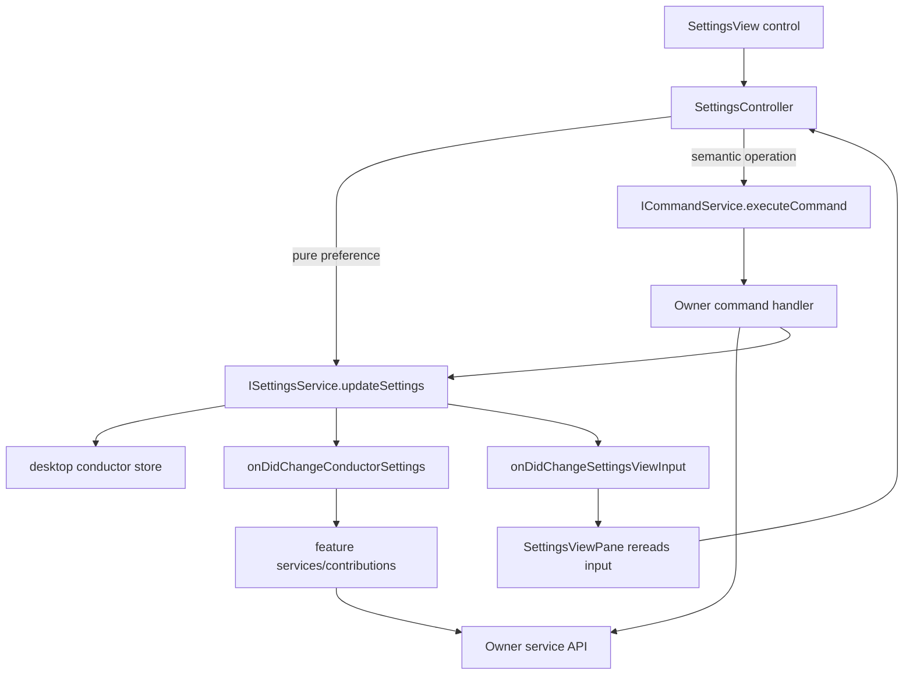

# Settings

Settings is a preferences surface, not the owner of every behavior affected by
a preference. The settings area owns persisted Conductor settings, settings view
input, and form editing state. A feature that owns the resulting behavior owns
the command, service API, and runtime side effect.

## Core flow

Settings changes are facts. Consumers subscribe, reread current settings, and
apply their own state. Do not use settings events as hidden commands where the
settings service tells another feature how to mutate itself.

## File responsibilities

| File | Responsibility | Must not do |
| --- | --- | --- |
| `src/cs/workbench/services/settings/common/settings.ts` | Settings contracts, persisted setting types, settings view input, `ISettingsService`. | Import DOM, desktop bridge implementations, views, or command registrations. |
| `src/cs/workbench/services/settings/browser/settingsService.ts` | Owns the in-memory settings snapshot, settings load/update/merge, service-local view input, and settings events. | Mutate unrelated feature state, render DOM, register commands, or become a generic workflow orchestrator. |
| `src/cs/workbench/services/settings/browser/settingsStore.ts` | Browser-side wrapper around the desktop conductor store bridge. | Normalize domain values, decide UI behavior, or call feature services. |
| `src/cs/workbench/contrib/settings/browser/settingsController.ts` | Owns form drafts, saving flags, validation/normalization at the form edge, feedback, and dispatch from UI intent to settings service or owner commands. | Store canonical analysis data, mutate feature services directly when an owner command exists, or put DOM construction here. |
| `src/cs/workbench/contrib/settings/browser/settingsView.ts` | Pure DOM rendering for settings controls. Calls callbacks supplied by the controller. | Inject services, persist settings, execute commands, or decide cross-feature behavior. |
| `src/cs/workbench/contrib/settings/browser/settingsViewPane.ts` | View pane shell, DI, controller lifecycle, subscription to settings view input changes. | Own form drafts, normalize setting values, or call feature-specific services. |
| `src/cs/workbench/contrib/settings/browser/settings.contribution.ts` | Registers the settings view and contribution entry. | Become a settings controller or business workflow. |

## Direct update vs command

Use `ISettingsService.updateSettings(...)` directly when the user intent is only
"persist this preference" and the controller can normalize the value locally.
Examples: file-name separator defaults, Origin default plot fields, cleanup
retention preferences, chart default scale/font settings, or other passive
defaults read by owner services later.

Use an owner command when the settings control represents a semantic operation
owned by another capability, even if that operation also persists a setting.
Examples:

- Theme mode, workbench background, and transparent chrome go through
  `ThemeCommandId.*`.
- Layout reset, sidebar visibility, or workbench layout state go through
  `WorkbenchLayoutCommandId.*`.
- Language changes and update checks go through workbench command ids because
  they may reload the shell or call desktop update APIs.
- Export, Origin execution, table/chart/search/plot actions go through the
  owning feature command or owner service API.

Do not add one command per raw settings field. Also do not add a generic
`settings.update(key, value)` command; it hides ownership and weakens
validation. Commands should express semantic user intent. Plain persisted
preferences can stay as settings service updates.

## Side effects

`ISettingsService` publishes changed settings; it should not directly mutate
theme, layout, chart, plot, template, session, or Explorer state. The owning
feature subscribes to `onDidChangeConductorSettings`, rereads
`getConductorSettings()`, and applies the relevant fields through its own
service/model.

Do not add callback slots to `SettingsServiceOptions` for applying settings to
another service. `SettingsServiceOptions` may carry static view-input context
such as app update availability, shell kind, current language fallback, and
current theme fallback.

## View input

`SettingsViewInput` and `OriginSettingsViewInput` are service-local snapshots.
Their change events should stay `Event<void>`; listeners reread the latest
snapshot through `getSettingsViewInput()` or `getOriginSettingsViewInput()`.
Do not pass mutable settings objects, service methods, or owner behavior through
view input records.

`SettingsController` may pass local callbacks to `SettingsView`. Those callbacks
are form entry points only: they normalize UI values, manage draft/saving state,
and then call `ISettingsService` or an owner command.

## Adding a setting

Before adding a persisted setting:

1. Identify the owner of the behavior affected by the setting.
2. Decide whether the settings control is a pure persisted preference or an
   owner-owned semantic operation.
3. Add the field to `ConductorSettings` and the conductor store schema/defaults
   when it is persisted through desktop config.
4. Put normalization near the owner or in a shared common helper already owned
   by that domain. The settings controller can call that helper at the form
   edge.
5. Add the field to settings view input/rendering only if the settings UI needs
   it.
6. Add focused tests around the owner contract: settings service persistence for
   passive fields, command dispatch for semantic operations, and subscriber
   behavior for settings-driven side effects.
