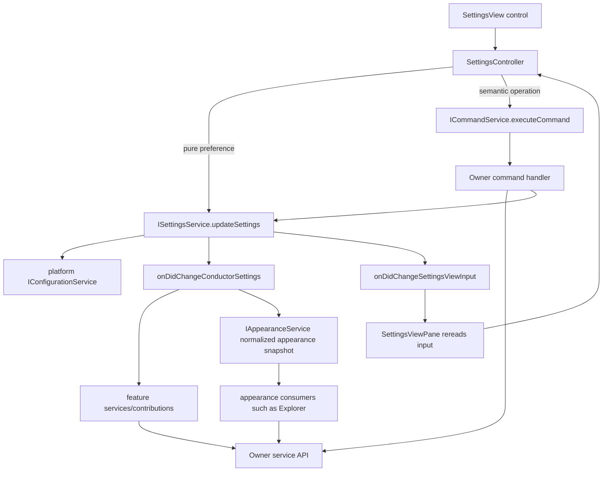

# Settings

Settings is a preferences surface, not the owner of every behavior affected by
a preference. The settings area owns the in-memory Conductor settings snapshot,
settings view input, and form editing state. Renderer settings persistence goes
through the platform `IConfigurationService`, following the upstream user
configuration path. Electron main reads the same user settings file only for
bootstrap/native-process needs. A feature that owns the resulting behavior owns
the command, service API, and runtime side effect.

## Core flow

Settings changes are facts. Consumers subscribe, reread current settings, and
apply their own state. Do not use settings events as hidden commands where the
settings service tells another feature how to mutate itself.

## Configuration vs storage

Follow the upstream VS Code boundary: configuration is not "everything that is
persisted", and storage is not "temporary only". Both may persist across
restarts. The distinction is what the value means and who should understand it.

Use platform configuration for user preferences:

- Values a user can reasonably understand, edit, or expect in Settings UI /
  `User/settings.json`.
- Values that need schema, defaults, configuration scopes, inspection, or
  future Settings Sync / workspace / language override behavior.
- Passive defaults consumed by feature owners later.

Examples: `theme`, `language`, `backgroundColor`, `transparentChrome`,
`windowCloseBehavior`, `originExePath`, Origin export and plot defaults,
calculation defaults, chart axis defaults, file-name separator defaults, and
default scale preferences.

Use platform storage for app state:

- Values the app remembers for itself but users should not configure by hand.
- View, layout, prompt, onboarding, cache, recent, migration, and one-shot
  marker state.
- Values whose owner is a runtime service or UI component rather than the
  Settings surface.

Examples: `trayMinimizeHintShown`, onboarding completion or dismissal markers,
last selected template ids, view widths, collapsed/expanded state, recent
resources, cache versions, and migration markers.

If a value looks like a setting only because it is persisted, stop and name the
owner first. A user preference belongs to `IConfigurationService`; remembered
application state belongs to `IStorageService`. Electron main may read user
configuration for bootstrap/native-process needs, but it should not introduce a
parallel settings store.

## File responsibilities

| File | Responsibility | Must not do |
| --- | --- | --- |
| `src/cs/workbench/services/settings/common/settings.ts` | Settings contracts, persisted setting types, settings view input, `ISettingsService`. | Import DOM, desktop bridge implementations, views, or command registrations. |
| `src/cs/workbench/services/settings/browser/settingsService.ts` | Owns the in-memory settings snapshot, settings load/update/merge, service-local view input, and settings events; consumes `IConfigurationService` for persisted user configuration. | Mutate unrelated feature state, render DOM, register commands, or become a generic workflow orchestrator. |
| `src/cs/platform/configuration/common/configurationRegistry.ts` | Upstream-shaped configuration registry plus Conductor configuration schema, defaults, setting keys, and normalization helpers used by settings consumers and desktop bootstrap. | Persist templates, render UI, own feature side effects, or define a parallel workbench configuration service outside `IConfigurationService`. |
| `src/cs/platform/configuration/common/configurationModels.ts` | Upstream-shaped configuration model/parser/merge/inspect primitives used to turn registered defaults and user JSON into configuration data. | Define Conductor feature semantics, own settings UI state, or bypass the registry. |
| `src/cs/platform/configuration/common/configurationService.ts` | Upstream-shaped `IConfigurationService` implementation that reads registered defaults, optionally reads/writes a user settings resource through `IFileService`, updates target models, and emits configuration changes. | Store app-state markers, own Settings form state, define feature settings, or bypass target models. |
| `src/cs/code/electron-main/app.ts` main configuration setup | Electron main creates and initializes the platform `ConfigurationService` with `User/settings.json` before native/window/bootstrap consumers read settings. | Introduce a parallel settings store, write settings through raw `fs`, or put main-process bootstrap helpers under workbench renderer services. |
| `src/cs/workbench/services/configuration/common/configuration.ts` | Workbench configuration constants, shared cache contracts, restricted-settings shape, and the upstream-shaped `IWorkbenchConfigurationService` refined service id. | Define Conductor feature settings, implement configuration loading, or claim remote/workspace/profile behavior beyond the current no-op contract. |
| `src/cs/workbench/services/configuration/browser/configuration.ts` | Upstream-shaped browser configuration helpers such as `UserConfiguration`; owns reading, parsing, and writing workbench configuration files through `IFileService`. | Register `IConfigurationService`, import Electron main APIs, own Settings form state, or store app-state markers. |
| `src/cs/workbench/services/configuration/browser/configurationService.ts` | Workbench browser registration for `IConfigurationService` using the platform common configuration primitives. | Import Electron/native host services, store app-state markers, or own Settings form state. |
| `src/cs/workbench/services/configuration/electron-browser/configurationService.ts` | Desktop renderer workbench `IConfigurationService` implementation that resolves `User/settings.json` through `INativeHostService`, reads/writes it through `IFileService`, and updates the user configuration model. | Become an Electron main bootstrap store, persist app-state markers, or route settings UI behavior directly to unrelated feature services. |
| `src/cs/base/common/platform.ts` display language helpers | Base runtime platform language values and Conductor-supported display-language normalization helpers, following upstream's `base/common/platform.ts` placement for UI language state. | Own locale persistence, register language-pack services, or introduce a separate language platform service. |
| `src/cs/platform/languagePacks/common/languagePacks.ts` | Upstream-shaped language pack service contract and shared item builder for display-language quick-pick entries. | Persist locale preferences, own workbench reload behavior, or depend on workbench settings services. |
| `src/cs/platform/languagePacks/browser/languagePacks.ts` | Browser/workbench language pack service registration; currently exposes Conductor built-in languages because no extension gallery pipeline exists. | Register localization commands, write configuration, or pretend extension language packs are installed. |
| `src/cs/platform/languagePacks/node/languagePacks.ts` | Node-side native language pack service class with the same upstream responsibility name, ready for future extension-backed language pack cache work. | Register renderer services, persist locale preferences, or bypass the platform language pack contract. |
| `src/cs/platform/theme/electron-main/themeMainService.ts` | Main-process theme service contract, following upstream `IThemeMainService` shape; exposes native theme/window appearance state derived from configuration. | Persist settings, render workbench DOM, or define workbench theme schema. |
| `src/cs/platform/theme/electron-main/themeMainServiceImpl.ts` | Main-process theme owner that consumes `IConfigurationService`, syncs Electron `nativeTheme`, normalizes desktop window appearance, and emits native color-scheme changes. | Read raw settings files, mutate Settings service state, or own tray/window lifecycle behavior. |
| `src/cs/platform/windows/electron-main/trayMainService.ts` | Main-process tray/window-close service contract for Conductor-specific tray behavior, close-to-tray policy, and quit state. | Render workbench UI, define settings schema, or own generic window styling. |
| `src/cs/platform/windows/electron-main/trayMainServiceImpl.ts` | Main-process tray owner that consumes `IConfigurationService` for `windowCloseBehavior`, consumes `IStorageService` for one-shot tray hints, creates/updates the tray menu, and handles Windows/macOS close-to-tray semantics. | Read raw settings files, bypass configuration/storage services, own updater implementation, or grow into a full VS Code `WindowsMainService` replacement. |
| `src/cs/platform/origin/electron-main/originMainService.ts` | Main-process Origin service contract for configuration-backed Origin executable path, runtime cleanup policy, and plot defaults. | Register IPC handlers, open dialogs, run Origin jobs, or define renderer settings UI. |
| `src/cs/platform/origin/electron-main/originMainServiceImpl.ts` | Main-process Origin settings owner that consumes `IConfigurationService` for Origin preferences and writes `originExePath` through configuration targets. | Read raw settings files, depend on workbench settings service, register IPC handlers, or run Origin worker jobs. |
| `src/cs/platform/origin/electron-main/originMainHandlers.ts` | Origin IPC handler registration and workflow entry; delegates configuration-backed settings reads/writes to `IOriginMainService`, then performs detection, picker, health check, CSV run, and cleanup orchestration. | Own persistent Origin settings, bypass `IOriginMainService` for configuration values, or become a generic settings adapter. |
| `src/cs/workbench/services/localization/common/locale.ts` | Workbench localization service contracts, following upstream `ILocaleService` / `IActiveLanguagePackService` ownership names. | Persist raw settings, own main-process NLS bootstrap, or imply the full upstream language-pack system exists before it is implemented. |
| `src/cs/workbench/services/localization/browser/localeService.ts` | Workbench browser localization owner that applies the Conductor language preference through `ISettingsService` and reloads the shell; current active-language-pack service is a no-op because Conductor has no language-pack extension pipeline. | Register UI commands, read or write raw configuration files, or own Electron main language resolution. |
| `src/cs/workbench/contrib/localization/common/localizationsActions.ts` | Localization command/action registration; validates command arguments and delegates display-language changes to `ILocaleService`. | Persist settings directly, reload the shell directly, or mutate Settings UI state. |
| `src/cs/workbench/contrib/localization/common/localization.contribution.ts` | Shared localization contribution wiring for command/action registration, mirroring upstream's base localization contribution shape. | Implement locale persistence or browser/native reload behavior. |
| `src/cs/workbench/contrib/localization/browser/localization.contribution.ts` | Browser workbench contribution registration for localization. | Become the localization service or register unrelated settings commands. |
| `src/cs/platform/storage/common/storage.ts` | Upstream-shaped storage contract for remembered application state, scoped by application/profile/workspace and target. | Store user preferences that belong in configuration, define feature-specific state semantics, or become a settings schema. |
| `src/cs/platform/storage/electron-main/storageMainService.ts` | Electron main implementation of platform storage for native-process state and markers. | Persist user settings, templates, or renderer configuration updates. |
| `src/cs/workbench/contrib/settings/browser/settingsController.ts` | Owns form drafts, saving flags, validation/normalization at the form edge, feedback, and dispatch from UI intent to settings service or owner commands. | Store canonical analysis data, mutate feature services directly when an owner command exists, or put DOM construction here. |
| `src/cs/workbench/contrib/settings/browser/settingsView.ts` | Pure DOM rendering for settings controls. Calls callbacks supplied by the controller. | Inject services, persist settings, execute commands, or decide cross-feature behavior. |
| `src/cs/workbench/contrib/settings/browser/settingsViewPane.ts` | View pane shell, DI, controller lifecycle, subscription to settings view input changes. | Own form drafts, normalize setting values, or call feature-specific services. |
| `src/cs/workbench/contrib/settings/browser/settings.contribution.ts` | Registers the settings view and contribution entry. | Become a settings controller or business workflow. |

## Direct update vs command

Use `ISettingsService.updateSettings(...)` directly when the user intent is only
"persist this preference" and the controller can normalize the value locally.
Examples: file-name separator defaults, Origin default plot fields, cleanup
retention preferences, chart default scale/font settings, or other passive
defaults read by owner services later.

Use an owner command when the settings control represents a semantic operation
owned by another capability, even if that operation also persists a setting.
Examples:

- Theme mode, workbench background, and transparent chrome go through
  `ThemeCommandId.*`.
- Layout reset, sidebar visibility, or workbench layout state go through
  `WorkbenchLayoutCommandId.*`.
- Language changes and update checks go through workbench command ids because
  they may reload the shell or call desktop update APIs.
- Export, Origin execution, table/chart/search/plot actions go through the
  owning feature command or owner service API.

Do not add one command per raw settings field. Also do not add a generic
`settings.update(key, value)` command; it hides ownership and weakens
validation. Commands should express semantic user intent. Plain persisted
preferences can stay as settings service updates.

## Side effects

`ISettingsService` publishes changed settings; it should not directly mutate
theme, layout, chart, plot, template, session, or Explorer state. The owning
feature subscribes to `onDidChangeConductorSettings`, rereads
`getConductorSettings()`, and applies the relevant fields through its own
service/model.

For product appearance preferences that are shared as a normalized UI snapshot,
`IAppearanceService` may subscribe to `onDidChangeConductorSettings`, reread
settings, and publish `onDidChangeAppearance`. Appearance consumers then reread
`IAppearanceService.getAppearance()` and apply their own DOM or model state.

Do not add callback slots to `SettingsServiceOptions` for applying settings to
another service. `SettingsServiceOptions` may carry static view-input context
such as app update availability, shell kind, current language fallback, and
current theme fallback.

## View input

`SettingsViewInput` and `OriginSettingsViewInput` are service-local snapshots.
Their change events should stay `Event<void>`; listeners reread the latest
snapshot through `getSettingsViewInput()` or `getOriginSettingsViewInput()`.
Do not pass mutable settings objects, service methods, or owner behavior through
view input records.

`SettingsController` may pass local callbacks to `SettingsView`. Those callbacks
are form entry points only: they normalize UI values, manage draft/saving state,
and then call `ISettingsService` or an owner command.

## Adding a setting

Before adding a persisted setting:

1. Identify the owner of the behavior affected by the setting.
2. Decide whether the settings control is a pure persisted preference or an
   owner-owned semantic operation.
3. Add the field to `ConductorSettings` and the configuration defaults /
   normalization when it is persisted through user configuration.
4. Put normalization near the owner or in a shared common helper already owned
   by that domain. The settings controller can call that helper at the form
   edge.
5. Add the field to settings view input/rendering only if the settings UI needs
   it.
6. Add focused tests around the owner contract: settings service persistence for
   passive fields, command dispatch for semantic operations, and subscriber
   behavior for settings-driven side effects.
