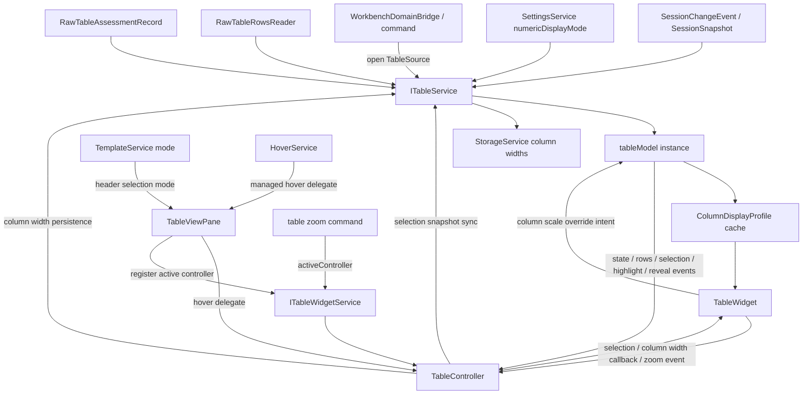

# Table

Table shows raw tables and assessment block ranges. It does not identify measurement structure.

## Ownership

`ITableService` owns:

- current table source;
- externally visible table selection snapshot used by commands and copy workflows;
- selected table text generation from the current selection snapshot;
- focus/reveal cell state;
- highlighted columns/ranges;
- table column width persistence;
- column-level display profiles for settings-driven numeric table presentation;
- paged raw rows cache;
- block table preview model;
- table loading status;
- row request lifecycle and worker lifecycle.
- preview invalidation when the selected table source changes.

It consumes:

- session change events and session snapshot for raw table metadata and assessment ranges;
- file import/raw table row reader for row bytes;
- assessment result for block ranges and column role display.
- `TableSource` open intent from commands, search, or `WorkbenchDomainBridge`.
- settings changes for visual-only table display preferences.

It does not own:

- raw table import;
- assessment;
- template execution;
- plot or chart model;
- session canonical records.

## Core files

| File | Responsibility |
| --- | --- |
| `src/cs/workbench/services/table/common/table.ts` | Defines `ITableService`, `ITableRowsReaderService`, table service constants, pure table records/model contracts, and source key helpers. It must stay a small contract surface: avoid named exports for subordinate model details that callers can derive from `TableState` or `TableModel`. |
| `src/cs/workbench/services/table/common/tableColumnLayout.ts` | Defines table column width policy and storage serialization helpers shared by `ITableService` persistence and `TableWidget` layout math. No service access or DOM. |
| `src/cs/workbench/services/table/common/tableDisplayProfile.ts` | Defines table display profile contracts such as `NumericDisplayMode` and `ColumnDisplayProfile`. Derived display profiles are service/view state, not session records. |
| `src/cs/workbench/services/table/common/numericFormat.ts` | Pure numeric parsing, engineering-scale selection, suffix formatting, and profile-based cell formatting helpers. No service access or DOM. |
| `src/cs/workbench/services/table/browser/tableService.ts` | Injectable `ITableService` owner. Handles table source, reveal, copy text generation, view input publication, selection snapshots, and column width persistence. It does not own widget-only UI controls such as zoom or live resize gestures. |
| `src/cs/workbench/services/table/browser/tableModel.ts` | Creates and owns the per-table service model: source switching, preview loading, row cache activation, cell-read conversion, selection normalization/equality, selection/highlight/reveal snapshots, row-cache versioning, and worker/reader request lifecycle. This is the owner file for table data-plane helpers; do not split row cache, cell-read, or selection-state helpers into separate production files unless they become an independent service boundary. |
| `src/cs/workbench/services/table/browser/tableDropTargetService.ts` | Browser-only registry for the table preview DOM drop target used by cross-feature drop controllers. No table data state. |
| `src/cs/workbench/services/table/browser/tableRowsReaderService.ts` | Browser table rows reader fallback. It can read normalized CSV through the file converter reader and reports desktop table source operations as unavailable. |
| `src/cs/workbench/services/table/browser/tablePreviewWorker.ts` | Optional browser worker for CSV row paging and cell fetches. |
| `src/cs/workbench/services/table/electron-browser/tableRowsReader.ts` | Desktop table rows reader. Opens table preview sources, reads row/cell ranges through Rust IPC/preload, and releases opened table preview sources during shutdown. |
| `src/cs/workbench/contrib/table/common/table.ts` | Defines table contribution/view/command IDs owned by the table contribution layer. Services must not import these IDs. |
| `src/cs/workbench/contrib/table/browser/tableWidget.ts` | Browser table grid widget. Owns grid DOM, virtual scroll rendering, local keyboard/mouse/wheel gestures, selection API, zoom state/API, live column resize UI, scroll reveal behavior, and DOM-free grid math helpers. It receives pure model/state input and callback props, and does not import table services, storage services, or command services. |
| `src/cs/workbench/contrib/table/browser/tableController.ts` | Feature controller/adapter. Converts table view input and callback props into `TableWidget` props. No service ownership, grid DOM ownership, or table data ownership. |
| `src/cs/workbench/contrib/table/browser/tableWidgetService.ts` | Contrib-owned registry service for the active table widget controller. Mirrors upstream list/editor command dispatch shape: views register controllers, commands resolve the active controller through DI. No table data ownership. |
| `src/cs/workbench/contrib/table/browser/tableCommands.ts` | Defines table command entries and handlers. Data/selection/copy commands delegate to `ITableService`; zoom commands resolve `ITableWidgetService.activeController` and delegate to the widget/controller API. No action/menu registration or long-lived command state. |
| `src/cs/workbench/contrib/table/browser/tableActions.ts` | Registers table `Action2` entries, command palette metadata, and action-backed command IDs from the table command definitions. No domain behavior. |
| `src/cs/workbench/contrib/table/browser/table.contribution.ts` | Registers table view and table actions. |

## Flow



## Selection rule

Selection belongs to the active `TableWidget` interaction surface and is synced
to `ITableService` as an externally visible snapshot for commands, copy, and
cross-feature reveal. It does not belong to Session.

```ts
export type TableSelection = {
  readonly activeCell?: TableCell | null;
  readonly selectedColumns?: readonly number[];
  readonly ranges?: readonly TableRange[];
};
```

Other services can request reveal/highlight through `ITableService`, not by mutating session or widget DOM.

Follow the upstream owner-driven selection shape. A table cell, range, or column
set is a pure target/ref. It must not expose `select()` or `reveal()` methods
and must not know about services or views.

Preferred shape:

```ts
tableWidget.select(target, reveal?);
tableWidget.zoomIn();
tableWidget.zoomOut();
tableWidget.resetZoom();
tableService.open(source);
tableService.select(target, reveal?); // command/external snapshot path
tableService.reveal(target, options?);
tableModel.setSelection(selection);
tableModel.revealCell(cell);
```

Where command-facing targets are pure records:

```ts
export type TableSelectionTarget =
  | { readonly kind: "cell"; readonly cell: TableCell | null }
  | { readonly kind: "range"; readonly range: TableRange }
  | { readonly kind: "columns"; readonly columns: readonly number[] };
```

Do not use:

```ts
tableCell.select();
tableRange.reveal();
```

The active table widget validates table-local gestures, applies table selection
intent through its public API, and emits snapshot callbacks. `ITableService`
stores the externally visible selection snapshot so commands such as copy can
read it without importing widget code. Table commands and external reveal paths
may still dispatch to `ITableService` when there is no direct widget context.

## Command entry and dispatch

Table commands own table interactions, not raw parsing.

Recommended files:

| File | Responsibility |
| --- | --- |
| `src/cs/workbench/contrib/table/browser/tableWidgetService.ts` | Registers table widget controllers and exposes the active controller to command handlers. |
| `src/cs/workbench/contrib/table/browser/tableCommands.ts` | Defines public table command entries and handlers. Data/selection/copy commands delegate to `ITableService`; zoom commands resolve `ITableWidgetService.activeController`. |
| `src/cs/workbench/contrib/table/browser/tableActions.ts` | Registers public table actions and command palette entries from table command definitions. |
| `src/cs/workbench/contrib/table/browser/tableWidget.ts` | Handles table-local keyboard, mouse, wheel, selection, zoom, and column width interactions through its public widget API and callback props. |
| `src/cs/workbench/services/table/browser/tableService.ts` | Owns table state and row preview. No command registration. |

Command flow:

```txt
table.revealRawRange command
  -> normalize RawTableRangeRef
  -> ITableService.reveal(target) or ITableService.select(target, reveal?)
  -> ITableService event
  -> TableController/TableWidget render

table.zoomIn command
  -> ITableWidgetService.activeController
  -> active TableController.zoomIn()
  -> TableWidget zoom state/event
  -> TableViewPane header zoom control update
```

Search result navigation may dispatch to table commands when the result points to `RawTableRangeRef`.

Open/session flow:

```ts
tableService.open({ fileId, sheetId });
```

Do not name the table input after another feature's selection state.
`WorkbenchDomainBridge` may derive a `TableSource` from Explorer/session state
by subscribing to source owner events and rereading owner public state, but
`ITableService` consumes session snapshots itself and owns its own preview
lifecycle. External callers do not pass raw files or table rows into the table
service; they only pass the pure source target they want table to open.
This follows the cross-service selection mirroring rule in
`architecture.instructions.md`: bridge by translating domain input, not by
sharing selection state or calling another service's internals.

The table view pane subscribes to `ITableService.onDidChangeTableViewInput` and then
rereads `ITableService.getViewInput()`. Do not use the event payload as the
table view input data path.

## Do not

- Do not detect headers or block boundaries in table code.
- Do not apply templates from table code.
- Do not put table row caches or worker refs in session.
- Do not call chart/plot directly from table selection logic. Use commands or explicit service APIs.


## Field catalog

Use `records.instructions.md` for shared table state fields such as
`TableState` and `TableSource`. Selection is table state, not session canonical
data.
