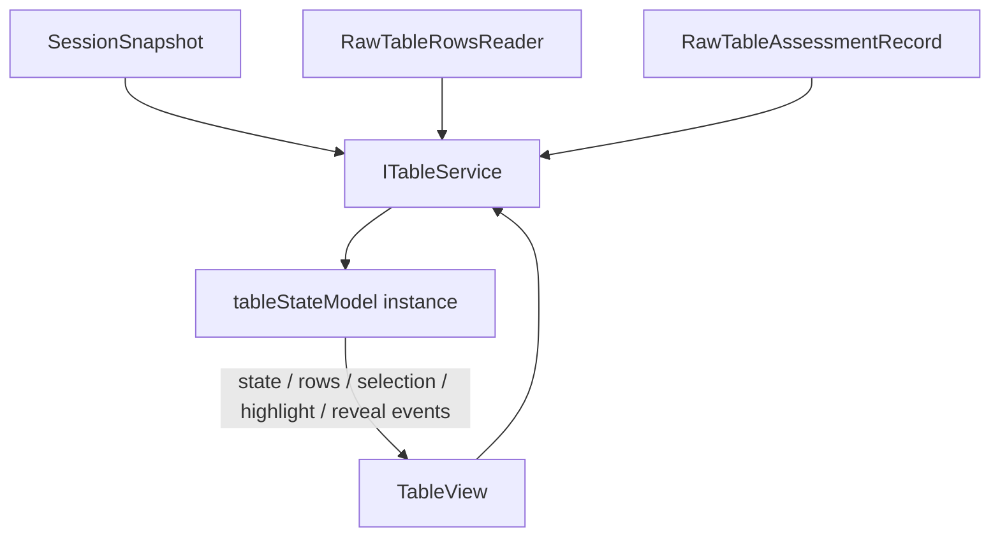

# Table

Table shows raw tables and assessment block ranges. It does not identify measurement structure.

## Ownership

`ITableService` owns:

- current table source;
- active cell/range selection;
- selected table text generation for copy workflows;
- focus/reveal cell state;
- highlighted columns/ranges;
- persisted column view configuration such as column widths;
- paged raw rows cache;
- block table preview model;
- table loading status;
- row request lifecycle and worker lifecycle.
- preview invalidation when the selected table source changes.

It consumes:

- session snapshot for raw table metadata and assessment ranges;
- file import/raw table row reader for row bytes;
- assessment result for block ranges and column role display.
- current `TableSource` input from `WorkbenchDomainBridge`.

It does not own:

- raw table import;
- assessment;
- template execution;
- plot or chart model;
- session canonical records.

## Core files

| File | Responsibility |
| --- | --- |
| `src/cs/workbench/services/table/common/table.ts` | Defines `ITableService`, `ITableRowsReaderService`, table command/service constants, table rows reader contracts, and compatibility re-exports for table common records. |
| `src/cs/workbench/services/table/common/tableColumnLayout.ts` | Defines the shared column width layout contract used by the table service and grid view math. |
| `src/cs/workbench/services/table/common/tableContracts.ts` | Defines pure table records and model/view-input contracts such as `TableState`, `TableSelection`, `TableHighlight`, `TableSource`, copy text results, column widths, and row request types. |
| `src/cs/workbench/services/table/common/tableSource.ts` | Defines table source key helpers shared by table state and persistence. |
| `src/cs/workbench/services/table/browser/tableService.ts` | Injectable `ITableService` owner. Handles service selection/reveal/copy commands, view input publication, and persisted column width storage. |
| `src/cs/workbench/services/table/browser/tableStateModel.ts` | Creates and owns the per-table state model: source switching, preview loading, row cache activation, selection/highlight/reveal events, zoom state, and worker/reader request lifecycle. |
| `src/cs/workbench/services/table/browser/tableDropTargetService.ts` | Browser-only registry for the table preview DOM drop target used by cross-feature drop controllers. No table data state. |
| `src/cs/workbench/services/table/browser/tableRowCache.ts` | Row chunking, row-cache merge/prune, loaded range calculation, and row-cache version notifications. |
| `src/cs/workbench/services/table/browser/tableCellRead.ts` | Converts table cell-read payloads into cached row arrays. |
| `src/cs/workbench/services/table/browser/tableRowsReaderService.ts` | Browser table rows reader fallback. It can read normalized CSV through the file converter reader and reports desktop table source operations as unavailable. |
| `src/cs/workbench/services/table/browser/tablePreviewWorker.ts` | Optional browser worker for CSV row paging and cell fetches. |
| `src/cs/workbench/services/table/electron-browser/tableRowsReader.ts` | Desktop table rows reader. Opens table preview sources, reads row/cell ranges through Rust IPC/preload, and releases opened table preview sources during shutdown. |
| `src/cs/workbench/contrib/table/browser/tableGridModel.ts` | DOM-free grid view math and local layout helpers such as viewport render ranges, keyboard navigation targets, resize targets/guides, virtual spacer heights, spreadsheet labels, zoom scale, and column width constraints. |
| `src/cs/workbench/contrib/table/browser/tableView.ts` | DOM view. Renders `TableState`/rows and forwards user actions. |
| `src/cs/workbench/contrib/table/browser/table.contribution.ts` | Registers table view and UI actions. |

## Flow



## Selection rule

Selection belongs to Table, not Session.

```ts
export type TableSelection = {
  readonly activeCell?: TableCell | null;
  readonly selectedColumns?: readonly number[];
  readonly ranges?: readonly TableRange[];
};
```

Other services can request reveal/highlight through `ITableService`, not by mutating session.

Follow the upstream owner-driven selection shape. A table cell, range, or column
set is a pure target/ref. It must not expose `select()` or `reveal()` methods
and must not know about services or views.

Preferred shape:

```ts
tableService.select(target, reveal?);
tableService.reveal(target, options?);
tableModel.setSelection(selection);
tableModel.revealCell(cell);
```

Where command-facing targets are pure records:

```ts
export type TableSelectionTarget =
  | { readonly kind: "cell"; readonly cell: TableCell | null }
  | { readonly kind: "range"; readonly range: TableRange }
  | { readonly kind: "columns"; readonly columns: readonly number[] };
```

Do not use:

```ts
tableCell.select();
tableRange.reveal();
```

The Table owner validates and normalizes targets, mutates table selection or
reveal state, emits table selection/state events, and views rerender from the
current table state model. Table commands and view gestures should normalize raw input
into table targets and dispatch to `ITableService`/the active table state model; they should
not mutate DOM selection as the source of truth.

## Command entry and dispatch

Table commands own table interactions, not raw parsing.

Recommended files:

| File | Responsibility |
| --- | --- |
| `src/cs/workbench/contrib/table/browser/tableCommands.ts` | Registers reveal cell/range, copy, select, clear selection, focus table commands. |
| `src/cs/workbench/contrib/table/browser/tableActions.ts` | Menu/toolbar/keybinding/context-menu entries for table commands. |
| `src/cs/workbench/services/table/browser/tableService.ts` | Owns table state and row preview. No command registration. |

Command flow:

```txt
table.revealRawRange command
  -> normalize RawTableRangeRef
  -> ITableService.reveal(target) or ITableService.select(target, reveal?)
  -> ITableService event
  -> TableView render
```

Search result navigation may dispatch to table commands when the result points to `RawTableRangeRef`.

Input flow:

```ts
tableService.update({
  rawFiles,
  source: { fileId, sheetId },
});
```

Do not name the table input after another feature's selection state.
`WorkbenchDomainBridge` may derive a `TableSource` from Explorer/session state
by subscribing to source owner events and rereading owner public state, but
`ITableService` consumes table source input and owns its own preview lifecycle.
This follows the cross-service selection mirroring rule in
`architecture.instructions.md`: bridge by translating domain input, not by
sharing selection state or calling another service's internals.

The table view subscribes to `ITableService.onDidChangeTableViewInput` and then
rereads `ITableService.getViewInput()`. Do not use the event payload as the
table view input data path.

## Do not

- Do not detect headers or block boundaries in table code.
- Do not apply templates from table code.
- Do not put table row caches or worker refs in session.
- Do not call chart/plot directly from table selection logic. Use commands or explicit service APIs.


## Field catalog

Use `records.instructions.md` for shared table state fields such as
`TableState` and `TableSource`. Selection is table state, not session canonical
data.
