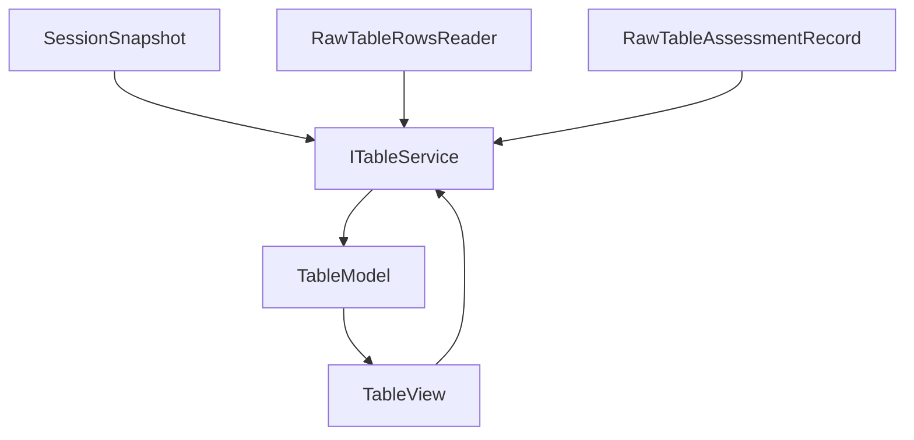

# Table

Table shows raw tables and assessment block ranges. It does not identify measurement structure.

## Ownership

`ITableService` owns:

- current table source;
- active cell/range selection;
- focus/reveal cell state;
- highlighted columns/ranges;
- paged raw rows cache;
- block table preview model;
- table loading status;
- row request lifecycle and worker lifecycle.

It consumes:

- session snapshot for raw table metadata and assessment ranges;
- file import/raw table row reader for row bytes;
- assessment result for block ranges and column role display.

It does not own:

- raw table import;
- assessment;
- template execution;
- plot or chart model;
- session canonical records.

## Core files

| File | Responsibility |
| --- | --- |
| `src/cs/workbench/services/table/common/table.ts` | Defines `ITableService`, `TableState`, `TableSelection`, `TableHighlight`, `TableSource`, row request types. |
| `src/cs/workbench/services/table/common/tableModel.ts` | Pure table display model types: raw table view, block table view, column display metadata. |
| `src/cs/workbench/services/table/browser/tableService.ts` | Owns table state, row caches, selection events, row paging, and table source switching. |
| `src/cs/workbench/services/table/browser/tableRowsModel.ts` | Chunking, row cache merge/prune, loaded range calculation. |
| `src/cs/workbench/services/table/browser/tableRowsWorker.ts` | Optional worker for CSV row paging and cell fetches. |
| `src/cs/workbench/services/table/browser/table.contribution.ts` | Registers service and session subscription if required. |
| `src/cs/workbench/contrib/table/browser/tableView.ts` | DOM view. Renders `TableState`/rows and forwards user actions. |
| `src/cs/workbench/contrib/table/browser/table.contribution.ts` | Registers table view and UI actions. |

## Flow



## Selection rule

Selection belongs to Table, not Session.

```ts
export type TableSelection =
  | { readonly kind: 'cell'; readonly source: RawTableRef; readonly cell: CellRef }
  | { readonly kind: 'range'; readonly source: RawTableRef; readonly range: RangeRef };
```

Other services can request reveal/highlight through `ITableService`, not by mutating session.

## Command entry and dispatch

Table commands own table interactions, not raw parsing.

Recommended files:

| File | Responsibility |
| --- | --- |
| `src/cs/workbench/contrib/table/browser/tableCommands.ts` | Registers reveal cell/range, copy, select, clear selection, focus table commands. |
| `src/cs/workbench/contrib/table/browser/tableActions.ts` | Menu/toolbar/keybinding/context-menu entries for table commands. |
| `src/cs/workbench/services/table/browser/tableService.ts` | Owns table state and row preview. No command registration. |

Command flow:

```txt
table.revealRawRange command
  -> normalize RawTableRangeRef
  -> ITableService.revealRange(ref)
  -> ITableService event
  -> TableView render
```

Search result navigation may dispatch to table commands when the result points to `RawTableRangeRef`.

## Do not

- Do not detect headers or block boundaries in table code.
- Do not apply templates from table code.
- Do not put table row caches or worker refs in session.
- Do not call chart/plot directly from table selection logic. Use commands or explicit service APIs.


## State and model fields

### `TableState`

| Field | Meaning |
| --- | --- |
| `source` | Current table source: raw table/block/range. |
| `fileName` | Display file name. |
| `rawTableName` | Sheet/table display name. |
| `rowCount` | Current source row count. |
| `columnCount` | Current source column count. |
| `loadState` | Idle/loading/ready/error. |
| `selection` | Active cell/ranges. |
| `highlight` | Temporary highlighted columns/ranges. |
| `revealCell` | Cell requested for scroll/reveal. |
| `rowsVersion` | Increments when row cache changes. |

### `TableSource`

| Field | Meaning |
| --- | --- |
| `kind` | `rawTable`, `measurementBlock`, or `range`. |
| `fileId` | File id. |
| `rawTableId` | Raw table id. |
| `measurementBlockId` | Block id when showing a block. |
| `range` | Explicit range when showing a range. |

### `TableSelection`

| Field | Meaning |
| --- | --- |
| `activeCell` | Focused cell. |
| `ranges` | Selected ranges. |
| `selectedColumns` | Selected raw columns. |

Selection is table state, not session canonical data.

