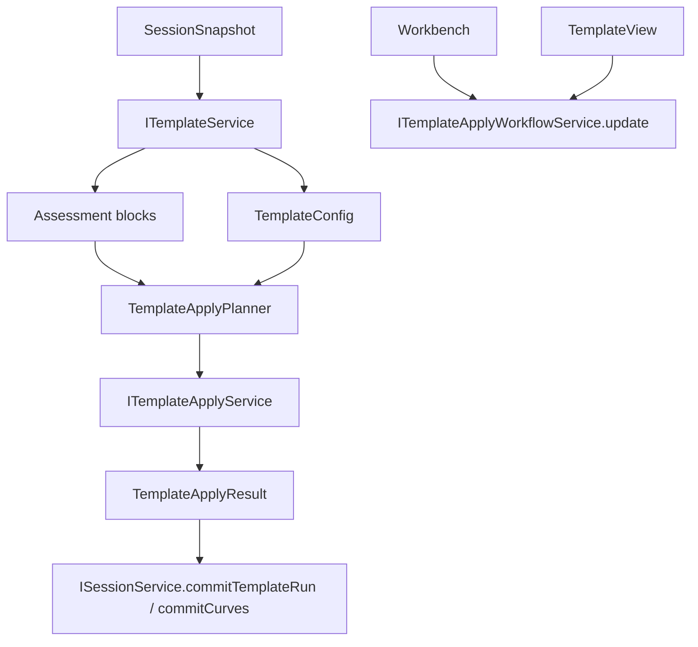

# Template

Template consumes assessment. It does not decide whether a table is IV/CV/CF/PV/IT.

## Ownership

`ITemplateService` owns:

- template CRUD and persistence;
- template selection rules;
- template form state and template selections;
- publishing template view input.

`ITemplateApplyWorkflowService` owns:

- template run planning;
- applying templates to session raw files and assessment blocks;
- producing `TemplateRunRecord`, series, base curves, and warnings/errors;
- consuming current table/session/template input through `update(...)`;
- coordinating with `ITemplateApplyService` for worker execution.

`ITemplateApplyService` owns:

- worker boundary;
- start/cancel/terminate processing jobs;
- translating worker payloads into service-level results.

Template does not own:

- assessment;
- raw table import;
- table selection state;
- plot rendering;
- chart state.

## Core files

| File | Responsibility |
| --- | --- |
| `src/cs/workbench/services/template/common/template.ts` | Defines `ITemplateService`, `TemplateRecord`, `TemplateConfig`, template CRUD contracts. |
| `src/cs/workbench/services/template/common/templateRun.ts` | Defines `TemplateRunRecord`, `TemplateRunInput`, warnings/errors, config fingerprint. |
| `src/cs/workbench/services/template/common/templateSelection.ts` | Template selection records and helpers. |
| `src/cs/workbench/services/template/browser/templateService.ts` | Implements template CRUD, selection state, and read APIs. |
| `src/cs/workbench/services/template/browser/templateApplyService.ts` | Worker boundary implementation. No DOM. |
| `src/cs/workbench/services/template/browser/templateApplyPlanner.ts` | Builds run plan from assessment blocks and config. Pure enough to test. |
| `src/cs/workbench/services/template/browser/template.contribution.ts` | Registers services and template lifecycle contribution. |
| `src/cs/workbench/contrib/template/browser/templateViewPane.ts` | Template UI shell. Renders service state and sends commands. |
| `src/cs/workbench/services/template/browser/templateApplyController.ts` | Template apply workflow service/controller. Coordinates apply workflow around service boundaries; target is to keep it thin and service-facing. |

## Flow



## Rules

- Template reads block source ranges and column maps from assessment.
- Template may ask Table for currently selected range only as explicit user input.
  Template UI consumes `ITableService` directly from its DI view pane for table
  selection/highlight. Do not pass `ITableService` through `TemplateViewInput`.
- Template apply is an owner API on `ITemplateApplyWorkflowService`. Template UI
  invokes `applyTemplate(...)` / `applyTemplateIncremental(...)`; do not pass
  Workbench apply callbacks through `TemplateViewInput`.
- Template apply may consume the current table preview through injected
  `ITableService` public state/model APIs. Do not pass table row readers,
  source-existence callbacks, or table model methods through
  `TemplateApplyWorkflowInput`.
- Template result records should include config fingerprint and source block ids.
- Re-running a template replaces only affected template output.
- Template processing cleanup consumes `SessionChangeEvent`: `filesRemoved`
  removes affected queued files, and `sessionCleared` terminates and resets the
  active processing worker. Do not route this cleanup through Explorer submit
  events or Workbench-only callbacks.

## Command entry and dispatch

Template commands cover template management and application. Template application is a workflow and may use a controller.

Recommended files:

| File | Responsibility |
| --- | --- |
| `src/cs/workbench/contrib/template/browser/templateCommands.ts` | Registers save/delete/import/apply/select template commands. |
| `src/cs/workbench/contrib/template/browser/templateActions.ts` | UI actions that execute template commands. |
| `src/cs/workbench/services/template/browser/templateApplyController.ts` | Coordinates apply workflow, worker boundary, notifications, and session batching through `ITemplateApplyWorkflowService`. |
| `src/cs/workbench/services/template/browser/templateService.ts` | Template management and state. |
| `src/cs/workbench/services/template/browser/templateApplyService.ts` | Worker/service boundary for template application. |

Apply command flow:

```txt
template.apply command
  -> ITemplateApplyWorkflowService
  -> ITemplateService / ITemplateApplyService
  -> assessment blocks from SessionSnapshot
  -> TemplateRunRecord + curves/series
  -> ISessionService commit
```

The command/controller must not re-detect table structure.

## Do not

- Do not infer IV/CV/transfer/output from raw headers here.
- Do not store template form draft state in Session.
- Do not let worker payload format leak into session records.
- Do not let TemplateView mutate session directly.


## Record fields

### `TemplateRecord`

| Field | Meaning |
| --- | --- |
| `id` | Template id. |
| `name` | Display name. |
| `config` | Template configuration. |
| `createdAt` | Creation timestamp. |
| `updatedAt` | Last update timestamp. |
| `source` | Built-in/user/imported origin. |

### `TemplateConfig`

| Field | Meaning |
| --- | --- |
| `xDataStart` | First x data row. |
| `xDataEnd` | Last x data row. |
| `xSegmentationMode` | Auto/points/segments. |
| `xSegmentCount` | Number of x segments. |
| `xPointsPerGroup` | Points per group. |
| `xUnit` | X unit. |
| `yLegendStart` | Starting legend value. |
| `yLegendCount` | Legend count. |
| `yLegendStep` | Legend step. |
| `yLegendTarget` | Auto/yColumn/group legend source. |
| `yUnit` | Y unit. |
| `bottomTitle` | X axis title. |
| `leftTitle` | Y axis title. |
| `legendPrefix` | Legend prefix. |
| `yColumns` | Y columns to extract. |
| `stopOnError` | Stop run on extraction error. |

### `TemplateRunRecord`

| Field | Meaning |
| --- | --- |
| `id` | Template run id. |
| `fileId` | Target file. |
| `selection` | Auto/template/manual selection used. |
| `config` | Effective config. |
| `input` | Input ranges/blocks. |
| `sourceBlockIds` | Blocks consumed by this run. |
| `outputSeriesIds` | Series produced. |
| `outputCurveKeys` | Curves produced. |
| `configFingerprint` | Stable config signature. |
| `mode` | Auto/manual/rule. |
| `appliedAt` | Timestamp. |
| `warnings` | Non-fatal warnings. |
| `errors` | Errors. |

## Component split

| Component | Responsibility |
| --- | --- |
| `TemplateService` | Template CRUD, selection state, run APIs. |
| `TemplateApplyService` | Worker lifecycle boundary. |
| `TemplateApplyWorkflowService` / `TemplateApplyController` | User workflow coordination: apply, progress, notification, batching. |
| `TemplateApplyPlanner` | Pure plan from config + assessment blocks. |
