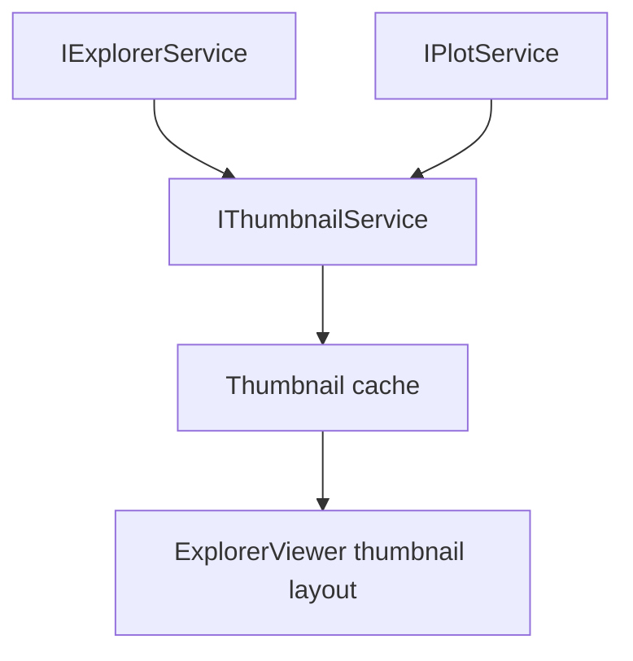

# Thumbnail

Thumbnail renders compact previews from Plot models.

It should not independently rebuild curve data from Session when Plot can provide the render model.

## Ownership

`IThumbnailService` owns:

- thumbnail cache;
- bitmap/render lifecycle;
- thumbnail sizing and cache invalidation;
- converting `PlotRenderModel` into thumbnail output;
- thumbnail model used by Explorer thumbnail layout and hover previews.

It consumes:

- `IPlotService` for render models;
- Explorer state for which files need thumbnails;
- plot settings needed for consistent display.

It does not own:

- Explorer tree state;
- raw session curves;
- assessment;
- chart shell state;
- export payloads.

## Core files

| File | Responsibility |
| --- | --- |
| `src/cs/workbench/services/thumbnail/common/thumbnail.ts` | Defines `IThumbnailService`, thumbnail request/result/cache key types. |
| `src/cs/workbench/services/thumbnail/browser/thumbnailService.ts` | Owns cache, invalidation, request scheduling, and rendering coordination. |
| `src/cs/workbench/services/thumbnail/browser/thumbnailBitmap.ts` | Converts `PlotRenderModel` into bitmap/canvas output. No session reads. |
| `src/cs/workbench/contrib/thumbnail/browser/ThumbnailView.ts` | UI component for thumbnail grid/list. Receives thumbnail models. |
| `src/cs/workbench/contrib/thumbnail/browser/thumbnail.contribution.ts` | Registers thumbnail view/contribution if needed. |

## Flow



## Rules

- Thumbnail cache invalidates on plot model changes.
- Cache key must include file id, plot type, unit/scale settings, and relevant curve signatures.
- Thumbnail render code should accept `PlotRenderModel`, not `ProcessedEntry` or raw session records.

## Command entry and dispatch

Thumbnail usually has no standalone domain command. Explorer owns thumbnail layout selection; Thumbnail owns bitmap/render cache.

Recommended files:

| File | Responsibility |
| --- | --- |
| `src/cs/workbench/contrib/files/browser/fileCommands.ts` / `fileActions.ts` | Toggle Explorer tree/thumbnail layout through the Files action/command path. |
| `src/cs/workbench/contrib/thumbnail/browser/thumbnailCommands.ts` | Optional refresh/clear thumbnail cache commands. |
| `src/cs/workbench/services/thumbnail/browser/thumbnailService.ts` | Render/cache thumbnails from plot models. |

Command flow for cache refresh:

```txt
thumbnail.refresh command
  -> IThumbnailService.invalidate(fileId or all)
  -> IThumbnailService event
  -> ExplorerViewer thumbnail mode rerenders
```

## Do not

- Do not duplicate plot domain/downsampling logic in thumbnail code.
- Do not store thumbnail cache in Session.
- Do not import ChartViewPane or AnalysisPanel to render thumbnails.


## State and record fields

### `ThumbnailRequest`

| Field | Meaning |
| --- | --- |
| `fileId` | File to render. |
| `plotType` | Plot type to render. |
| `width` | Requested bitmap width. |
| `height` | Requested bitmap height. |
| `settingsSignature` | Unit/scale/style settings signature. |

### `ThumbnailCacheKey`

| Field | Meaning |
| --- | --- |
| `fileId` | File id. |
| `plotModelSignature` | Plot render model signature. |
| `size` | Requested size. |
| `theme` | Theme/style discriminator if required. |

### `ThumbnailResult`

| Field | Meaning |
| --- | --- |
| `key` | Cache key. |
| `bitmap` | Canvas/image/bitmap output. |
| `createdAt` | Creation timestamp. |
| `diagnostics` | Render warnings/errors. |
