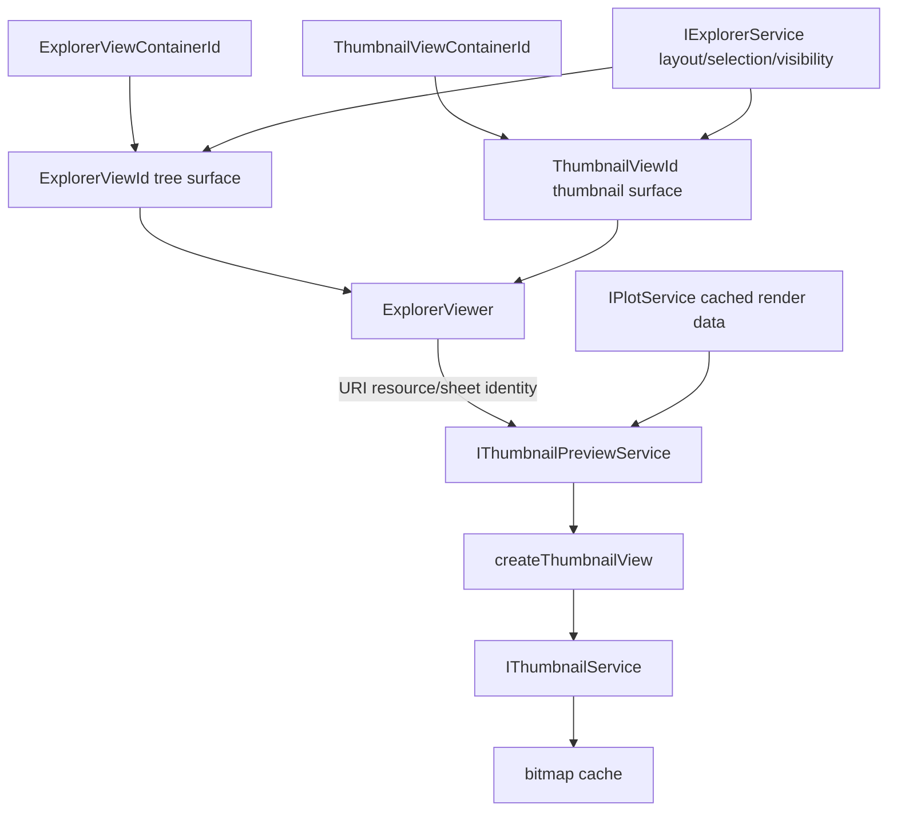

# Thumbnail

Thumbnail renders compact previews from Plot models. It must not rebuild raw
curve data when Plot can provide a render model.

## Ownership

`IThumbnailService` owns bitmap rendering and cache lifecycle:

- render `PlotRenderModel` into thumbnail canvas/bitmap output;
- cache by render-affecting input signature;
- warm cached bitmaps for hover or thumbnail consumers before their canvas is visible;
- clear/invalidate only through render keys or explicit thumbnail cache commands.

`IThumbnailPreviewService` owns per-file preview state:

- preview request priorities: `hover`, `visible`, `recent`, `nearby`, `idle`;
- preview cache invalidation from Plot cache/state facts;
- Plot cache lookup and retry when calculated/display data becomes available;
- `onDidChangePreview` so Explorer refreshes only the active hover or affected grid item.

`src/cs/workbench/contrib/thumbnail` owns reusable thumbnail UI:

- `createThumbnailView` and thumbnail CSS;
- thumbnail-specific action/command ids;
- thumbnail command handlers that delegate layout changes to `IExplorerService`.

Explorer/files owns every Explorer concern:

- `tree` and `thumbnail` layout state;
- Explorer selection, ordering, expansion, visibility, hover triggers, and context-view placement;
- which files appear as thumbnail candidates;
- shared file item commands/actions used by both tree and thumbnail layouts.

Thumbnail does not own Explorer selection/layout, raw calculation curves,
table-model production, chart shell state, export payloads, file import, or
Explorer file filtering.

## Core Files

| File | Responsibility |
| --- | --- |
| `src/cs/workbench/services/thumbnail/common/thumbnail.ts` | Thumbnail service contract and request/result types. |
| `src/cs/workbench/services/thumbnail/browser/thumbnailService.ts` | Bitmap cache/rendering, preview cache, invalidation, request scheduling. |
| `src/cs/workbench/services/thumbnail/browser/thumbnailBitmap.ts` | Convert `PlotRenderModel` into canvas/bitmap output. No domain-service reads. |
| `src/cs/workbench/contrib/thumbnail/common/thumbnail.ts` | Thumbnail action/command ids and `ThumbnailViewId`. |
| `src/cs/workbench/contrib/thumbnail/browser/thumbnailView.ts` | Reusable thumbnail component. Receives file display metadata and plot render models. |
| `src/cs/workbench/contrib/thumbnail/browser/thumbnailViewPane.ts` | Thumbnail sidebar surface class. Declares the thumbnail view id/title/layout while reusing the files-owned Explorer surface behavior. |
| `src/cs/workbench/contrib/thumbnail/browser/thumbnailCommands.ts` | Thumbnail command handlers. Normalize and delegate to services. |
| `src/cs/workbench/contrib/thumbnail/browser/thumbnailActions.ts` | `Action2` wrappers for thumbnail commands. |
| `src/cs/workbench/contrib/thumbnail/browser/thumbnail.contribution.ts` | Registers thumbnail actions, CSS, and the thumbnail sidebar view descriptor in the thumbnail container. |

## Explorer Integration

Explorer is one resource manager with two sidebar containers:
`ExplorerViewContainerId` hosts `ExplorerViewId` for the tree surface, and
`ThumbnailViewContainerId` hosts `ThumbnailViewId` for the thumbnail
surface. The thumbnail toggle action is thumbnail-specific UI, but the command
delegates to `IExplorerService.toggleViewLayout()` because Explorer owns layout
state and Workbench uses that state to choose which sidebar container is active
in chart mode.

The thumbnail view descriptor and `ThumbnailViewPane` class live in the
thumbnail contribution. The pane inherits the files-owned Explorer surface
behavior; do not move Explorer selection, ordering, import, filtering, hover,
or context menu ownership into thumbnail code.

Selection is still Explorer selection. A thumbnail click is equivalent to a
tree item selection and must flow through the existing Explorer selection
surface, currently `IExplorerService.select(resource, reveal?, sheetId?)`.

Tree hover previews also stay Explorer-owned. Explorer owns the hover trigger,
delay, anchor, context-view container, placement, layout, and dismissal.
Thumbnail owns only the preview content rendered through `createThumbnailView`.

While chart processing is active, Explorer may open a hover preview for queued,
processing, or ready chart files even when the current item projection is still
stale. Failed and skipped files are terminal and should not produce thumbnail
hover content.



## Preview Flow

1. Explorer supplies file display metadata, active state, and an optional Plot model to `createThumbnailView`.
2. Thumbnail view creates or updates the canvas and asks the thumbnail renderer to draw from the Plot model.
3. Thumbnail service reads or updates its bitmap cache by render input signature.
4. Explorer publishes visible/nearby resource/sheet identities while thumbnail layout is active.
5. Domain bridge resolves recent Explorer file references to resource/sheet
   identities and prefetches recent, visible, and nearby thumbnail previews.
   Explorer callers pass `resource` and optional `sheetId` directly; they do not
   fall back to file-id preview targets when a row has no resolved resource.
6. Preview service reads Plot cached data, keeps loading state on miss, and retries on Plot cache events.
7. Preview service fires `onDidChangePreview` with the resource/sheet identity
   that changed for Explorer previews.
8. Explorer refreshes only the active hover or affected thumbnail grid item.

## DOM and Performance

- Thumbnail grid items should be keyed by stable file id and updated in place.
- Preview completion should refresh only the affected thumbnail item.
- Replace container children only for real insertion, removal, or ordering changes.
- Reuse existing thumbnail views and redraw into existing canvas when the Plot model changes.
- Keep the last nonblank canvas visible if a refresh temporarily resolves to `loading`.
- Hover cache keys should include only fields that affect the hover thumbnail node or plotted output.
- Hover cache identity must not include active/selection visual state; toggle those classes in place.
- Reused hover shells must relayout from the current anchor and verify thumbnail file identity before showing async updates.
- Keyed DOM reuse is separate from `FastDomNode`-style repeated style write deduplication. Add a common primitive only when multiple surfaces share the same keyed DOM reuse need.

## Rules

- Thumbnail render code accepts `PlotRenderModel`, not imported table payloads or raw calculation records.
- Thumbnail view components may receive file id, file name, active state, and plot settings, but must not rebuild source or plot data.
- Thumbnail cache keys must include file id, plot type, unit/scale settings, and relevant curve/model signatures.
- Loading previews should render a nonblank thumbnail-owned placeholder unless an older plot model is available.
- Hover previews may request eager draw so the first connected, sized canvas draws immediately.
- Thumbnail grid items should use the stable draw strategy to avoid repaint churn in persistent layouts.
- `fastReady` is a Plot-provided display-model cache source, not a legacy-ledger shortcut.
- Treat `ready -> fastReady` for the same calculated-data signature as a cache-source upgrade.
- Do not downgrade `fastReady`, `rawReady`, or `ready` to `loading` while replacement data with the same signature is pending.
- Preview queues must consume `IPlotService.getCachedCalculatedData`; they must not call `getCalculatedData` inside the thumbnail frame budget.
- If Plot cache is not warm, keep the preview in `loading` and retry on `onDidChangeCalculatedDataCache`.
- Targeted Plot cache invalidation must preserve pending preview priority for affected loading previews.
- Recent preview prefetch is limited to files that were actually active or hovered recently.
- Tree layout hover previews are on-demand through hover priority; ordinary tree scrolling must not warm every visible thumbnail.

## Commands

Thumbnail commands/actions live in thumbnail contribution only when the
user-facing affordance is thumbnail-specific. Explorer file item actions remain
in the shared Explorer/files action set and are used by both layouts.

Do not register thumbnail toggle actions in
`src/cs/workbench/contrib/files/browser/fileActions.ts`.

Do not put thumbnail command handlers in
`src/cs/workbench/contrib/files/browser/fileCommands.ts`.

If a cache clear command is added later, it must delegate to
`IThumbnailService.clear()`.

## API Shape

The current public render surface is direct canvas drawing:

```ts
IThumbnailService.drawPlotThumbnail(target, options)
```

`ThumbnailBitmapOptions` should stay limited to render-affecting inputs:

- `model`: Plot render-model source and stable signature;
- `plotType`: plot type to render;
- `originOpenPlotOptions`: optional Origin display settings;
- `plotAxisSettings`: optional plot axis/display settings.

Cache keys are an internal `thumbnailBitmap.ts` detail until a public caller
needs keyed lookup, targeted invalidation, diagnostics, or telemetry.

Add explicit async request/result contracts only when thumbnail rendering truly
becomes async, cancellable, worker-backed, exported, or telemetry/reporting
needs structured diagnostics.

## Do Not

- Do not duplicate plot domain/downsampling logic in thumbnail code.
- Do not store thumbnail cache outside `IThumbnailService`.
- Do not import ChartViewPane or ChartPanel to render thumbnails.
- Do not create reusable thumbnail UI under `src/cs/workbench/contrib/files/browser/views/thumbnail`.
- Do not use `explorerThumbnail...` names for files or exported UI symbols inside `contrib/thumbnail`.
- Do not move Explorer selection, layout state, ordering, hover timing, anchor, or context-view lifecycle into thumbnail contribution code.
- Do not invent `setSelectedFile`, `selectedThumbnailId`, or parallel thumbnail selection APIs.
- Do not add thumbnail-specific duplicates of Explorer file item actions or commands.
- Do not add thumbnail file visibility/filter helpers under `src/cs/workbench/services/thumbnail`.
- Do not have Explorer views call `IThumbnailService.clear()` for normal prop changes.
