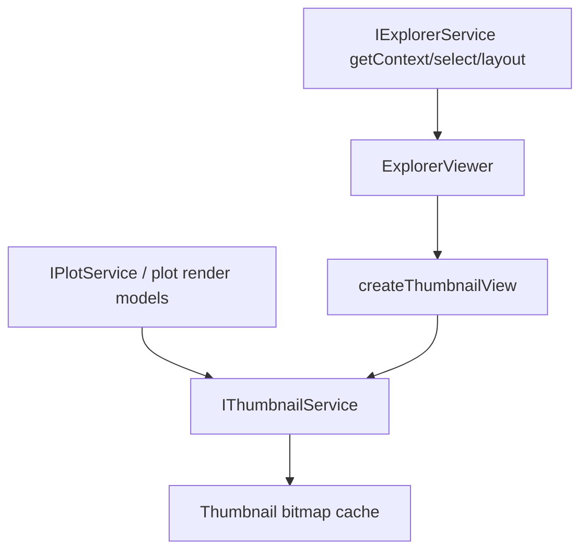
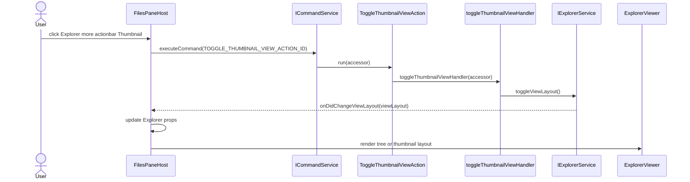
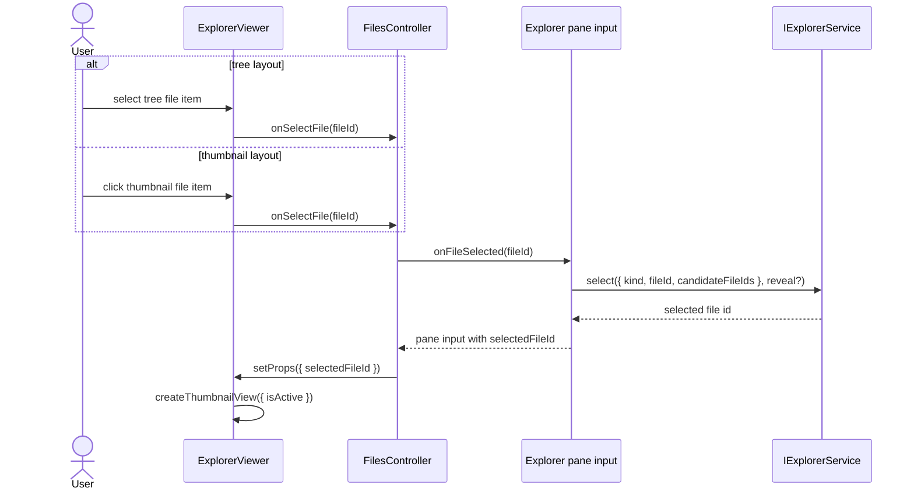
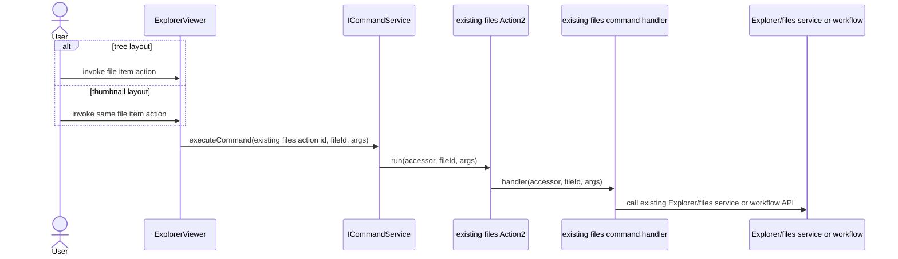
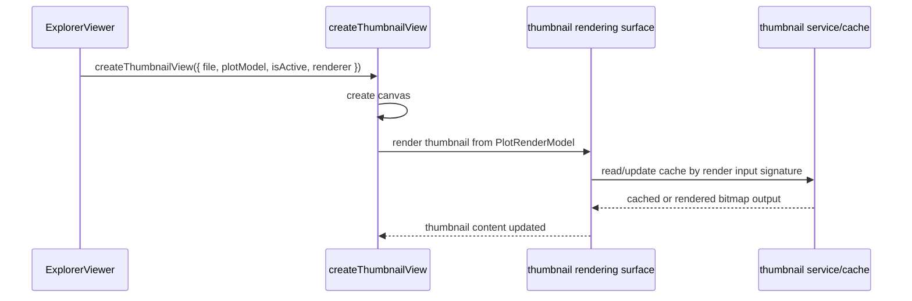
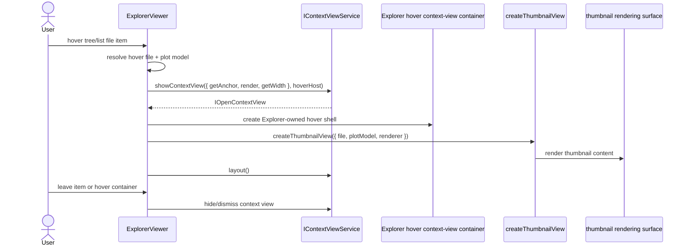

# Thumbnail

Thumbnail renders compact previews from Plot models and provides thumbnail-specific UI affordances for Explorer.

It should not independently rebuild curve data from Session when Plot can provide the render model.

## Ownership

`IThumbnailService` owns:

- thumbnail cache;
- bitmap/render lifecycle;
- thumbnail sizing and cache invalidation from render inputs, cache keys, and explicit thumbnail cache commands;
- converting `PlotRenderModel` into thumbnail output;
- bitmap output used by Explorer thumbnail layout and hover previews.

`src/cs/workbench/contrib/thumbnail` owns:

- reusable thumbnail view components;
- thumbnail CSS;
- thumbnail layout/cache affordance action ids, commands, and `Action2` registrations;
- thumbnail-specific command dispatch, including the command that toggles Explorer between its tree and thumbnail layouts by delegating to `IExplorerService`.

Explorer/files owns:

- the Explorer resource manager semantic model;
- both Explorer presentation layouts: `tree` and `thumbnail`;
- the shared Explorer file item action/command set used by both layouts;
- Explorer tree state;
- Explorer selection, expansion, folder/file ordering, and source workflow state;
- the Explorer container, tree/grid/hover trigger, hover context-view placement, and rerender lifecycle that consume thumbnail UI;
- deciding which Explorer files should be shown as thumbnails;
- filtering or narrowing Explorer thumbnail inputs before they are handed to thumbnail UI;
- the more actionbar placement that lets users switch between Explorer tree and thumbnail layouts.

Thumbnail consumes:

- `IPlotService` or plot-provided render models;
- `IExplorerService` only for commands that request Explorer layout changes;
- plot settings needed for consistent display.

Thumbnail does not own:

- Explorer tree state;
- Explorer view layout state;
- Explorer selection;
- raw session curves;
- assessment;
- chart shell state;
- export payloads;
- file import/source collection workflow.
- Explorer thumbnail file filtering.

## Core files

| File | Responsibility |
| --- | --- |
| `src/cs/workbench/services/thumbnail/common/thumbnail.ts` | Defines `IThumbnailService`, thumbnail request/result/cache key types. |
| `src/cs/workbench/services/thumbnail/browser/thumbnailService.ts` | Owns cache, invalidation, request scheduling, and rendering coordination. |
| `src/cs/workbench/services/thumbnail/browser/thumbnailBitmap.ts` | Converts `PlotRenderModel` into bitmap/canvas output. No session reads. |
| `src/cs/workbench/contrib/thumbnail/common/thumbnail.ts` | Defines thumbnail contribution action/command ids. |
| `src/cs/workbench/contrib/thumbnail/browser/thumbnailView.ts` | Reusable thumbnail UI component. Receives display metadata and thumbnail render models. |
| `src/cs/workbench/contrib/thumbnail/browser/thumbnailActions.ts` | Registers thumbnail `Action2` entries. |
| `src/cs/workbench/contrib/thumbnail/browser/thumbnailCommands.ts` | Command handlers for thumbnail affordances. Handlers normalize and delegate to services. |
| `src/cs/workbench/contrib/thumbnail/browser/thumbnail.contribution.ts` | Registers thumbnail contribution side effects, actions, and CSS. |

## Flow



## Explorer Integration

Explorer is one resource manager with two layouts: `tree` and `thumbnail`. The user switches layouts from the Explorer more actionbar thumbnail button. The button executes the thumbnail toggle action, and the command delegates to `IExplorerService.toggleViewLayout()`.

Selection is still Explorer selection. Selecting a thumbnail is equivalent to selecting the corresponding Explorer list item. The selection request must flow through the existing Explorer selection surface, currently `IExplorerService.select(target, reveal?)` with context read through `IExplorerService.getContext()` or the existing pane input props derived from it. Do not introduce a thumbnail selection owner or a parallel selected-file state.

Thumbnail view components must not own selection, Explorer ordering, or layout mode. They only render active/selection props supplied by Explorer and use the thumbnail rendering surface provided by the thumbnail feature. Do not make the UI ownership rule depend on a specific low-level canvas method name.

Tree layout hover previews follow the same boundary. The hover trigger is an Explorer tree/list item, so Explorer owns the hover event handling, delay, context-view container, anchor, positioning, and dismissal. The preview content inside that Explorer-owned container is thumbnail UI rendered through `createThumbnailView(...)` and the thumbnail rendering surface.

## Wiring Contract

Tree and thumbnail layouts share the same Explorer wiring. They differ only in DOM presentation.

Layout toggle command sequence:



Selection sequence:



File item action sequence:



Thumbnail render sequence:



Tree item hover thumbnail preview sequence:



Do not create thumbnail-specific duplicates of Explorer file item commands such as remove, rename, template assignment, reveal, or selection. If a thumbnail UI affordance invokes an Explorer file operation, it must call the existing Explorer/files command or selection path.

## Rules

- Thumbnail cache invalidates on plot model changes.
- Cache key must include file id, plot type, unit/scale settings, and relevant curve signatures.
- Thumbnail render code should accept `PlotRenderModel`, not `ProcessedEntry` or raw session records.
- Thumbnail view components may receive minimal display metadata such as file id, file name, and active marker props, but must not rebuild plot/session data.
- Thumbnail service/common code must not decide which Explorer files are visible as thumbnails. Any file filtering, field filter option building, or visible file id narrowing belongs to Explorer/files view-model code.
- Thumbnail clicks may travel through an existing Explorer UI callback such as `onSelectFile`, but the target selection operation must remain upstream-shaped Explorer selection (`IExplorerService.select(...)`), not thumbnail-owned state.
- Thumbnail file item actions must reuse the same Explorer/files action ids and command handlers as tree file items.
- Tree layout hover thumbnail previews must use Explorer-owned hover triggers and context-view containers, with thumbnail-owned preview content rendering.
- Explorer may clear its own hover DOM cache when render props change, but must not directly clear `IThumbnailService`'s global bitmap cache as part of ordinary view rerendering. Thumbnail bitmap cache invalidation is driven by render keys/signatures or explicit thumbnail cache commands.
- Do not place reusable thumbnail UI under `src/cs/workbench/contrib/files/browser/views/thumbnail`.
- Do not keep Explorer-specific prefixes in thumbnail contribution file names or exported UI names. Prefer `thumbnailView.ts`, `createThumbnailView`, and `ThumbnailViewProps`.
- If Explorer consumes thumbnail UI, Explorer imports from `src/cs/workbench/contrib/thumbnail/browser/...`.
- Do not model thumbnail mode as a separate resource manager or standalone workbench view. It is Explorer's `thumbnail` layout.

## Command Entry and Dispatch

Thumbnail commands/actions live in the thumbnail contribution only when the user-facing affordance is thumbnail-specific. The current command is the thumbnail layout toggle. Explorer file item actions remain in the shared Explorer/files action set and are used by both tree and thumbnail layouts. The toggle command delegates to Explorer because Explorer owns the `tree`/`thumbnail` layout state. If a cache clear command is added later, it must dispatch to `IThumbnailService.clear()`.

Recommended files:

| File | Responsibility |
| --- | --- |
| `src/cs/workbench/contrib/thumbnail/common/thumbnail.ts` | Thumbnail action/command ids such as `TOGGLE_THUMBNAIL_VIEW_ACTION_ID`. |
| `src/cs/workbench/contrib/thumbnail/browser/thumbnailCommands.ts` | Thumbnail layout toggle command handler. Add cache clear here only if it delegates to `IThumbnailService.clear()`. |
| `src/cs/workbench/contrib/thumbnail/browser/thumbnailActions.ts` | `Action2` wrappers for thumbnail commands. |
| `src/cs/workbench/contrib/thumbnail/browser/thumbnail.contribution.ts` | Imports `thumbnailActions.ts` so actions are registered. |
| `src/cs/workbench/services/thumbnail/browser/thumbnailService.ts` | Render/cache thumbnails from plot models. |

See the Wiring Contract sequence diagrams for the exact command calls and interfaces.

Do not register thumbnail toggle actions in `src/cs/workbench/contrib/files/browser/fileActions.ts`.
Do not put thumbnail command handlers in `src/cs/workbench/contrib/files/browser/fileCommands.ts`.

## Do Not

- Do not duplicate plot domain/downsampling logic in thumbnail code.
- Do not store thumbnail cache in Session.
- Do not import ChartViewPane or AnalysisPanel to render thumbnails.
- Do not create `files/browser/views/thumbnail` for reusable thumbnail components.
- Do not use `explorerThumbnail...` names for files or exported UI symbols inside `contrib/thumbnail`.
- Do not move Explorer selection or layout state into thumbnail contribution code.
- Do not move Explorer tree item hover trigger, hover timing, anchor, positioning, or context-view lifecycle into thumbnail contribution code.
- Do not invent `setSelectedFile`, `selectedThumbnailId`, or other selection state APIs for thumbnails. Use the upstream-shaped Explorer `select(...)` and `getContext()` surfaces.
- Do not add thumbnail-specific duplicates of Explorer file item actions or commands. Tree and thumbnail layouts use one Explorer action/command set.
- Do not add thumbnail file visibility/filter helpers under `src/cs/workbench/services/thumbnail`. Those helpers are Explorer/files responsibility.
- Do not have Explorer views call `IThumbnailService.clear()` for normal prop changes. Use cache-key invalidation or an explicit thumbnail cache command.

## API Fields

Do not introduce public thumbnail request/result/cache-key records until there is a caller that needs them. The current public surface is direct rendering into a browser canvas:

```ts
IThumbnailService.drawPlotThumbnail(target, options)
```

### `ThumbnailBitmapOptions`

| Field | Meaning |
| --- | --- |
| `model` | Plot render-model source plus its stable `signature`. |
| `plotType` | Plot type to render. |
| `originOpenPlotOptions` | Optional Origin display settings that affect thumbnail style. |
| `plotAxisSettings` | Optional plot axis/display settings that affect thumbnail style. |

Cache keys are an internal implementation detail of `thumbnailBitmap.ts`. They should include every render-affecting field used by the bitmap renderer, but they should not be exported as `ThumbnailCacheKey` unless a future cache API exposes keyed lookup, targeted invalidation, diagnostics, or telemetry.

Only add a `ThumbnailResult`-style return type if thumbnail rendering becomes asynchronous or needs to report render diagnostics to a caller. Synchronous canvas drawing does not need `createdAt` or `diagnostics`.

## Future Async/Batch Rendering

If thumbnail rendering grows beyond synchronous canvas drawing, add explicit request/result contracts at that time. Valid triggers include:

- async thumbnail rendering service with cancellation, priority, retry, or queue scheduling;
- batch image generation for many Explorer files at once;
- exporting thumbnail images as artifacts;
- remote or worker-backed thumbnail rendering;
- user-visible render failures;
- telemetry or diagnostics for render failures, fallback paths, timing, cache hit rate, or worker errors.

When one of these triggers exists, define the request/result fields from the actual caller needs. Do not add generic `diagnostics`, `createdAt`, request size, or public cache-key fields preemptively.
