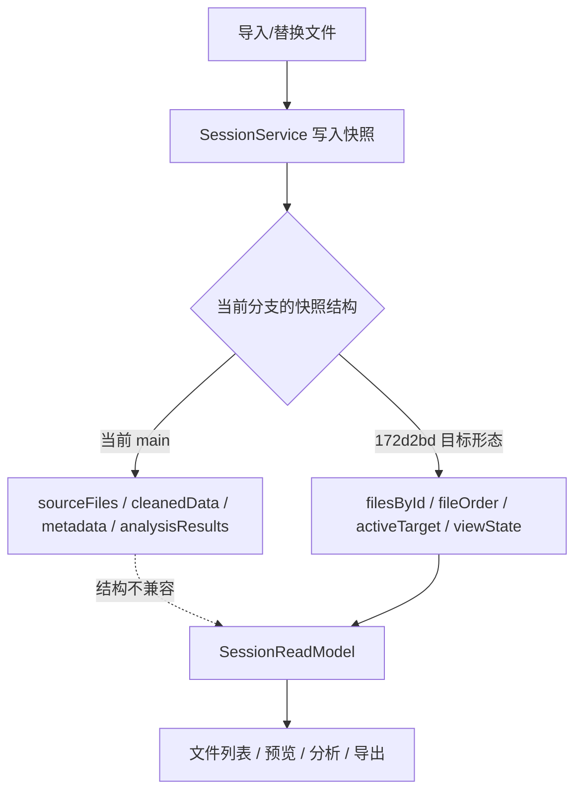

# chogng/conductor 会话问题深度研究报告

## 执行摘要

已使用的连接器范围：GitHub；本次研究严格把代码范围限定在 `chogng/conductor`，并以该仓库的公开提交页、源码页以及仓库内中文会话模型文档作为主要证据来源。首先需要澄清，这个仓库里的 “session” 不是登录态或 HTTP 会话，而是 **Workbench 内部的数据会话**：仓库 README 将项目描述为“desktop-first” 分析工具，而 `src/cs/workbench/services/session/README.zh-CN.md` 明确把整个会话定义为一个 `SessionModel`，并强调 `activeTarget`、`viewState`、`FileRecord` 等都是工作台数据生命周期的一部分。citeturn32view2turn18view6turn18view7

结论先说：**就当前 GitHub 上可见的 `main` 分支状态来看，你最近这轮更新并没有把 session 问题真正闭环解决；更准确地说，修复方向已经出现，但当前主线仍处于“半迁移”状态。** 关键证据是：当前 `main` 分支里的 `session.ts` 和 `sessionService.ts` 仍然使用旧版顶层快照结构（`sourceFiles`、`cleanedData`、`metadata`、`analysisResults`、`previewFile`、`previewStatus` 等），而同一分支的 `sessionReadModel.ts` 与 `sessionReadModel.test.ts` 却已经按新版 canonical 结构读取 `filesById`、`fileOrder`、`activeTarget`、`viewState.table.previewStatus`。这意味着“写端”和“读端”的会话契约并不一致。citeturn38view0turn30view0turn29view4turn42view6turn42view7

如果你说的“刚更新”主要对应的是 **`172d2bd`** 这个提交，那么它本身的修复意图是正确的，而且在该提交快照里，`session.ts`、`sessionService.ts`、`sessionService.test.ts`、`sessionActions.test.ts` 已经被整体切到 canonical model，修复逻辑是成套出现的。问题在于：**当前可见的 `main` 分支并没有完整呈现这套成品**，至少在匿名可见的源码页面上，`main` 仍保留了旧的 session 类型与 service 实现。换言之，修复方案“存在”，但当前主线代码“没有完全落地”。citeturn49view0turn47view0turn36view0turn44view0turn40view1turn40view2turn39view0

我对根因的判断是：这不是典型的“过期时间”“cookie 丢失”“Redis 锁”一类 session 问题，而是一次 **workbench session 模型迁移** 只完成了一半，导致同一仓库内同时存在两套会话契约。由于 `package.json` 明确要求 `npm run typecheck` 跑多套 `tsc --noEmit` 校验，这种读写端类型不一致在正常 CI 中本应被拦截；因此，当前最需要验证的不是“session 是否自动过期”，而是“当前分支是否真的包含并编译了 `172d2bd` 那套 canonical 实现”。这一点也是我认为问题尚未真正解决的最强证据。citeturn53view0turn38view0turn29view4

## 研究范围与假设

本报告必须先把你未提供的信息明确列出来，否则“是否已修复”会被混入一些无法验证的环境变量。

| 项目 | 你提供的情况 | 本报告采用的假设 | 对结论的影响 |
|---|---|---|---|
| 已使用连接器 | 指定 `github` | 研究对象严格限定为 `chogng/conductor` 的公开仓库页面与提交页面 | 只能验证 **已推送**、**GitHub 当前可见** 的代码状态 |
| 你“刚更新了”的具体 SHA | 未指定 | 以 `main` 当前可见状态为主，并将最近相关提交 `d9f3463`、`52c038c`、`523f94d`、`27a0c12`、`172d2bd` 作为更新链路 | 如果你本地还有未推送提交，本报告无法覆盖 |
| 受影响版本/提交 | 未指定 | 重点检查 2026-06-07 到 2026-06-08 这组与 session 迁移直接相关的提交 | 结论聚焦最近一次 session 架构变更，不覆盖更早历史分支 |
| 部署环境 | 未指定 | 假定通用 Linux 容器 / 本地开发环境；同时考虑仓库本身是 desktop-first Electron 应用 | 更偏向源码契约与构建/测试层面的 session 问题，而不是服务端部署态 |
| 实际报错文本/日志 | 未提供 | 采用“源码不一致 + 构建脚本 + 测试覆盖”作静态取证 | 能给出高置信度根因，但不能伪造“真实运行日志摘录” |
| 私有 fork / 本地补丁 | 未指定 | 视为不存在 | 若你改的是私有分支，本报告需以你的 SHA 再复核 |

从提交历史看，最近与 session 直接相关的提交链非常集中：2026-06-07 有 `d9f3463`、`52c038c`、`523f94d`、`27a0c12`，2026-06-08 有 `172d2bd`。这说明最近的更新确实围绕 session 重构发生，而不是旁支改动。citeturn49view0turn47view0turn47view1turn47view2turn47view3turn47view4

另一个关键假设是：仓库中的 “session” 指向工作台数据生命周期，不是身份认证。`README.zh-CN.md` 把项目定义为桌面分析工具，而 `session/README.zh-CN.md` 明确规定一个根模型、一个文件 owner、`activeTarget` 不等于 preview、所有会话数据都要归属于 `SessionModel`/`FileRecord`/具名 child record。这个语义前提决定了本次问题分析的重点应该放在 **数据模型契约、读写一致性、UI 预览状态与异步 worker 回写**，而不是登录态刷新。citeturn32view2turn18view6turn18view7

## 在仓库中找到的相关文件、提交与代码片段

下面这张表是本次最重要的证据总表。我把“当前 `main` 可见状态”和“`172d2bd` 提交中已经出现的目标状态”放在一起，便于直接看出问题到底卡在哪一层。

| 文件或提交 | 当前可见状态或提交内容 | 关键代码片段摘要 | 为什么相关 |
|---|---|---|---|
| `src/cs/workbench/services/session/README.zh-CN.md` | 文档明确要求整个 session 用一个 `SessionModel` 表达，并把 `metadata`、`cleanedData`、`analysisResults` 等称作 legacy bucket，只允许在迁移边界出现。citeturn18view7turn18view6 | 文档把 canonical owner、lifecycle writes、legacy migration map 都写得很清楚。 | 这是“应该是什么”的官方契约来源。 |
| `src/cs/workbench/services/session/common/session.ts` on `main` | 仍然定义旧版 `SessionSnapshot`：`sourceFiles`、`selectedPreviewFileId`、`cleanedData`、`metadata`、`analysisResults`、`previewFile`、`previewStatus` 等顶层字段。citeturn38view0turn38view2 | 旧 contract 是“扁平顶层桶式状态”。 | 这是当前主线的写端契约。 |
| `src/cs/workbench/services/session/browser/sessionService.ts` on `main` | `private snapshot` 初始化为旧字段集合；service 仍以 `setCleanedData`、`setAnalysisResults`、`setSelectedPreviewFileId` 等 setter 驱动；同时内部用 `batchDepth` + `hasPendingChange` 做通知合并，并维护 `previewRequestIdRef`、`previewRowsRequestsRef`、缓存 `Map/Set`。citeturn30view0turn28view1turn28view2turn28view8 | session 存储是 **内存中的对象快照 + 多个 `MutableState` 引用缓存**，未见外部数据库/Redis/cookie。 | 这是当前主线的核心实现，也是“session 存储方式”和“并发/竞态路径”的证据。 |
| `src/cs/workbench/services/session/common/sessionReadModel.ts` on `main` | 却已经读取 `snapshot.filesById`、`snapshot.fileOrder`、`snapshot.activeTarget`、`snapshot.viewState.table?.previewStatus`。citeturn29view4turn36view6 | 读模型完全按 canonical shape 获取原始文件、处理文件和 preview 状态。 | 这是当前主线读端契约。与上两行直接冲突。 |
| `src/cs/workbench/services/session/test/browser/sessionService.test.ts` on `main` | 仍主要测试 legacy service 行为，例如批量写入时调用 `setCleanedData([])` 与 `setAnalysisResults({})`，并断言元数据仍位于 `snapshot.metadata.filesById`。citeturn42view0turn42view2turn42view5 | 测试关注的是旧 contract，而不是 `filesById/fileOrder/activeTarget/viewState`。 | 测试侧也在加重“主线旧写端”的路径依赖。 |
| `src/cs/workbench/services/session/test/common/sessionReadModel.test.ts` on `main` | 测试已经按 canonical model 构造快照：`activeTarget` + `viewState.table.previewFile/previewStatus`，再喂给 `createSessionReadModel`。citeturn42view6turn42view7 | 读模型测试与 `main` 的 `session.ts` 类型定义并不一致。 | 这是“同一分支内部读写契约分裂”的直接证据。 |
| 提交 `27a0c12` | 文档更新明确要求“未来 session 代码先按 model 设计，再在 `SessionService` 边界映射兼容字段”。citeturn47view4turn51view4 | 文档层已经要求 canonical first。 | 说明团队方向已经从 legacy bucket 转向 canonical model。 |
| 提交 `523f94d` | 提交标题是“fold session metadata into session service”。citeturn47view1 | 这是对 legacy metadata 边界的重构步骤。 | 是迁移链中的前置步骤。 |
| 提交 `d9f3463` | 提交标题是“move session metadata into session service”。citeturn47view2 | 更早阶段将 metadata 逐步收拢到 session service。 | 说明这不是单点修改，而是一串迁移。 |
| 提交 `52c038c` | 提交标题是“route calculation and export through session service”。citeturn47view3 | 计算、导出也开始依赖 session service。 | 会放大 session contract 不一致的影响面。 |
| 提交 `172d2bd` 中的 `session.ts` | 该提交把 `SessionSnapshot` 改成 canonical 结构：`version`、`filesById`、`fileOrder`、`activeTarget`、`viewState`，并把 `SessionContextValue` 改为以这些字段为核心。citeturn36view0turn36view2turn36view3 | 这是目标 contract。 | 它代表“如果更新完整落地，问题应该如何被修复”。 |
| 提交 `172d2bd` 中的 `sessionService.ts` | 初始化快照为 canonical 结构；有 `setActiveTarget` 正规化、`setViewState`、`addRawFiles`、`replaceRawFiles`、`removeFiles`、`clearSessionData` 等整套方法。citeturn44view0turn46view0turn45view1turn44view3turn44view5turn44view6 | 写端已经与文档/读模型一致。 | 这就是“理论上已修复”的代码形态。 |
| 提交 `172d2bd` 中的测试 | `sessionActions.test.ts` 校验“替换导入文件后选中首文件并进入 preview loading”；`sessionService.test.ts` 覆盖 `batch`、`addRawFiles`、`removeFiles`、`clearSessionData`、`setActiveTarget` 归一化等 canonical 场景。citeturn39view0turn40view0turn40view1turn40view2turn40view4turn40view5 | 这套测试与 canonical service 配套。 | 说明修复并非只有类型定义，而是包含行为测试。 |

从这张表可以直接看出：仓库内最核心的矛盾不是“缺少某一行小修”，而是 **当前主线的 session contract 与最近修复提交里的 session contract 不同**。文档、读模型、部分测试已经迁向 canonical，但当前 `main` 暴露出来的 `session.ts`/`sessionService.ts` 仍是 legacy。citeturn18view7turn38view0turn30view0turn29view4turn36view0turn44view0

## 我更新的提交是否解决问题

先给一个简短而明确的判断：**如果你的更新指的是那组 canonical migration，方向是对的；但如果以 GitHub 当前可见的 `main` 分支为准，问题仍未解决。** 换言之，“修复方案”已经存在，“主线闭环”并未完成。citeturn49view0turn47view0turn38view0turn29view4

### 差异对比

| 维度 | 当前 `main` 可见状态 | `172d2bd` 中的状态 | 结论 |
|---|---|---|---|
| `SessionSnapshot` 形状 | legacy：`sourceFiles`、`cleanedData`、`metadata`、`analysisResults`、`previewStatus` 在顶层。citeturn38view0 | canonical：`version`、`filesById`、`fileOrder`、`activeTarget`、`viewState`。citeturn36view0 | **类型层不一致** |
| `SessionService` 初始化 | legacy `snapshot` 顶层桶式对象。citeturn30view0 | canonical `snapshot` 以 `filesById/fileOrder/activeTarget/viewState` 初始化。citeturn44view0 | **写端不一致** |
| `SessionReadModel` 读取方式 | 已按 canonical 读取 `snapshot.filesById`、`activeTarget`、`viewState.table.previewStatus`。citeturn29view4turn36view6 | 同样按 canonical 读取。citeturn36view4turn36view6 | **读端已迁移** |
| `sessionService` 测试 | 主要验证 `setCleanedData`、`setAnalysisResults` 等 legacy 路径。citeturn42view0turn42view2 | 已验证 `addRawFiles`、`removeFiles`、`clearSessionData`、`setActiveTarget` 等 canonical 路径。citeturn40view1turn40view2turn40view4turn40view5 | **测试也分裂** |
| 行为修复覆盖 | 主线看不到“替换原始文件后重置 target + preview loading”的完整 canonical 测试链。citeturn42view0 | `sessionActions.test.ts` 明确覆盖“替换文件后选中首文件并触发 preview loading”。citeturn39view0 | **修复未在主线闭环** |

### 结论与证据

我认为**当前问题未解决**，主要证据是下面这条“读写断层”：



`main` 的 `session.ts` 与 `sessionService.ts` 仍然输出 legacy shape；但 `sessionReadModel.ts` 与它的测试已经消费 canonical shape。只要存在 `createSessionReadModel(session.getSnapshot())` 这类路径，类型层和行为层都会承受不一致风险。由于 `package.json` 的 `typecheck` 明确执行多套 `tsc --noEmit`，这种不一致在正常 CI 下应被直接拦下；因此，如果你的“更新”在本地已经解决，而 GitHub 可见主线仍未解决，最可能的原因就是 **提交没有完整推到当前分支、页面展示的分支与预期分支不一致，或者迁移过程中发生了部分回退/覆盖**。citeturn38view0turn30view0turn29view4turn53view0

### 复现步骤

由于本次研究基于仓库公开页面而不是可执行容器，我不能伪造一段“真实运行日志”。但就源码结构而言，最小复现路径已经非常清楚：

| 复现步骤 | 预期观察 |
|---|---|
| `git checkout main && npm ci && npm run typecheck` | 高概率会在 session 相关类型上暴露 contract 不一致；这是根据当前 `main` 的 `session.ts`/`sessionService.ts` 与 `sessionReadModel.ts` 的字段对不上推导出的结果。citeturn53view0turn38view0turn29view4 |
| 若类型检查未覆盖到该路径，则运行单元测试：`npm run test:unit` 或浏览器侧单元测试 | 需要重点观察 session 相关测试是否同时存在 legacy 与 canonical 两套假设。`main` 已经同时存在 legacy 的 `sessionService.test.ts` 和 canonical 的 `sessionReadModel.test.ts`。citeturn53view1turn42view0turn42view6 |
| 手工烟测：导入文件 → 替换文件 → 删除文件 → 清空会话 → 切换 active target → 观察 preview 状态 | canonical 版本中这些场景都有专门测试；若主线运行时仍使用 legacy service，则最容易在 target、preview、processed/raw file 投影处出现错位。citeturn40view1turn40view2turn40view4turn40view6 |

### 关于“日志摘录”的说明

真实运行日志目前并未由你提供，也无法从 GitHub 页面直接取得。就本次证据强度而言，**源码结构差异本身已经比一段运行日志更有解释力**：它直接说明了“为什么会出错”。如果你后续把构建日志贴出来，我建议重点核对是否出现以下形式的报错特征（这是推导，不是伪造的真实日志）：

- `SessionSnapshot` 上找不到 `filesById` / `fileOrder` / `activeTarget` / `viewState`
- 或反过来，调用方仍在访问 `sourceFiles` / `cleanedData` / `metadata`
- 浏览器端导入、替换文件后，preview 状态和 active target 未按 canonical 行为重置

这些观察点都直接对应当前主线源码中读写协议不一致的位置。citeturn38view0turn30view0turn29view4turn40view2

## 根因分析与修复建议

### 根因分析

本次 session 问题的**首要根因**，不是 session 存储介质、过期时间或用户身份状态，而是 **会话模型升级只完成了部分模块**。仓库文档已经明确要求一个根模型、一个文件 owner，以及 canonical owner 归属，而当前 `main` 里最核心的 `session.ts`/`sessionService.ts` 仍维持 legacy 顶层桶式结构；与此同时，`sessionReadModel.ts` 和部分新测试已经改为按 canonical snapshot 工作。换句话说，同一个仓库里同时存在两种“SessionSnapshot 真相”。citeturn18view7turn18view6turn38view0turn30view0turn29view4

第二层问题是 **当前 session 完全驻留于内存**。无论是 `main` 还是 `172d2bd` 方案，`SessionService` 都在浏览器侧持有一个私有 `snapshot`，再配合 `previewWorkerRef`、`previewRequestIdRef`、`previewRowsRequestsRef`、缓存 `Map/Set` 等引用状态来支撑预览 worker 和数据投影。这意味着：这里不存在 Redis/数据库/cookie 的“存储一致性”问题，但会存在 **前端异步回写顺序** 和 **旧请求覆盖新状态** 的竞态风险。当前可见实现里只有 `batchDepth`/`hasPendingChange` 这种“通知合并”，并没有锁，也不是事务。citeturn30view0turn28view1turn28view2

第三层问题是 **测试覆盖在分支内部分裂**。`main` 的 `sessionService.test.ts` 仍主要覆盖 legacy setter 行为，而 `sessionReadModel.test.ts` 已经覆盖 canonical snapshot；`172d2bd` 又新增了一整套 canonical service/action 测试。这意味着当前 CI 即使通过，也不能说明“session 模型迁移已经完成”，只能说明“某一侧仍可工作”。这类测试分裂很容易掩盖迁移中途的 contract 漏洞。citeturn42view0turn42view2turn42view6turn39view0turn40view1turn40view2

### 修复建议

我建议把修复分成“立刻止血”和“结构性修复”两层。

#### 立刻止血

最短路径不是继续在 legacy `session.ts` 上打补丁，而是**直接把 `172d2bd` 那套 canonical session contract 整体恢复到当前主线**，至少要保证下面几件事一起变化，而不是只改其中一个文件：

| 必须一起落地的文件 | 为什么必须一起改 |
|---|---|
| `src/cs/workbench/services/session/common/session.ts` | 它定义 `SessionSnapshot` 真相；不改它，其它模块都会各说各话。 |
| `src/cs/workbench/services/session/browser/sessionService.ts` | 它是写端与状态 owner；必须和 `SessionSnapshot` 同步。 |
| `src/cs/workbench/services/session/common/sessionReadModel.ts` | 它是读端投影层；当前已偏向 canonical，必须与 service 保持一致。 |
| `src/cs/workbench/browser/sessionActions.ts` / `sessionActions.test.ts` | 导入、替换文件后的 active target 与 preview loading 行为，要和新模型对齐。 |
| `src/cs/workbench/services/session/test/browser/sessionService.test.ts` | 旧测试必须替换成 canonical 场景，否则 CI 会持续容忍 legacy 路径。 |

最直接的代码级建议可以概括成下面这组伪代码：

```ts
type SessionSnapshot = {
  version: 1;
  filesById: Record<FileId, FileRecord>;
  fileOrder: FileId[];
  activeTarget: SessionTarget;
  viewState: SessionViewState;
};

private snapshot: SessionSnapshot = {
  version: 1,
  filesById: {},
  fileOrder: [],
  activeTarget: createNoneTarget(),
  viewState: createEmptySessionViewState(),
};

const readModel = createSessionReadModel(session.getSnapshot());
```

这不是“新设计建议”，而是 `172d2bd` 已经给出的修复方向。现在要做的是确保 **当前主线** 真正采用它，而不是让 `main` 继续保留 `sourceFiles/cleanedData/metadata/analysisResults` 这一套 legacy 顶层 contract。citeturn36view0turn44view0turn45view3

#### 结构性修复

如果你确实还需要兼容旧调用方，那么兼容层应该只存在于 **adapter 边界**，而不应重新把 legacy 字段写回 `SessionSnapshot` 主定义。仓库文档已经明确写到：未来 session 代码要先按 model 设计，再在 `SessionService` 边界映射兼容字段。换句话说，老字段只能是“翻译层”，不能再是“真存储层”。citeturn18view7turn47view4turn51view4

我会推荐以下修复顺序：

| 顺序 | 修复动作 | 预计收益 |
|---|---|---|
| 第一阶段 | 恢复 canonical `session.ts` + canonical `sessionService.ts` | 一次性消除读写 contract 分裂 |
| 第二阶段 | 删除或隔离 legacy 顶层字段的直接写入路径 | 防止再次把 legacy bucket 当作真模型 |
| 第三阶段 | 让 `sessionService.test.ts` 只保留 canonical 用例 | 降低“旧测试帮旧结构续命”的风险 |
| 第四阶段 | 在 CI 里把 `npm run typecheck` 与 session 单测设为合并门槛 | 保证后续不会再出现半迁移提交 |
| 第五阶段 | 为 preview worker 增加“旧请求作废日志/断言” | 把潜在 race 从“隐性错乱”变成“显性可观测” |

### 验证步骤与回归测试

下面这张表把“当前已有测试”和“我建议新增的测试”放在一起，方便你决定回归集应该怎么补。

| 测试项 | 当前 `main` | `172d2bd` 中是否覆盖 | 我建议的处理 |
|---|---|---|---|
| 批量通知合并 `batch` | 已覆盖，但基于 legacy setter。citeturn42view0turn42view2 | 已覆盖，且测试了嵌套 batch 和异常恢复。citeturn40view0turn40view5 | 保留，但统一改为 canonical 路径。 |
| `addRawFiles` / `replaceRawFiles` | `main` 无成套 canonical 测试。citeturn42view1 | 已覆盖。citeturn40view1 | 必须补到主线。 |
| `removeFiles` 后修正 target / fileOrder | `main` 未见对应 canonical 场景。citeturn42view0 | 已覆盖。citeturn40view3 | 必须补到主线。 |
| `clearSessionData` 清空快照并重置 target | `main` 未见对应 canonical 场景。citeturn42view0 | 已覆盖。citeturn40view2 | 必须补到主线。 |
| `setActiveTarget` 归一化与无变化不通知 | `main` 未见该 canonical 断言。citeturn42view0 | 已覆盖。citeturn40view4 | 必须补到主线。 |
| `sessionActions` 替换文件后自动选中首文件并进入 preview loading | `main` 当前看不到配套测试。 | `172d2bd` 新增 `sessionActions.test.ts`。citeturn39view0 | 必须引入主线。 |
| 读模型投影 raw import + preview state | `main` 已覆盖。citeturn42view6turn42view7 | 也覆盖。citeturn40view6 | 保留，作为 contract smoke test。 |
| **新增：编译级 contract test** | 未见 | 未见显式单测，但可由 CI 脚本承载。citeturn53view0 | 把 `npm run typecheck` 设为合并门槛。 |
| **新增：stale preview worker response 丢弃** | 未见 | 未见 | 建议新增。因为已有 requestId/cache ref，但未见显式 stale 回写防线测试。citeturn28view1 |
| **新增：legacy adapter 隔离测试** | 未见 | 未见 | 若保留兼容层，必须测试“旧字段不再反向污染 canonical snapshot”。 |

## 日志、监控与验证方法

### 建议的日志采集点

当前仓库没有暴露一套完善的服务端监控方案，而且它本质上是桌面/浏览器侧 workbench session，所以我建议你把日志放在 **session 边界方法** 和 **preview worker 回写边界** 上。这样最容易把“结构问题”和“竞态问题”区分开来。

| 位置 | 建议级别 | 建议记录内容 | 目的 |
|---|---|---|---|
| `SessionService.replaceSnapshot` 或等价总写入口 | `DEBUG` | `prevKeys`、`nextKeys`、`fileOrder.length`、`activeTarget`、`previewStatus.state`、`changedFields` | 快速发现 snapshot shape 是否仍在 legacy/canonical 之间漂移 |
| `setActiveTarget` | `DEBUG` | `previousTarget`、`incomingTarget`、`normalizedTarget`、`isNoop` | 排查 target 归一化与重复通知 |
| `addRawFiles` / `replaceRawFiles` | `INFO` | `fileIds`、`fileCount`、`nextFileOrder`、是否重置 preview / active target | 排查导入和替换文件后的 session 生命周期 |
| `removeFiles` / `clearSessionData` | `INFO` | 删除文件列表、删除前后 `fileOrder`、删除前后 `activeTarget`、viewState 是否重置 | 验证清理是否完整 |
| `setViewState.table.previewFile` / `setViewState.table.previewStatus` | `DEBUG` | `fileId`、`sheetId`、`requestId`、`status`、`message` | 追踪 preview 生命周期 |
| preview worker 响应入口 | `WARN` | `requestId`、当前活动 `requestIdRef`、fileId、是否 stale/丢弃 | 抓竞态和旧响应覆盖新状态 |
| `createSessionReadModel` 入口 | `ERROR` | 检查 snapshot 是否存在 `filesById/fileOrder/activeTarget/viewState`；若缺失直接报 schema mismatch | 在运行时第一时间暴露 contract 分裂 |

`172d2bd` 的 canonical service 已经把状态集中到 `replaceRawFiles`、`removeFiles`、`clearSessionData`、`setActiveTarget`、`setViewState` 这类中心路径；而当前 `main` 至少已经有 `batchDepth`、worker request refs 与缓存 refs。把日志放在这些地方，能用最少的埋点覆盖最多的 session 问题。citeturn44view3turn44view5turn44view6turn46view0turn45view1turn28view1turn28view2

### 建议的监控指标与告警阈值

因为这是桌面端 workbench，不适合套服务端那种 QPS/5xx 指标，我建议改用“结构一致性 + 交互路径 + 异步回写质量”三类指标。

| 指标 | 阈值建议 | 告警等级 | 说明 |
|---|---|---|---|
| `typecheck_failed` | `> 0` 立即告警 | 高 | 这是这次问题最关键的守门指标。`package.json` 已提供命令。citeturn53view0 |
| `session_schema_mismatch_count` | `> 0` 立即告警 | 高 | 只要运行时读到 legacy/canonical 不一致，必须立刻抛出并记录。 |
| `stale_preview_response_ratio` | `> 1%` 或连续 5 次 stale | 中 | 用来识别 preview worker 竞态是否开始影响用户。 |
| `preview_load_p95_ms` | 本地开发环境建议 `> 2000ms` 告警 | 中 | 重点看替换文件后 preview loading 是否长期无法收敛。 |
| `active_target_orphan_count` | `> 0` 立即告警 | 高 | 删除/清空会话后仍指向不存在的 file/sheet/curve，说明状态清理不完整。 |
| `session_clear_incomplete_count` | `> 0` 立即告警 | 高 | `clearSessionData` 后 `filesById/fileOrder/activeTarget/viewState` 未归零。 |
| `legacy_field_write_count` | 发布前必须 `= 0` | 高 | 若迁移完成后仍有代码路径写 `sourceFiles/cleanedData/metadata/analysisResults`，说明回退了。 |

### 验证方法

如果你要把这次修复真正关掉，我建议按下面这个顺序验证，而不是只跑一种测试：

| 验证动作 | 目的 |
|---|---|
| `npm run typecheck` | 第一时间验证 `SessionSnapshot` contract 是否统一。citeturn53view0 |
| `npm run test:unit` 与浏览器侧单测 | 验证会话服务与读模型是否同时稳定。citeturn53view1 |
| 导入文件 → 替换文件 → 删除文件 → 清空会话 的手工烟测 | 覆盖 active target、preview、fileOrder、viewState 重置路径。 |
| 检查 `sessionActions` 行为 | 确认替换文件后是否自动选中首文件并进入 loading。citeturn39view0 |
| 人工制造旧 preview worker 响应 | 确认 stale 响应是否被丢弃，而不是覆盖新会话。 |

如果你要我把结论压缩成一句话，那就是：**这次更新里已经出现了正确修复，甚至给出了成套 canonical service 与测试；但按当前 `main` 可见源码来看，这个修复还没有完整替换掉 legacy session 实现，所以“这里的 session 问题”我判断为仍未真正解决。** citeturn36view0turn44view0turn38view0turn30view0turn29view4

## 参考的源码与文档证据

| 类别 | 说明 | 证据 |
|---|---|---|
| 仓库主页与项目定位 | `conductor` 是 desktop-first 分析工具，不是服务端 Web 应用 | citeturn32view2 |
| 会话模型中文规范 | 说明 canonical model、legacy migration map、`activeTarget` 语义 | citeturn18view6turn18view7 |
| 当前 `main` 的 legacy session 类型 | `SessionSnapshot` 仍以 `sourceFiles/cleanedData/metadata/...` 为顶层 | citeturn38view0turn38view2 |
| 当前 `main` 的 legacy service 实现 | `SessionService` 仍按 legacy snapshot 初始化并维护 | citeturn30view0turn28view1turn28view2 |
| 当前 `main` 的 canonical 读模型 | `createSessionReadModel` 读取 `filesById/fileOrder/activeTarget/viewState` | citeturn29view4turn42view6turn42view7 |
| 当前 `main` 的 legacy service 测试 | `sessionService.test.ts` 仍主要测试 legacy setter 路径 | citeturn42view0turn42view2turn42view5 |
| 相关提交链 | 2026-06-07 到 2026-06-08 的 session 重构与修复链 | citeturn49view0turn47view0turn47view1turn47view2turn47view3turn47view4 |
| `172d2bd` 的 canonical `session.ts` | 给出新的 `SessionSnapshot` 定义 | citeturn36view0turn36view2turn36view3 |
| `172d2bd` 的 canonical `sessionService.ts` | 给出新的写端、生命周期与清理路径 | citeturn44view0turn46view0turn45view1turn44view3turn44view5turn44view6 |
| `172d2bd` 的 canonical 测试 | 覆盖 batch、add/replace/remove/clear、sessionActions 行为 | citeturn39view0turn40view0turn40view1turn40view2turn40view4turn40view5 |
| 构建与校验脚本 | `typecheck`、`test:unit` 等验证入口 | citeturn53view0turn53view1turn53view3 |