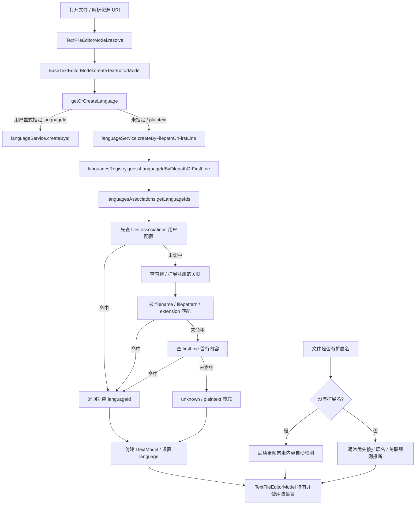
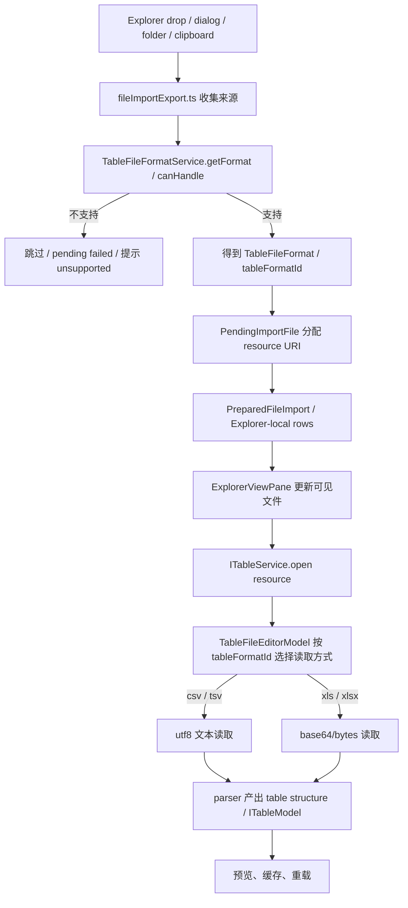

# Files 导入映射说明

这份说明记录上游 VS Code “文件 -> 文本模型/语言识别” 思路如何映射到
Conductor 的 Files / Explorer 表格导入链路。

上游的 `files.associations`、语言注册、`firstLine` 检测解决的是文本编辑器
`languageId`。Conductor 可以借鉴这个“资源 -> 稳定 ID -> 专门能力”的映射思想，
但目标 ID 应该是 Files/Table 自己的 `tableFormatId`，不是 VS Code 的
`languageId`。

`tableFormatId` 用来选择表格读取和解析策略。它可以告诉我们“这个资源应该按哪类表格结构
去解析”，但完整表结构仍由后续 parser 产出，包括 header、rows、sheet、range、
坏行诊断和置信度等。

## 同构链路与差异

Conductor 的表格打开链路和 VS Code 文本模型链路是同构的：都是从 resource 出发，
先解析出一个稳定的格式 ID，再进入 reader 和模型生命周期。差异不是入口形状，而是
目标模型和格式语义。

```txt
VS Code:
  resource
    -> languageId
    -> text reader
    -> ITextModel
    -> language features

Conductor:
  resource
    -> tableFormatId
    -> table reader
    -> table parser
    -> ITableModel
    -> table features
```

如果去掉表格结构，CSV/TSV/TXT 都可以只是文本。但 Files/Table 的目标不是普通文本模型，
而是 `ITableModel`。因此 `tableFormatId` 不是普通扩展名白名单，它表示这个 resource
具备进入 `ITableModel` 构建链路的表格格式语义。

```txt
.txt
  -> 能稳定读成 text
  -> 不能稳定推出 table structure

.csv / .tsv
  -> text + delimiter 语义
  -> 可以稳定解析成 table structure

.xls / .xlsx
  -> bytes + workbook 语义
  -> 可以稳定解析成 sheets / table structure
```

## 上游参考



相关上游位置：

- `.../workbench/services/textfile/common/textFileEditorModel.ts`
  - `TextFileEditorModel.resolve` / `doCreateTextModel` 读取文件内容，并把资源交给基础文本模型创建。
  - `autoDetectLanguage` 在无扩展名、当前语言为空或 `plaintext` 时触发内容检测。
- `.../workbench/common/editor/textEditorModel.ts`
  - `BaseTextEditorModel.createTextEditorModel` 创建 `ITextModel`。
  - `getOrCreateLanguage` 根据显式语言、resource 和 firstLine 选择语言。
- `.../editor/common/services/languageService.ts`
  - `createByFilepathOrFirstLine` / `guessLanguageIdByFilepathOrFirstLine` 是语言推断的服务入口。
- `.../editor/common/services/languagesRegistry.ts`
  - 收集语言定义，把 extensions、filenames、filenamePatterns、firstLine 注册成 association。
  - `guessLanguageIdByFilepathOrFirstLine` 调用 association 层返回候选 `languageId`。
- `.../editor/common/services/languagesAssociations.ts`
  - 真正执行 resource / filename / extension / filepattern / firstLine 到 `languageId` 的匹配。
  - 匹配优先级是用户配置 > 内建/扩展注册 > firstLine > unknown。
- `.../editor/common/languages/modesRegistry.ts`
  - 注册基础语言和 `plaintext`，其中 `.txt` 默认关联到 `plaintext`。

## 映射到 Conductor

### 职责一对一映射

| VS Code | 负责 | Conductor 对应 |
| --- | --- | --- |
| `modesRegistry.ts` | 注册已知语言 ID，例如 `plaintext`。 | 注册已知表格格式 ID，例如 `csv` / `tsv` / `xls` / `xlsx` / 未来 `txtDelimited`。 |
| `languagesRegistry.ts` | 收集语言定义，并注册扩展名、文件名、filepattern、firstLine 规则。 | table format registry：收集 `tableFormatId` 定义和默认匹配规则。 |
| `languagesAssociations.ts` | 按优先级匹配 resource -> `languageId`。 | table format associations：按资源、文件名、用户配置、内容探测匹配 resource -> `tableFormatId`。 |
| `languageService.ts` | 对外提供 `createByFilepathOrFirstLine` / `guessLanguageIdByFilepathOrFirstLine`。 | `TableFileFormatService`，未来可演进为 `TableFormatResolver`。 |
| `TextFileEditorModel` | 读取资源内容，消费 `languageId` 创建/更新文本模型。 | `TableFileEditorModel` 消费 `tableFormatId`，协调 reader 和 parser，创建/更新表格模型。 |
| text reader / encoding | 读取 resource，做编码解码，给 `ITextModel` 提供文本内容。 | table reader：读取 resource，按 `tableFormatId` 选择 text/bytes 模式。 |
| text buffer / language feature | 文本 buffer 进入 `ITextModel` 后，`languageId` 分发 tokenization、补全、格式化、诊断等能力。 | table parser：reader 产出的 text/bytes 必须继续解析成 table structure，才能进入 `ITableModel` 和表格能力。 |

目标形态直接拆成 registry / associations / resolver，不再把
“格式定义 + 扩展名关联 + resolver service” 长期压在
`services/tablefile/common/tableFileFormat.ts` 一个文件里。这样 `.txt`、用户配置、
内容探测进入时只扩展对应 owner，不再重新搬边界。

最后两行不是对应某个单独文件，而是说明 ID 解析完成后的下游能力消费方式：
VS Code 用 `languageId` 分发编辑器语言能力；Conductor 用 `tableFormatId` 分发表格读取和解析能力。
Reader 只负责把 resource 读成 text/bytes；parser 才负责把 text/bytes 变成表格结构。
Preview、sheet、rows、diagnostics 是 parser/model 的结果，不是格式匹配阶段提前写死的结构。

拆分结构：

```txt
tableFormatRegistry.ts
  定义可用 tableFormatId 和默认规则

tableFormatAssociations.ts
  按 filename / extension / pattern / detector 匹配

tableFileFormatService.ts
  对外提供 getFormat / canHandle / resolveFormat

TableFileEditorModel
  消费 tableFormatId，协调 reader 和 parser

tableFileReader.ts
  按 tableFormatId 选择 read mode，产出 text/bytes

tableStructureParser.ts
  按 tableFormatId 解析 text/bytes，产出 ITableModel 结构
```

### 概念映射

| 上游概念 | Conductor 对应 | 说明 |
| --- | --- | --- |
| 文件路径 / resource | `FileSource` / `URI` | 由 Explorer drop/dialog/folder/clipboard 工作流收集。 |
| `languageId` | `tableFormatId` | 文本语言 ID 的思想映射到表格格式 ID；不要复用 VS Code 的 `languageId`。 |
| `files.associations` | 未来可能的 table association | 如果需要用户配置，应配置表格格式/解析策略，而不是文本语言模式。 |
| 语言注册里的扩展名关联 | `TableFileFormatService` | 当前唯一格式入口，集中判断 `.csv` / `.tsv` / `.xls` / `.xlsx`。 |
| `firstLine` 语言检测 | 未来可能的 table detector | 可用于 `.txt` 这类模糊来源，但必须产出明确 tableFormatId 或 unsupported。 |
| `TextFileEditorModel` | `TableFileEditorModel` / `ITableModel` | Conductor 的 URI-backed 表格预览生命周期由 tablefile/table model 负责。 |
| `unknown` / `plaintext` 兜底 | unsupported source | 不支持的文件不进入普通表格导入链路。 |

当前代码里，`tableFormatId` 的粗粒度实现就是：

```ts
type TableFileFormat = "csv" | "tsv" | "xls" | "xlsx";
```

`TableFileFormatService.getFormat(...)` 现在只按文件名/URI 的扩展名把资源映射到
这个 `TableFileFormat`。后续如果支持更多模糊格式，可以把它演进成更完整的
resolver：

```txt
resource / filename / user table association / content detector
  -> tableFormatId
  -> reader + parser
  -> table structure
```

当前 Files 侧的真实链路是：



责任边界：

- `files.contribution.ts` 只注册 Files/Explorer view，不放导入业务逻辑。
- `fileActions.contribution.ts` 注册命令、动作、菜单和快捷键。
- `fileImportExport.ts` 负责文件传输、来源收集、pending 状态、resource 分配和导入工作流编排。
- `services/tablefile/common/tableFileFormat.ts` 负责表格格式支持策略。
- `services/tablefile/common/encoding.ts` 负责已知表格格式下的读取编码/字节模式。
- `services/table/common/parsers.ts` 负责 CSV/TSV/XLSX 的物理表格结构解析。
- `ExplorerViewPane` 负责 Explorer-local 可见行和打开表格资源的交接。
- `services/files/browser/rawTableRowsReader.ts` 只保留 legacy raw-table 行预览能力；普通 Explorer file-to-table 打开不再经过旧转换器链路。

## `.txt` 待定

`.txt` 在上游 VS Code 是 `plaintext` 语言关联，但这不等于 Conductor 的表格格式。
它可以进入未来的 `tableFormatId` 映射设计，但暂时不应加入 `TABLE_IMPORT_FILE_EXTENSIONS`。

原因：

- `.txt` 没有稳定的表格结构语义，可能是空格分隔、固定宽度、自由文本或混合内容。
- 不能只按扩展名决定 delimiter、header、坏行诊断和预览结构。
- 如果后续支持 `.txt`，需要先定义更细的 `tableFormatId`，例如 `txtDelimited`、
  `txtFixedWidth` 或用户指定的格式策略。
- `.txt` resolver 必须能产出明确 `tableFormatId` 或 unsupported，不能只返回 `plaintext`。

在 parser 没有落地前，`.txt` 应保持 unsupported source，不能通过
`languageId`、编码类型、URI scheme 或文本 `files.associations` 绕进表格导入链路。
